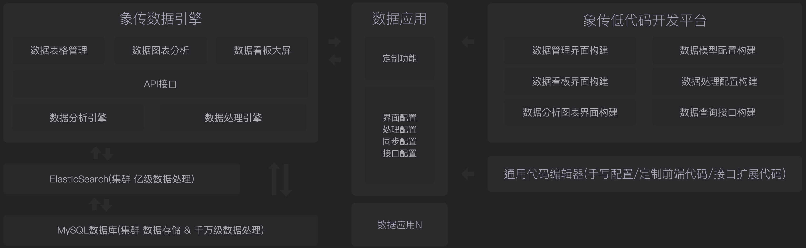

# 象传应用引擎

象传应用引擎，是一款低代码应用运行引擎，采用 Golang 语言开发。 [查看文档](https://github.com/YaoApp/xiang-spec)

## 象传全文

### 乾

天行，健；君子以自强不息。
潜龙勿用，阳在下也。见龙在田，德施普也。终日乾乾，反复道也。或跃在渊，进无咎也。飞龙在天，大人造也。亢龙有悔，盈不可久也。用九，天德不可为首也。

### 坤

地势，坤；君子以厚德载物。
履霜坚冰，阴始凝也。驯致其道，至坚冰也。六二之动，直以方也。不习无不利，地道光也。含章可贞，以时发也。或从王事，知光大也。括囊无咎，慎不害也。黄裳元吉，文在中也。龙战于野，其道穷也。用六永贞，以大终也。
03．屯
云雷，屯；君子以经纶。
虽磐桓，志行正也。以贵下贱，大得民也。六二之难，乘刚也。十年乃字，反常也。即鹿无虞，以从禽也。君子舍之，往吝穷也。求而往，明也。屯其膏，施未光也。泣血涟如，何可长也。

### 蒙

山下出泉，蒙；君子以果行育德。
利用刑人，以正法也。子克家，刚柔接也。勿用取女，行不顺也。困蒙之吝，独远实也。童蒙之吉，顺以巽也。利用御寇，上下顺也。

### 需

云上于天，需；君子以饮食宴乐。
需于郊，不犯难行也。利用恒无咎，未失常也。需于沙，衍在中也。虽小有言，以终吉也。需于泥，灾在外也。自我致寇，敬慎不败也。需于血，顺以听也。酒食贞吉，以中正也。不速之客来，敬之终吉。虽不当位，未大失也。

### 讼

天与水违行，讼；君子以作事谋始。
不永所事，讼不可长也。虽小有言，其辩明也。不克讼，归逋窜也。自下讼上，患至掇也。食旧德，从上吉也。复即命渝，安贞不失也。讼元吉，以中正也。以讼受服，亦不足敬也。

### 师

地中有水，师；君子以容民畜众。
师出以律，失律凶也。在师中吉，承天宠也。王三锡命，怀万邦也。师或舆尸，大无功也。左次无咎，未失常也。长子帅师，以中行也。弟子舆尸，使不当也。大君有命，以正功也。小人勿用，必乱邦也。

### 比

地上有水，比；先王以建万国，亲诸侯。
比之初六，有它吉也。比之自内，不自失也。比之匪人，不亦伤乎？外比于贤，以从上也。显比之吉，位正中也。舍逆取顺，失前禽也。邑人不诫，上使中也。比之无首，无所终也。 09.小畜
风行天上，小畜；君子以懿文德。
复自道，其义吉也。牵复在中，亦不自失也。夫妻反目，不能正室也。有孚惕出，上合志也。有孚挛如，不独富也。既雨既处，德积载也。君子征凶，有所疑也。

### 履

上天下泽，履；君子以辩上下，定民志。
素履之往，独行愿也。幽人贞吉，中不自乱也。眇能视，不足以有明也。跛能履，不足以与行也。咥人之凶，位不当也。武人为于大君，志刚也。愬愬终吉，志行也。夬履贞厉，位正当也。元吉在上，大有庆也。

### 泰

天地交，泰；后以财成天地之道，辅相天地之宜，以左右民。
拔茅征吉，志在外也。包荒得尚于中行，以光大也。无往不复，天地际也。翩翩不富，皆失实也。不戒以孚，中心愿也。以祉元吉，中以行愿也。城复于隍，其命乱也。

### 否

天地不交，否；君子以俭德辟难，不可荣以禄。
拔茅贞吉，志在君也。大人否亨，不乱群也。包羞，位不当也。有命无咎，志行也。大人之吉，位正当也。否终则倾，何可长也。 13.同人
天与火，同人；君子以类族辨物。
出门同人，又谁咎也。同人于宗，吝道也。伏戎于莽，敌刚也。三岁不兴，安行也。乘其墉，义弗克也。其吉，则困而反则也。同人之先，以中直也。大师相遇，言相克也。同人于郊，志未得也。

### 大有

火在天上，大有；君子以遏恶扬善，顺天休命。
大有初九，无交害也。大车以载，积中不败也。公用亨于天子，小人害也。匪其彭无咎，明辨皙也。厥孚交如，信以发志也。威如之吉，易而无备也。大有上吉，自天祐也。

### 谦

地中有山，谦；君子以裒多益寡，称物平施。
谦谦君子，卑以自牧也。鸣谦贞吉，中心得也。劳谦君子，万民服也。无不利撝谦，不违则也。利用侵伐，征不服也。鸣谦，志未得也。可用行师，征邑国也。

### 豫

雷出地奋，豫；先王以作乐崇德，殷荐之上帝，以配祖考。
初六鸣豫，志穷凶也。不终日贞吉，以中正也。盱豫有悔，位不当也。由豫大有得，志大行也。六五贞疾，乘刚也。恒不死，中未亡也。冥豫在上，何可长也？

### 随

泽中有雷，随；君子以向晦入宴息。
官有渝，从正吉也。出门交有功，不失也。系小子，弗兼与也。系丈夫，志舍下也。随有获，其义凶也。有孚在道，明功也。孚于嘉吉，位正中也。拘系之，上穷也。

### 蛊

山下有风，蛊；君子以振民育德。
干父之蛊，意承考也。干母之蛊，得中道也。干父之蛊，终无咎也。裕父之蛊，往未得也。干父用誉，承以德也。不事王侯，志可则也。

### 临

泽上有地，临；君子以教思无穷，容保民无疆。
咸临贞吉，志行正也。咸临吉无不利，未顺命也。甘临，位不当也。既忧之，咎不长也。至临无咎，位当也。大君之宜，行中之谓也。敦临之吉，志在内也。

### 观

风行地上，观；先王以省方观民设教。
初六童观，小人道也。窥观女贞，亦可丑也。观我生进退，未失道也。观国之光，尚宾也。观我生，观民也。观其生，志未平也。

### 噬嗑

雷电，噬嗑；先王以明罚勅法。
屦校灭趾，不行也。噬肤灭鼻，乘刚也。遇毒，位不当也。利艰贞吉，未光也。贞厉无咎，得当也。何校灭耳，聪不明也。

### 贲

山下有火，贲；君子以明庶政，无敢折狱。
舍车而徒，义弗乘也。贲其须，与上兴也。永贞之吉，终莫之陵也。六四，当位疑也。匪寇婚媾，终无尤也。六五之吉，有喜也。白贲无咎，上得志也。

### 剥

山附于地，剥；上以厚下安宅。
剥床以足，以灭下也。剥床以辨，未有与也。剥之无咎，失上下也。剥床以肤，切近灾也。以宫人宠，终无尤也。君子得舆，民所载也。小人剥庐，终不可用也。

### 复

雷在地中，复；先王以至日闭关，商旅不行，后不省方。
不远之复，以修身也。休复之吉，以下仁也。频复之厉，义无咎也。中行独复，以从道也。敦复无悔，中以自考也。迷复之凶，反君道也。 25.无妄
天下雷行，物与无妄；先王以茂对时育万物。
无妄之往，得志也。不耕获，未富也。行人得牛，邑人灾也。可贞无咎，固有之也。无妄之药，不可试也。无妄之行，穷之灾也。

### 大畜

天在山中，大畜；君子以多识前贤往行，以畜其德。
有厉利巳，不犯灾也。舆说輹，中无尤也。利有攸往，上合志也。六四元吉，有喜也。六五之吉，有庆也。何天之衢，道大行也。

### 颐

山下有雷，颐；君子以慎言语，节饮食。
观我朵颐，亦不足贵也。六二征凶，行失类也。十年勿用，道大悖也。颠颐之吉，上施光也。居贞之吉，顺以从上也。由颐厉吉，大有庆也。

### 大过

泽灭木，大过；君子以独立不惧，遁世无闷。
藉用白茅，柔在下也。老夫女妻，过以相与也。栋桡之凶，不可以有辅也。栋隆之吉，不桡乎下也。枯杨生华，何可久也。无妇士夫，亦可丑也。过涉之凶，不可咎也。

### 坎

水洊至，习坎；君子以常德行，习教事。
习坎入坎，失道凶也。求小得，未出中也。来之坎坎，终无功也。樽酒簋贰，刚柔际也。坎不盈，中未大也。上六失道，凶三岁也。

### 离

明两作，离；大人以继明照于四方。
履错之敬，以辟咎也。黄离元吉，得中道也。日昃之离，何可久也？突如其来如，无所容也。六五之吉，离王公也。王用出征，以正邦也。
象下

### 咸

山上有泽，咸；君子以虚受人。
咸其拇，志在外也。虽凶居吉，顺不害也。咸其股，亦不处也。志在随人，所执下也。贞吉悔亡，未感害也。憧憧往来，未光大也。咸其脢，志末也。咸其辅颊舌，滕口说也。

### 恒

雷风，恒；君子以立不易方。
浚恒之凶，始求深也。九二悔亡，能久中也。不恒其德，无所容也。久非其位，安得禽也。妇人贞吉，从一而终也。夫子制义，从妇凶也。振恒在上，大无功也。 33.遯
天下有山，遯；君子以远小人，不恶而严。
遯尾之厉，不往何灾也？执用黄牛，固志也。系遯之厉，有疾惫也。畜臣妾吉，不可大事也。君子好遯，小人否也。嘉遯贞吉，以正志也。肥遯无不利，无所疑也。

### 大壮

雷在天上，大壮；君子以非礼弗履。
壮于趾，其孚穷也。九二贞吉，以中也。小人用壮，君子罔也。藩决不羸，尚往也。丧羊于易，位不当也。不能退不能遂，不详也。艰则吉，咎不长也。

### 晋

明出地上，晋；君子以自昭明德。
晋如摧如，独行正也。裕无咎，未受命也。受兹介福，以中正也。众允之志，上行也。鼫鼠贞厉，位不当也。失得勿恤，往有庆也。维用伐邑，道未光也。

### 明夷

明入地中，明夷；君子以莅众，用晦而明。
君子于行，义不食也。六二之吉，顺以则也。南狩之志，乃大得也。入于左腹，获心意也。箕子之贞，明不可息也。初登于天，照四国也。后入于地，失则也。

### 家人

风自火出，家人；君子以言有物而行有恒。
闲有家，志未变也。六二之吉，顺以巽也。家人嗃嗃，未失也。妇子嘻嘻，失家节也。富家大吉，顺在位也。王假有家，交相爱也。威如之吉，反身之谓也。

### 睽

上火下泽，睽；君子以同而异。
见恶人，以辟咎也。遇主于巷，未失道也。见舆曳，位不当也。无初有终，遇刚也。交孚无咎，志行也。厥宗噬肤，往有庆也。遇雨之吉，群疑亡也。

### 蹇

山上有水，蹇；君子以反身修德。
往蹇来誉，宜待也。王臣蹇蹇，终无尤也。往蹇来反，内喜之也。往蹇来连，当位实也。大蹇朋来，以中节也。往蹇来硕，志在内也。利见大人，以从贵也。

### 解

雷雨作，解；君子以赦过宥罪。
刚柔之际，义无咎也。九二贞吉，得中道也。负且乘，亦可丑也。自我致戎，又谁咎也？解而拇，未当位也。君子有解，小人退也。公用射隼，以解悖也。

### 损

山下有泽，损；君子以惩忿窒欲。
巳事遄往，尚合志也。九二利贞，中以为志也。一人行，三则疑也。损其疾，亦可喜也。六五元吉，自上祐也。弗损益之，大得志也。

### 益

风雷，益；君子以见善则迁，有过则改。
元吉无咎，下不厚事也。或益之，自外来也。益用凶事，固有之也。告公从，以益志也。有孚惠心，勿问之矣。惠我德，大得志也。莫益之，偏辞也。或击之，自外来也。 43.夬
泽上于天，夬；君子以施禄及下，居德则忌。
不胜而往，咎也。有戎勿恤，得中道也。君子夬夬，终无咎也。其行次且，位不当也。闻言不信，聪不明也。中行无咎，中未光也。无号之凶，终不可长也。 44.姤
天下有风，姤；后以施命诰四方。
系于金柅，柔道牵也。包有鱼，义不及宾也。其行次且，行未牵也。无鱼之凶，远民也。九五含章，中正也。有陨自天，志不舍命也。姤其角，上穷吝也。

### 萃

泽上于地，萃；君子以除戎器，戒不虞。
乃乱乃萃，其志乱也。引吉无咎，中未变也。往无咎，上巽也。大吉无咎，位不当也。萃有位，志未光也。赍咨涕洟，未安上也。

### 升

地中生木，升；君子以顺德，积小以高大。
允升大吉，上合志也。九二之孚，有喜也。升虚邑，无所疑也。王用亨于岐山，顺事也。贞吉升阶，大得志也。冥升在上，消不富也。

### 困

泽无水，困；君子以致命遂志。
入于幽谷，幽不明也。困于酒食，中有庆也。据于蒺藜，乘刚也。入于其宫不见其妻，不祥也。来徐徐，志在下也。虽不当位，有与也。劓刖，志未得也。乃徐有说，以中直也。利用祭祀，受福也。困于葛藟，未当也。动悔有悔，吉行也。

### 井

木上有水，井；君子以劳民劝相。
井泥不食，下也。旧井无禽，时舍也。井谷射鲋，无与也。井渫不食，行恻也。求王明，受福也。井甃无咎，修井也。寒泉之食，中正也。元吉在上，大成也。

### 革

泽中有火，革；君子以治历明时。
巩用黄牛，不可以有为也。巳日革之，行有嘉也。革言三就，又何之矣。改命之吉，信志也。大人虎变，其文炳也。君子豹变，其文蔚也。小人革面，顺以从君也。

### 鼎

木上有火，鼎；君子以正位凝命。
鼎颠趾，未悖也。利出否，以从贵也。鼎有实，慎所之也。我仇有疾，终无尤也。鼎耳革，失其义也。覆公饣束，信如何也。鼎黄耳，中以为实也。玉铉在上，刚柔节也。

### 震

洊雷，震；君子以恐惧修省。
震来虩虩，恐致福也。笑言哑哑，后有则也。震来厉，乘刚也。震苏苏，位不当也。震遂泥，未光也。震往来厉，危行也。其事在中，大无丧也。震索索，中未得也。虽凶无咎，畏邻戒也。

### 艮

兼山，艮；君子以思不出其位。
艮其趾，未失正也。不拯其随，未退听也。艮其限，危熏心也。艮其身，止诸躬也。艮其辅，以中正也。敦艮之吉，以厚终也。

### 渐

山上有木，渐；君子以居贤德善俗。
小子之厉，义无咎也。饮食衎衎，不素饱也。夫征不复，离群丑也。妇孕不育，失其道也。利用御寇，顺相保也。或得其桷，顺以巽也。终莫之胜吉，得所愿也。其羽可用为仪吉，不可乱也。 54.归妹
泽上有雷，归妹；君子以永终知敝。
归妹以娣，以恒也。跛能履吉，相承也。利幽人之贞，未变常也。归妹以须，未当也。愆期之志，有待而行也。帝乙归妹，不如其娣之袂良也。其位在中，以贵行也。上六无实，承虚筐也。

### 丰

雷电皆至，丰；君子以折狱致刑。
虽旬无咎，过旬灾也。有孚发若，信以发志也。丰其沛，不可大事也。折其右肱，终不可用也。丰其蔀，位不当也。日中见斗，幽不明也。遇其夷主，吉行也。六五之吉，有庆也。丰其屋，天际翔也。窥其户阒其无人，自藏也。

### 旅

山上有火，旅；君子以明慎用刑，而不留狱。
旅琐琐，志穷灾也。得童仆贞，终无尤也。旅焚其次，亦以伤矣。以旅与下，其义丧也。旅于处，未得位也。得其资斧，心未快也。终以誉命，上逮也。以旅在上，其义焚也。丧牛于易，终莫之闻也。

### 巽

随风，巽；君子以申命行事。
进退，志疑也。利武人之贞，志治也。纷若之吉，得中也。频巽之吝，志穷也。田获三品，有功也。九五之吉，位正中也。巽在床下，上穷也。丧其资斧，正乎凶也。

### 兑

丽泽，兑；君子以朋友讲习。
和兑之吉，行未疑也。孚兑之吉，信志也。来兑之凶，位不当也。九四之喜，有庆也。孚于剥，位正当也。上六引兑，未光也。

### 涣

风行水上，涣；先王以享于帝，立庙。
初六之吉，顺也。涣奔其机，得愿也。涣其躬，志在外也。涣其群元吉，光大也。王居无咎，正位也。涣其血，远害也。

### 节

泽上有水，节；君子以制数度，议德行。
不出户庭，知通塞也。不出门庭凶，失时极也。不节之嗟，又谁咎也？安节之亨，承上道也。甘节之吉，居位中也。苦节贞凶，其道穷也。

### 中孚

泽上有风，中孚；君子以议狱缓死。
初九虞吉，志未变也。其子和之，中心愿也。或鼓或罢，位不当也。马匹亡，绝类上也。有孚挛如，位正当也。翰音登于天，何可长也？

### 小过

山上有雷，小过；君子以行过乎恭，丧过乎哀，用过乎俭。
飞鸟以凶，不可如何也。不及其君，臣不可过也。从或戕之，凶如何也？弗过遇之，位不当也。往厉必戒，终不可长也。密云不雨，已上也。弗遇过之，已亢也。

### 既济

水在火上，既济；君子以思患而豫防之。
曳其轮，义无咎也。七日得，以中道也。三年克之，惫也。终日戒，有所疑也。东邻杀牛，不如西邻之时也。实受其福，吉大来也。濡其首厉，何可久也？

### 未济

火在水上，未济；君子以慎辨物居方。
濡其尾，亦不知极也。九二贞吉，中以行正也。未济征凶，位不当也。贞吉悔亡，志行也。君子之光，其晖吉也。饮酒濡首，亦不知节也。
