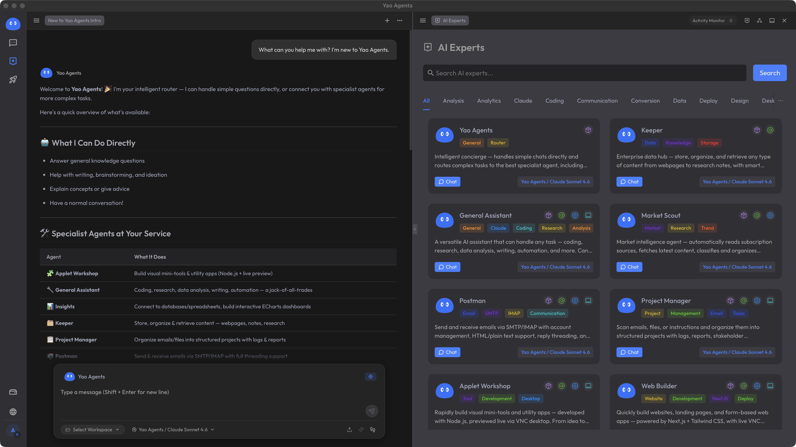

# Yao — Build Autonomous Agents. Just Define the Role.

Yao is an open-source engine for autonomous agents — event-driven, proactive, and self-scheduling.

**Quick Links:**

**🏠 Homepage:** [https://yaoapps.com](https://yaoapps.com)

**🚀 Quick Start:** [https://yaoapps.com/docs/documentation/en-us/getting-started](https://yaoapps.com/docs/documentation/en-us/getting-started#quickstart)

**📚 Documentation:** [https://yaoapps.com/docs](https://yaoapps.com/docs)

**✨ Why Yao?** [https://yaoapps.com/docs/why-yao](https://yaoapps.com/docs/documentation/en-us/getting-started/why-yao)

**🤖 Yao Agents:** [https://github.com/YaoAgents/awesome](https://github.com/YaoAgents/awesome) ( Preview )

---

## What Makes Yao Different?

| Traditional AI Assistants     | Yao Autonomous Agents                 |
| ----------------------------- | ------------------------------------- |
| Entry point: Chatbox          | Entry point: Email, Events, Schedules |
| Passive: You ask, they answer | Proactive: They work autonomously     |
| Role: Tool                    | Role: Team member                     |

> The entry point is not a chatbox — it's email, events, and scheduled tasks.

---

## Features

### Autonomous Agent Framework

Build agents that work like real team members:

- **Three Trigger Modes** — Clock (scheduled), Human (email/message), Event (webhook/database)
- **Six-Phase Execution** — Inspiration → Goals → Tasks → Run → Deliver → Learn
- **Multi-Agent Orchestration** — Agents delegate, collaborate, and compose dynamically
- **Continuous Learning** — Agents accumulate experience in private knowledge bases

### Native MCP Support

Integrate tools without writing adapters:

- **Process Transport** — Map Yao processes directly to MCP tools
- **External Servers** — Connect via SSE or STDIO
- **Schema Mapping** — Declarative input/output schemas

### Built-in GraphRAG

- **Vector Search** — Embeddings with OpenAI/FastEmbed
- **Knowledge Graph** — Entity-relationship retrieval
- **Hybrid Search** — Combine vector similarity with graph traversal

### Full-Stack Runtime

Everything in a single executable:

- **All-in-One** — Data, API, Agent, UI in one engine
- **TypeScript Support** — Built-in V8 engine
- **Single Binary** — No Node.js, Python, or containers required
- **Edge-Ready** — Runs on ARM64/x64 devices
