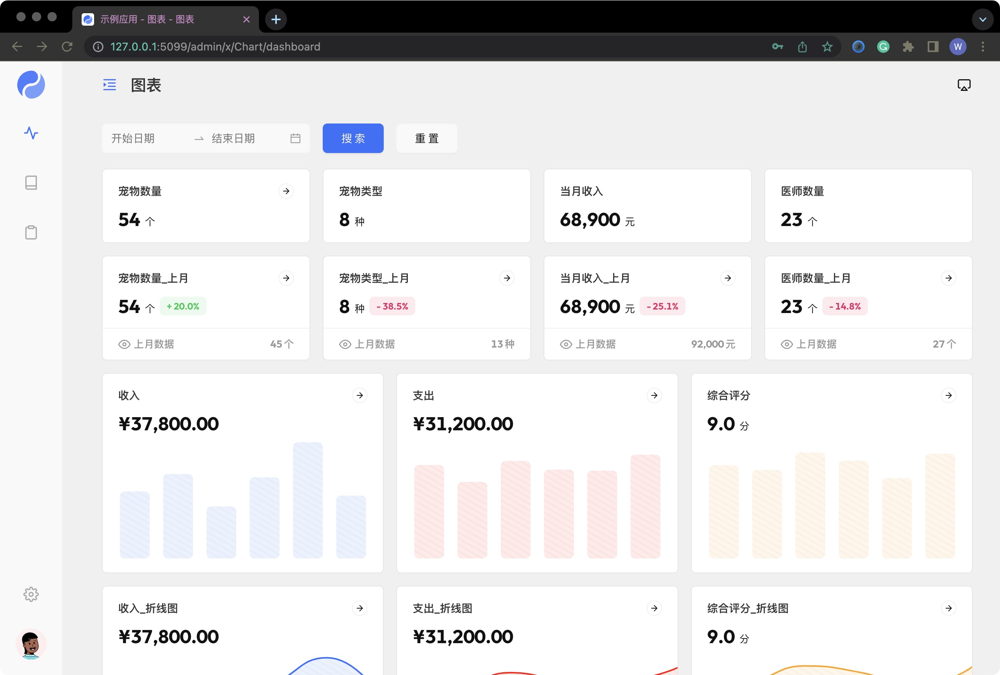
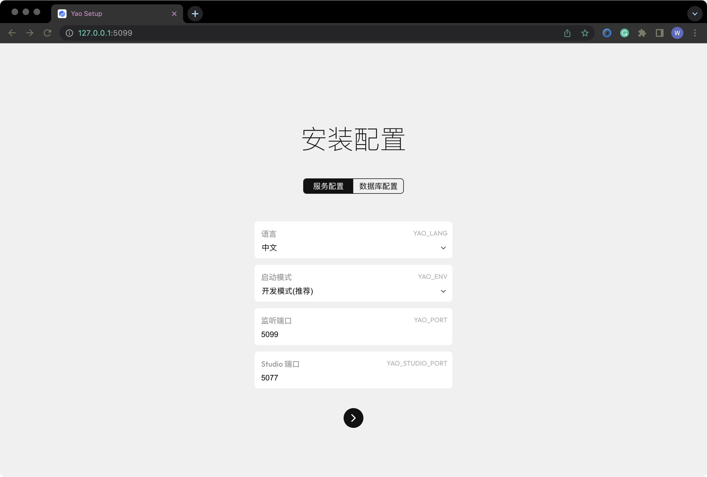

# Yao

[](https://github.com/YaoApp/yao/actions/workflows/unit-test.yml)
[](https://codecov.io/gh/YaoApp/yao)

https://github.com/YaoApp/yao/assets/1842210/6b23ac89-ef6e-4c24-874f-753a98370dec

[English](README.md)

YAO 是一款开源应用引擎，使用 Golang 编写，以一个命令行工具的形式存在, 下载即用。适合用于开发业务系统、网站/APP API 接口、管理后台、自建低代码平台等。

YAO 采用 flow-based 的编程模式，通过编写 YAO DSL (JSON 格式逻辑描述) 或使用 JavaScript 编写处理器，实现各种功能。 YAO DSL 可以有多种编写方式:

1. 纯手工编写

2. 使用自动化脚本，根据上下文逻辑生成

3. 使用可视化编辑器，通过“拖拉拽”制作

官网: [https://yaoapps.com](https://yaoapps.com)

文档: [https://yaoapps.com/doc](https://yaoapps.com/doc)

## 最新版本下载安装 (推荐)

https://github.com/YaoApp/xgen-dev-app

## 演示



使用 YAO 开发的应用

| 应用                 | 简介                         | 代码仓库                                |
| -------------------- | ---------------------------- | --------------------------------------- |
| yaoapp/yao-examples  | Yao 应用示例                 | https://github.com/YaoApp/yao-examples  |
| yaoapp/yao-knowledge | ChatGPT 驱动的知识管理库应用 | https://github.com/YaoApp/yao-knowledge |
| yaoapp/xgen-dev-app  | 演示应用 (演示)              | https://github.com/YaoApp/xgen-dev-app  |
| yaoapp/demo-project  | 工程项目管理演示应用(演示)   | https://github.com/yaoapp/demo-project  |
| yaoapp/demo-finance  | 财务管理演示应用(演示)       | https://github.com/yaoapp/demo-finance  |
| yaoapp/demo-plm      | 生产项目管理演示应用(演示)   | https://github.com/yaoapp/demo-plm      |

## 介绍

Yao 是一个只需使用 JSON 即可创建数据库模型、编写 API 接口、描述管理后台界面的应用引擎，使用 Yao 构建的应用可运行在云端或物联网设备上。 开发者不需要写一行代码，就可以拥有 10 倍生产力。

Yao 基于 **flow-based** 编程思想，采用 **Go** 语言开发，支持多种方式扩展数据流处理器。这使得 Yao 具有极好的**通用性**，大部分场景下可以代替编程语言, 在复用性和编码效率上是传统编程语言的 **10 倍**；应用性能和资源占比上优于 **PHP**, **JAVA** 等语言。

Yao 内置了一套数据管理系统，通过编写 **JSON** 描述界面布局，即可实现 90% 常见界面交互功能，特别适合快速制作各类管理后台、CRM、ERP 等企业内部系统。对于特殊交互功能亦可通过编写扩展组件或 HTML 页面的方式实现。内置管理系统与 Yao 并不耦合，亦可采用 **VUE**, **React** 等任意前端技术实现管理界面。

## 安装

Yao v0.10.4 使用说明

https://github.com/YaoApp/xgen-dev-app/blob/main/README.zh-CN.md

## 入门指南

详细说明请看[文档](https://yaoapps.com/doc/%E4%BB%8B%E7%BB%8D/%E5%85%A5%E9%97%A8%E6%8C%87%E5%8D%97)

### 创建应用

#### 新建一个空白应用

新建一个应用目录，进入应用目录，运行 `yao start` 命令, 启动安装界面。

```bash
mkdir -p /data/app  # 创建应用目录
cd /data/app  # 进入应用目录
yao start # 启动安装界面
```

**默认账号**

- 用户名: **xiang@iqka.com**

- 密码: **A123456p+**



## 关于 Yao

Yao 的名字源于汉字**爻(yáo)**，是构成八卦的基本符号。八卦，是上古大神伏羲观测总结自然规律后，创造的一个可以指代万事万物的符号体系。爻，有阴阳两种状态，就像 0 和 1。爻的阴阳转换，驱动八卦更替，以此来总结记录事物的发展规律。
