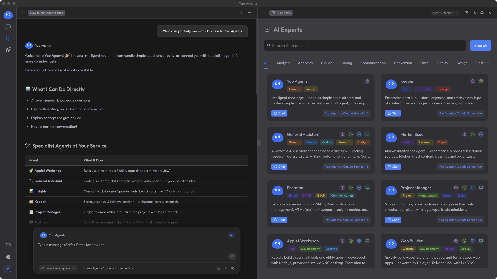
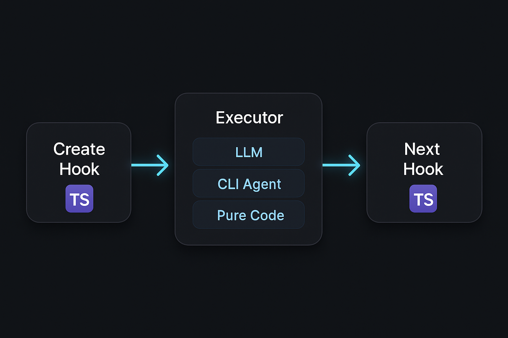

# Yao — AI 时代的应用运行时

Yao 是一个开源的 AI Agent 和 Web 应用运行时，以单一二进制的形式发布，下载即用。

**🏠 官网：** [https://yaoagents.com](https://yaoagents.com)

**📚 文档：** [https://yaoagents.com/docs](https://yaoagents.com/docs)

**🖥️ Yao Desktop：** [https://yaoagents.com/download](https://yaoagents.com/download)

[English](README.md)

---

## 工作原理

Yao Agent 本质上是一个**笼子，而不是动物**。放进去的东西决定行为，笼子保证可控。

每个请求都经过同一套管道：

`Create Hook` 在执行器前运行 —— 注入上下文、施加约束、路由请求。  
`Next Hook` 在执行器后运行 —— 校验输出、触发下游动作、驱动多步循环。  
**AI 负责干活，你来划定边界。**

### 三种模式

| 模式 | 执行器 | 适用场景 |
|------|--------|---------|
| **LLM** | OpenAI、Anthropic 等 | 对话助手、问答、内容生成 |
| **CLI Agent** | 容器中的 OpenCode、Claude Code、Codex | Computer Use、沙箱隔离、SKILL 生态 |
| **纯 Hook** | 你自己的 TypeScript 代码 | 确定性逻辑、菜单路由、无需 AI 的业务流程 |

三种模式共享同一套 Hook 接口，可以自由混合 —— 在一个 `Create Hook` 里，部分请求走 LLM，部分用纯代码处理。

---

## 功能特性

### Agent 框架

- **TypeScript Hook** — `Create` 和 `Next` 两个钩子拦截每一次请求；内置 V8 引擎
- **原生 MCP 支持** — 通过 process、SSE 或 STDIO 传输协议接入工具
- **Memory API** — 四个作用域：请求级、会话级、用户级、团队级
- **多 Agent 协作** — 委派给专属 Agent 或并行调用多个 Agent
- **CLI Agent / 沙箱** — 在隔离容器中运行 Claude Code 等 CLI 程序，支持 VNC 桌面
- **Skills 生态** — 将可复用的能力包（`SKILL.md`）挂载到任意 CLI Agent

### 全栈运行时

一个二进制文件包含所有能力：

- **数据模型** — 用 JSON/YAML 定义数据库表和关联关系
- **REST API** — 将路由映射到模型查询或 TypeScript 处理器
- **SUI 页面** — 组件化 Web UI，支持服务端渲染
- **Chat UI（CUI）** — 内置对话界面，开箱即用
- **TypeScript** — 内置 V8 引擎，不依赖 Node.js
- **单一二进制** — 支持 ARM64/x64，宿主机无需 Python、Node 或容器

### 内置搜索

- **向量搜索** — 支持 OpenAI 或 FastEmbed 嵌入模型
- **知识图谱** — 实体关系检索
- **GraphRAG** — 向量 + 图谱混合搜索

---

## 关于名字

Yao 的名字源于汉字**爻（yáo）**，是构成八卦的基本符号。八卦，是上古大神伏羲观测自然规律后创造的符号体系。爻有阴阳两种状态，就像 0 和 1。爻的阴阳转换，驱动八卦更替，记录事物的发展规律。
