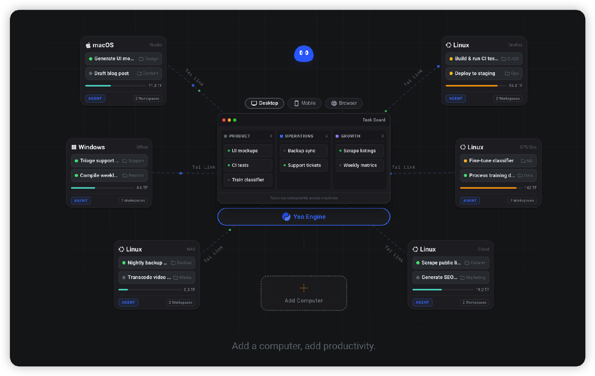

# Yao Agents

✨ **所有 Agent 和工作区集中管理，覆盖你的每一台设备。任务看板追踪进度，桌面端、移动端、浏览器、API 随时访问。自托管。**

**🏠 官网：** [https://yaoagents.com](https://yaoagents.com)

**📚 文档：** [https://yaoagents.com/docs](https://yaoagents.com/docs)

**🖥️ Yao Desktop：** [https://yaoagents.com/download](https://yaoagents.com/download)

**📱 Android 客户端（公测）：** [APK 下载](https://get.yaoapps.com/yaoagents/cui-android/0.6.37/cui-android-0.6.37.apk)

⚡⚡⚡ **DeepSeek Harness 已集成 — 在桌面端、Android 或浏览器中直接使用，跨设备运行。**

*本 README 由 Yao Agents Android 应用（公测版）中的 DeepSeek Harness 撰写并自动发布。*

[English](README.md)

---

## 工作原理

Agent 运行在你自己的设备上。每添加一台机器，就多一个它们的工作场所，所有设备统一管理。

## 工作区

每个工作区相互隔离。工作内容分开管理，跨设备协同，逐步积累为文档，成为你的知识库。

工作过程中，Agent 可以从任意节点读取所需信息。

## 任务看板

在对话中说出你的需求，它就会变成看板上的一个任务。

持续对话、持续运行，随着使用不断改进，最终成长为专门应对这类工作的 Agent。

将任务 Agent 接入你的应用，或分享给其他人。

## 开放 API

专家 Agent 和任务 Agent 可以集成到你自己的应用和工作流中。基于标准 API 构建，支持 SSE 和 WebSocket。

让你的 Agent 成为业务的一部分，无论你在哪里需要它们。

---

## 链接

- 官网：https://yaoagents.com
- 文档：https://yaoagents.com/docs
- Yao Desktop：https://yaoagents.com/download
- Android 客户端（公测）：https://get.yaoapps.com/yaoagents/cui-android/0.6.37/cui-android-0.6.37.apk
- Discord：https://discord.com/invite/BkMR2NUsjU
