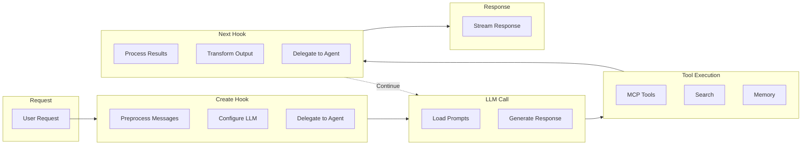

# Yao Agent

A powerful AI assistant framework for building intelligent conversational agents with tool integration, knowledge base search, and multi-agent orchestration.

## Quick Start

### 1. Create an Assistant

```
assistants/
└── my-assistant/
    ├── package.yao      # Configuration
    ├── prompts.yml      # System prompts
    └── locales/
        └── en-us.yml    # Translations
```

**package.yao**

```json
{
  "name": "{{ name }}",
  "connector": "gpt-4o",
  "description": "{{ description }}",
  "placeholder": {
    "title": "{{ chat.title }}",
    "prompts": ["{{ chat.prompts.0 }}"]
  }
}
```

**prompts.yml**

```yaml
- role: system
  content: |
    You are a helpful assistant.
```

**locales/en-us.yml**

```yaml
name: My Assistant
description: A helpful AI assistant
chat:
  title: New Chat
  prompts:
    - How can I help you today?
```

### 2. Add Hooks (Optional)

Create `src/index.ts` for custom logic:

```typescript
import { agent } from "@yao/runtime";

function Create(ctx: agent.Context, messages: agent.Message[]): agent.Create {
  // Preprocess messages before LLM call
  return { messages };
}

function Next(ctx: agent.Context, payload: agent.Payload): agent.Next {
  // Post-process LLM response
  return null;
}
```

### 3. Test (Optional)

```bash
# Run tests
yao agent test -i "Hello, how are you?"

# Run tests from JSONL file
yao agent test -i tests/inputs.jsonl -v

# Extract results for review
yao agent extract output-*.jsonl
```

### 4. Run

```bash
yao start
```

Access via API: `POST /v1/chat/completions`

## Examples

### Hook: Route to Specialist

```typescript
// src/index.ts
function Create(ctx: agent.Context, messages: agent.Message[]): agent.Create {
  const last = messages[messages.length - 1]?.content || "";
  if (last.includes("refund")) {
    return { delegate: { agent_id: "refund-specialist", messages } };
  }
  return null;
}
```

### Database Query

```json
// package.yao - Enable auto DB search
{ "db": { "models": ["orders", "products"] } }
```

```bash
# Test: Agent auto-generates QueryDSL and searches database
yao agent test -i "Find orders over $1000 from last month"
```

### MCP Tools (Process Transport)

```json
// mcps/tools.mcp.yao - Define MCP server with Yao Processes
{
  "label": "Tools",
  "transport": "process",
  "tools": {
    "search_orders": "models.order.Paginate",
    "create_order": "models.order.Create"
  }
}
```

```json
// mcps/mapping/tools/schemes/search_orders.in.yao - Input schema
{
  "type": "object",
  "properties": {
    "keyword": { "type": "string" },
    "page": { "type": "integer" }
  },
  "x-process-args": [":arguments"]
}
```

```json
// package.yao
{ "mcp": { "servers": [{ "server_id": "tools" }] } }
```

### Sidebar Page (Display Data)

Pages render in the right sidebar during conversation to display structured data:

```html
<!-- pages/result/result.html - Display query results -->
<div class="result-panel">
  <h3>{{ title }}</h3>
  <table s:if="{{ rows.length > 0 }}">
    <tr s:for="{{ rows }}" s:for-item="row">
      <td>{{ row.name }}</td>
      <td>{{ row.value }}</td>
    </tr>
  </table>
</div>
```

```bash
yao sui build agent    # Build pages
```

```javascript
// In hook: send action to open page in sidebar
ctx.Send({
  type: "action",
  props: {
    name: "navigate",
    payload: {
      route: "/agents/my-assistant/result",
      title: "Query Results",
      query: { id: "123" }, // Passed as $query in page
    },
  },
});
```

## Documentation

- [Configuration](docs/configuration.md) - Assistant settings, connectors, options
- [Prompts](docs/prompts.md) - System prompts and prompt presets
- [Hooks](docs/hooks.md) - Create/Next hooks and agent lifecycle
- [Context API](docs/context-api.md) - Messaging, memory, trace, MCP
- [MCP Integration](docs/mcp.md) - Tool servers and resources
- [Models](docs/models.md) - Assistant-scoped data models
- [Search](docs/search.md) - Web, knowledge base, and database search
- [Pages](docs/pages.md) - Web UI for agents (SUI framework)
- [Iframe Integration](docs/iframe.md) - Iframe communication with CUI
- [Internationalization](docs/i18n.md) - Multi-language support
- [Testing](docs/testing.md) - Agent testing framework

## Architecture



## API Endpoints

OpenAPI endpoints (base URL: `/v1`):

| Endpoint                               | Method | Description           |
| -------------------------------------- | ------ | --------------------- |
| `/v1/chat/completions`                 | POST   | Chat with assistant   |
| `/v1/chat/sessions`                    | GET    | List chat sessions    |
| `/v1/chat/sessions/:chat_id`           | GET    | Get chat session      |
| `/v1/chat/sessions/:chat_id/messages`  | GET    | Get messages          |
| `/v1/agent/assistants`                 | GET    | List assistants       |
| `/v1/agent/assistants/:id`             | GET    | Get assistant details |
| `/v1/file/:uploaderID`                 | POST   | Upload files          |
| `/v1/file/:uploaderID/:fileID`         | GET    | Get file info         |
| `/v1/file/:uploaderID/:fileID/content` | GET    | Download file         |

## License

This project is part of the Yao App Engine and follows the [Yao Open Source License](../LICENSE).
