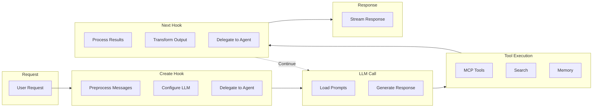

# Yao Agent

A powerful AI assistant framework for building intelligent conversational agents with tool integration, knowledge base search, and multi-agent orchestration.

## Quick Start

### 1. Create an Assistant

```
assistants/
└── my-assistant/
    ├── package.yao      # Configuration
    ├── prompts.yml      # System prompts
    └── locales/
        └── en-us.yml    # Translations
```

**package.yao**

```json
{
  "name": "{{ name }}",
  "connector": "gpt-4o",
  "description": "{{ description }}",
  "placeholder": {
    "title": "{{ chat.title }}",
    "prompts": ["{{ chat.prompts.0 }}"]
  }
}
```

**prompts.yml**

```yaml
- role: system
  content: |
    You are a helpful assistant.
```

**locales/en-us.yml**

```yaml
name: My Assistant
description: A helpful AI assistant
chat:
  title: New Chat
  prompts:
    - How can I help you today?
```

### 2. Add Hooks (Optional)

Create `src/index.ts` for custom logic:

```typescript
import { agent } from "@yao/runtime";

function Create(ctx: agent.Context, messages: agent.Message[]): agent.Create {
  // Preprocess messages before LLM call
  return { messages };
}

function Next(ctx: agent.Context, payload: agent.Payload): agent.Next {
  // Post-process LLM response
  return null;
}
```

### 3. Test (Optional)

```bash
yao agent test -i "Hello, how are you?"
```

### 4. Run

```bash
yao start
```

Access via API: `POST /api/__yao/agent`

## Documentation

- [Configuration](docs/configuration.md) - Assistant settings, connectors, options
- [Prompts](docs/prompts.md) - System prompts and prompt presets
- [Hooks](docs/hooks.md) - Create/Next hooks and agent lifecycle
- [Context API](docs/context-api.md) - Messaging, memory, trace, MCP
- [MCP Integration](docs/mcp.md) - Tool servers and resources
- [Search](docs/search.md) - Web, knowledge base, and database search
- [Internationalization](docs/i18n.md) - Multi-language support
- [Testing](docs/testing.md) - Agent testing framework

## Architecture



## API Endpoints

| Endpoint                        | Method | Description         |
| ------------------------------- | ------ | ------------------- |
| `/api/__yao/agent`              | POST   | Chat with assistant |
| `/api/__yao/agent/history`      | GET    | Get chat history    |
| `/api/__yao/agent/chats`        | GET    | List chat sessions  |
| `/api/__yao/agent/assistants`   | GET    | List assistants     |
| `/api/__yao/agent/upload/:type` | POST   | Upload files        |

## License

This project is part of the Yao App Engine and follows the [Yao Open Source License](../LICENSE).
