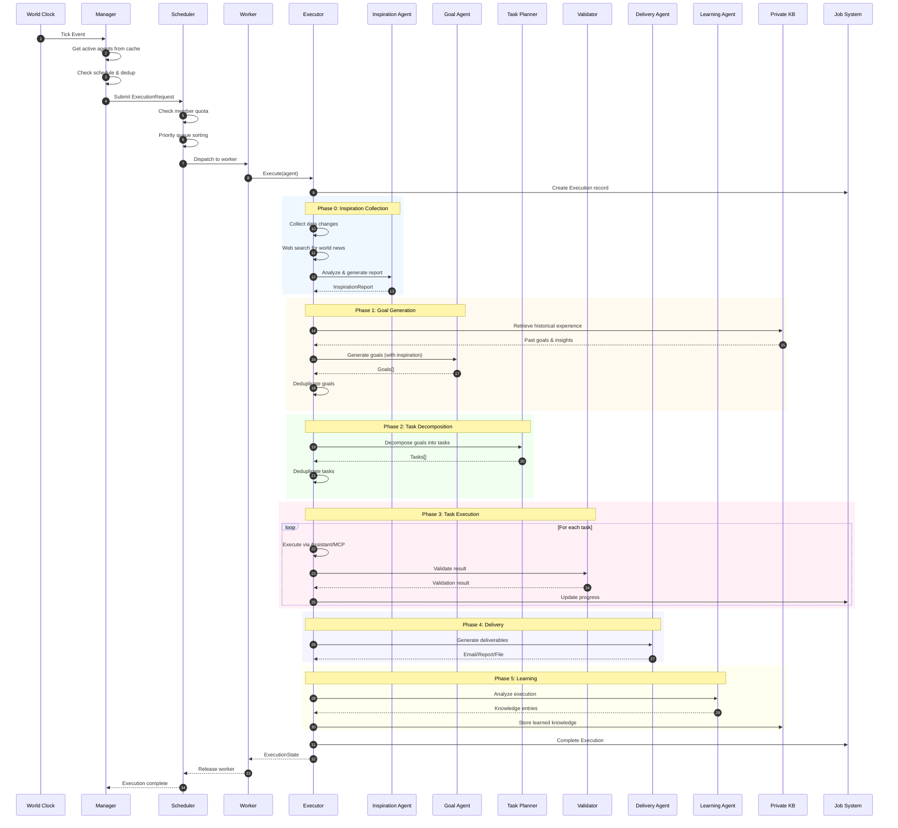

# Autonomous Agent Design Document

## Overview

An Autonomous Agent is an **AI member** within a team, belonging to a Team just like human members. From the user's perspective, it's simply a team member with clearly defined job responsibilities (such as Sales Manager, Data Analyst, Customer Service Representative, etc.). It can operate independently, make autonomous decisions, and execute tasks. Unlike Assistants that passively respond to user requests, Autonomous Agents are proactive, capable of running periodically based on job responsibilities and rules to complete complex multi-step tasks.

**Core Features:**

- **Team Member**: From the user's perspective, it's an AI member managed like human members
- **Job Responsibilities**: Each AI member has clearly defined duties and knows what to do
- **Dynamic Lifecycle**: Dynamically created/destroyed based on team needs
- **Autonomous Operation**: Triggered by the World Clock, periodically executing job responsibilities

## Relationship with Team

From the user's perspective, an Autonomous Agent is an **AI member** within the team. Each AI member has clearly defined job responsibilities, and a Team can have multiple AI members.

```
┌─────────────────────────────────────────────────────────────────┐
│                            Team                                  │
│                                                                  │
│  ┌─────────────────────────────────────────────────────────┐    │
│  │                      AI Members                          │    │
│  │  ┌─────────────┐ ┌─────────────┐ ┌─────────────┐        │    │
│  │  │Sales Manager│ │Data Analyst │ │CS Specialist│        │    │
│  │  │ (AI Member) │ │ (AI Member) │ │ (AI Member) │        │    │
│  │  │             │ │             │ │             │        │    │
│  │  │ Duties:     │ │ Duties:     │ │ Duties:     │        │    │
│  │  │ • Track KPIs│ │ • Analyze   │ │ • Handle    │        │    │
│  │  │ • Generate  │ │   data      │ │   tickets   │        │    │
│  │  │   reports   │ │ • Generate  │ │ • Reply to  │        │    │
│  │  │             │ │   reports   │ │   inquiries │        │    │
│  │  └─────────────┘ └─────────────┘ └─────────────┘        │    │
│  └─────────────────────────────────────────────────────────┘    │
│                                                                  │
│  ┌─────────────────────────────────────────────────────────┐    │
│  │                    Human Members                         │    │
│  │  ┌─────────────┐ ┌─────────────┐                        │    │
│  │  │ John        │ │ Jane        │                        │    │
│  │  │ (Owner)     │ │ (Admin)     │                        │    │
│  │  └─────────────┘ └─────────────┘                        │    │
│  └─────────────────────────────────────────────────────────┘    │
└─────────────────────────────────────────────────────────────────┘
```

### Team Member Table Extension

AI members reuse the `team_members` table, distinguished by `member_type`:

```sql
-- team_members table
CREATE TABLE team_members (
    id BIGINT PRIMARY KEY AUTO_INCREMENT,
    team_id VARCHAR(64) NOT NULL,
    user_id VARCHAR(64),              -- user_id for human members
    member_type VARCHAR(32) NOT NULL, -- "user" | "ai"
    role_id VARCHAR(64),

    -- AI member specific fields
    agent_id VARCHAR(64),             -- Autonomous Agent ID (AI members only)
    agent_config JSON,                -- Agent configuration (identity, resources, delivery, etc.)

    is_owner BOOLEAN DEFAULT FALSE,
    status VARCHAR(32) DEFAULT 'active',
    joined_at DATETIME,
    created_at DATETIME,
    updated_at DATETIME,

    INDEX idx_team_id (team_id),
    INDEX idx_member_type (member_type),
    INDEX idx_agent_id (agent_id)
);
```

## System Architecture

```
┌─────────────────────────────────────────────────────────────────┐
│                         World Clock                              │
│                    (Global timer, e.g., every minute)            │
└─────────────────────────────────────────────────────────────────┘
                              │ Tick
                              ▼
┌─────────────────────────────────────────────────────────────────┐
│                    Autonomous Agent Manager                      │
│  ┌──────────────────────────────────────────────────────────┐   │
│  │  • Get active AI members from memory cache               │   │
│  │    (loaded at startup, refreshed on changes)             │   │
│  │  • Check scheduling conditions                           │   │
│  │  • Execution-level deduplication (prevent duplicate      │   │
│  │    submissions)                                          │   │
│  │  • Dispatch execution requests to eligible members       │   │
│  │  • Monitor execution status, handle failures and retries │   │
│  └──────────────────────────────────────────────────────────┘   │
└─────────────────────────────────────────────────────────────────┘
                              │
                              ▼
┌─────────────────────────────────────────────────────────────────┐
│                           Team A                                 │
│  ┌─────────────────┐ ┌─────────────────┐ ┌─────────────────┐    │
│  │ AI: Sales Mgr   │ │ AI: Analyst     │ │ AI: Editor      │    │
│  │ (sales-manager) │ │ (data-analyst)  │ │ (content-editor)│    │
│  │                 │ │                 │ │                 │    │
│  │ Duties:         │ │ Duties:         │ │ Duties:         │    │
│  │ • Track sales   │ │ • Analyze data  │ │ • Generate      │    │
│  │   performance   │ │ • Generate      │ │   marketing     │    │
│  │ • Generate      │ │   analysis      │ │   content       │    │
│  │   sales reports │ │   reports       │ │ • Maintain KB   │    │
│  └─────────────────┘ └─────────────────┘ └─────────────────┘    │
│                                                                  │
│  ┌─────────────────┐ ┌─────────────────┐                        │
│  │ Human: John     │ │ Human: Jane     │                        │
│  │ (owner)         │ │ (admin)         │                        │
│  └─────────────────┘ └─────────────────┘                        │
└─────────────────────────────────────────────────────────────────┘
```

## Core Design Philosophy

### 1. AI Member = Team Member with Job Responsibilities

Each Autonomous Agent is simply an **AI member** to the user, but internally has clearly defined job responsibilities:

- **Job Responsibilities**: Clearly knows what to do (e.g., "Sales Manager tracks performance and generates reports")
- **Resource Permissions**: Accessible resources and callable tools are defined by configuration
- **Private Knowledge Base**: Dedicated KB for accumulating work experience and expertise
- **Goal-Driven**: Autonomously generates work goals based on job responsibilities
- **Task Execution**: Breaks down goals into specific tasks, calls Assistants/MCP Tools to execute
- **Result Delivery**: Generates deliverables (reports, emails, notifications, etc.)
- **Continuous Learning**: Learns from execution to continuously improve capabilities

### 2. Multi-Trigger Source Concurrent Execution

The same AI member can be triggered in multiple ways, supporting concurrent execution:

- **World Clock**: Scheduled triggers (cron/interval)
- **Human Intervention**: Manually add tasks, adjust goals
- **Event Triggers**: webhooks, database changes, etc.

> **Note**: Agent-to-agent collaboration (one Agent calling another Agent) is implemented at the Assistant layer, not part of the scheduling layer's responsibility.

### 3. Concurrency Control and Resource Quotas

To prevent resources from being monopolized by a single member, the system implements two-level control:

```
┌─────────────────────────────────────────────────────────────────┐
│                    Global Worker Pool                            │
│  ┌──────────────────────────────────────────────────────────┐   │
│  │  Total Workers: 10 (configurable)                        │   │
│  │  Currently Used: 6                                       │   │
│  │  Queued Tasks: 3                                         │   │
│  └──────────────────────────────────────────────────────────┘   │
└─────────────────────────────────────────────────────────────────┘
                              │
          ┌───────────────────┼───────────────────┐
          ▼                   ▼                   ▼
┌─────────────────┐ ┌─────────────────┐ ┌─────────────────┐
│ Sales Manager   │ │ Data Analyst    │ │ CS Specialist   │
│ Quota: 3        │ │ Quota: 2        │ │ Quota: 3        │
│ Current: 2 ✓    │ │ Current: 2(full)│ │ Current: 2 ✓    │
│ Queued: 1       │ │ Queued: 2       │ │ Queued: 0       │
└─────────────────┘ └─────────────────┘ └─────────────────┘
```

**Two-Level Control:**

1. **Global Worker Pool**: Limits total system concurrency, shared by all members
2. **Member Quota**: Maximum concurrent executions per member, prevents single member from monopolizing resources

### 4. Member Cache (Avoiding Frequent DB Queries)

Manager loads all active members into memory at startup, refreshes via events:

```go
// AgentCache member cache
type AgentCache struct {
    agents    map[string]*AutonomousAgent // agent_id -> agent
    byTeam    map[string][]string         // team_id -> []agent_id
    mutex     sync.RWMutex
    lastLoad  time.Time
}

// Cache refresh timing
// 1. Full load at Manager startup
// 2. Incremental refresh on member create/update/delete (via event notification)
// 3. Periodic full refresh (e.g., hourly, as fallback)

func (c *AgentCache) Refresh(agentID string) {
    // Load single member from database, update cache
}

func (c *AgentCache) RefreshAll() {
    // Full refresh
}

func (c *AgentCache) GetActive() []*AutonomousAgent {
    // Return all active members (from memory, no database query)
}
```

### 5. Deduplication

Uses **Agent semantic understanding** for deduplication, determining duplicates based on historical task data:

```
┌─────────────────────────────────────────────────────────────────┐
│                    Deduplication Service                         │
│  ┌──────────────────────────────────────────────────────────┐   │
│  │  Core idea: Let Agent determine "has this task been done │   │
│  │  before"                                                 │   │
│  │                                                          │   │
│  │  Input:                                                  │   │
│  │  • Goal/task to be evaluated                             │   │
│  │  • Historical execution records (retrieved from DB)      │   │
│  │                                                          │   │
│  │  Output:                                                 │   │
│  │  • is_duplicate: whether it's a duplicate                │   │
│  │  • reason: reasoning for the judgment                    │   │
│  │  • similar_task_id: ID of similar historical task        │   │
│  └──────────────────────────────────────────────────────────┘   │
└─────────────────────────────────────────────────────────────────┘
```

**Deduplication Approach:**

```go
// DeduplicationService deduplication service
type DeduplicationService struct {
    dedupAgent string // Dedup Agent ID (e.g., __yao.dedup-checker)
}

// DedupRequest deduplication request
type DedupRequest struct {
    AgentID     string      `json:"agent_id"`
    Type        string      `json:"type"`         // goal | task
    Content     string      `json:"content"`      // goal/task description
    Context     interface{} `json:"context"`      // context information
}

// DedupResult deduplication result
type DedupResult struct {
    IsDuplicate   bool    `json:"is_duplicate"`
    Confidence    float64 `json:"confidence"`     // confidence 0-1
    Reason        string  `json:"reason"`         // reasoning
    SimilarID     string  `json:"similar_id"`     // similar historical record ID
    SimilarDesc   string  `json:"similar_desc"`   // similar record description
    Suggestion    string  `json:"suggestion"`     // suggestion (skip | merge | proceed)
}
```

**Agent Semantic Deduplication Flow:**

```
Goal/Task to be checked
        │
        ▼
┌─────────────────────────────────────────────────────────────────┐
│  Step 1: Retrieve Historical Records                             │
│  ┌──────────────────────────────────────────────────────────┐   │
│  │  Query from database for this member's recent:           │   │
│  │  • Goal records (last 7 days)                            │   │
│  │  • Task records (last 24 hours)                          │   │
│  │  • Execution results (success/failure/in-progress)       │   │
│  └──────────────────────────────────────────────────────────┘   │
└─────────────────────────────────────────────────────────────────┘
        │
        ▼
┌─────────────────────────────────────────────────────────────────┐
│  Step 2: Agent Semantic Judgment                                 │
│  ┌──────────────────────────────────────────────────────────┐   │
│  │  Call Dedup Agent with Prompt:                           │   │
│  │                                                          │   │
│  │  "Please determine if the following goal duplicates      │   │
│  │   historical records:                                    │   │
│  │                                                          │   │
│  │   Goal to check: {content}                               │   │
│  │                                                          │   │
│  │   Historical records:                                    │   │
│  │   1. [2024-01-09] Analyze weekly sales data - Completed  │   │
│  │   2. [2024-01-08] Generate customer analysis - Completed │   │
│  │   3. [2024-01-10] Track key customers - In progress      │   │
│  │                                                          │   │
│  │   Please determine:                                      │   │
│  │   - Is it essentially the same as any historical record? │   │
│  │   - If so, suggest how to handle (skip/merge/proceed)?"  │   │
│  └──────────────────────────────────────────────────────────┘   │
└─────────────────────────────────────────────────────────────────┘
        │
        ▼
┌─────────────────────────────────────────────────────────────────┐
│  Step 3: Decision Based on Result                                │
│  ┌──────────────────────────────────────────────────────────┐   │
│  │  • skip: Skip, don't execute                             │   │
│  │  • merge: Merge into existing task                       │   │
│  │  • proceed: Continue execution (not duplicate, or needs  │   │
│  │             re-execution)                                │   │
│  └──────────────────────────────────────────────────────────┘   │
└─────────────────────────────────────────────────────────────────┘
```

**Dedup Agent Implementation:**

```go
// Call Dedup Agent for semantic judgment
func (s *DeduplicationService) CheckDuplicate(ctx *context.Context, req *DedupRequest) (*DedupResult, error) {

    // 1. Retrieve historical records
    var history []HistoryRecord
    switch req.Type {
    case "goal":
        history = s.getRecentGoals(req.AgentID, 7*24*time.Hour)
    case "task":
        history = s.getRecentTasks(req.AgentID, 24*time.Hour)
    }

    // If no historical records, return not duplicate
    if len(history) == 0 {
        return &DedupResult{IsDuplicate: false, Suggestion: "proceed"}, nil
    }

    // 2. Build dedup prompt
    prompt := buildDedupPrompt(req.Content, history)

    // 3. Call Dedup Agent
    messages := []context.Message{
        {Role: "system", Content: dedupSystemPrompt},
        {Role: "user", Content: prompt},
    }

    response, err := s.callAgent(ctx, s.dedupAgent, messages)
    if err != nil {
        // On dedup failure, default to not blocking execution
        return &DedupResult{IsDuplicate: false, Suggestion: "proceed"}, nil
    }

    // 4. Parse Agent's structured response
    return parseDedupResponse(response)
}

// Dedup Agent system prompt
var dedupSystemPrompt = `You are a task deduplication assistant. Your job is to determine if a new task duplicates historical tasks.

Judgment criteria:
1. Essentially the same: The core intent of the goal/task is the same, even if worded differently
2. Time sensitivity: Consider if the task is time-sensitive (e.g., "today's report" vs "yesterday's report" are not duplicates)
3. Execution status: If a historical task failed, it may need re-execution

Output format (JSON):
{
    "is_duplicate": true/false,
    "confidence": 0.0-1.0,
    "reason": "reasoning",
    "similar_id": "similar historical record ID, if any",
    "suggestion": "skip | merge | proceed"
}

Suggestion meanings:
- skip: Complete duplicate, suggest skipping
- merge: Partial duplicate, suggest merging into existing task
- proceed: Not duplicate, or similar but needs re-execution`
```

**Deduplication Timing:**

| Phase            | Dedup Type      | Description                                                         |
| ---------------- | --------------- | ------------------------------------------------------------------- |
| After Phase 1    | Goal dedup      | Compare generated goals with historical goals                       |
| After Phase 2    | Task dedup      | Compare decomposed tasks with historical tasks                      |
| Before execution | Execution dedup | Prevent same trigger from duplicate submission (memory-level, fast) |

**Execution-Level Deduplication (Fast, Memory):**

```go
// Execution-level dedup (no Agent needed, pure memory check)
type ExecutionDedup struct {
    runningSet map[string]bool // agent_id + trigger_type + trigger_id
    queuedSet  map[string]bool
    mutex      sync.RWMutex
}

func (d *ExecutionDedup) IsDuplicate(agentID, triggerType, triggerID string) bool {
    key := fmt.Sprintf("%s:%s:%s", agentID, triggerType, triggerID)
    d.mutex.RLock()
    defer d.mutex.RUnlock()
    return d.runningSet[key] || d.queuedSet[key]
}
```

### 6. Inspiration Factor

The Inspiration Factor is input on the executing Agent side, collected in **Phase 0** by calling a dedicated **Inspiration Agent**.

```
┌─────────────────────────────────────────────────────────────────┐
│                    Execution Start (Executor Side)               │
└─────────────────────────────────────────────────────────────────┘
                              │
                              ▼
┌─────────────────────────────────────────────────────────────────┐
│  Phase 0: Inspiration Collection                                 │
│  ┌──────────────────────────────────────────────────────────┐   │
│  │  Call: Inspiration Agent (dedicated inspiration collector)│   │
│  │                                                          │   │
│  │  Input:                                                  │   │
│  │  • Member identity info (job responsibilities)           │   │
│  │  • List of accessible data sources                       │   │
│  │  • Last execution time                                   │   │
│  │  • Private knowledge base ID                             │   │
│  │                                                          │   │
│  │  Inspiration Agent Responsibilities:                     │   │
│  │  • Query data sources, discover changes                  │   │
│  │  • Check time factors (periodic tasks, deadlines)        │   │
│  │  • Retrieve historical experience (success/failure       │   │
│  │    patterns)                                             │   │
│  │  • Get pending items                                     │   │
│  │  • Web Search: Perceive external world changes related   │   │
│  │    to job responsibilities                               │   │
│  │  • Comprehensive analysis, generate inspiration report   │   │
│  │                                                          │   │
│  │  Output: InspirationReport                               │   │
│  └──────────────────────────────────────────────────────────┘   │
└─────────────────────────────────────────────────────────────────┘
                              │
                              ▼
                    Phase 1: Goal Generation
                    (Use inspiration report to generate high-value goals)
```

**Inspiration Agent Configuration:**

```go
// Configured in AgentConfig.Resources
type Resources struct {
    // Phase assistants
    Inspiration   string `json:"inspiration"`    // Inspiration Agent (Phase 0)
    GoalGenerator string `json:"goal_generator"` // Goal Generator Agent (Phase 1)
    TaskPlanner   string `json:"task_planner"`   // Task Planner Agent (Phase 2)
    Validator     string `json:"validator"`      // Validator Agent (Phase 3)
    Delivery      string `json:"delivery"`       // Delivery Agent (Phase 4)
    Learning      string `json:"learning"`       // Learning Agent (Phase 5)

    // ...
}
```

**Inspiration Report Structure:**

```go
// InspirationReport (generated by Inspiration Agent)
type InspirationReport struct {
    // Structured output from Agent analysis
    Summary       string           `json:"summary"`        // Overall situation summary
    Highlights    []Highlight      `json:"highlights"`     // Key findings
    Opportunities []Opportunity    `json:"opportunities"`  // Discovered opportunities
    Risks         []Risk           `json:"risks"`          // Potential risks
    WorldInsights []WorldInsight   `json:"world_insights"` // External world insights
    Suggestions   []string         `json:"suggestions"`    // Suggested focus areas

    // Raw data (for Goal Generator reference)
    RawData       *InspirationData `json:"raw_data"`
}

// Highlight key finding
type Highlight struct {
    Type        string `json:"type"`        // data_change | event | feedback | deadline | world_news
    Title       string `json:"title"`       // Title
    Description string `json:"description"` // Description
    Importance  string `json:"importance"`  // high | medium | low
    Source      string `json:"source"`      // internal | external
}

// Opportunity
type Opportunity struct {
    Description string `json:"description"`
    Reason      string `json:"reason"`      // Why it's an opportunity
    TimeWindow  string `json:"time_window"` // Time window
    Source      string `json:"source"`      // internal | external
}

// Risk
type Risk struct {
    Description string `json:"description"`
    Impact      string `json:"impact"`      // Impact
    Mitigation  string `json:"mitigation"`  // Suggested mitigation
    Source      string `json:"source"`      // internal | external
}

// WorldInsight external world insight
type WorldInsight struct {
    Topic            string `json:"topic"`             // Topic
    Insight          string `json:"insight"`           // Insight
    ActionSuggestion string `json:"action_suggestion"` // Suggested action
}

// InspirationData raw inspiration data
type InspirationData struct {
    // Internal changes (system data)
    DataChanges  []DataChange  `json:"data_changes"`
    Events       []Event       `json:"events"`
    Feedbacks    []Feedback    `json:"feedbacks"`

    // External world changes (Web Search)
    WorldNews    []WorldNews   `json:"world_news"`

    // Time factors
    TimeContext  *TimeContext  `json:"time_context"`
    Deadlines    []Deadline    `json:"deadlines"`

    // Historical experience
    RecentGoals  []GoalRecord  `json:"recent_goals"`

    // Pending items
    PendingItems []PendingItem `json:"pending_items"`
}

// WorldNews external world news
type WorldNews struct {
    Topic       string    `json:"topic"`        // Search topic (based on job responsibilities)
    Title       string    `json:"title"`        // News/update title
    Summary     string    `json:"summary"`      // Summary
    Source      string    `json:"source"`       // Source
    URL         string    `json:"url"`          // Link
    PublishedAt time.Time `json:"published_at"` // Published time
    Relevance   float64   `json:"relevance"`    // Relevance to job (0-1)
}

// DataChange data change
type DataChange struct {
    Source      string    `json:"source"`       // Data source
    ChangeType  string    `json:"change_type"`  // insert | update | threshold
    Description string    `json:"description"`  // Change description
    Timestamp   time.Time `json:"timestamp"`
}

// TimeContext time context
type TimeContext struct {
    Now           time.Time `json:"now"`
    DayOfWeek     string    `json:"day_of_week"`     // Monday, Tuesday...
    IsWeekend     bool      `json:"is_weekend"`
    IsMonthStart  bool      `json:"is_month_start"`
    IsMonthEnd    bool      `json:"is_month_end"`
    IsQuarterEnd  bool      `json:"is_quarter_end"`
    // Extensible: holidays, special dates, etc.
}
```

**Inspiration Agent Call:**

```go
// Phase 0: Call Inspiration Agent to collect inspiration
func (e *Executor) collectInspiration(ctx *context.Context, agent *AutonomousAgent) (*InspirationReport, error) {

    // 1. Prepare raw data (collected by system, provided to Agent)
    rawData := &InspirationData{
        // Internal data changes
        DataChanges:  e.dataMonitor.GetChanges(agent.AgentID, agent.LastExecutionTime),
        Events:       e.eventQueue.GetPending(agent.AgentID),
        Feedbacks:    e.feedbackStore.GetRecent(agent.AgentID),

        // External world news (Web Search)
        WorldNews:    e.searchWorldNews(agent.Config.Identity),

        // Time and history
        TimeContext:  buildTimeContext(time.Now()),
        Deadlines:    e.getUpcomingDeadlines(agent.AgentID),
        RecentGoals:  e.getRecentGoals(agent.AgentID),
        PendingItems: e.getPendingItems(agent.AgentID),
    }

// searchWorldNews searches for external world news related to job responsibilities
func (e *Executor) searchWorldNews(identity *Identity) []WorldNews {
    // 1. Generate search keywords based on job responsibilities
    keywords := e.generateSearchKeywords(identity)

    // 2. Call Web Search MCP Tool
    var news []WorldNews
    for _, keyword := range keywords {
        results, err := e.mcpClient.Call("web_search", map[string]interface{}{
            "query": keyword,
            "limit": 5,
            "recent": "24h", // Only search last 24 hours
        })
        if err != nil {
            continue
        }

        // 3. Filter and evaluate relevance
        for _, r := range results {
            news = append(news, WorldNews{
                Topic:       keyword,
                Title:       r.Title,
                Summary:     r.Snippet,
                Source:      r.Source,
                URL:         r.URL,
                PublishedAt: r.PublishedAt,
                Relevance:   e.evaluateRelevance(r, identity),
            })
        }
    }

    // 4. Sort by relevance, take Top N
    sort.Slice(news, func(i, j int) bool {
        return news[i].Relevance > news[j].Relevance
    })
    if len(news) > 10 {
        news = news[:10]
    }

    return news
}

    // 2. Build prompt for Inspiration Agent to analyze
    prompt := buildInspirationPrompt(agent.Config.Identity, rawData)

    messages := []context.Message{
        {Role: "system", Content: inspirationSystemPrompt},
        {Role: "user", Content: prompt},
    }

    // 3. Call Inspiration Agent
    response, err := e.callAssistant(ctx, agent.Config.Resources.Inspiration, messages)
    if err != nil {
        return nil, err
    }

    // 4. Parse returned inspiration report
    report := parseInspirationReport(response)
    report.RawData = rawData

    return report, nil
}

// Inspiration Agent system prompt
var inspirationSystemPrompt = `You are an inspiration collection assistant. Your job is to analyze the current situation and discover valuable work directions for AI members.

You will receive:
1. The member's job responsibilities
2. Recent data changes, events, feedback
3. External world news (industry news, market changes related to the job)
4. Time context (day of week, end of month, etc.)
5. Historical goal execution status
6. Pending items

Please analyze this information and output a structured inspiration report (JSON):
{
    "summary": "One-sentence summary of the overall situation",
    "highlights": [
        {"type": "data_change|event|feedback|deadline|world_news", "title": "Title", "description": "Description", "importance": "high|medium|low"}
    ],
    "opportunities": [
        {"description": "Opportunity description", "reason": "Why it's an opportunity", "time_window": "Time window", "source": "internal|external"}
    ],
    "risks": [
        {"description": "Risk description", "impact": "Impact", "mitigation": "Suggested measures", "source": "internal|external"}
    ],
    "world_insights": [
        {"topic": "Topic", "insight": "Insight", "action_suggestion": "Suggested action"}
    ],
    "suggestions": ["Suggested focus area 1", "Suggested focus area 2"]
}

Key points:
- Identify important changes and anomalies (internal data + external world)
- Discover potential opportunities (combined with industry trends)
- Alert potential risks (including risks from external environment changes)
- Extract job-relevant insights from external world news
- Give suggestions based on time factors`
```

**Injecting Inspiration Report into Goal Generation:**

```go
// Phase 1: Generate goals using inspiration report
func (e *Executor) generateGoals(ctx *context.Context, agent *AutonomousAgent, report *InspirationReport) ([]Goal, error) {

    // Build goal generation prompt, inject inspiration report
    prompt := buildGoalPrompt(agent.Config.Identity, report)

    /*
    Prompt example:

    You are [Sales Manager], responsible for [tracking sales performance, generating reports].

    ## Inspiration Report

    ### Summary
    This week's sales data shows significant changes, and there are new industry developments to focus on.

    ### Key Findings
    - [High] Data change: 15 new sales records yesterday, 50% increase
    - [High] Deadline: Today is Friday, need to prepare weekly report
    - [Medium] Customer feedback: Customer A submitted product feedback
    - [High] External news: Competitor released new product, may affect market landscape

    ### Opportunities
    - [Internal] This week's sales exceeded last week by 20%, can analyze growth reasons
    - [Internal] TOP3 customers contributed 60% of sales, worth deep analysis
    - [External] Industry report shows market demand growth, opportunity to expand

    ### Risks
    - [Internal] 3 days until month end, monthly target only 80% complete
    - [External] Competitor price promotion, need to watch for customer churn risk

    ### External World Insights
    - Topic: Industry Trends
      Insight: AI adoption in sales accelerating, automation tool demand growing
      Suggestion: Evaluate automation opportunities in current sales process
    - Topic: Competitors
      Insight: XX company released new product line, focusing on value
      Suggestion: Prepare differentiation strategy, emphasize service advantages

    ### Suggested Directions
    - Analyze this week's sales growth reasons
    - Prepare weekly report
    - Follow up on monthly target progress
    - Monitor competitor developments, prepare response strategy

    Please generate today's most valuable work goals based on the above inspiration report.
    */

    messages := []context.Message{
        {Role: "system", Content: goalGeneratorSystemPrompt},
        {Role: "user", Content: prompt},
    }

    return e.callAssistant(ctx, agent.Config.Resources.GoalGenerator, messages)
}
```

**Manager-Side Tick Processing Flow:**

```go
func (m *Manager) onTick() {
    // Get active members from cache (no database query)
    agents := m.cache.GetActive()

    for _, agent := range agents {
        // 1. Check scheduling time
        if !agent.ShouldRun(time.Now()) {
            continue
        }

        // 2. Execution-level deduplication (fast, memory)
        dedupKey := fmt.Sprintf("%s:schedule:%s", agent.AgentID, getScheduleWindow(time.Now()))
        if m.executionDedup.IsDuplicate(dedupKey) {
            continue
        }

        // 3. Build execution request (no inspiration factor, collected on Executor side)
        req := &ExecutionRequest{
            AgentID:     agent.AgentID,
            TriggerType: "schedule",
            TriggerTime: time.Now(),
        }

        // 4. Submit to scheduler
        m.scheduler.Submit(req)
    }
}
```

**Executor-Side Execution Flow:**

```go
func (e *Executor) Execute(ctx *context.Context, req *ExecutionRequest, agent *AutonomousAgent) (*ExecutionState, error) {
    state := &ExecutionState{
        AgentID:   agent.AgentID,
        StartTime: time.Now(),
        Status:    StatusRunning,
    }

    // Phase 0: Inspiration collection (call Inspiration Agent)
    state.Phase = PhaseInspiration
    report, err := e.collectInspiration(ctx, agent)
    if err != nil {
        // Inspiration collection failure doesn't block execution, use empty report
        report = &InspirationReport{Summary: "Inspiration collection failed, using default mode"}
    }

    // Phase 1: Goal generation (using inspiration report)
    state.Phase = PhaseGoalGeneration
    goals, err := e.generateGoals(ctx, agent, report)
    if err != nil {
        return state.Failed(err)
    }

    // Phase 1.5: Goal deduplication (call Dedup Agent)
    goals, err = e.deduplicateGoals(ctx, agent, goals)
    if err != nil {
        return state.Failed(err)
    }
    state.Goals = goals

    // Phase 2: Task decomposition
    state.Phase = PhaseTaskDecomposition
    tasks, err := e.decomposeTasks(ctx, agent, goals)
    if err != nil {
        return state.Failed(err)
    }

    // Phase 2.5: Task deduplication (call Dedup Agent)
    tasks, err = e.deduplicateTasks(ctx, agent, tasks)
    if err != nil {
        return state.Failed(err)
    }
    state.Tasks = tasks

    // Phase 3: Task execution
    state.Phase = PhaseTaskExecution
    for i := range tasks {
        if err := e.executeTask(ctx, agent, &tasks[i]); err != nil {
            tasks[i].Status = TaskStatusFailed
            tasks[i].Error = err.Error()
        }
    }

    // Phase 4: Result delivery
    state.Phase = PhaseDelivery
    if err := e.deliver(ctx, agent, state); err != nil {
        // Delivery failure is recorded but doesn't interrupt
        state.DeliveryError = err.Error()
    }

    // Phase 5: Learning
    state.Phase = PhaseLearning
    if err := e.learn(ctx, agent, state); err != nil {
        // Learning failure is recorded but doesn't interrupt
    }

    state.Status = StatusCompleted
    state.EndTime = time.Now()
    return state, nil
}
```

### Scheduling Flow

```
Trigger Source (World Clock/Human Intervention/Event)
                │
                ▼
┌─────────────────────────────────────────────────────────────────┐
│                      Scheduler                                   │
│  ┌──────────────────────────────────────────────────────────┐   │
│  │  1. Check member quota: current concurrent < max?        │   │
│  │     • Yes → Enter global queue                           │   │
│  │     • No → Enter member wait queue                       │   │
│  │                                                          │   │
│  │  2. Global queue sorted by priority                      │   │
│  │     • Member priority                                    │   │
│  │     • Trigger time (FIFO)                                │   │
│  │     • Trigger type weight (intervention > event > schedule)│  │
│  └──────────────────────────────────────────────────────────┘   │
└─────────────────────────────────────────────────────────────────┘
                │
                ▼
┌─────────────────────────────────────────────────────────────────┐
│                   Global Worker Pool                             │
│  ┌──────────────────────────────────────────────────────────┐   │
│  │  Worker gets task:                                       │   │
│  │    1. Take highest priority task from global queue       │   │
│  │    2. Double check member quota                          │   │
│  │    3. Execute task, update member concurrent count       │   │
│  │    4. On completion, release and check member wait queue │   │
│  └──────────────────────────────────────────────────────────┘   │
└─────────────────────────────────────────────────────────────────┘
```

### Global Configuration

```go
// ManagerConfig global manager configuration
type ManagerConfig struct {
    // Worker pool configuration
    GlobalWorkerCount int           `json:"global_worker_count"` // Global worker count (default: 10)
    GlobalQueueSize   int           `json:"global_queue_size"`   // Global queue size (default: 100)

    // Default member quota (can be overridden by member config)
    DefaultMaxConcurrent int        `json:"default_max_concurrent"` // Default max concurrent (default: 2)
    DefaultQueueSize     int        `json:"default_queue_size"`     // Default queue size (default: 10)

    // Trigger type weights (for priority sorting)
    TriggerWeights map[string]int   `json:"trigger_weights"` // intervene: 100, event: 50, schedule: 10
}
```

### Execution Request

```go
// ExecutionRequest execution request
type ExecutionRequest struct {
    ID          string      `json:"id"`
    AgentID     string      `json:"agent_id"`
    TeamID      string      `json:"team_id"`
    TriggerType string      `json:"trigger_type"` // schedule | intervene | event
    TriggerData interface{} `json:"trigger_data"` // Trigger-related data
    Priority    int         `json:"priority"`     // Calculated priority
    CreatedAt   time.Time   `json:"created_at"`
    Status      string      `json:"status"`       // queued | running | completed | failed
}

// Priority calculation
func (r *ExecutionRequest) CalculatePriority(config *ManagerConfig, agentConfig *AgentConfig) int {
    // Base priority = member priority
    priority := agentConfig.Concurrency.Priority * 10

    // + trigger type weight
    if weight, ok := config.TriggerWeights[r.TriggerType]; ok {
        priority += weight
    }

    // + wait time bonus (every minute waiting +1)
    waitMinutes := int(time.Since(r.CreatedAt).Minutes())
    priority += waitMinutes

    return priority
}
```

## Execution Flow

### Execution Flow Diagram (Mermaid)

```mermaid
flowchart TB
    subgraph Trigger["Trigger Sources"]
        WC[/"World Clock<br/>(Schedule)"/]
        HI[/"Human Intervention<br/>(Intervene)"/]
        EV[/"External Events<br/>(Event)"/]
    end

    subgraph Manager["Autonomous Agent Manager"]
        Cache[("Agent Cache<br/>(Memory)")]
        Check{Schedule Check<br/>& Dedup}
        Queue["Global Queue<br/>(Priority Sorted)"]
    end

    subgraph WorkerPool["Global Worker Pool"]
        W1["Worker 1"]
        W2["Worker 2"]
        W3["Worker N..."]
    end

    subgraph Executor["Agent Executor"]
        subgraph Phase0["Phase 0: Inspiration"]
            P0_1["Collect Internal Data Changes"]
            P0_2["Web Search: External World"]
            P0_3["Call Inspiration Agent"]
            P0_4[/"Inspiration Report"/]
        end

        subgraph Phase1["Phase 1: Goal Generation"]
            P1_1["Inject Inspiration Report"]
            P1_2["Call Goal Generator Agent"]
            P1_3["Goal Deduplication"]
            P1_4[/"Goals List"/]
        end

        subgraph Phase2["Phase 2: Task Decomposition"]
            P2_1["Analyze Goals"]
            P2_2["Call Task Planner Agent"]
            P2_3["Task Deduplication"]
            P2_4[/"Tasks List"/]
        end

        subgraph Phase3["Phase 3: Task Execution"]
            P3_1["Execute Task via Assistant/MCP"]
            P3_2["Call Validator Agent"]
            P3_3{All Tasks<br/>Complete?}
            P3_4[/"Task Results"/]
        end

        subgraph Phase4["Phase 4: Delivery"]
            P4_1["Aggregate Results"]
            P4_2["Call Delivery Agent"]
            P4_3[/"Deliverables<br/>(Email/Report/File)"/]
        end

        subgraph Phase5["Phase 5: Learning"]
            P5_1["Analyze Execution"]
            P5_2["Call Learning Agent"]
            P5_3["Write to Private KB"]
        end
    end

    subgraph Storage["Persistence"]
        KB[("Private KB")]
        DB[("autonomous_executions")]
        Job[("Job System<br/>(Activity Monitor)")]
    end

    %% Trigger to Manager
    WC --> Cache
    HI --> Cache
    EV --> Cache
    Cache --> Check
    Check -->|Pass| Queue
    Check -->|Duplicate/Skip| Cache

    %% Manager to Worker
    Queue --> W1
    Queue --> W2
    Queue --> W3

    %% Worker to Executor
    W1 --> Phase0
    W2 --> Phase0
    W3 --> Phase0

    %% Phase 0 Flow
    P0_1 --> P0_3
    P0_2 --> P0_3
    P0_3 --> P0_4

    %% Phase 1 Flow
    P0_4 --> P1_1
    P1_1 --> P1_2
    P1_2 --> P1_3
    P1_3 --> P1_4

    %% Phase 2 Flow
    P1_4 --> P2_1
    P2_1 --> P2_2
    P2_2 --> P2_3
    P2_3 --> P2_4

    %% Phase 3 Flow
    P2_4 --> P3_1
    P3_1 --> P3_2
    P3_2 --> P3_3
    P3_3 -->|No| P3_1
    P3_3 -->|Yes| P3_4

    %% Phase 4 Flow
    P3_4 --> P4_1
    P4_1 --> P4_2
    P4_2 --> P4_3

    %% Phase 5 Flow
    P4_3 --> P5_1
    P5_1 --> P5_2
    P5_2 --> P5_3

    %% Storage connections
    P5_3 --> KB
    P5_3 --> DB
    P5_3 --> Job

    %% KB feedback to Phase 0
    KB -.->|Historical Experience| P0_1
```



### Execution Sequence Diagram (Mermaid)



### Phase Details

Each Autonomous Agent executes the following standard flow when scheduling conditions are met:

```
┌─────────────────────────────────────────────────────────────────┐
│                     Autonomous Agent Execution                   │
│                                                                  │
│  Input: Identity + Private KB + Current State                    │
└─────────────────────────────────────────────────────────────────┘
                              │
                              ▼
┌─────────────────────────────────────────────────────────────────┐
│  Phase 1: Goal Generation                                        │
│  ┌──────────────────────────────────────────────────────────┐   │
│  │  Call: Goal Generator Assistant                          │   │
│  │  Input: Identity + Private KB + Historical Context       │   │
│  │  Output: Goal list (with priorities)                     │   │
│  └──────────────────────────────────────────────────────────┘   │
└─────────────────────────────────────────────────────────────────┘
                              │
                              ▼
┌─────────────────────────────────────────────────────────────────┐
│  Phase 2: Task Decomposition                                     │
│  ┌──────────────────────────────────────────────────────────┐   │
│  │  Call: Task Planner Assistant                            │   │
│  │  Input: Goal list + Available resources (Agents/MCP Tools)│  │
│  │  Output: Task list (with dependencies and executor       │   │
│  │          assignments)                                    │   │
│  └──────────────────────────────────────────────────────────┘   │
└─────────────────────────────────────────────────────────────────┘
                              │
                              ▼
┌─────────────────────────────────────────────────────────────────┐
│  Phase 3: Task Execution                                         │
│  ┌──────────────────────────────────────────────────────────┐   │
│  │  Loop through each task:                                 │   │
│  │    1. Call specified Agent or MCP Tool to execute task   │   │
│  │    2. Collect execution results                          │   │
│  │    3. Call Validator Assistant to verify results         │   │
│  │    4. Update task status                                 │   │
│  └──────────────────────────────────────────────────────────┘   │
└─────────────────────────────────────────────────────────────────┘
                              │
                              ▼
┌─────────────────────────────────────────────────────────────────┐
│  Phase 4: Delivery                                               │
│  ┌──────────────────────────────────────────────────────────┐   │
│  │  Call: Delivery Assistant                                │   │
│  │  Input: All task results + Delivery config               │   │
│  │  Output: Final deliverables (email/report/file/          │   │
│  │          notification, etc.)                             │   │
│  └──────────────────────────────────────────────────────────┘   │
└─────────────────────────────────────────────────────────────────┘
                              │
                              ▼
┌─────────────────────────────────────────────────────────────────┐
│  Phase 5: Learning (Self-Learning)                               │
│  ┌──────────────────────────────────────────────────────────┐   │
│  │  Call: Learning Assistant                                │   │
│  │  Input: Execution process + Results + Feedback           │   │
│  │  Output: Experience summary → Write to Private KB        │   │
│  └──────────────────────────────────────────────────────────┘   │
└─────────────────────────────────────────────────────────────────┘
```

## Data Structures

### Agent Configuration (stored in team_members.agent_config)

```go
// AgentConfig AI member configuration (stored in team_members.agent_config JSON field)
type AgentConfig struct {
    // Scheduling configuration
    Schedule *Schedule `json:"schedule"`

    // Identity settings
    Identity *Identity `json:"identity"`

    // Concurrency quota
    Concurrency *ConcurrencyConfig `json:"concurrency"`

    // Private knowledge base (Agent exclusive, for self-learning)
    PrivateKB *PrivateKB `json:"private_kb"`

    // Shared knowledge base (optional, team-shared knowledge)
    SharedKB *SharedKB `json:"shared_kb,omitempty"`

    // Available resources
    Resources *Resources `json:"resources"`

    // Delivery configuration
    Delivery *Delivery `json:"delivery"`
}

// ConcurrencyConfig concurrency quota configuration
type ConcurrencyConfig struct {
    MaxConcurrent int `json:"max_concurrent"` // Max concurrent executions for this member (default: 2)
    QueueSize     int `json:"queue_size"`     // Queue size (default: 10)
    Priority      int `json:"priority"`       // Scheduling priority (1-10, default: 5)
}

// Schedule scheduling configuration
type Schedule struct {
    Type             string `json:"type"`               // cron | interval
    Expression       string `json:"expression"`         // cron: "0 9 * * 1-5" or interval: "1h"
    Timezone         string `json:"timezone"`           // Timezone
    MaxExecutionTime string `json:"max_execution_time"` // Max execution time
}

// Identity identity settings
type Identity struct {
    Role             string   `json:"role"`             // Role name
    Responsibilities []string `json:"responsibilities"` // Responsibility list
    Constraints      []string `json:"constraints"`      // Constraints
}

// PrivateKB Agent private knowledge base (auto-created, for self-learning)
type PrivateKB struct {
    CollectionID string `json:"collection_id"` // KB collection ID (auto-generated: agent_{agent_id}_kb)

    // Learning configuration
    Learning *LearningConfig `json:"learning,omitempty"`
}

// LearningConfig learning configuration
type LearningConfig struct {
    Enabled       bool     `json:"enabled"`        // Enable self-learning
    Categories    []string `json:"categories"`     // Learning categories: ["execution", "feedback", "insight"]
    RetentionDays int      `json:"retention_days"` // Knowledge retention days, 0 means permanent
}

// SharedKB shared knowledge base (optional, references team or global knowledge)
type SharedKB struct {
    Collections []string `json:"collections"` // Referenced KB collection list
}

// Resources available resources
type Resources struct {
    // Phase assistants (built-in or custom)
    Inspiration   string `json:"inspiration"`    // Inspiration Agent (Phase 0)
    GoalGenerator string `json:"goal_generator"` // Goal generation assistant (Phase 1)
    TaskPlanner   string `json:"task_planner"`   // Task planning assistant (Phase 2)
    Validator     string `json:"validator"`      // Result validation assistant (Phase 3)
    Delivery      string `json:"delivery"`       // Delivery assistant (Phase 4)
    Learning      string `json:"learning"`       // Learning assistant (Phase 5)

    // Execution resources
    Assistants []string           `json:"assistants"` // Callable assistant list
    MCP        []MCPServerConfig  `json:"mcp"`        // Callable MCP services
}

// MCPServerConfig MCP service configuration
type MCPServerConfig struct {
    ServerID string   `json:"server_id"`
    Tools    []string `json:"tools"` // Available tools list, empty means all
}

// Delivery delivery configuration
type Delivery struct {
    Type   string                 `json:"type"`   // email | file | webhook | notification
    Config map[string]interface{} `json:"config"` // Type-specific configuration
}
```

### Execution State

```go
// ExecutionState execution state (persisted to database)
type ExecutionState struct {
    ID             string          `json:"id"`
    TeamID         string          `json:"team_id"`
    AgentID        string          `json:"agent_id"`
    StartTime      time.Time       `json:"start_time"`
    EndTime        *time.Time      `json:"end_time,omitempty"`
    Status         ExecutionStatus `json:"status"`
    Phase          ExecutionPhase  `json:"phase"`
    Goals          []Goal          `json:"goals,omitempty"`
    Tasks          []Task          `json:"tasks,omitempty"`
    Error          string          `json:"error,omitempty"`
    DeliveryResult interface{}     `json:"delivery_result,omitempty"`
}

type ExecutionStatus string

const (
    StatusPending   ExecutionStatus = "pending"
    StatusRunning   ExecutionStatus = "running"
    StatusCompleted ExecutionStatus = "completed"
    StatusFailed    ExecutionStatus = "failed"
)

type ExecutionPhase string

const (
    PhaseInspiration       ExecutionPhase = "inspiration"        // Phase 0
    PhaseGoalGeneration    ExecutionPhase = "goal_generation"    // Phase 1
    PhaseTaskDecomposition ExecutionPhase = "task_decomposition" // Phase 2
    PhaseTaskExecution     ExecutionPhase = "task_execution"     // Phase 3
    PhaseDelivery          ExecutionPhase = "delivery"           // Phase 4
    PhaseLearning          ExecutionPhase = "learning"           // Phase 5
)

// Goal
type Goal struct {
    ID          string `json:"id"`
    Description string `json:"description"`
    Priority    int    `json:"priority"`
    Status      string `json:"status"`
}

// Task
type Task struct {
    ID           string      `json:"id"`
    GoalID       string      `json:"goal_id"`
    Description  string      `json:"description"`
    ExecutorType string      `json:"executor_type"` // assistant | mcp
    ExecutorID   string      `json:"executor_id"`
    Status       string      `json:"status"`
    Result       interface{} `json:"result,omitempty"`
    Error        string      `json:"error,omitempty"`
}
```

## Core Interfaces

### Manager Interface

```go
// Manager Autonomous Agent manager
type Manager interface {
    // Start/stop world clock
    Start() error
    Stop() error

    // Load active AI members from database
    LoadActiveAgents(ctx context.Context) ([]*AutonomousAgent, error)

    // Check if Agent should execute
    ShouldExecute(agent *AutonomousAgent, now time.Time) bool

    // Execute single Agent
    Execute(ctx context.Context, agent *AutonomousAgent) (*ExecutionState, error)

    // Manually trigger execution
    Trigger(ctx context.Context, teamID, agentID string) (*ExecutionState, error)

    // Query execution history
    GetExecutionHistory(ctx context.Context, teamID, agentID string, limit int) ([]*ExecutionState, error)
}
```

### AutonomousAgent Structure

```go
// AutonomousAgent autonomous agent (loaded from database)
type AutonomousAgent struct {
    // From team_members table
    TeamID   string `json:"team_id"`
    AgentID  string `json:"agent_id"`
    RoleID   string `json:"role_id"`
    Status   string `json:"status"`

    // From agent_config JSON
    Config *AgentConfig `json:"config"`

    // Runtime state
    LastExecutionTime *time.Time `json:"last_execution_time,omitempty"`
}
```

## Private Knowledge Base and Self-Learning

Each Autonomous Agent has a dedicated private knowledge base for storing learning outcomes and accumulated experience.

### Automatic KB Creation

When an AI member is created, the system automatically creates a private knowledge base:

```go
// Auto-create private KB when creating AI member
func createAgentPrivateKB(teamID, agentID string) (string, error) {
    collectionID := fmt.Sprintf("agent_%s_%s_kb", teamID, agentID)

    // Call KB API to create collection
    err := kb.CreateCollection(collectionID, &kb.CollectionConfig{
        Name:        fmt.Sprintf("Agent %s Private KB", agentID),
        Description: "Auto-created private knowledge base for autonomous agent",
        Type:        "agent_private",
        TeamID:      teamID,
        AgentID:     agentID,
    })

    return collectionID, err
}
```

### Learning Content Categories

The private knowledge base stores the following types of knowledge:

| Category    | Description               | Examples                                                      |
| ----------- | ------------------------- | ------------------------------------------------------------- |
| `execution` | Execution records/results | Task execution process, success/failure cases                 |
| `feedback`  | Feedback and evaluation   | Validation results, user feedback, error analysis             |
| `insight`   | Insights and summaries    | Pattern recognition, optimization suggestions, best practices |

### Learning Flow (Phase 5)

```
After execution → Learning Assistant analyzes execution process
                    │
                    ▼
           ┌───────────────────┐
           │  Analysis content: │
           │  • Goal achievement│
           │  • Task efficiency │
           │  • Errors/anomalies│
           │  • Success patterns│
           └───────────────────┘
                    │
                    ▼
           ┌───────────────────┐
           │  Generate knowledge│
           │  entries:          │
           │  • Experience      │
           │    summary         │
           │  • Improvement     │
           │    suggestions     │
           │  • Cautions        │
           └───────────────────┘
                    │
                    ▼
           Write to Private KB (vectorized storage)
```

### Knowledge Application

In Phase 1 (Goal Generation), the Goal Generator Assistant retrieves from the private knowledge base:

```go
// Retrieve relevant experience during goal generation
func (e *Executor) generateGoals(ctx *context.Context, agent *AutonomousAgent) ([]Goal, error) {
    // 1. Build retrieval query
    query := buildGoalQuery(agent.Config.Identity)

    // 2. Retrieve relevant experience from private KB
    experiences, err := kb.Search(agent.Config.PrivateKB.CollectionID, query, &kb.SearchOptions{
        Categories: []string{"insight", "feedback"},
        Limit:      10,
    })

    // 3. Call Goal Generator Assistant, inject historical experience
    messages := []context.Message{
        {Role: "system", Content: buildGoalPrompt(agent.Config.Identity, experiences)},
        {Role: "user", Content: "Please generate today's goals based on current state and historical experience"},
    }

    return e.callAssistant(ctx, agent.Config.Resources.GoalGenerator, messages)
}
```

### Knowledge Base Lifecycle

- **Creation**: Auto-created when AI member is created
- **Update**: New knowledge written after each execution
- **Cleanup**: Auto-cleanup of expired knowledge based on `retention_days` config
- **Deletion**: When AI member is deleted, KB can be retained or deleted

## Integration with Assistant

Autonomous Agents complete various phase tasks by calling existing Assistants:

```go
// Call Assistant example
func (e *Executor) callAssistant(ctx *context.Context, assistantID string, messages []context.Message) (*context.Response, error) {
    ast, err := assistant.Get(assistantID)
    if err != nil {
        return nil, err
    }

    return ast.Stream(ctx, messages, &context.Options{
        // Configuration options
    })
}
```

## Lifecycle Management

### AI Member Lifecycle Diagram

```
┌─────────────────────────────────────────────────────────────────────────────┐
│                        AI Member Lifecycle                                   │
└─────────────────────────────────────────────────────────────────────────────┘

    ┌─────────────┐
    │   Create    │  POST /api/teams/:team_id/members
    │  (member_type: "ai")
    └──────┬──────┘
           │
           ▼
┌─────────────────────────────────────────────────────────────────────────────┐
│  Initialization                                                              │
│  ┌────────────────────────────────────────────────────────────────────────┐ │
│  │  1. Validate agent_config                                              │ │
│  │  2. Generate agent_id (if not provided)                                │ │
│  │  3. Create private KB: agent_{team_id}_{agent_id}_kb                   │ │
│  │  4. Register with Manager (add to cache)                               │ │
│  │  5. Create Job entry for scheduling                                    │ │
│  │  6. Set status = "active"                                              │ │
│  └────────────────────────────────────────────────────────────────────────┘ │
└─────────────────────────────────────────────────────────────────────────────┘
           │
           ▼
┌─────────────────────────────────────────────────────────────────────────────┐
│  Active State                                                                │
│  ┌────────────────────────────────────────────────────────────────────────┐ │
│  │                                                                        │ │
│  │    ┌──────────┐     ┌──────────┐     ┌──────────┐     ┌──────────┐    │ │
│  │    │  Idle    │────▶│ Triggered│────▶│ Running  │────▶│ Learning │    │ │
│  │    │          │◀────│          │     │          │     │          │    │ │
│  │    └──────────┘     └──────────┘     └──────────┘     └────┬─────┘    │ │
│  │         ▲                                                   │          │ │
│  │         └───────────────────────────────────────────────────┘          │ │
│  │                                                                        │ │
│  │  Triggers:                                                             │ │
│  │  • World Clock (schedule)                                              │ │
│  │  • Human Intervention (intervene)                                      │ │
│  │  • External Events (event)                                             │ │
│  │                                                                        │ │
│  └────────────────────────────────────────────────────────────────────────┘ │
└─────────────────────────────────────────────────────────────────────────────┘
           │
           │  PATCH /api/teams/:team_id/members/:member_id
           │  (status: "paused")
           ▼
┌─────────────────────────────────────────────────────────────────────────────┐
│  Paused State                                                                │
│  ┌────────────────────────────────────────────────────────────────────────┐ │
│  │  • Removed from active cache                                           │ │
│  │  • No longer triggered by World Clock                                  │ │
│  │  • Private KB preserved                                                │ │
│  │  • Can be resumed: PATCH status = "active"                             │ │
│  └────────────────────────────────────────────────────────────────────────┘ │
└─────────────────────────────────────────────────────────────────────────────┘
           │
           │  DELETE /api/teams/:team_id/members/:member_id
           ▼
┌─────────────────────────────────────────────────────────────────────────────┐
│  Termination                                                                 │
│  ┌────────────────────────────────────────────────────────────────────────┐ │
│  │  1. Cancel running executions (if any)                                 │ │
│  │  2. Remove from Manager cache                                          │ │
│  │  3. Delete Job entry                                                   │ │
│  │  4. Handle private KB:                                                 │ │
│  │     • Option A: Delete KB (default)                                    │ │
│  │     • Option B: Archive KB (if preserve_kb=true)                       │ │
│  │  5. Mark record as deleted (soft delete)                               │ │
│  └────────────────────────────────────────────────────────────────────────┘ │
└─────────────────────────────────────────────────────────────────────────────┘
           │
           ▼
    ┌─────────────┐
    │  Deleted    │
    │  (archived) │
    └─────────────┘


State Transitions:
┌──────────┬───────────────────────┬─────────────────────────────────────────┐
│  From    │  To                   │  Trigger                                │
├──────────┼───────────────────────┼─────────────────────────────────────────┤
│  -       │  active               │  POST create member                     │
│  active  │  paused               │  PATCH status="paused"                  │
│  paused  │  active               │  PATCH status="active"                  │
│  active  │  deleted              │  DELETE member                          │
│  paused  │  deleted              │  DELETE member                          │
└──────────┴───────────────────────┴─────────────────────────────────────────┘
```

### Creating AI Member

```go
// Add AI member via Team API
POST /api/teams/:team_id/members
{
    "member_type": "ai",
    "agent_id": "sales-bot",
    "role_id": "analyst",
    "agent_config": {
        "schedule": {
            "type": "cron",
            "expression": "0 9 * * 1-5",
            "timezone": "Asia/Shanghai",
            "max_execution_time": "30m"
        },
        "identity": {
            "role": "Sales Analyst",
            "responsibilities": ["Analyze sales data", "Generate weekly reports"],
            "constraints": ["Only access sales-related data"]
        },
        "concurrency": {
            "max_concurrent": 2,
            "queue_size": 10,
            "priority": 5
        },
        "private_kb": {
            "learning": {
                "enabled": true,
                "categories": ["execution", "feedback", "insight"],
                "retention_days": 90
            }
        },
        "shared_kb": {
            "collections": ["sales-policies", "product-catalog"]
        },
        "resources": {
            "goal_generator": "__yao.goal-generator",
            "task_planner": "__yao.task-planner",
            "validator": "__yao.validator",
            "delivery": "__yao.report-generator",
            "learning": "__yao.learning",
            "assistants": ["data-analyst", "chart-generator"],
            "mcp": [
                {"server_id": "database", "tools": ["query"]}
            ]
        },
        "delivery": {
            "type": "email",
            "config": {"recipients": ["manager@company.com"]}
        }
    }
}

// System automatically:
// 1. Creates private KB: agent_{team_id}_{agent_id}_kb
// 2. Registers with scheduler, allocates resources by quota
```

### Deleting AI Member

```go
// Remove AI member via Team API
DELETE /api/teams/:team_id/members/:member_id

// Manager will automatically stop this Agent on next Tick
```

## Execution State Persistence

```sql
-- Execution history table
CREATE TABLE autonomous_executions (
    id VARCHAR(64) PRIMARY KEY,
    team_id VARCHAR(64) NOT NULL,
    agent_id VARCHAR(64) NOT NULL,
    start_time DATETIME NOT NULL,
    end_time DATETIME,
    status VARCHAR(32) NOT NULL,
    phase VARCHAR(32),
    goals JSON,
    tasks JSON,
    error TEXT,
    delivery_result JSON,
    created_at DATETIME DEFAULT CURRENT_TIMESTAMP,

    INDEX idx_team_agent (team_id, agent_id),
    INDEX idx_status (status),
    INDEX idx_start_time (start_time)
);
```

## Security Considerations

1. **Team Isolation**: AI members can only access resources belonging to their team
2. **Permission Inheritance**: AI member permissions are determined by their role_id
3. **Resource Restrictions**: Callable resources limited via agent_config.resources
4. **Execution Timeout**: Prevent infinite execution via max_execution_time
5. **Audit Logs**: All execution records persisted to autonomous_executions table

## External Input and Intervention Mechanism

Besides scheduled triggers, Autonomous Agents need to respond to external inputs (human intervention, event notifications, etc.).

### Input Types

```go
// InputType input type
type InputType string

const (
    InputTypeSchedule    InputType = "schedule"    // Scheduled trigger
    InputTypeIntervene   InputType = "intervene"   // Human intervention (adjust goals/tasks)
    InputTypeEvent       InputType = "event"       // External event (webhook, system event)
    InputTypeCallback    InputType = "callback"    // Async task callback
)

// ExternalInput external input
type ExternalInput struct {
    ID        string                 `json:"id"`
    Type      InputType              `json:"type"`
    Source    string                 `json:"source"`     // Source identifier
    Priority  int                    `json:"priority"`   // Priority (1-10, 10 highest)
    Content   interface{}            `json:"content"`    // Input content
    Metadata  map[string]interface{} `json:"metadata"`
    CreatedAt time.Time              `json:"created_at"`
}
```

### Input Queue and Isolation

Each Agent maintains an independent input queue for input isolation:

```
┌─────────────────────────────────────────────────────────────────┐
│                    Autonomous Agent                              │
│  ┌───────────────────────────────────────────────────────────┐  │
│  │                    Input Queue (Isolated)                  │  │
│  │  ┌───────────┐ ┌───────────┐ ┌───────────┐               │  │
│  │  │ Schedule  │ │ Intervene │ │  Event    │               │  │
│  │  │  Queue    │ │  Queue    │ │  Queue    │               │  │
│  │  │(Scheduled)│ │(Intervention)│(Events)  │               │  │
│  │  └─────┬─────┘ └─────┬─────┘ └─────┬─────┘               │  │
│  │        │             │             │                      │  │
│  │        └─────────────┴─────────────┘                      │  │
│  │                       │                                    │  │
│  │                       ▼                                    │  │
│  │              ┌─────────────────┐                          │  │
│  │              │  Input Router   │                          │  │
│  │              │ (Priority Sort) │                          │  │
│  │              └────────┬────────┘                          │  │
│  └───────────────────────┼───────────────────────────────────┘  │
│                          ▼                                       │
│                   Execution Engine                               │
└─────────────────────────────────────────────────────────────────┘
```

### Input Processing Strategy

```go
// InputConfig input configuration (in AgentConfig)
type InputConfig struct {
    // Input isolation settings
    Isolation *IsolationConfig `json:"isolation"`

    // Processing strategy for each input type
    Strategies map[InputType]*InputStrategy `json:"strategies"`
}

// IsolationConfig isolation configuration
type IsolationConfig struct {
    QueueSize       int  `json:"queue_size"`        // Queue size limit
    EnableRateLimit bool `json:"enable_rate_limit"` // Enable rate limiting
    RatePerMinute   int  `json:"rate_per_minute"`   // Max inputs per minute
}

// InputStrategy input processing strategy
type InputStrategy struct {
    Enabled  bool   `json:"enabled"`   // Enable this input type
    Priority int    `json:"priority"`  // Default priority
    Action   string `json:"action"`    // immediate | queue | merge
    // immediate: Process immediately, can interrupt current execution
    // queue: Queue up, process by priority
    // merge: Merge into current/next execution plan
}
```

### Intervention Processing Flow

When receiving human intervention input:

```
External Intervention Input
      │
      ▼
┌─────────────────────────────────────────────────────────────────┐
│  Intervene Handler                                               │
│  ┌──────────────────────────────────────────────────────────┐   │
│  │  1. Parse intervention intent                            │   │
│  │     • adjust_goal: Adjust current goal                   │   │
│  │     • add_task: Add new task                             │   │
│  │     • cancel_task: Cancel task                           │   │
│  │     • pause: Pause execution                             │   │
│  │     • resume: Resume execution                           │   │
│  │     • abort: Abort current execution                     │   │
│  └──────────────────────────────────────────────────────────┘   │
└─────────────────────────────────────────────────────────────────┘
      │
      ▼
┌─────────────────────────────────────────────────────────────────┐
│  Decide handling based on intervention type and current state    │
│  ┌──────────────────────────────────────────────────────────┐   │
│  │  If currently executing:                                 │   │
│  │    • High priority intervention → Interrupt current task,│   │
│  │      process immediately                                 │   │
│  │    • Low priority intervention → Schedule into current   │   │
│  │      task list                                           │   │
│  │  If currently idle:                                      │   │
│  │    • Trigger new execution cycle                         │   │
│  │  If intervention is plan-type:                           │   │
│  │    • Write to plan queue for later                       │   │
│  └──────────────────────────────────────────────────────────┘   │
└─────────────────────────────────────────────────────────────────┘
```

### Intervention Type Definitions

```go
// InterveneAction intervention action
type InterveneAction string

const (
    InterveneAdjustGoal InterveneAction = "adjust_goal" // Adjust goal
    InterveneAddTask    InterveneAction = "add_task"    // Add task
    InterveneCancelTask InterveneAction = "cancel_task" // Cancel task
    IntervenePause      InterveneAction = "pause"       // Pause
    InterveneResume     InterveneAction = "resume"      // Resume
    InterveneAbort      InterveneAction = "abort"       // Abort
    IntervenePlan       InterveneAction = "plan"        // Queue for later plan
)

// InterveneInput intervention input content
type InterveneInput struct {
    Action      InterveneAction        `json:"action"`
    TargetID    string                 `json:"target_id,omitempty"`    // Goal/task ID
    Description string                 `json:"description"`            // Intervention description
    Data        map[string]interface{} `json:"data,omitempty"`         // Additional data
    ScheduleAt  *time.Time             `json:"schedule_at,omitempty"`  // Scheduled execution time
}
```

## Event Trigger Mechanism

Besides scheduled triggers, supports multiple event sources to trigger Agent execution.

### Event Sources

```go
// EventSource event source configuration
type EventSource struct {
    Type    string                 `json:"type"`    // webhook | database | mq | system
    Config  map[string]interface{} `json:"config"`
    Filter  *EventFilter           `json:"filter"`  // Event filter conditions
    Mapping *EventMapping          `json:"mapping"` // Event to input mapping
}

// EventFilter event filter
type EventFilter struct {
    EventTypes []string               `json:"event_types"` // Subscribed event types
    Conditions map[string]interface{} `json:"conditions"`  // Filter conditions
}
```

### Configuration Example

```yaml
agent_config:
  # ... other config ...

  # Input configuration
  input:
    isolation:
      queue_size: 100
      enable_rate_limit: true
      rate_per_minute: 10

    strategies:
      schedule:
        enabled: true
        priority: 5
        action: "immediate"

      intervene:
        enabled: true
        priority: 10 # Highest priority
        action: "immediate"

      event:
        enabled: true
        priority: 7
        action: "queue"

  # Event source configuration
  event_sources:
    - type: "webhook"
      config:
        endpoint: "/webhook/agent/{agent_id}"
      filter:
        event_types: ["order.created", "customer.feedback"]

    - type: "database"
      config:
        table: "sales_orders"
        trigger: "insert"
      filter:
        conditions:
          amount: { "$gt": 10000 }
```

## Plan Queue

Supports queuing tasks for later plans, enabling delayed execution and batch processing.

### Plan Queue Structure

```go
// PlanQueue plan queue
type PlanQueue struct {
    AgentID string       `json:"agent_id"`
    Items   []PlanItem   `json:"items"`
}

// PlanItem plan item
type PlanItem struct {
    ID          string      `json:"id"`
    Type        string      `json:"type"`        // goal | task | input
    Content     interface{} `json:"content"`
    Priority    int         `json:"priority"`
    ScheduleAt  *time.Time  `json:"schedule_at"` // nil means process on next execution
    Source      string      `json:"source"`      // Source (intervene, event)
    CreatedAt   time.Time   `json:"created_at"`
    Status      string      `json:"status"`      // pending | processed | cancelled
}
```

### Plan Processing

Before Phase 1 (Goal Generation), check the plan queue:

```
Execution Start
    │
    ▼
┌─────────────────────────────────────────────────────────────────┐
│  Phase 0: Plan Processing                                        │
│  ┌──────────────────────────────────────────────────────────┐   │
│  │  1. Check due items in plan queue                        │   │
│  │  2. Sort by priority                                     │   │
│  │  3. Merge into current execution:                        │   │
│  │     • goal type → Inject into goal generation            │   │
│  │     • task type → Add directly to task list              │   │
│  │     • input type → Process as additional input           │   │
│  └──────────────────────────────────────────────────────────┘   │
└─────────────────────────────────────────────────────────────────┘
    │
    ▼
Phase 1: Goal Generation
    │
    ...
```

## Integration with Job System (Activity Monitor)

Autonomous Agent task execution is based on the existing Job framework (`yao/job`), reusing its complete task scheduling, execution monitoring, and logging capabilities, with visual management through the **Activity Monitor** UI.

### Job System Architecture

```
┌─────────────────────────────────────────────────────────────────┐
│                    Activity Monitor                              │
│                         (UI Dashboard)                           │
│  ┌──────────────────────────────────────────────────────────┐   │
│  │  • Task list and status                                  │   │
│  │  • Real-time progress tracking                           │   │
│  │  • Execution log viewing                                 │   │
│  │  • Cancel/pause/retry operations                         │   │
│  └──────────────────────────────────────────────────────────┘   │
└─────────────────────────────────────────────────────────────────┘
                              │
                              ▼
┌─────────────────────────────────────────────────────────────────┐
│                      Job Framework (yao/job)                     │
│  ┌──────────────────────────────────────────────────────────┐   │
│  │  • Job: Task definition (once/cron/daemon)               │   │
│  │  • Execution: Execution instance (supports parent-child) │   │
│  │  • Worker: Executor (goroutine/process)                  │   │
│  │  • Log: Multi-level execution logs                       │   │
│  │  • Progress: Real-time progress tracking                 │   │
│  │  • Health: Health check                                  │   │
│  └──────────────────────────────────────────────────────────┘   │
└─────────────────────────────────────────────────────────────────┘
                              │
                              ▼
┌─────────────────────────────────────────────────────────────────┐
│                   Autonomous Agent Executor                      │
│  ┌──────────────────────────────────────────────────────────┐   │
│  │  Phase 0 → Phase 1 → Phase 2 → Phase 3 → Phase 4 → Phase 5│   │
│  └──────────────────────────────────────────────────────────┘   │
└─────────────────────────────────────────────────────────────────┘
```

### Agent Execution Mapping to Job

Each Autonomous Agent corresponds to a Job, each execution cycle corresponds to an Execution:

```go
// Create Job corresponding to Agent
func createAgentJob(agent *AutonomousAgent) (*job.Job, error) {
    jobData := map[string]interface{}{
        "name":          fmt.Sprintf("Agent: %s", agent.AgentID),
        "description":   fmt.Sprintf("Autonomous Agent for team %s", agent.TeamID),
        "category_id":   "autonomous_agent",
        "__yao_team_id": agent.TeamID,
    }

    var j *job.Job
    var err error

    switch agent.Config.Schedule.Type {
    case "cron":
        j, err = job.CronAndSave(job.GOROUTINE, jobData, agent.Config.Schedule.Expression)
    case "daemon":
        j, err = job.DaemonAndSave(job.GOROUTINE, jobData)
    default:
        j, err = job.OnceAndSave(job.GOROUTINE, jobData)
    }

    if err != nil {
        return nil, err
    }

    // Associate Agent configuration
    j.SetConfig(map[string]interface{}{
        "agent_id":     agent.AgentID,
        "team_id":      agent.TeamID,
        "agent_config": agent.Config,
    })

    return j, nil
}
```

### Execution and Execution Phases

Each Execution runs the complete Agent cycle, tracking each phase via Progress and Log:

```go
// Agent execution function (registered to Job)
func agentExecutionHandler(ctx *job.ExecutionContext) error {
    execution := ctx.Execution
    agentConfig := ctx.Args["agent_config"].(*AgentConfig)

    // Phase 0: Plan Processing
    execution.Info("Phase 0: Processing plan queue")
    execution.SetProgress(5, "Processing pending plans...")
    processPlanQueue(ctx, agentConfig)

    // Phase 1: Goal Generation
    execution.Info("Phase 1: Generating goals")
    execution.SetProgress(15, "Generating goals...")
    goals, err := generateGoals(ctx, agentConfig)
    if err != nil {
        execution.Error("Goal generation failed: %v", err)
        return err
    }

    // Phase 2: Task Decomposition
    execution.Info("Phase 2: Decomposing tasks")
    execution.SetProgress(30, "Decomposing tasks...")
    tasks, err := decomposeTasks(ctx, agentConfig, goals)
    if err != nil {
        execution.Error("Task decomposition failed: %v", err)
        return err
    }

    // Phase 3: Task Execution (create child Execution for each task)
    execution.Info("Phase 3: Executing %d tasks", len(tasks))
    for i, task := range tasks {
        progress := 30 + (50 * (i + 1) / len(tasks))
        execution.SetProgress(progress, fmt.Sprintf("Task %d/%d: %s", i+1, len(tasks), task.Description))
        executeTaskWithChildExecution(ctx, execution, agentConfig, &task)
    }

    // Phase 4: Delivery
    execution.Info("Phase 4: Delivering results")
    execution.SetProgress(85, "Generating deliverables...")
    deliver(ctx, agentConfig, tasks)

    // Phase 5: Learning
    execution.Info("Phase 5: Learning from execution")
    execution.SetProgress(95, "Updating knowledge base...")
    learn(ctx, agentConfig, goals, tasks)

    execution.SetProgress(100, "Completed")
    return nil
}
```

### Child Task Tracking (Parent-Child Execution)

Each task in Agent execution creates a child Execution, expandable in the Activity Monitor:

```go
// Create child Execution for Agent task
func executeTaskWithChildExecution(ctx *job.ExecutionContext, parent *job.Execution, config *AgentConfig, task *Task) error {
    // Create child Execution
    childExec := &job.Execution{
        JobID:             parent.JobID,
        ParentExecutionID: &parent.ExecutionID,
        Status:            "running",
        TriggerCategory:   "agent_task",
        ExecutionConfig: &job.ExecutionConfig{
            Type:     job.ExecutionTypeFunc,
            FuncID:   fmt.Sprintf("task_%s", task.ID),
            FuncName: task.Description,
        },
    }
    job.SaveExecution(childExec)

    // Execute task
    childExec.Info("Starting task: %s", task.Description)
    err := executeTask(ctx, config, task)

    // Update child Execution status
    if err != nil {
        childExec.Status = "failed"
        childExec.Error("Task failed: %v", err)
    } else {
        childExec.Status = "completed"
        childExec.Info("Task completed successfully")
    }
    job.SaveExecution(childExec)

    return err
}
```

### Activity Monitor Features

Via Job API (`yao/openapi/job`), the Activity Monitor provides:

| Feature            | API                                              | Description                |
| ------------------ | ------------------------------------------------ | -------------------------- |
| Agent task list    | `GET /api/jobs?category_id=autonomous_agent`     | View all Agent Jobs        |
| Execution history  | `GET /api/jobs/:job_id/executions`               | View execution history     |
| Real-time progress | `GET /api/jobs/:job_id/executions/:id`           | View current progress      |
| Execution logs     | `GET /api/jobs/:job_id/executions/:id/logs`      | View detailed logs         |
| Expand child tasks | `GET /api/jobs/:job_id/executions?parent_id=:id` | View child tasks           |
| Cancel execution   | `POST /api/jobs/:job_id/stop`                    | Cancel running task        |
| Manual trigger     | `POST /api/jobs/:job_id/trigger`                 | Manually trigger execution |

### Log Levels

Agent execution logs map to Job log levels:

```go
// Log level mapping
execution.Debug("Detailed debug info")     // Debug
execution.Info("Phase start/complete")     // Info
execution.Warn("Non-fatal warning")        // Warn
execution.Error("Error, interrupt execution") // Error
```

### Job Configuration

```yaml
agent_config:
  # ... other config ...

  # Job execution configuration
  job:
    mode: "goroutine" # goroutine | process
    max_worker_nums: 1 # Max concurrent executions
    max_retry_count: 3 # Max retry count
    default_timeout: 1800 # Default timeout (seconds)
    priority: 5 # Execution priority (affects queue sorting)
```

## Complete AgentConfig Structure

```go
// AgentConfig AI member complete configuration
type AgentConfig struct {
    // Scheduling configuration
    Schedule *Schedule `json:"schedule"`

    // Identity settings
    Identity *Identity `json:"identity"`

    // Concurrency quota
    Concurrency *ConcurrencyConfig `json:"concurrency"`

    // Private knowledge base
    PrivateKB *PrivateKB `json:"private_kb"`

    // Shared knowledge base
    SharedKB *SharedKB `json:"shared_kb,omitempty"`

    // Available resources
    Resources *Resources `json:"resources"`

    // Delivery configuration
    Delivery *Delivery `json:"delivery"`

    // Input configuration (isolation, strategies)
    Input *InputConfig `json:"input,omitempty"`

    // Event source configuration
    EventSources []EventSource `json:"event_sources,omitempty"`

    // Monitoring configuration
    Monitoring *MonitoringConfig `json:"monitoring,omitempty"`
}

// MonitoringConfig monitoring configuration
type MonitoringConfig struct {
    Enabled bool        `json:"enabled"`
    Alerts  []AlertRule `json:"alerts,omitempty"`
}

// AlertRule alert rule definition
type AlertRule struct {
    Name        string                 `json:"name"`        // Rule name
    Condition   string                 `json:"condition"`   // Trigger condition: "execution_failed" | "timeout" | "error_rate_high"
    Threshold   float64                `json:"threshold"`   // Threshold value (e.g., error rate > 0.1)
    Window      string                 `json:"window"`      // Time window (e.g., "1h", "24h")
    Actions     []AlertAction          `json:"actions"`     // Actions to take when triggered
    Cooldown    string                 `json:"cooldown"`    // Cooldown period between alerts
}

// AlertAction alert action
type AlertAction struct {
    Type   string                 `json:"type"`   // "email" | "webhook" | "notification"
    Config map[string]interface{} `json:"config"` // Action-specific configuration
}
```
