# Autonomous Agent

## 1. What is it?

An **Autonomous Agent** is an AI team member. It works on its own, makes decisions, and runs tasks without waiting for user input.

**Key points:**

- Belongs to a Team, managed like human members
- Has clear job duties (e.g., "Sales Manager: track KPIs, make reports")
- Created and deleted via Team API
- Runs on schedule, or when triggered by humans or events
- Learns from each run, stores knowledge in private KB

---

## 2. Architecture

### 2.1 System Flow

```mermaid
flowchart TB
    subgraph Triggers["Triggers"]
        WC[/"⏰ Schedule"/]
        HI[/"👤 Human"/]
        EV[/"📡 Event"/]
    end

    subgraph Manager["Manager"]
        TC{"Enabled?"}
        Cache[("Cache")]
        Dedup{"Dedup?"}
        Queue["Queue"]
    end

    subgraph Pool["Workers"]
        W1["Worker"]
        W2["Worker"]
        W3["Worker"]
    end

    subgraph Executor["Executor"]
        P0["P0: Inspiration<br/>(Schedule only)"]
        P1["P1: Goals"]
        P2["P2: Tasks"]
        P3["P3: Run"]
        P4["P4: Deliver"]
        P5["P5: Learn"]
    end

    subgraph Storage["Storage"]
        KB[("KB")]
        DB[("DB")]
        Job[("Job")]
    end

    WC --> TC
    HI & EV --> TC
    TC -->|Yes| Cache
    TC -->|No| X[/Skip/]
    Cache --> Dedup
    Dedup -->|OK| Queue
    Dedup -->|Dup| Cache
    Queue --> W1 & W2 & W3
    W1 --> P0
    W2 & W3 -.->|Human/Event| P1
    P0 --> P1 --> P2 --> P3 --> P4 --> P5
    P5 --> KB & DB & Job
    KB -.->|History| P0
```



### 2.2 Team Structure

AI members live in `team_members` table with `member_type = "ai"`:

```
┌─────────────────────────────────────────────────────────────────┐
│                            Team                                  │
│  ┌─────────────────────────────────────────────────────────┐    │
│  │                    AI Members                            │    │
│  │  ┌─────────────┐ ┌─────────────┐ ┌─────────────┐        │    │
│  │  │Sales Manager│ │Data Analyst │ │CS Specialist│        │    │
│  │  │ • Track KPIs│ │ • Analyze   │ │ • Tickets   │        │    │
│  │  │ • Reports   │ │ • Reports   │ │ • Inquiries │        │    │
│  │  └─────────────┘ └─────────────┘ └─────────────┘        │    │
│  └─────────────────────────────────────────────────────────┘    │
│  ┌─────────────────────────────────────────────────────────┐    │
│  │                   Human Members                          │    │
│  │  ┌─────────────┐ ┌─────────────┐                        │    │
│  │  │ John (Owner)│ │ Jane (Admin)│                        │    │
│  │  └─────────────┘ └─────────────┘                        │    │
│  └─────────────────────────────────────────────────────────┘    │
└─────────────────────────────────────────────────────────────────┘
```

```sql
CREATE TABLE team_members (
    id BIGINT PRIMARY KEY AUTO_INCREMENT,
    team_id VARCHAR(64) NOT NULL,
    user_id VARCHAR(64),              -- for humans
    member_type VARCHAR(32) NOT NULL, -- "user" | "ai"
    agent_id VARCHAR(64),             -- for AI only
    agent_config JSON,                -- AI config
    status VARCHAR(32) DEFAULT 'active',
    INDEX idx_team_id (team_id),
    INDEX idx_agent_id (agent_id)
);
```

---

## 3. How It Works

### 3.1 Flow: Trigger → Schedule → Run


### 3.2 Triggers

| Type         | What                     | Config               |
| ------------ | ------------------------ | -------------------- |
| **Schedule** | Timer (cron or interval) | `triggers.schedule`  |
| **Human**    | Manual action            | `triggers.intervene` |
| **Event**    | Webhook, DB change       | `triggers.event`     |

All on by default. Turn off per agent:

```yaml
triggers:
  schedule: { enabled: true }
  intervene: { enabled: true, actions: ["add_task", "pause"] }
  event: { enabled: false }
```

### 3.3 Concurrency

Two levels to prevent one agent from using all resources:

```
┌─────────────────────────────────────────────────────────────────┐
│                    Global Pool (10 workers)                      │
└─────────────────────────────────────────────────────────────────┘
          │                   │                   │
          ▼                   ▼                   ▼
┌─────────────────┐ ┌─────────────────┐ ┌─────────────────┐
│ Sales Manager   │ │ Data Analyst    │ │ CS Specialist   │
│ Limit: 3        │ │ Limit: 2        │ │ Limit: 3        │
│ Now: 2 ✓        │ │ Now: 2 (full)   │ │ Now: 1 ✓        │
└─────────────────┘ └─────────────────┘ └─────────────────┘
```

### 3.4 Dedup

**Fast check** (in memory):

```go
key := agentID + ":" + triggerType + ":" + window
if has(key) { skip }
```

**Smart check** (for goals/tasks):

- Dedup Agent looks at history
- Returns: `skip` | `merge` | `proceed`

### 3.5 Cache

Keeps agents in memory. No DB query on each tick:

```go
type AgentCache struct {
    agents map[string]*Agent   // agent_id -> agent
    byTeam map[string][]string // team_id -> agent_ids
}
// Refresh: on start, on change, every hour
```

---

## 4. Phases

### 4.1 Overview

```
Schedule:     P0 → P1 → P2 → P3 → P4 → P5
Human/Event:       P1 → P2 → P3 → P4 → P5
```

| Phase | Agent       | In               | Out             | When          |
| ----- | ----------- | ---------------- | --------------- | ------------- |
| P0    | Inspiration | Data, news, time | Report          | Schedule only |
| P1    | Goal Gen    | Report + history | Goals           | Always        |
| P2    | Task Plan   | Goals + tools    | Tasks           | Always        |
| P3    | Validator   | Results          | Checked results | Always        |
| P4    | Delivery    | All results      | Email/File      | Always        |
| P5    | Learning    | Summary          | KB entries      | Always        |

### 4.2 P0: Inspiration (Schedule only)

**Skipped for Human/Event triggers.** They already have clear intent.

Gathers info to help make good goals:

```go
type InspirationReport struct {
    Summary       string         // What's happening
    Highlights    []Highlight    // Key changes
    Opportunities []Opportunity  // Chances to act
    Risks         []Risk         // Things to watch
    WorldInsights []WorldInsight // News from outside
    Suggestions   []string       // What to focus on
}
```

**Sources:**

- Internal: Data changes, events, feedback, pending work
- External: Web search (news, competitors)
- Time: Day of week, deadlines

### 4.3 P1: Goals

**For Schedule:** Uses inspiration report to make goals.

**For Human/Event:** Uses the input directly as goals (or to generate goals).

```
Prompt:
You are [Sales Manager]. Your job: [track KPIs, make reports].

## Report
### Key Items
- [High] Data: 15 new sales (+50%)
- [High] Deadline: Friday report due
- [High] News: Competitor launched product

### Chances
- Sales up 20% vs last week
- Market growing

Make today's goals.
```

### 4.4 P2: Tasks

Breaks goals into steps:

```go
type Task struct {
    ID           string
    GoalID       string
    Description  string
    ExecutorType string // "assistant" | "mcp"
    ExecutorID   string
}
```

### 4.5 P3: Run

For each task:

1. Call Assistant or MCP Tool
2. Get result
3. Validate
4. Update status

### 4.6 P4: Deliver

Send output:

```yaml
delivery:
  type: email # email | file | webhook | notify
  opts:
    to: ["manager@company.com"]
```

### 4.7 P5: Learn

Save to KB:

| Type        | Examples                 |
| ----------- | ------------------------ |
| `execution` | What worked, what failed |
| `feedback`  | Errors, fixes            |
| `insight`   | Patterns, tips           |

---

## 5. Config

### 5.1 Structure

```go
type Config struct {
    Triggers  *Triggers  `json:"triggers,omitempty"`
    Schedule  *Schedule  `json:"schedule,omitempty"`
    Identity  *Identity  `json:"identity"`
    Quota     *Quota     `json:"quota"`
    PrivateKB *KB        `json:"private_kb"`
    SharedKB  *KB        `json:"shared_kb,omitempty"`
    Resources *Resources `json:"resources"`
    Delivery  *Delivery  `json:"delivery"`
    Input     *Input     `json:"input,omitempty"`
    Events    []Event    `json:"events,omitempty"`
    Monitor   *Monitor   `json:"monitor,omitempty"`
}
```

### 5.2 Types

```go
// Triggers - all on by default
type Triggers struct {
    Schedule  *Trigger `json:"schedule,omitempty"`
    Intervene *Trigger `json:"intervene,omitempty"`
    Event     *Trigger `json:"event,omitempty"`
}

type Trigger struct {
    Enabled bool     `json:"enabled"`
    Actions []string `json:"actions,omitempty"` // for intervene
}

// Schedule
type Schedule struct {
    Type    string `json:"type"`    // cron | interval
    Expr    string `json:"expr"`    // "0 9 * * 1-5" or "1h"
    TZ      string `json:"tz"`
    Timeout string `json:"timeout"`
}

// Identity
type Identity struct {
    Role   string   `json:"role"`
    Duties []string `json:"duties"`
    Rules  []string `json:"rules"`
}

// Quota
type Quota struct {
    Max      int `json:"max"`      // max running (default: 2)
    Queue    int `json:"queue"`    // queue size (default: 10)
    Priority int `json:"priority"` // 1-10 (default: 5)
}

// KB
type KB struct {
    ID    string   `json:"id,omitempty"`
    Refs  []string `json:"refs,omitempty"`
    Learn *Learn   `json:"learn,omitempty"`
}

type Learn struct {
    On    bool     `json:"on"`
    Types []string `json:"types"` // execution, feedback, insight
    Keep  int      `json:"keep"`  // days, 0 = forever
}

// Resources
type Resources struct {
    P0     string   `json:"p0"` // Inspiration (Schedule only)
    P1     string   `json:"p1"` // Goals
    P2     string   `json:"p2"` // Tasks
    P3     string   `json:"p3"` // Validation
    P4     string   `json:"p4"` // Delivery
    P5     string   `json:"p5"` // Learning
    Agents []string `json:"agents"`
    MCP    []MCP    `json:"mcp"`
}

type MCP struct {
    ID    string   `json:"id"`
    Tools []string `json:"tools,omitempty"` // empty = all
}

// Delivery
type Delivery struct {
    Type string                 `json:"type"` // email | file | webhook | notify
    Opts map[string]interface{} `json:"opts"`
}

// Monitor
type Monitor struct {
    On     bool    `json:"on"`
    Alerts []Alert `json:"alerts,omitempty"`
}

type Alert struct {
    Name     string   `json:"name"`
    When     string   `json:"when"`  // failed | timeout | error_rate
    Value    float64  `json:"value"`
    Window   string   `json:"window"` // 1h | 24h
    Do       []Action `json:"do"`
    Cooldown string   `json:"cooldown"`
}

type Action struct {
    Type string                 `json:"type"` // email | webhook | notify
    Opts map[string]interface{} `json:"opts"`
}
```

### 5.3 Example

```json
{
  "member_type": "ai",
  "agent_id": "sales-bot",
  "agent_config": {
    "triggers": {
      "schedule": { "enabled": true },
      "intervene": { "enabled": true },
      "event": { "enabled": false }
    },
    "schedule": {
      "type": "cron",
      "expr": "0 9 * * 1-5",
      "tz": "Asia/Shanghai",
      "timeout": "30m"
    },
    "identity": {
      "role": "Sales Analyst",
      "duties": ["Analyze sales", "Make weekly reports"],
      "rules": ["Only access sales data"]
    },
    "quota": { "max": 2, "queue": 10, "priority": 5 },
    "private_kb": {
      "learn": {
        "on": true,
        "types": ["execution", "feedback", "insight"],
        "keep": 90
      }
    },
    "shared_kb": { "refs": ["sales-policies", "products"] },
    "resources": {
      "p0": "__yao.inspiration",
      "p1": "__yao.goals",
      "p2": "__yao.tasks",
      "p3": "__yao.validation",
      "p4": "__yao.delivery",
      "p5": "__yao.learning",
      "agents": ["data-analyst", "chart-gen"],
      "mcp": [{ "id": "database", "tools": ["query"] }]
    },
    "delivery": {
      "type": "email",
      "opts": { "to": ["manager@company.com"] }
    }
  }
}
```

---

## 6. Lifecycle

### 6.1 Agent States


| From   | To      | How                   |
| ------ | ------- | --------------------- |
| -      | active  | POST create           |
| active | paused  | PATCH status="paused" |
| paused | active  | PATCH status="active" |
| any    | deleted | DELETE                |

### 6.2 On Create

1. Check config
2. Make agent_id if missing
3. Create KB: `agent_{team_id}_{agent_id}_kb`
4. Add to cache
5. Create Job
6. Set active

### 6.3 On Delete

1. Stop running jobs
2. Remove from cache
3. Delete Job
4. Delete or archive KB
5. Soft delete record

### 6.4 Execution Flow

Single execution flow, depends on trigger type:


---

## 7. Integrations

### 7.1 Job System

Each agent = 1 Job. Each run = 1 Execution.

```
┌─────────────────────────────────────────────────────────────────┐
│                    Activity Monitor (UI)                         │
│  • List jobs                                                     │
│  • See progress                                                  │
│  • View logs                                                     │
│  • Cancel/retry                                                  │
└─────────────────────────────────────────────────────────────────┘
                              │
                              ▼
┌─────────────────────────────────────────────────────────────────┐
│                      Job Framework                               │
│  Job → Execution → Progress → Logs                               │
└─────────────────────────────────────────────────────────────────┘
```

**APIs:**

| Action   | API                                          |
| -------- | -------------------------------------------- |
| List     | `GET /api/jobs?category_id=autonomous_agent` |
| History  | `GET /api/jobs/:job_id/executions`           |
| Progress | `GET /api/jobs/:job_id/executions/:id`       |
| Logs     | `GET /api/jobs/:job_id/executions/:id/logs`  |
| Cancel   | `POST /api/jobs/:job_id/stop`                |
| Trigger  | `POST /api/jobs/:job_id/trigger`             |

### 7.2 Private KB

Made on agent create: `agent_{team_id}_{agent_id}_kb`

**What it stores:**

- `execution`: What worked, what failed
- `feedback`: Errors, fixes
- `insight`: Patterns, tips

**When:**

- Create: On agent create
- Update: After P5
- Clean: Based on `keep` days
- Delete: On agent delete

### 7.3 External Input

**Types:**

- `schedule`: Timer
- `intervene`: Human action
- `event`: Webhook, DB change
- `callback`: Async result

**Human actions:**

- `adjust_goal`: Change goal
- `add_task`: Add task
- `cancel_task`: Stop task
- `pause` / `resume` / `abort`
- `plan`: Do later

**Plan Queue:**

- Holds tasks for later
- Runs at next cycle start

---

## 8. API

### 8.1 Manager

```go
type Manager interface {
    Start() error
    Stop() error
    LoadActiveAgents(ctx context.Context) ([]*Agent, error)
    ShouldExecute(agent *Agent, now time.Time) bool
    Execute(ctx context.Context, agent *Agent) (*State, error)
    Trigger(ctx context.Context, teamID, agentID string) (*State, error)
    GetHistory(ctx context.Context, teamID, agentID string, limit int) ([]*State, error)
}
```

### 8.2 State

```go
type State struct {
    ID        string
    TeamID    string
    AgentID   string
    StartTime time.Time
    EndTime   *time.Time
    Status    Status // pending | running | completed | failed
    Phase     Phase  // inspiration (schedule only) | goal_gen | task_plan | run | deliver | learn
    Goals     []Goal
    Tasks     []Task
    Error     string
    Result    interface{}
}
```

### 8.3 Database

```sql
CREATE TABLE autonomous_executions (
    id VARCHAR(64) PRIMARY KEY,
    team_id VARCHAR(64) NOT NULL,
    agent_id VARCHAR(64) NOT NULL,
    start_time DATETIME NOT NULL,
    end_time DATETIME,
    status VARCHAR(32) NOT NULL,
    phase VARCHAR(32),
    goals JSON,
    tasks JSON,
    error TEXT,
    result JSON,
    created_at DATETIME DEFAULT CURRENT_TIMESTAMP,
    INDEX idx_team_agent (team_id, agent_id),
    INDEX idx_status (status)
);
```

---

## 9. Security

1. **Team only**: Agent sees only its team's data
2. **Role rules**: Uses role_id permissions
3. **Limited tools**: Only what's in `resources`
4. **Timeout**: Stops if runs too long
5. **Logs**: All runs saved

---

## 10. Quick Ref

### Triggers

```yaml
triggers:
  schedule: { enabled: true }
  intervene: { enabled: true, actions: [...] }
  event: { enabled: false }
```

### Phase Agents

```yaml
resources:
  p0: "__yao.inspiration" # Schedule only
  p1: "__yao.goals"
  p2: "__yao.tasks"
  p3: "__yao.validation"
  p4: "__yao.delivery"
  p5: "__yao.learning"
```

### Quota

```yaml
quota:
  max: 2 # max running
  queue: 10 # queue size
  priority: 5 # 1-10
```

### Schedule

```yaml
schedule:
  type: cron
  expr: "0 9 * * 1-5"
  tz: Asia/Shanghai
  timeout: 30m
```
