# Autonomous Agent Design Document

## 1. Overview

An **Autonomous Agent** is an AI team member that operates independently, makes decisions, and executes tasks proactively. Unlike Assistants that respond to user requests, Autonomous Agents run periodically based on job responsibilities.

**Key Characteristics:**

- **Team Member**: Managed like human members, belongs to a Team
- **Job Responsibilities**: Has defined duties (e.g., "Sales Manager tracks KPIs")
- **Dynamic Lifecycle**: Created/destroyed via Team API
- **Multi-Trigger**: Activated by schedule, human intervention, or events
- **Self-Learning**: Maintains private knowledge base, learns from execution

---

## 2. Architecture

### 2.1 System Overview

```mermaid
flowchart TB
    subgraph Triggers["Trigger Sources"]
        WC[/"⏰ World Clock<br/>(Schedule)"/]
        HI[/"👤 Human<br/>(Intervene)"/]
        EV[/"📡 Events<br/>(Webhook/DB)"/]
    end

    subgraph Manager["Agent Manager"]
        TC{"Trigger<br/>Enabled?"}
        Cache[("Agent Cache")]
        Dedup{"Dedup<br/>Check"}
        Queue["Priority Queue"]
    end

    subgraph Pool["Worker Pool"]
        W1["Worker"]
        W2["Worker"]
        W3["Worker"]
    end

    subgraph Executor["Executor"]
        P0["P0: Inspiration"]
        P1["P1: Goals"]
        P2["P2: Tasks"]
        P3["P3: Execute"]
        P4["P4: Deliver"]
        P5["P5: Learn"]
    end

    subgraph Storage["Storage"]
        KB[("Private KB")]
        DB[("Executions")]
        Job[("Job System")]
    end

    WC & HI & EV --> TC
    TC -->|Yes| Cache
    TC -->|No| X[/Ignored/]
    Cache --> Dedup
    Dedup -->|Pass| Queue
    Dedup -->|Skip| Cache
    Queue --> W1 & W2 & W3
    W1 & W2 & W3 --> P0
    P0 --> P1 --> P2 --> P3 --> P4 --> P5
    P5 --> KB & DB & Job
    KB -.->|Experience| P0
```



### 2.2 Team Integration

AI members are stored in `team_members` table with `member_type = "ai"`:

```
┌─────────────────────────────────────────────────────────────────┐
│                            Team                                  │
│  ┌─────────────────────────────────────────────────────────┐    │
│  │                    AI Members                            │    │
│  │  ┌─────────────┐ ┌─────────────┐ ┌─────────────┐        │    │
│  │  │Sales Manager│ │Data Analyst │ │CS Specialist│        │    │
│  │  │ Duties:     │ │ Duties:     │ │ Duties:     │        │    │
│  │  │ • Track KPIs│ │ • Analyze   │ │ • Tickets   │        │    │
│  │  │ • Reports   │ │ • Reports   │ │ • Inquiries │        │    │
│  │  └─────────────┘ └─────────────┘ └─────────────┘        │    │
│  └─────────────────────────────────────────────────────────┘    │
│  ┌─────────────────────────────────────────────────────────┐    │
│  │                   Human Members                          │    │
│  │  ┌─────────────┐ ┌─────────────┐                        │    │
│  │  │ John (Owner)│ │ Jane (Admin)│                        │    │
│  │  └─────────────┘ └─────────────┘                        │    │
│  └─────────────────────────────────────────────────────────┘    │
└─────────────────────────────────────────────────────────────────┘
```

```sql
CREATE TABLE team_members (
    id BIGINT PRIMARY KEY AUTO_INCREMENT,
    team_id VARCHAR(64) NOT NULL,
    user_id VARCHAR(64),              -- Human members
    member_type VARCHAR(32) NOT NULL, -- "user" | "ai"
    agent_id VARCHAR(64),             -- AI members only
    agent_config JSON,                -- AI config
    status VARCHAR(32) DEFAULT 'active',
    INDEX idx_team_id (team_id),
    INDEX idx_agent_id (agent_id)
);
```

---

## 3. How It Works

### 3.1 Trigger → Schedule → Execute


### 3.2 Trigger Sources

| Trigger       | Description                 | Config               |
| ------------- | --------------------------- | -------------------- |
| **Schedule**  | World Clock (cron/interval) | `triggers.schedule`  |
| **Intervene** | Human intervention          | `triggers.intervene` |
| **Event**     | Webhook, DB changes         | `triggers.event`     |

All triggers enabled by default. Configure per-agent:

```yaml
triggers:
  schedule: { enabled: true }
  intervene: { enabled: true, actions: ["add_task", "pause"] }
  event: { enabled: false }
```

### 3.3 Concurrency Control

Two-level control prevents resource monopolization:

```
┌─────────────────────────────────────────────────────────────────┐
│                    Global Worker Pool (10 workers)               │
└─────────────────────────────────────────────────────────────────┘
          │                   │                   │
          ▼                   ▼                   ▼
┌─────────────────┐ ┌─────────────────┐ ┌─────────────────┐
│ Sales Manager   │ │ Data Analyst    │ │ CS Specialist   │
│ Quota: 3        │ │ Quota: 2        │ │ Quota: 3        │
│ Current: 2 ✓    │ │ Current: 2 (full)│ │ Current: 1 ✓   │
└─────────────────┘ └─────────────────┘ └─────────────────┘
```

### 3.4 Deduplication

**Execution-level** (fast, memory):

```go
key := fmt.Sprintf("%s:%s:%s", agentID, triggerType, window)
if cache.Has(key) { skip }
```

**Semantic-level** (Agent-based, for goals/tasks):

- Dedup Agent analyzes historical records
- Returns: `skip` | `merge` | `proceed`

### 3.5 Agent Cache

Avoids frequent DB queries:

```go
type AgentCache struct {
    agents map[string]*Agent  // agent_id -> agent
    byTeam map[string][]string // team_id -> []agent_id
}

// Refresh: startup, on change, periodic (hourly)
```

---

## 4. Execution Phases

### 4.1 Phase Overview

```
P0: Inspiration → P1: Goals → P2: Tasks → P3: Execute → P4: Deliver → P5: Learn
```

| Phase | Agent          | Input                                  | Output            |
| ----- | -------------- | -------------------------------------- | ----------------- |
| P0    | Inspiration    | Data changes, world news, time context | InspirationReport |
| P1    | Goal Generator | Inspiration + KB experience            | Goals[]           |
| P2    | Task Planner   | Goals + available resources            | Tasks[]           |
| P3    | Validator      | Task results                           | Validated results |
| P4    | Delivery       | All results                            | Email/Report/File |
| P5    | Learning       | Execution summary                      | KB entries        |

### 4.2 Phase 0: Inspiration

Collects context to generate high-value goals:

```go
type InspirationReport struct {
    Summary       string         // Overall situation
    Highlights    []Highlight    // Key findings (data_change|event|deadline|world_news)
    Opportunities []Opportunity  // Discovered opportunities
    Risks         []Risk         // Potential risks
    WorldInsights []WorldInsight // External world insights
    Suggestions   []string       // Focus areas
}
```

**Data sources:**

- Internal: Data changes, events, feedback, pending items
- External: Web search (industry news, competitors)
- Time: Day of week, month end, deadlines

### 4.3 Phase 1: Goal Generation

Uses inspiration report to generate goals:

```
Prompt:
You are [Sales Manager], responsible for [tracking KPIs, generating reports].

## Inspiration Report
### Key Findings
- [High] Data: 15 new sales records (+50%)
- [High] Deadline: Friday, prepare weekly report
- [High] External: Competitor launched new product

### Opportunities
- Sales exceeded last week by 20%
- Industry report shows market growth

Please generate today's most valuable work goals.
```

### 4.4 Phase 2: Task Decomposition

Breaks goals into executable tasks:

```go
type Task struct {
    ID           string
    GoalID       string
    Description  string
    ExecutorType string // "assistant" | "mcp"
    ExecutorID   string // Assistant ID or MCP tool
}
```

### 4.5 Phase 3: Execution

For each task:

1. Call specified Assistant or MCP Tool
2. Collect result
3. Call Validator to verify
4. Update status

### 4.6 Phase 4: Delivery

Generates deliverables based on config:

```yaml
delivery:
  type: email # email | file | webhook | notify
  opts:
    to: ["manager@company.com"]
```

### 4.7 Phase 5: Learning

Analyzes execution, writes to private KB:

| Category    | Examples                            |
| ----------- | ----------------------------------- |
| `execution` | Task process, success/failure cases |
| `feedback`  | Validation results, error analysis  |
| `insight`   | Patterns, optimization suggestions  |

---

## 5. Configuration

### 5.1 Config Structure

```go
type Config struct {
    Triggers  *Triggers  `json:"triggers,omitempty"`  // Trigger sources
    Schedule  *Schedule  `json:"schedule,omitempty"`  // Timing
    Identity  *Identity  `json:"identity"`            // Role & duties
    Quota     *Quota     `json:"quota"`               // Concurrency
    PrivateKB *KB        `json:"private_kb"`          // Private KB
    SharedKB  *KB        `json:"shared_kb,omitempty"` // Shared KB refs
    Resources *Resources `json:"resources"`           // Agents & tools
    Delivery  *Delivery  `json:"delivery"`            // Output
    Input     *Input     `json:"input,omitempty"`     // Input isolation
    Events    []Event    `json:"events,omitempty"`    // Event sources
    Monitor   *Monitor   `json:"monitor,omitempty"`   // Monitoring
}
```

### 5.2 Type Definitions

```go
// Triggers (all enabled by default)
type Triggers struct {
    Schedule  *Trigger `json:"schedule,omitempty"`
    Intervene *Trigger `json:"intervene,omitempty"`
    Event     *Trigger `json:"event,omitempty"`
}

type Trigger struct {
    Enabled bool     `json:"enabled"`
    Actions []string `json:"actions,omitempty"` // For intervene only
}

// Schedule
type Schedule struct {
    Type    string `json:"type"`    // cron | interval
    Expr    string `json:"expr"`    // "0 9 * * 1-5" or "1h"
    TZ      string `json:"tz"`      // Timezone
    Timeout string `json:"timeout"` // Max execution time
}

// Identity
type Identity struct {
    Role   string   `json:"role"`   // Role name
    Duties []string `json:"duties"` // Responsibilities
    Rules  []string `json:"rules"`  // Constraints
}

// Quota
type Quota struct {
    Max      int `json:"max"`      // Max concurrent (default: 2)
    Queue    int `json:"queue"`    // Queue size (default: 10)
    Priority int `json:"priority"` // 1-10 (default: 5)
}

// KB
type KB struct {
    ID    string   `json:"id,omitempty"`    // Collection ID
    Refs  []string `json:"refs,omitempty"`  // Shared refs
    Learn *Learn   `json:"learn,omitempty"` // Learning config
}

type Learn struct {
    On    bool     `json:"on"`    // Enable
    Types []string `json:"types"` // ["execution", "feedback", "insight"]
    Keep  int      `json:"keep"`  // Retention days, 0 = forever
}

// Resources
type Resources struct {
    P0     string   `json:"p0"`     // Inspiration
    P1     string   `json:"p1"`     // Goal Generator
    P2     string   `json:"p2"`     // Task Planner
    P3     string   `json:"p3"`     // Validator
    P4     string   `json:"p4"`     // Delivery
    P5     string   `json:"p5"`     // Learning
    Agents []string `json:"agents"` // Callable assistants
    MCP    []MCP    `json:"mcp"`    // MCP services
}

type MCP struct {
    ID    string   `json:"id"`
    Tools []string `json:"tools,omitempty"` // empty = all
}

// Delivery
type Delivery struct {
    Type string                 `json:"type"` // email | file | webhook | notify
    Opts map[string]interface{} `json:"opts"`
}

// Monitor
type Monitor struct {
    On     bool    `json:"on"`
    Alerts []Alert `json:"alerts,omitempty"`
}

type Alert struct {
    Name     string   `json:"name"`
    When     string   `json:"when"`     // failed | timeout | error_rate
    Value    float64  `json:"value"`    // Threshold
    Window   string   `json:"window"`   // 1h | 24h
    Do       []Action `json:"do"`
    Cooldown string   `json:"cooldown"`
}

type Action struct {
    Type string                 `json:"type"` // email | webhook | notify
    Opts map[string]interface{} `json:"opts"`
}
```

### 5.3 Full Example

```json
{
  "member_type": "ai",
  "agent_id": "sales-bot",
  "agent_config": {
    "triggers": {
      "schedule": { "enabled": true },
      "intervene": { "enabled": true },
      "event": { "enabled": false }
    },
    "schedule": {
      "type": "cron",
      "expr": "0 9 * * 1-5",
      "tz": "Asia/Shanghai",
      "timeout": "30m"
    },
    "identity": {
      "role": "Sales Analyst",
      "duties": ["Analyze sales data", "Generate weekly reports"],
      "rules": ["Only access sales-related data"]
    },
    "quota": { "max": 2, "queue": 10, "priority": 5 },
    "private_kb": {
      "learn": {
        "on": true,
        "types": ["execution", "feedback", "insight"],
        "keep": 90
      }
    },
    "shared_kb": { "refs": ["sales-policies", "product-catalog"] },
    "resources": {
      "p0": "__yao.inspiration",
      "p1": "__yao.goal-gen",
      "p2": "__yao.task-plan",
      "p3": "__yao.validator",
      "p4": "__yao.delivery",
      "p5": "__yao.learning",
      "agents": ["data-analyst", "chart-gen"],
      "mcp": [{ "id": "database", "tools": ["query"] }]
    },
    "delivery": {
      "type": "email",
      "opts": { "to": ["manager@company.com"] }
    }
  }
}
```

---

## 6. Lifecycle

### 6.1 State Diagram

```
┌─────────┐  POST create   ┌─────────┐
│         │ ─────────────▶ │         │
│  None   │                │ Active  │◀─────┐
│         │                │         │      │
└─────────┘                └────┬────┘      │
                                │           │
                    PATCH pause │    PATCH resume
                                ▼           │
                           ┌─────────┐      │
                           │ Paused  │──────┘
                           └────┬────┘
                                │
                         DELETE │
                                ▼
                           ┌─────────┐
                           │ Deleted │
                           └─────────┘
```

### 6.2 State Transitions

| From          | To      | Trigger               |
| ------------- | ------- | --------------------- |
| -             | active  | POST create member    |
| active        | paused  | PATCH status="paused" |
| paused        | active  | PATCH status="active" |
| active/paused | deleted | DELETE member         |

### 6.3 Initialization

On create:

1. Validate config
2. Generate agent_id (if not provided)
3. Create private KB: `agent_{team_id}_{agent_id}_kb`
4. Register with Manager (add to cache)
5. Create Job entry
6. Set status = "active"

### 6.4 Active State

```
┌──────────┐     ┌──────────┐     ┌──────────┐     ┌──────────┐
│   Idle   │────▶│ Triggered│────▶│ Running  │────▶│ Learning │
│          │◀────│          │     │ (P0-P4)  │     │  (P5)    │
└──────────┘     └──────────┘     └──────────┘     └────┬─────┘
      ▲                                                  │
      └──────────────────────────────────────────────────┘
```

### 6.5 Termination

On delete:

1. Cancel running executions
2. Remove from cache
3. Delete Job entry
4. Handle KB (delete or archive)
5. Soft delete record

---

## 7. Integrations

### 7.1 Job System (Activity Monitor)

Each Agent maps to a Job, each execution to an Execution:

```
┌─────────────────────────────────────────────────────────────────┐
│                    Activity Monitor (UI)                         │
│  • Task list and status                                          │
│  • Real-time progress                                            │
│  • Execution logs                                                │
│  • Cancel/pause/retry                                            │
└─────────────────────────────────────────────────────────────────┘
                              │
                              ▼
┌─────────────────────────────────────────────────────────────────┐
│                      Job Framework                               │
│  Job → Execution → Progress → Logs                               │
└─────────────────────────────────────────────────────────────────┘
```

**APIs:**

| Feature     | API                                          |
| ----------- | -------------------------------------------- |
| List agents | `GET /api/jobs?category_id=autonomous_agent` |
| History     | `GET /api/jobs/:job_id/executions`           |
| Progress    | `GET /api/jobs/:job_id/executions/:id`       |
| Logs        | `GET /api/jobs/:job_id/executions/:id/logs`  |
| Cancel      | `POST /api/jobs/:job_id/stop`                |
| Trigger     | `POST /api/jobs/:job_id/trigger`             |

### 7.2 Private Knowledge Base

Auto-created per agent: `agent_{team_id}_{agent_id}_kb`

**Learning categories:**

- `execution`: Task process, success/failure
- `feedback`: Validation, errors
- `insight`: Patterns, best practices

**Lifecycle:**

- Create: On agent creation
- Update: After each execution (P5)
- Cleanup: Based on `keep` config
- Delete: On agent deletion (or archive)

### 7.3 External Input

**Input types:**

- `schedule`: World Clock
- `intervene`: Human intervention
- `event`: Webhooks, DB triggers
- `callback`: Async task callbacks

**Intervention actions:**

- `adjust_goal`: Modify current goal
- `add_task`: Add new task
- `cancel_task`: Cancel task
- `pause` / `resume` / `abort`
- `plan`: Queue for later

**Plan Queue:**

- Stores deferred goals/tasks
- Processed at start of next execution

---

## 8. API Reference

### 8.1 Core Interfaces

```go
type Manager interface {
    Start() error
    Stop() error
    LoadActiveAgents(ctx context.Context) ([]*Agent, error)
    ShouldExecute(agent *Agent, now time.Time) bool
    Execute(ctx context.Context, agent *Agent) (*State, error)
    Trigger(ctx context.Context, teamID, agentID string) (*State, error)
    GetHistory(ctx context.Context, teamID, agentID string, limit int) ([]*State, error)
}
```

### 8.2 Execution State

```go
type State struct {
    ID        string
    TeamID    string
    AgentID   string
    StartTime time.Time
    EndTime   *time.Time
    Status    Status  // pending | running | completed | failed
    Phase     Phase   // inspiration | goal_generation | task_decomposition | task_execution | delivery | learning
    Goals     []Goal
    Tasks     []Task
    Error     string
    Result    interface{}
}
```

### 8.3 Database Schema

```sql
CREATE TABLE autonomous_executions (
    id VARCHAR(64) PRIMARY KEY,
    team_id VARCHAR(64) NOT NULL,
    agent_id VARCHAR(64) NOT NULL,
    start_time DATETIME NOT NULL,
    end_time DATETIME,
    status VARCHAR(32) NOT NULL,
    phase VARCHAR(32),
    goals JSON,
    tasks JSON,
    error TEXT,
    result JSON,
    created_at DATETIME DEFAULT CURRENT_TIMESTAMP,
    INDEX idx_team_agent (team_id, agent_id),
    INDEX idx_status (status)
);
```

---

## 9. Security

1. **Team Isolation**: Agents only access their team's resources
2. **Permission Inheritance**: Permissions from role_id
3. **Resource Restrictions**: Limited by `resources` config
4. **Execution Timeout**: Enforced by `timeout` config
5. **Audit Logs**: All executions persisted

---

## 10. Quick Reference

### Trigger Config

```yaml
triggers:
  schedule: { enabled: true }
  intervene: { enabled: true, actions: [...] }
  event: { enabled: false }
```

### Phase Agents

```yaml
resources:
  p0: "__yao.inspiration" # Inspiration
  p1: "__yao.goal-gen" # Goal Generator
  p2: "__yao.task-plan" # Task Planner
  p3: "__yao.validator" # Validator
  p4: "__yao.delivery" # Delivery
  p5: "__yao.learning" # Learning
```

### Quota

```yaml
quota:
  max: 2 # Max concurrent
  queue: 10 # Queue size
  priority: 5 # 1-10
```

### Schedule

```yaml
schedule:
  type: cron # cron | interval
  expr: "0 9 * * 1-5" # Cron or duration
  tz: Asia/Shanghai
  timeout: 30m
```
