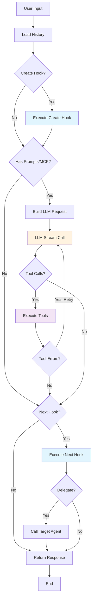

# Context JavaScript API Documentation

## Overview

The Context JavaScript API provides a comprehensive interface for interacting with the Yao Agent system from JavaScript/TypeScript hooks (Create, Next). The Context object exposes agent state, configuration, messaging capabilities, trace operations, and MCP (Model Context Protocol) integrations.

## Context Object

The Context object is automatically passed to hook functions and provides access to the agent's execution environment.

### Basic Properties

```typescript
interface Context {
  // Identifiers
  chat_id: string; // Current chat session ID
  assistant_id: string; // Assistant identifier

  // Configuration
  locale: string; // User locale (e.g., "en", "zh-cn")
  theme: string; // UI theme preference
  accept: string; // Output format ("standard", "cui-web", "cui-native", etc.)
  route: string; // Request route path
  referer: string; // Request referer

  // Client Information
  client: {
    type: string; // Client type
    user_agent: string; // User agent string
    ip: string; // Client IP address
  };

  // Dynamic Data
  metadata: Record<string, any>; // Custom metadata (empty object if not set)
  authorized: Record<string, any>; // Authorization data (empty object if not set)

  // Objects
  memory: Memory; // Agent memory with four namespaces: user, team, chat, context
  trace: Trace; // Trace object for debugging and monitoring
  mcp: MCP; // MCP object for external tool/resource access
  agent: Agent; // Agent-to-Agent calls (A2A)
  llm: LLM; // Direct LLM connector calls
}
```

## Methods

### Send Messages

The Context provides several methods for sending messages to the client:

| Method                               | Description                 | Auto `message_end` | Updatable |
| ------------------------------------ | --------------------------- | ------------------ | --------- |
| `Send(message, block_id?)`           | Send a complete message     | ✅ Yes             | ❌ No     |
| `SendStream(message, block_id?)`     | Start a streaming message   | ❌ No              | ✅ Yes    |
| `Append(message_id, content, path?)` | Append content to a message | -                  | -         |
| `Replace(message_id, message)`       | Replace message content     | -                  | -         |
| `Merge(message_id, data, path?)`     | Merge data into message     | -                  | -         |
| `Set(message_id, data, path)`        | Set a field in message      | -                  | -         |
| `End(message_id, final_content?)`    | Finalize streaming message  | ✅ Yes             | -         |
| `EndBlock(block_id)`                 | End a message block         | -                  | -         |
| `MessageID()`                        | Generate unique message ID  | -                  | -         |
| `BlockID()`                          | Generate unique block ID    | -                  | -         |
| `ThreadID()`                         | Generate unique thread ID   | -                  | -         |

> **Note:** `Append`, `Replace`, `Merge`, and `Set` only work with messages started via `SendStream()`. Messages sent via `Send()` are immediately finalized and cannot be updated.

#### `ctx.Send(message, block_id?): string`

Sends a message to the client and automatically flushes the output.

**Parameters:**

- `message`: Message object or string
- `block_id`: String (optional) - Block ID to send this message in. If omitted, no block ID is assigned.

**Returns:**

- `string`: The message ID (auto-generated if not provided in the message object)

**Message Object Structure:**

```typescript
interface Message {
  // Required
  type: string; // Message type: "text", "tool", "image", etc.

  // Common fields
  props?: Record<string, any>; // Message properties (passed to frontend component)
  message_id?: string; // Message ID (auto-generated if omitted)
  block_id?: string; // Block ID (NOT auto-generated, has priority over block_id parameter)
  thread_id?: string; // Thread ID (auto-set from Stack for nested agents)

  // Metadata (optional)
  metadata?: Record<string, any>; // Custom metadata
}
```

**Examples:**

```javascript
// Send text message (object format) and capture message ID
const message_id = ctx.Send({
  type: "text",
  props: { content: "Hello, World!" },
});
console.log("Sent message:", message_id);

// Send text message (shorthand) - no block ID by default
const text_id = ctx.Send("Hello, World!");

// Send multiple messages in the same block (same bubble/card in UI)
const block_id = ctx.BlockID(); // Generate block ID first
const msg1 = ctx.Send("Step 1: Analyzing...", block_id);
const msg2 = ctx.Send("Step 2: Processing...", block_id);
const msg3 = ctx.Send("Step 3: Complete!", block_id);

// Specify block_id in message object (highest priority)
const msg4 = ctx.Send({
  type: "text",
  props: { content: "In specific block" },
  block_id: "B2", // This takes priority over second parameter
});

// Send tool message with custom IDs
const tool_id = ctx.Send({
  type: "tool",
  message_id: "custom-tool-msg-1",
  block_id: "B_tools",
  props: {
    name: "calculator",
    result: { sum: 42 },
  },
});

// Send image message
const image_id = ctx.Send({
  type: "image",
  props: {
    url: "https://example.com/image.png",
    alt: "Example Image",
  },
});
```

**Block Management:**

```javascript
// Scenario 1: Simple message (most common)
function Next(ctx, payload) {
  const { completion } = payload;

  // Send a complete message
  ctx.Send({
    type: "text",
    props: { content: completion.content },
  });
}

// Scenario 2: Loading indicator before slow operation
function Next(ctx, payload) {
  // Start a streaming message for loading
  const loading_id = ctx.SendStream({
    type: "loading",
    props: { message: "Fetching data..." },
  });

  // Do slow operation (e.g., external API call)
  const result = fetchExternalData();

  // Replace loading with result
  ctx.Replace(loading_id, {
    type: "text",
    props: { content: result },
  });
  ctx.End(loading_id);
}

// Scenario 3: Grouping messages in one block (special case)
function Create(ctx, messages) {
  // Generate a block ID for grouping
  const block_id = ctx.BlockID(); // "B1"

  ctx.Send("# Analysis Results", block_id);
  ctx.Send("- Finding 1: ...", block_id);
  ctx.Send("- Finding 2: ...", block_id);
  ctx.Send("- Finding 3: ...", block_id);

  // All messages appear in the same card/bubble in the UI
}

// Scenario 4: LLM response + follow-up card in same block
function Next(ctx, payload) {
  const { completion } = payload;
  const block_id = ctx.BlockID();

  // LLM response
  ctx.Send({
    type: "text",
    props: { content: completion.content },
    block_id: block_id,
  });

  // Action card (grouped with LLM response)
  ctx.Send({
    type: "card",
    props: {
      title: "Related Actions",
      actions: ["action1", "action2"],
    },
    block_id: block_id,
  });
}
```

**Notes:**

- **Message ID** is automatically generated if not provided
- **Block ID** is NOT auto-generated by default (remains empty unless manually specified)
  - Most messages don't need a Block ID (each message is independent)
  - Only specify Block ID in special cases (e.g., grouping LLM output with a follow-up card)
  - **Block ID priority**: message.block_id > block_id parameter > empty
- **Thread ID** is automatically set from Stack for non-root calls (nested agents)
- Returns the message ID for reference in subsequent operations
- Output is automatically flushed after sending
- Throws exception on failure
- `Send()` automatically sends `message_end` event - the message is complete and cannot be updated
- **For updatable messages**, use `ctx.SendStream()` instead (see below)

#### `ctx.SendStream(message, block_id?): string`

Sends a streaming message that can be appended to later. Unlike `Send()`, this does NOT automatically send `message_end` event. Use `ctx.Append()` to add content, then `ctx.End()` to finalize.

**Parameters:**

- `message`: Message object or string
- `block_id`: String (optional) - Block ID to send this message in

**Returns:**

- `string`: The message ID (for use with `Append` and `End`)

**Examples:**

```javascript
// Start a streaming message
const msg_id = ctx.SendStream({
  type: "text",
  props: { content: "# Title\n\n" },
});

// Append content in chunks (simulating streaming)
ctx.Append(msg_id, "First paragraph. ");
ctx.Append(msg_id, "Second sentence. ");
ctx.Append(msg_id, "Third sentence.\n\n");

// Finalize the message (sends message_end event)
ctx.End(msg_id);
```

**String Shorthand:**

```javascript
// SendStream with string shorthand
const msg_id = ctx.SendStream("Starting analysis...");
ctx.Append(msg_id, " processing...");
ctx.Append(msg_id, " done!");
ctx.End(msg_id);
// Final content: "Starting analysis... processing... done!"
```

**With Block ID:**

```javascript
const block_id = ctx.BlockID();
const msg_id = ctx.SendStream("Step 1: ", block_id);
ctx.Append(msg_id, "Analyzing data...");
ctx.End(msg_id);
```

**Notes:**

- Returns the message ID immediately for use with `Append` and `End`
- Sends `message_start` event but NOT `message_end` (unlike `Send`)
- Must call `ctx.End(msg_id)` to finalize the message
- Content appended via `ctx.Append()` is accumulated for storage
- Ideal for streaming text output where you control the timing

#### `ctx.End(message_id, final_content?): string`

Finalizes a streaming message started with `SendStream()`. Sends `message_end` event with the complete accumulated content.

**Parameters:**

- `message_id`: String - The message ID returned by `SendStream()`
- `final_content`: String (optional) - Final content to append before ending

**Returns:**

- `string`: The message ID

**Examples:**

```javascript
// Basic usage
const msg_id = ctx.SendStream("Hello");
ctx.Append(msg_id, " World");
ctx.End(msg_id);
// Final: "Hello World"

// End with final content
const msg_id2 = ctx.SendStream("Processing");
ctx.Append(msg_id2, "...");
ctx.End(msg_id2, " Complete!");
// Final: "Processing... Complete!"
```

**Notes:**

- Must be called after `SendStream()` to send `message_end` event
- Optional `final_content` is appended before sending `message_end`
- The complete accumulated content is included in `message_end.extra.content`
- Throws exception if `message_id` is not a string

**Send vs SendStream Comparison:**

| Feature               | `Send()`          | `SendStream()`      |
| --------------------- | ----------------- | ------------------- |
| `message_start` event | ✅ Auto           | ✅ Auto             |
| `message_end` event   | ✅ Auto           | ❌ Manual (`End()`) |
| Use case              | Complete messages | Streaming output    |
| Content accumulation  | N/A               | Via `Append()`      |
| Storage               | Immediate         | On `End()`          |

**Streaming Workflow Example:**

```javascript
function Create(ctx, messages) {
  // Start streaming output
  const msg_id = ctx.SendStream({
    type: "text",
    props: { content: "# Analysis Report\n\n" },
  });

  // Simulate streaming chunks
  ctx.Append(msg_id, "## Section 1\n");
  ctx.Append(msg_id, "Processing data...\n\n");

  // Do some work
  const result = analyzeData();

  ctx.Append(msg_id, "## Section 2\n");
  ctx.Append(msg_id, `Found ${result.count} items.\n\n`);

  // Finalize with conclusion
  ctx.End(msg_id, "## Conclusion\nAnalysis complete.");

  return { messages };
}
```

#### `ctx.Replace(message_id, message): string`

Replaces the content of a streaming message. **Only works with messages started via `SendStream()`**.

**Parameters:**

- `message_id`: String - The ID of the streaming message (returned by `SendStream()`)
- `message`: Message object or string - The new message content

**Returns:**

- `string`: The message ID (same as the provided message_id)

**Examples:**

```javascript
// Start a streaming message
const msg_id = ctx.SendStream({
  type: "loading",
  props: { message: "Loading..." },
});

// Replace with new content
ctx.Replace(msg_id, {
  type: "text",
  props: { content: "Data loaded successfully!" },
});

// Finalize the message
ctx.End(msg_id);
```

**Use Cases:**

```javascript
// Progress updates with replacement
function Next(ctx, payload) {
  const msg_id = ctx.SendStream("Step 1/3: Starting...");

  // ... do work ...
  ctx.Replace(msg_id, "Step 2/3: Processing...");

  // ... do more work ...
  ctx.Replace(msg_id, "Step 3/3: Finalizing...");

  // ... finish ...
  ctx.Replace(msg_id, "Complete! ✓");
  ctx.End(msg_id);
}

// Loading to result transition
function Next(ctx, payload) {
  const msg_id = ctx.SendStream({
    type: "loading",
    props: { message: "Fetching results..." },
  });

  const results = fetchData();

  ctx.Replace(msg_id, {
    type: "text",
    props: { content: `Found ${results.length} results` },
  });
  ctx.End(msg_id);
}
```

**Notes:**

- **Only works with `SendStream()` messages** - `Send()` messages cannot be replaced
- Replaces the entire message content, not just specific fields
- Must call `ctx.End(msg_id)` after all updates to finalize the message
- Output is automatically flushed after replacing
- Throws exception on failure

#### `ctx.Append(message_id, content, path?): string`

Appends content to a streaming message. **Only works with messages started via `SendStream()`**.

**Parameters:**

- `message_id`: String - The ID of the streaming message (returned by `SendStream()`)
- `content`: Message object or string - The content to append
- `path`: String (optional) - The delta path to append to (e.g., "props.content", "props.data")

**Returns:**

- `string`: The message ID (same as the provided message_id)

**Examples:**

```javascript
// Start a streaming message
const msg_id = ctx.SendStream("Starting");

// Append more text (default path)
ctx.Append(msg_id, "... processing");
ctx.Append(msg_id, "... done!");

// Finalize the message
ctx.End(msg_id);
// Final content: "Starting... processing... done!"

// Append to specific path
const data_id = ctx.SendStream({
  type: "data",
  props: {
    content: "Item 1\n",
    status: "loading",
  },
});

ctx.Append(data_id, "Item 2\n", "props.content");
ctx.Append(data_id, "Item 3\n", "props.content");
ctx.End(data_id);
// Final: props.content = "Item 1\nItem 2\nItem 3\n"
```

**Use Cases:**

```javascript
// Streaming text output (simulating LLM-like output)
function Create(ctx, messages) {
  const msg_id = ctx.SendStream("");

  ctx.Append(msg_id, "The");
  ctx.Append(msg_id, " quick");
  ctx.Append(msg_id, " brown");
  ctx.Append(msg_id, " fox");

  ctx.End(msg_id);
  // Final: "The quick brown fox"

  return { messages };
}

// Progress logs
function Next(ctx, payload) {
  const log_id = ctx.SendStream({
    type: "log",
    props: { content: "Starting process\n" },
  });

  // Step 1
  doStep1();
  ctx.Append(log_id, "Step 1 complete\n", "props.content");

  // Step 2
  doStep2();
  ctx.Append(log_id, "Step 2 complete\n", "props.content");

  // Finish
  ctx.Append(log_id, "All done!\n", "props.content");
  ctx.End(log_id);
}
```

**Notes:**

- **Only works with `SendStream()` messages** - `Send()` messages cannot be appended to
- Uses delta append operation (adds to existing content, doesn't replace)
- If `path` is omitted, appends to the default content location (`props.content`)
- Must call `ctx.End(msg_id)` after all appends to finalize the message
- Output is automatically flushed after appending
- Throws exception on failure
- block_id and ThreadID are inherited from the original message

#### `ctx.Merge(message_id, data, path?): string`

Merges data into a streaming message object. **Only works with messages started via `SendStream()`**.

**Parameters:**

- `message_id`: String - The ID of the streaming message (returned by `SendStream()`)
- `data`: Object - The data to merge (should be an object)
- `path`: String (optional) - The delta path to merge into (e.g., "props", "props.metadata")

**Returns:**

- `string`: The message ID (same as the provided message_id)

**Examples:**

```javascript
// Start a streaming message with object data
const msg_id = ctx.SendStream({
  type: "status",
  props: {
    status: "running",
    progress: 0,
    started: true,
  },
});

// Merge updates into props (adds/updates fields, keeps others unchanged)
ctx.Merge(msg_id, { progress: 50 }, "props");
// Result: props = { status: "running", progress: 50, started: true }

ctx.Merge(msg_id, { progress: 100, status: "completed" }, "props");
// Result: props = { status: "completed", progress: 100, started: true }

// Finalize the message
ctx.End(msg_id);
```

**Use Cases:**

```javascript
// Updating task progress
function Next(ctx, payload) {
  const task_id = ctx.SendStream({
    type: "task",
    props: {
      name: "Data Processing",
      status: "pending",
      progress: 0,
    },
  });

  ctx.Merge(task_id, { status: "running" }, "props");
  doStep1();
  ctx.Merge(task_id, { progress: 25 }, "props");
  doStep2();
  ctx.Merge(task_id, { progress: 50 }, "props");
  doStep3();
  ctx.Merge(task_id, { progress: 100, status: "completed" }, "props");

  ctx.End(task_id);
}

// Building metadata incrementally
function Create(ctx, messages) {
  const data_id = ctx.SendStream({
    type: "data",
    props: { content: "Result data" },
  });

  ctx.Merge(data_id, { metadata: { source: "api" } }, "props");
  ctx.Merge(data_id, { metadata: { timestamp: Date.now() } }, "props");
  // metadata fields are merged together

  ctx.End(data_id);
  return { messages };
}
```

**Notes:**

- **Only works with `SendStream()` messages** - `Send()` messages cannot be merged into
- Uses delta merge operation (merges objects, doesn't replace)
- Only works with object data (for merging key-value pairs)
- Existing fields not in the merge data remain unchanged
- If `path` is omitted, merges into the default object location
- Must call `ctx.End(msg_id)` after all merges to finalize the message
- Output is automatically flushed after merging
- Throws exception on failure
- block_id and ThreadID are inherited from the original message

#### `ctx.Set(message_id, data, path): string`

Sets a new field or value in a streaming message. **Only works with messages started via `SendStream()`**.

**Parameters:**

- `message_id`: String - The ID of the streaming message (returned by `SendStream()`)
- `data`: Any - The value to set
- `path`: String (required) - The delta path where to set the value (e.g., "props.newField", "props.metadata.key")

**Returns:**

- `string`: The message ID (same as the provided message_id)

**Examples:**

```javascript
// Start a streaming message
const msg_id = ctx.SendStream({
  type: "result",
  props: {
    content: "Initial content",
  },
});

// Set a new field
ctx.Set(msg_id, "success", "props.status");
// Result: props.status = "success"

// Set a nested object
ctx.Set(msg_id, { duration: 1500, cached: true }, "props.metadata");
// Result: props.metadata = { duration: 1500, cached: true }

// Finalize the message
ctx.End(msg_id);
```

**Use Cases:**

```javascript
// Adding computed metadata after initial send
function Next(ctx, payload) {
  const result_id = ctx.SendStream({
    type: "search_result",
    props: { results: search_results },
  });

  ctx.Set(result_id, search_results.length, "props.count");
  ctx.Set(result_id, Date.now(), "props.timestamp");
  ctx.Set(result_id, "relevance", "props.sort_by");

  ctx.End(result_id);
}

// Conditionally adding fields
function Create(ctx, messages) {
  const msg_id = ctx.SendStream({
    type: "operation",
    props: { name: "Process Data" },
  });

  try {
    const result = processData();
    ctx.Set(msg_id, "success", "props.status");
    ctx.Set(msg_id, result, "props.data");
  } catch (e) {
    ctx.Set(msg_id, e.message, "props.error");
    ctx.Set(msg_id, "error", "props.status");
  }

  ctx.End(msg_id);
  return { messages };
}
```

**Notes:**

- **Only works with `SendStream()` messages** - `Send()` messages cannot be modified
- Uses delta set operation (creates/sets new fields)
- The `path` parameter is **required** (must specify where to set the value)
- Creates the path if it doesn't exist
- Use for adding new fields or completely replacing a field's value
- For updating existing object fields, consider using `Merge` instead
- Must call `ctx.End(msg_id)` after all sets to finalize the message
- Output is automatically flushed after setting
- Throws exception on failure
- block_id and ThreadID are inherited from the original message

### ID Generators

These methods generate unique IDs for manual message management. Useful when you need to specify IDs before sending messages or for advanced Block/Thread management.

#### `ctx.MessageID(): string`

Generates a unique message ID.

**Returns:**

- `string`: Message ID in format "M1", "M2", "M3"...

**Example:**

```javascript
// Generate IDs manually
const id_1 = ctx.MessageID(); // "M1"
const id_2 = ctx.MessageID(); // "M2"

// Use custom ID
ctx.Send({
  type: "text",
  message_id: id_1,
  props: { content: "Hello" },
});
```

#### `ctx.BlockID(): string`

Generates a unique block ID for grouping messages.

**Returns:**

- `string`: Block ID in format "B1", "B2", "B3"...

**Example:**

```javascript
// Generate block ID for grouping messages
const block_id = ctx.BlockID(); // "B1"

// Send multiple messages in the same block
ctx.Send("Step 1: Analyzing...", block_id);
ctx.Send("Step 2: Processing...", block_id);
ctx.Send("Step 3: Complete!", block_id);

// All three messages appear in the same card/bubble in UI
```

**Use Cases:**

```javascript
// Scenario: LLM output + follow-up card in same block
const block_id = ctx.BlockID();

// LLM response
const llm_result = Process("llms.chat", {...});
ctx.Send({
  type: "text",
  props: { content: llm_result.content },
  block_id: block_id,
});

// Follow-up action card (grouped with LLM output)
ctx.Send({
  type: "card",
  props: {
    title: "Related Actions",
    actions: [...]
  },
  block_id: block_id,
});
```

#### `ctx.ThreadID(): string`

Generates a unique thread ID for concurrent operations.

**Returns:**

- `string`: Thread ID in format "T1", "T2", "T3"...

**Example:**

```javascript
// For advanced parallel processing scenarios
const thread_id = ctx.ThreadID(); // "T1"

// Send messages in a specific thread
ctx.Send({
  type: "text",
  props: { content: "Parallel task 1" },
  thread_id: thread_id,
});
```

**Notes:**

- IDs are generated sequentially within each context
- Each context has its own ID counter (starts from 1)
- IDs are guaranteed to be unique within the same request/stream
- ThreadID is usually auto-managed by Stack, manual generation is for advanced use cases

### Lifecycle Management

#### `ctx.EndBlock(block_id): void`

Manually sends a `block_end` event for the specified block. Use this to explicitly mark the end of a block.

**Parameters:**

- `block_id`: String - The block ID to end

**Returns:**

- `void`

**Example:**

```javascript
// Create a block for grouped messages
const block_id = ctx.BlockID(); // "B1"

// Send messages in the block
ctx.Send("Analyzing data...", block_id);
ctx.Send("Processing results...", block_id);
ctx.Send("Complete!", block_id);

// Manually end the block
ctx.EndBlock(block_id);
```

**Block Lifecycle Events:**

When you send messages with a `block_id`:

1. **First message**: Automatically sends `block_start` event
2. **Subsequent messages**: No additional block events
3. **Manual end**: Call `ctx.EndBlock(block_id)` to send `block_end` event

**block_end Event Format:**

```json
{
  "type": "event",
  "props": {
    "event": "block_end",
    "message": "Block ended",
    "data": {
      "block_id": "B1",
      "timestamp": 1764483531624,
      "duration_ms": 1523,
      "message_count": 3,
      "status": "completed"
    }
  }
}
```

**Notes:**

- `block_start` is sent automatically when the first message with a new `block_id` is sent
- `block_end` must be called manually via `ctx.EndBlock()`
- You can track multiple blocks simultaneously (each has independent lifecycle)
- Automatically flushes output after sending the event

**Use Cases:**

```javascript
// Use case 1: Progress reporting in a block
function Create(ctx, messages) {
  const block_id = ctx.BlockID();

  ctx.Send("Step 1: Analyzing data...", block_id);
  // ... analysis logic ...

  ctx.Send("Step 2: Processing results...", block_id);
  // ... processing logic ...

  ctx.Send("Step 3: Complete!", block_id);

  // Mark the block as complete
  ctx.EndBlock(block_id);

  return { messages };
}

// Use case 2: Multiple parallel blocks
function Create(ctx, messages) {
  const llm_block = ctx.BlockID(); // "B1"
  const mcp_block = ctx.BlockID(); // "B2"

  // LLM output block
  ctx.Send("Thinking...", llm_block);
  const response = callLLM();
  ctx.Send(response, llm_block);
  ctx.EndBlock(llm_block);

  // MCP tool call block
  ctx.Send("Fetching data...", mcp_block);
  const data = ctx.mcp.CallTool("tool", "method", {});
  ctx.Send(`Found ${data.length} results`, mcp_block);
  ctx.EndBlock(mcp_block);

  return { messages };
}
```

### Resource Cleanup

#### `ctx.Release()`

Manually releases Context resources.

> **Note:** In Hook functions (`Create`, `Next`), you do **NOT** need to call `Release()` - the system handles cleanup automatically. Only call `Release()` when you create a new Context manually (e.g., via `new Context()`).

**Example (only for manually created Context):**

```javascript
// Only needed when creating Context manually, NOT in hooks
const ctx = new Context(options);
try {
  ctx.Send("Processing...");
} finally {
  ctx.Release(); // Required for manually created Context
}
```

## Trace API

The `ctx.trace` object provides tracing capabilities for:

1. **User Transparency** - Expose the agent's working and thinking process to users. The frontend will render these trace nodes to show users what the agent is doing.
2. **Developer Debugging** - Help developers debug agent execution by recording detailed steps and data.

> **Note:** Trace is primarily designed for developers to expose the agent's process to users. The frontend has corresponding UI components to render these trace nodes.

### Properties

- `ctx.trace.id`: String - The unique identifier of the trace

### Methods Summary

| Method                    | Description                     |
| ------------------------- | ------------------------------- |
| `Add(input, option)`      | Create a sequential trace node  |
| `Parallel(inputs)`        | Create parallel trace nodes     |
| `Info(message)`           | Add info log to current node    |
| `Debug(message)`          | Add debug log to current node   |
| `Warn(message)`           | Add warning log to current node |
| `Error(message)`          | Add error log to current node   |
| `SetOutput(output)`       | Set output for current node     |
| `SetMetadata(key, value)` | Set metadata for current node   |
| `Complete(output?)`       | Mark current node as completed  |
| `Fail(error)`             | Mark current node as failed     |
| `MarkComplete()`          | Mark entire trace as complete   |
| `IsComplete()`            | Check if trace is complete      |
| `CreateSpace(option)`     | Create a visual space container |
| `GetSpace(id)`            | Get a trace space by ID         |
| `Release()`               | Release trace resources         |

### Node Operations

#### `ctx.trace.Add(input, options)`

Creates a new trace node (sequential step).

**Parameters:**

- `input`: Input data for the node
- `options`: Node configuration object

**Options Structure:**

```typescript
interface TraceNodeOption {
  label: string; // Display label in UI
  type?: string; // Node type identifier
  icon?: string; // Icon identifier
  description?: string; // Node description
  metadata?: Record<string, any>; // Additional metadata
  autoCompleteParent?: boolean; // Auto-complete parent node(s) when this node is created (default: true)
}
```

**Example:**

```javascript
const search_node = ctx.trace.Add(
  { query: "What is AI?" },
  {
    label: "Search Query",
    type: "search",
    icon: "search",
    description: "Searching for AI information",
  }
);
```

#### `ctx.trace.Parallel(inputs)`

Creates multiple parallel trace nodes for concurrent operations.

**Parameters:**

- `inputs`: Array of parallel input objects

**Input Structure:**

```typescript
interface ParallelInput {
  input: any; // Input data
  option: TraceNodeOption; // Node configuration
}
```

**Example:**

```javascript
const parallel_nodes = ctx.trace.Parallel([
  {
    input: { url: "https://api1.com" },
    option: {
      label: "API Call 1",
      type: "api",
      icon: "cloud",
      description: "Fetching from API 1",
    },
  },
  {
    input: { url: "https://api2.com" },
    option: {
      label: "API Call 2",
      type: "api",
      icon: "cloud",
      description: "Fetching from API 2",
    },
  },
]);
```

### Logging Methods

Add log entries to the current trace node. Each method takes a single string message and returns the trace object for chaining.

```javascript
// Information logs
ctx.trace.Info("Processing started");

// Debug logs
ctx.trace.Debug("Variable value: 42");

// Warning logs
ctx.trace.Warn("Deprecated feature used");

// Error logs
ctx.trace.Error("Operation failed: timeout");
```

### Trace-Level Operations

These methods operate on the current trace node (managed by the trace manager).

#### `ctx.trace.SetOutput(output)`

Sets the output data for the current trace node.

```javascript
ctx.trace.SetOutput({ result: "success", data: [...] });
```

#### `ctx.trace.SetMetadata(key, value)`

Sets metadata for the current trace node.

```javascript
ctx.trace.SetMetadata("duration", 1500);
ctx.trace.SetMetadata("source", "cache");
```

#### `ctx.trace.Complete(output?)`

Marks the current trace node as completed (optionally with output).

```javascript
ctx.trace.Complete({ status: "done" });
```

#### `ctx.trace.Fail(error)`

Marks the current trace node as failed with an error message.

```javascript
ctx.trace.Fail("Connection timeout");
```

### Node Object

The `ctx.trace.Add()` and `ctx.trace.Parallel()` methods return Node objects. Each node has the following properties and methods:

#### Properties

- `id`: String - The unique identifier of the node

#### `node.Add(input, option)`

Creates a child node under this node.

```javascript
const parent_node = ctx.trace.Add({ step: "process" }, { label: "Process" });
const child_node = parent_node.Add(
  { action: "validate" },
  { label: "Validate Input", type: "validation" }
);
```

#### `node.Parallel(inputs)`

Creates multiple parallel child nodes under this node.

```javascript
const parent_node = ctx.trace.Add({ step: "fetch" }, { label: "Fetch Data" });
const child_nodes = parent_node.Parallel([
  { input: { source: "db" }, option: { label: "Database Query" } },
  { input: { source: "api" }, option: { label: "API Call" } },
]);
```

#### `node.Info(message)`, `node.Debug(message)`, `node.Warn(message)`, `node.Error(message)`

Add log entries to the node. All methods return the node for chaining.

```javascript
const search_node = ctx.trace.Add({ query: "search" }, { label: "Search" });
search_node
  .Info("Starting search")
  .Debug("Query parameters validated")
  .Warn("Cache miss, fetching from source");
```

#### `node.SetOutput(output)`

Sets the output data for a node. Returns the node for chaining.

```javascript
const search_node = ctx.trace.Add({ query: "search" }, { label: "Search" });
search_node.SetOutput({ results: [...], count: 10 });
```

#### `node.SetMetadata(key, value)`

Sets metadata for a node. Returns the node for chaining.

```javascript
search_node.SetMetadata("duration", 1500).SetMetadata("cache_hit", true);
```

#### `node.Complete(output?)`

Marks a node as completed (optionally with output). Returns the node for chaining.

```javascript
search_node.Complete({ status: "success", data: [...] });
```

#### `node.Fail(error)`

Marks a node as failed with an error message. Returns the node for chaining.

```javascript
try {
  // Operation
} catch (error) {
  search_node.Fail(error.message);
}
```

### Trace Lifecycle

#### `ctx.trace.IsComplete()`

Checks if the trace is complete.

```javascript
if (ctx.trace.IsComplete()) {
  console.log("Trace completed");
}
```

#### `ctx.trace.MarkComplete()`

Marks the entire trace as complete.

```javascript
ctx.trace.MarkComplete();
```

#### `ctx.trace.Release()`

Releases trace resources.

> **Note:** In Hook functions, you do **NOT** need to call `Release()` - the system handles cleanup automatically. Only call this when you create a Trace manually (e.g., via `new Trace()`).

### Trace Space Operations

Trace spaces are visual containers for organizing trace nodes in the frontend UI. They help group related operations together for better presentation to users.

> **Note:** Trace spaces are purely for visual organization and presentation. They do not store data - use `ctx.memory` for data storage between hooks.

#### `ctx.trace.CreateSpace(option)`

Creates a visual space container for grouping trace nodes.

**Option Structure:**

```typescript
interface TraceSpaceOption {
  label: string; // Display label in UI
  type?: string; // Space type identifier
  icon?: string; // Icon identifier
  description?: string; // Space description
  ttl?: number; // Time to live in seconds (for display only)
  metadata?: Record<string, any>; // Additional metadata
}
```

**Example:**

```javascript
const visual_space = ctx.trace.CreateSpace({
  label: "Search Results",
  type: "search",
  icon: "search",
  description: "Knowledge base search operations",
});
```

#### `ctx.trace.GetSpace(id)`

Retrieves a trace space by ID.

```javascript
const search_space = ctx.trace.GetSpace("search-space-id");
```

## Memory API

The `ctx.memory` object provides a four-level hierarchical memory system for agent state management. Each level has different persistence and scope characteristics.

### Memory Namespaces

| Namespace            | Scope               | Persistence | Use Case                                    |
| -------------------- | ------------------- | ----------- | ------------------------------------------- |
| `ctx.memory.user`    | Per user            | Persistent  | User preferences, settings, long-term state |
| `ctx.memory.team`    | Per team            | Persistent  | Team-wide settings, shared configurations   |
| `ctx.memory.chat`    | Per chat session    | Persistent  | Chat-specific context, conversation state   |
| `ctx.memory.context` | Per request context | Temporary   | Request-scoped data, cleared on release     |

### Namespace Interface

Each namespace (`user`, `team`, `chat`, `context`) provides the same interface:

```typescript
interface MemoryNamespace {
  // Basic KV operations
  Get(key: string): any; // Get a value
  Set(key: string, value: any, ttl?: number): void; // Set a value with optional TTL (seconds)
  Del(key: string): void; // Delete a key (supports wildcards: "prefix:*")
  Has(key: string): boolean; // Check if key exists
  GetDel(key: string): any; // Get and delete atomically

  // Collection operations
  Keys(): string[]; // Get all keys
  Len(): number; // Get number of keys
  Clear(): void; // Delete all keys

  // Atomic counter operations
  Incr(key: string, delta?: number): number; // Increment (default delta=1)
  Decr(key: string, delta?: number): number; // Decrement (default delta=1)

  // List operations
  Push(key: string, values: any[]): number; // Append to list, returns new length
  Pop(key: string): any; // Remove and return last element
  Pull(key: string, count: number): any[]; // Remove and return last N elements
  PullAll(key: string): any[]; // Remove and return all elements
  AddToSet(key: string, values: any[]): number; // Add unique values to set

  // Array access operations
  ArrayLen(key: string): number; // Get array length
  ArrayGet(key: string, index: number): any; // Get element at index
  ArraySet(key: string, index: number, value: any): void; // Set element at index
  ArraySlice(key: string, start: number, end: number): any[]; // Get slice
  ArrayPage(key: string, page: number, size: number): any[]; // Paginated access
  ArrayAll(key: string): any[]; // Get all elements

  // Metadata
  id: string; // Namespace ID
  space: string; // Space type: "user", "team", "chat", or "context"
}
```

### Basic KV Operations

#### `Get(key): any`

Gets a value from the namespace.

```javascript
// User preferences
const theme = ctx.memory.user.Get("theme");
if (theme) {
  console.log("User prefers:", theme);
}

// Chat context
const topic = ctx.memory.chat.Get("current_topic");
```

#### `Set(key, value, ttl?): void`

Sets a value with optional TTL (time-to-live in seconds).

```javascript
// Persistent user setting
ctx.memory.user.Set("language", "en");

// Team configuration
ctx.memory.team.Set("api_key", "sk-xxx");

// Chat state
ctx.memory.chat.Set("last_query", "What is AI?");

// Temporary context data with 5 minute TTL
ctx.memory.context.Set("temp_result", { data: "..." }, 300);
```

#### `Del(key): void`

Deletes a key. Supports wildcard patterns with `*`.

```javascript
// Delete single key
ctx.memory.user.Del("old_setting");

// Delete with wildcard pattern
ctx.memory.chat.Del("cache:*"); // Deletes all keys starting with "cache:"
```

#### `Has(key): boolean`

Checks if a key exists.

```javascript
if (ctx.memory.user.Has("onboarding_complete")) {
  // Skip onboarding
}
```

#### `GetDel(key): any`

Atomically gets and deletes a value. Useful for one-time tokens.

```javascript
const token = ctx.memory.context.GetDel("one_time_token");
if (token) {
  // Use token (it's now deleted)
}
```

### Collection Operations

#### `Keys(): string[]`

Returns all keys in the namespace.

```javascript
const userKeys = ctx.memory.user.Keys();
console.log("User has", userKeys.length, "stored values");
```

#### `Len(): number`

Returns the number of keys.

```javascript
const count = ctx.memory.chat.Len();
console.log("Chat has", count, "stored values");
```

#### `Clear(): void`

Deletes all keys in the namespace.

```javascript
// Clear temporary context data
ctx.memory.context.Clear();
```

### Atomic Counter Operations

#### `Incr(key, delta?): number`

Atomically increments a counter. Returns the new value.

```javascript
// Simple counter
const views = ctx.memory.user.Incr("page_views");
console.log("Total views:", views);

// Increment by custom amount
const points = ctx.memory.user.Incr("points", 10);
```

#### `Decr(key, delta?): number`

Atomically decrements a counter. Returns the new value.

```javascript
const remaining = ctx.memory.user.Decr("credits");
if (remaining < 0) {
  throw new Error("Insufficient credits");
}
```

### List Operations

#### `Push(key, values): number`

Appends values to a list. Returns new length.

```javascript
const len = ctx.memory.chat.Push("history", [
  { role: "user", content: "Hello" },
  { role: "assistant", content: "Hi there!" },
]);
```

#### `Pop(key): any`

Removes and returns the last element.

```javascript
const lastItem = ctx.memory.chat.Pop("pending_tasks");
```

#### `Pull(key, count): any[]`

Removes and returns the last N elements.

```javascript
const recentItems = ctx.memory.chat.Pull("notifications", 5);
```

#### `PullAll(key): any[]`

Removes and returns all elements.

```javascript
const allTasks = ctx.memory.context.PullAll("batch_queue");
// Process all tasks, queue is now empty
```

#### `AddToSet(key, values): number`

Adds unique values to a set (no duplicates). Returns new size.

```javascript
ctx.memory.user.AddToSet("visited_pages", ["/home", "/about"]);
ctx.memory.user.AddToSet("visited_pages", ["/home", "/contact"]); // "/home" not added again
```

### Array Access Operations

#### `ArrayLen(key): number`

Gets the length of an array.

```javascript
const historyLen = ctx.memory.chat.ArrayLen("messages");
```

#### `ArrayGet(key, index): any`

Gets an element at a specific index.

```javascript
const firstMessage = ctx.memory.chat.ArrayGet("messages", 0);
const lastMessage = ctx.memory.chat.ArrayGet("messages", -1); // Negative index
```

#### `ArraySet(key, index, value): void`

Sets an element at a specific index.

```javascript
ctx.memory.chat.ArraySet("messages", 0, { role: "system", content: "Updated" });
```

#### `ArraySlice(key, start, end): any[]`

Gets a slice of the array.

```javascript
const recent = ctx.memory.chat.ArraySlice("messages", -10, -1); // Last 10 messages
```

#### `ArrayPage(key, page, size): any[]`

Gets a page of elements (1-indexed pages).

```javascript
const page1 = ctx.memory.chat.ArrayPage("messages", 1, 20); // First 20 messages
const page2 = ctx.memory.chat.ArrayPage("messages", 2, 20); // Next 20 messages
```

#### `ArrayAll(key): any[]`

Gets all elements of the array.

```javascript
const allMessages = ctx.memory.chat.ArrayAll("messages");
```

### Use Cases

```javascript
// Use case 1: User preferences (persistent across sessions)
function Create(ctx, messages) {
  // Load user preferences
  const locale = ctx.memory.user.Get("preferred_locale") || "en";
  const style = ctx.memory.user.Get("response_style") || "concise";

  return {
    messages,
    locale: locale,
    metadata: { style: style },
  };
}

// Use case 2: Chat context (persistent within chat session)
function Next(ctx, payload) {
  // Track conversation topics
  const topics = ctx.memory.chat.Get("discussed_topics") || [];
  const newTopic = extractTopic(payload.completion.content);

  if (newTopic && !topics.includes(newTopic)) {
    topics.push(newTopic);
    ctx.memory.chat.Set("discussed_topics", topics);
  }
}

// Use case 3: Request-scoped data (cleared on context release)
function Create(ctx, messages) {
  // Store temporary processing data
  ctx.memory.context.Set("request_start", Date.now());
  ctx.memory.context.Set("original_query", messages[0]?.content);

  return { messages };
}

function Next(ctx, payload) {
  // Retrieve temporary data
  const startTime = ctx.memory.context.Get("request_start");
  const duration = Date.now() - startTime;
  console.log("Request took", duration, "ms");

  // context memory is automatically cleared when ctx.Release() is called
}

// Use case 4: Team-wide settings
function Create(ctx, messages) {
  // Check team quota
  const used = ctx.memory.team.Incr("monthly_requests");
  const limit = ctx.memory.team.Get("monthly_limit") || 10000;

  if (used > limit) {
    throw new Error("Team quota exceeded");
  }

  return { messages };
}

// Use case 5: Rate limiting with counters
function Create(ctx, messages) {
  const key = `rate:${new Date().toISOString().slice(0, 13)}`; // Hourly bucket
  const count = ctx.memory.user.Incr(key);

  if (count > 100) {
    throw new Error("Rate limit exceeded");
  }

  return { messages };
}
```

### Memory Lifecycle

| Namespace | Created When     | Cleared When    |
| --------- | ---------------- | --------------- |
| `user`    | First access     | Manual only     |
| `team`    | First access     | Manual only     |
| `chat`    | First access     | Manual only     |
| `context` | Context creation | `ctx.Release()` |

**Notes:**

- `user`, `team`, `chat` namespaces are persistent (backed by database)
- `context` namespace is temporary and cleared when the request context is released
- All namespaces support TTL for automatic expiration
- Wildcard deletion (`Del("prefix:*")`) works on all namespaces
- Counter operations (`Incr`, `Decr`) are atomic

## MCP API

The `ctx.mcp` object provides access to Model Context Protocol operations for interacting with external tools, resources, and prompts.

### Methods Summary

| Method                               | Description                      |
| ------------------------------------ | -------------------------------- |
| `ListResources(client, cursor?)`     | List available resources         |
| `ReadResource(client, uri)`          | Read a specific resource         |
| `ListTools(client, cursor?)`         | List available tools             |
| `CallTool(client, name, args?)`      | Call a single tool               |
| `CallTools(client, tools)`           | Call multiple tools sequentially |
| `CallToolsParallel(client, tools)`   | Call multiple tools in parallel  |
| `All(requests)`                      | Call tools across servers, wait for all |
| `Any(requests)`                      | Call tools across servers, first success wins |
| `Race(requests)`                     | Call tools across servers, first complete wins |
| `ListPrompts(client, cursor?)`       | List available prompts           |
| `GetPrompt(client, name, args?)`     | Get a specific prompt            |
| `ListSamples(client, type, name)`    | List samples for a tool/resource |
| `GetSample(client, type, name, idx)` | Get a specific sample by index   |

### Resource Operations

#### `ctx.mcp.ListResources(client, cursor?)`

Lists available resources from an MCP client.

**Parameters:**

- `client`: String - MCP client ID
- `cursor`: String (optional) - Pagination cursor

```javascript
const resources = ctx.mcp.ListResources("echo", "");
console.log(resources.resources); // Array of resources
```

#### `ctx.mcp.ReadResource(client, uri)`

Reads a specific resource.

**Parameters:**

- `client`: String - MCP client ID
- `uri`: String - Resource URI

```javascript
const info = ctx.mcp.ReadResource("echo", "echo://info");
console.log(info.contents); // Array of content items
```

### Tool Operations

#### `ctx.mcp.ListTools(client, cursor?)`

Lists available tools from an MCP client.

**Parameters:**

- `client`: String - MCP client ID
- `cursor`: String (optional) - Pagination cursor

```javascript
const tools = ctx.mcp.ListTools("echo", "");
console.log(tools.tools); // Array of tools
```

#### `ctx.mcp.CallTool(client, name, arguments?)`

Calls a single tool and returns the parsed result directly.

**Parameters:**

- `client`: String - MCP client ID
- `name`: String - Tool name
- `arguments`: Object (optional) - Tool arguments

**Returns:** Parsed result directly (automatically extracts and parses JSON from tool response)

```javascript
// Result is returned directly - no wrapper object needed
const result = ctx.mcp.CallTool("echo", "echo", { message: "hello" });
console.log(result.echo);  // "hello" - directly access parsed data!

// Another example
const status = ctx.mcp.CallTool("echo", "status", { verbose: true });
console.log(status.status);  // "online"
console.log(status.uptime);  // 3600
```

#### `ctx.mcp.CallTools(client, tools)`

Calls multiple tools sequentially and returns array of parsed results.

**Parameters:**

- `client`: String - MCP client ID
- `tools`: Array - Array of tool call objects

**Returns:** Array of parsed results (same order as input tools)

```javascript
const results = ctx.mcp.CallTools("echo", [
  { name: "ping", arguments: { count: 1 } },
  { name: "echo", arguments: { message: "hello" } },
]);

// Results are directly accessible
console.log(results[0].message);  // "pong"
console.log(results[1].echo);     // "hello"
```

#### `ctx.mcp.CallToolsParallel(client, tools)`

Calls multiple tools in parallel and returns array of parsed results.

**Parameters:**

- `client`: String - MCP client ID
- `tools`: Array - Array of tool call objects

**Returns:** Array of parsed results (same order as input tools)

```javascript
const results = ctx.mcp.CallToolsParallel("echo", [
  { name: "ping", arguments: { count: 1 } },
  { name: "echo", arguments: { message: "hello" } },
]);

// Results are directly accessible (order matches input order)
console.log(results[0].message);  // "pong" (ping result)
console.log(results[1].echo);     // "hello" (echo result)
```

### Prompt Operations

#### `ctx.mcp.ListPrompts(client, cursor?)`

Lists available prompts from an MCP client.

**Parameters:**

- `client`: String - MCP client ID
- `cursor`: String (optional) - Pagination cursor

```javascript
const prompts = ctx.mcp.ListPrompts("echo", "");
console.log(prompts.prompts); // Array of prompts
```

#### `ctx.mcp.GetPrompt(client, name, arguments?)`

Retrieves a specific prompt with optional arguments.

**Parameters:**

- `client`: String - MCP client ID
- `name`: String - Prompt name
- `arguments`: Object (optional) - Prompt arguments

```javascript
const prompt = ctx.mcp.GetPrompt("echo", "test_connection", {
  detailed: "true",
});
console.log(prompt.messages); // Array of prompt messages
```

### Sample Operations

#### `ctx.mcp.ListSamples(client, type, name)`

Lists available samples for a tool or resource.

**Parameters:**

- `client`: String - MCP client ID
- `type`: String - Sample type ("tool" or "resource")
- `name`: String - Tool or resource name

```javascript
const samples = ctx.mcp.ListSamples("echo", "tool", "ping");
console.log(samples.samples); // Array of samples
```

#### `ctx.mcp.GetSample(client, type, name, index)`

Gets a specific sample by index.

**Parameters:**

- `client`: String - MCP client ID
- `type`: String - Sample type ("tool" or "resource")
- `name`: String - Tool or resource name
- `index`: Number - Sample index (0-based)

```javascript
const sample = ctx.mcp.GetSample("echo", "tool", "ping", 0);
console.log(sample.name, sample.input); // Sample name and input data
```

### Cross-Server Tool Operations

These methods enable calling tools across multiple MCP servers concurrently, similar to JavaScript Promise patterns. This is useful for:

- **Parallel data fetching**: Query multiple data sources simultaneously
- **Redundancy/Fallback**: Try multiple servers, use first successful result
- **Load balancing**: Distribute load across servers

#### `ctx.mcp.All(requests)`

Calls tools on multiple MCP servers concurrently and waits for all to complete (like `Promise.all`).

**Parameters:**

- `requests`: Array of request objects with `mcp`, `tool`, and optional `arguments`

**Returns:** Array of `MCPToolResult` objects in the same order as requests

```javascript
const results = ctx.mcp.All([
  { mcp: "server1", tool: "search", arguments: { query: "topic" } },
  { mcp: "server2", tool: "fetch", arguments: { id: 123 } },
  { mcp: "server3", tool: "analyze", arguments: { data: "input" } }
]);

// Process all results
results.forEach((r, i) => {
  if (r.error) {
    console.log(`Request ${i} failed: ${r.error}`);
  } else {
    console.log(`Request ${i} result:`, r.result);
  }
});
```

#### `ctx.mcp.Any(requests)`

Calls tools on multiple MCP servers concurrently and returns when any succeeds (like `Promise.any`). Useful for redundancy/fallback scenarios.

**Parameters:**

- `requests`: Array of request objects

**Returns:** Array of `MCPToolResult` objects (only contains results received before first success)

```javascript
// Try multiple search providers, use first successful result
const results = ctx.mcp.Any([
  { mcp: "search-primary", tool: "search", arguments: { q: "query" } },
  { mcp: "search-backup", tool: "search", arguments: { q: "query" } }
]);

const success = results.find(r => r && !r.error);
if (success) {
  console.log("Search result:", success.result);
}
```

#### `ctx.mcp.Race(requests)`

Calls tools on multiple MCP servers concurrently and returns when any completes (like `Promise.race`). Returns immediately with first completion, regardless of success or failure.

**Parameters:**

- `requests`: Array of request objects

**Returns:** Array of `MCPToolResult` objects (only first completed result is populated)

```javascript
// Get fastest response
const results = ctx.mcp.Race([
  { mcp: "region-us", tool: "ping", arguments: {} },
  { mcp: "region-eu", tool: "ping", arguments: {} },
  { mcp: "region-asia", tool: "ping", arguments: {} }
]);

const first = results.find(r => r !== undefined && r !== null);
console.log(`Fastest server: ${first.mcp}`);
```

#### MCPToolRequest Structure

```typescript
interface MCPToolRequest {
  mcp: string;        // MCP server ID (required)
  tool: string;       // Tool name (required)
  arguments?: any;    // Tool arguments (optional)
}
```

#### MCPToolResult Structure

```typescript
interface MCPToolResult {
  mcp: string;     // MCP server ID
  tool: string;    // Tool name
  result?: any;    // Parsed result content (directly usable)
  error?: string;  // Error message (on failure)
}
```

The `result` field contains the automatically parsed content from the MCP response:
- For text content: JSON parsed if valid JSON, otherwise plain string
- For image content: `{ type: "image", data: "...", mimeType: "..." }`
- For resource content: The resource object directly
- If only one content item exists, returns it directly (not as array)

**Example using parsed result:**

```javascript
// Single server - direct result
const result = ctx.mcp.CallTool("echo", "echo", { message: "hello" });
console.log(result.echo);  // Directly access parsed data

// Cross-server - results array with MCPToolResult objects
const results = ctx.mcp.All([
  { mcp: "echo", tool: "echo", arguments: { message: "hello" } }
]);
console.log(results[0].result.echo);  // Access via .result field
```

## Agent API

The `ctx.agent` object provides methods to call other agents from within hooks, enabling agent-to-agent communication (A2A). This allows building complex multi-agent workflows where agents can delegate tasks, consult specialists, or orchestrate parallel operations.

### Methods Summary

| Method                          | Description                              |
| ------------------------------- | ---------------------------------------- |
| `Call(agentID, messages, opts)` | Call a single agent                      |
| `All(requests, opts?)`          | Call multiple agents, wait for all       |
| `Any(requests, opts?)`          | Call multiple agents, first success wins |
| `Race(requests, opts?)`         | Call multiple agents, first complete wins|

### Single Agent Call

#### `ctx.agent.Call(agentID, messages, options?)`

Calls a single agent and streams the response to the current context's output.

**Parameters:**

- `agentID`: String - The target agent/assistant ID
- `messages`: Array - Messages to send to the agent
- `options`: Object (optional) - Call options including callback

**Options:**

```typescript
interface AgentCallOptions {
  connector?: string;      // Override LLM connector
  mode?: string;           // Agent mode ("chat", "task", etc.)
  metadata?: Record<string, any>;  // Custom metadata passed to hooks
  skip?: {
    history?: boolean;        // Skip loading chat history
    trace?: boolean;          // Skip trace recording
    output?: boolean;         // Skip output to client
    keyword?: boolean;        // Skip keyword extraction
    search?: boolean;         // Skip search
    content_parsing?: boolean; // Skip content parsing
  };
  onChunk?: (msg: Message) => number;  // Callback for each message chunk
}
```

**Example:**

```javascript
// Basic call
const result = ctx.agent.Call("specialist.agent", [
  { role: "user", content: "Analyze this data" }
]);

// With callback
const result = ctx.agent.Call("specialist.agent", messages, {
  connector: "gpt-4o",
  onChunk: (msg) => {
    console.log("Received:", msg.type, msg.props?.content);
    return 0; // 0 = continue, non-zero = stop
  }
});
```

**Returns:**

```typescript
interface AgentResult {
  agent_id: string;            // Agent ID that was called
  response?: Response;         // Full agent response
  content?: string;            // Extracted text content
  error?: string;              // Error message if failed
}
```

**Message Object (received in onChunk callback):**

The `onChunk` callback receives a `Message` object with the following structure:

```typescript
interface Message {
  type: string;                  // Message type: "text", "thinking", "tool_call", "error", etc.
  props?: Record<string, any>;   // Message properties (e.g., { content: "Hello" })
  
  // Streaming identifiers
  chunk_id?: string;             // Unique chunk ID (C1, C2, ...)
  message_id?: string;           // Logical message ID (M1, M2, ...)
  block_id?: string;             // Output block ID (B1, B2, ...)
  thread_id?: string;            // Thread ID for concurrent calls (T1, T2, ...)
  
  // Delta control
  delta?: boolean;               // Whether this is an incremental update
  delta_path?: string;           // Update path (e.g., "content")
  delta_action?: string;         // Update action: "append", "replace", "merge", "set"
}
```

Common message types:
- `"text"` - Text content (`props.content` contains the text)
- `"thinking"` - Reasoning/thinking content (o1, DeepSeek R1 models)
- `"tool_call"` - Tool/function call
- `"error"` - Error message (`props.error` contains error details)

### Parallel Agent Calls

The parallel methods allow calling multiple agents concurrently, similar to JavaScript Promise patterns.

> **Important: SSE Output is Automatically Disabled**
>
> For all batch calls (`All`, `Any`, `Race`), SSE output is **automatically disabled** (`skip.output = true`).
> This prevents multiple agents from writing to the same SSE stream simultaneously, which would cause
> client disconnection and message corruption. Use the `onChunk` callback to receive streaming messages
> if needed.

#### `ctx.agent.All(requests, options?)`

Executes all agent calls and waits for all to complete (like `Promise.all`).

**Parameters:**

- `requests`: Array of request objects
- `options`: Object (optional) - Global options including callback

**Request Structure:**

```typescript
interface AgentRequest {
  agent: string;                     // Target agent ID
  messages: Message[];               // Messages to send
  options?: AgentCallOptions;        // Per-request options (excluding onChunk)
}

// Note: Per-request onChunk is NOT supported in batch calls.
// Use the global onChunk callback in the second argument instead.
// Note: skip.output is automatically set to true for all batch calls.
```

**Example:**

```javascript
// Call multiple agents in parallel
const results = ctx.agent.All([
  { agent: "analyzer", messages: [{ role: "user", content: "Analyze X" }] },
  { agent: "summarizer", messages: [{ role: "user", content: "Summarize Y" }] }
]);

// Results array matches request order
results.forEach((r, i) => {
  if (r.error) {
    console.log(`Agent ${r.agent_id} failed:`, r.error);
  } else {
    console.log(`Agent ${r.agent_id} response:`, r.content);
  }
});

// With global callback for all responses
const results = ctx.agent.All([
  { agent: "agent-1", messages: [...] },
  { agent: "agent-2", messages: [...] }
], {
  onChunk: (agentId, index, msg) => {
    console.log(`Agent ${agentId} [${index}]:`, msg.type, msg.props?.content);
    return 0;
  }
});
```

#### `ctx.agent.Any(requests, options?)`

Returns as soon as any agent call succeeds (like `Promise.any`). Other calls continue in background.

**Example:**

```javascript
// Try multiple agents, use first successful response
const results = ctx.agent.Any([
  { agent: "primary.agent", messages: [...] },
  { agent: "fallback.agent", messages: [...] }
]);

// First successful result is returned
const success = results.find(r => !r.error);
if (success) {
  console.log("Got response from:", success.agent_id);
}
```

#### `ctx.agent.Race(requests, options?)`

Returns as soon as any agent call completes, regardless of success/failure (like `Promise.race`).

**Example:**

```javascript
// Race multiple agents for fastest response
const results = ctx.agent.Race([
  { agent: "fast.agent", messages: [...] },
  { agent: "slow.agent", messages: [...] }
]);

// First completed result (may be error or success)
const first = results.find(r => r !== null);
console.log("Fastest agent:", first.agent_id);
```

### Use Cases

```javascript
// Use case 1: Specialist consultation
function Next(ctx, payload) {
  const { completion } = payload;
  
  if (completion?.content?.includes("complex analysis")) {
    // Delegate to specialist
    const result = ctx.agent.Call("specialist.analyzer", [
      { role: "user", content: completion.content }
    ]);
    
    return {
      data: {
        status: "delegated",
        specialist_response: result.content
      }
    };
  }
  
  return null;
}

// Use case 2: Parallel processing
function Create(ctx, messages) {
  const userQuery = messages[messages.length - 1]?.content;
  
  // Query multiple knowledge sources in parallel
  const results = ctx.agent.All([
    { agent: "kb.technical", messages: [{ role: "user", content: userQuery }] },
    { agent: "kb.business", messages: [{ role: "user", content: userQuery }] },
    { agent: "kb.legal", messages: [{ role: "user", content: userQuery }] }
  ]);
  
  // Combine results
  const combinedKnowledge = results
    .filter(r => !r.error)
    .map(r => r.content)
    .join("\n\n");
  
  // Add to messages
  return {
    messages: [
      ...messages,
      { role: "system", content: `Relevant knowledge:\n${combinedKnowledge}` }
    ]
  };
}

// Use case 3: Fallback strategy
function Next(ctx, payload) {
  if (payload.error) {
    // Try backup agents
    const results = ctx.agent.Any([
      { agent: "backup.gpt4", messages: payload.messages },
      { agent: "backup.claude", messages: payload.messages }
    ]);
    
    const success = results.find(r => !r.error);
    if (success) {
      return { data: { recovered: true, content: success.content } };
    }
  }
  
  return null;
}
```

## LLM API

The `ctx.llm` object provides direct access to LLM connectors for streaming completions. This allows calling LLM models directly without going through the full agent pipeline, useful for quick completions, model comparisons, or building custom workflows.

### Methods Summary

| Method                            | Description                            |
| --------------------------------- | -------------------------------------- |
| `Stream(connector, messages, opts)` | Stream LLM completion                |
| `All(requests, opts?)`            | Call multiple LLMs, wait for all       |
| `Any(requests, opts?)`            | Call multiple LLMs, first success wins |
| `Race(requests, opts?)`           | Call multiple LLMs, first complete wins|

### Single LLM Call

#### `ctx.llm.Stream(connector, messages, options?)`

Calls an LLM connector with streaming output to the current context's writer.

**Parameters:**

- `connector`: String - The LLM connector ID (e.g., "gpt-4o", "claude-3")
- `messages`: Array - Messages to send to the LLM
- `options`: Object (optional) - LLM options including callback

**Options:**

```typescript
interface LlmOptions {
  temperature?: number;           // Sampling temperature (0-2)
  max_tokens?: number;            // Max tokens (legacy, use max_completion_tokens)
  max_completion_tokens?: number; // Max completion tokens
  top_p?: number;                 // Nucleus sampling
  presence_penalty?: number;      // Presence penalty (-2 to 2)
  frequency_penalty?: number;     // Frequency penalty (-2 to 2)
  stop?: string | string[];       // Stop sequences
  user?: string;                  // User identifier for tracking
  seed?: number;                  // Random seed for reproducibility
  tools?: object[];               // Function/tool definitions
  tool_choice?: string | object;  // Tool choice strategy
  response_format?: {             // Response format
    type: string;                 // "text" | "json_object" | "json_schema"
    json_schema?: {
      name: string;
      description?: string;
      schema: object;
      strict?: boolean;
    };
  };
  reasoning_effort?: string;      // For reasoning models (e.g., "low", "medium", "high")
  onChunk?: (msg: Message) => number;  // Callback for each chunk
}
```

**Example:**

```javascript
// Basic streaming call
const result = ctx.llm.Stream("gpt-4o", [
  { role: "system", content: "You are a helpful assistant." },
  { role: "user", content: "Explain quantum computing" }
]);

// With options and callback
const result = ctx.llm.Stream("gpt-4o", messages, {
  temperature: 0.7,
  max_tokens: 2000,
  onChunk: (msg) => {
    console.log("Chunk:", msg.type, msg.props?.content);
    return 0; // 0 = continue, non-zero = stop
  }
});

console.log("Full response:", result.content);
```

**Returns:**

```typescript
interface LlmResult {
  connector: string;                    // Connector ID used
  response?: CompletionResponse;        // Full completion response
  content?: string;                     // Extracted text content
  error?: string;                       // Error message if failed
}
```

### Parallel LLM Calls

The parallel methods allow calling multiple LLM connectors concurrently, useful for model comparison, ensemble methods, or fallback strategies.

#### `ctx.llm.All(requests, options?)`

Executes all LLM calls and waits for all to complete (like `Promise.all`).

**Request Structure:**

```typescript
interface LlmRequest {
  connector: string;         // LLM connector ID
  messages: Message[];       // Messages to send
  options?: LlmOptions;      // Per-request options (excluding onChunk)
}
```

**Example:**

```javascript
// Compare responses from multiple models
const results = ctx.llm.All([
  { connector: "gpt-4o", messages: [...], options: { temperature: 0.7 } },
  { connector: "claude-3", messages: [...], options: { temperature: 0.7 } },
  { connector: "gemini-pro", messages: [...] }
]);

results.forEach((r) => {
  console.log(`${r.connector}: ${r.content?.substring(0, 100)}...`);
});

// With global callback
const results = ctx.llm.All([
  { connector: "gpt-4o", messages: [...] },
  { connector: "claude-3", messages: [...] }
], {
  onChunk: (connectorId, index, msg) => {
    console.log(`LLM ${connectorId} [${index}]:`, msg.props?.content);
    return 0;
  }
});
```

#### `ctx.llm.Any(requests, options?)`

Returns as soon as any LLM call succeeds (like `Promise.any`).

**Example:**

```javascript
// Use first successful response from any model
const results = ctx.llm.Any([
  { connector: "gpt-4o", messages: [...] },
  { connector: "gpt-4o-mini", messages: [...] }
]);

const success = results.find(r => !r.error);
if (success) {
  ctx.Send(success.content);
}
```

#### `ctx.llm.Race(requests, options?)`

Returns as soon as any LLM call completes (like `Promise.race`).

**Example:**

```javascript
// Get fastest response
const results = ctx.llm.Race([
  { connector: "gpt-4o-mini", messages: [...] },  // Usually faster
  { connector: "gpt-4o", messages: [...] }        // Usually slower
]);

const first = results.find(r => r !== null);
console.log("Fastest model:", first.connector);
```

### Use Cases

```javascript
// Use case 1: Quick classification without full agent pipeline
function Create(ctx, messages) {
  const userMessage = messages[messages.length - 1]?.content;
  
  // Quick intent classification
  const result = ctx.llm.Stream("gpt-4o-mini", [
    { role: "system", content: "Classify intent as: question, command, or chat" },
    { role: "user", content: userMessage }
  ], { temperature: 0, max_tokens: 10 });
  
  const intent = result.content?.toLowerCase();
  ctx.memory.context.Set("intent", intent);
  
  return { messages };
}

// Use case 2: Model comparison for quality assurance
function Next(ctx, payload) {
  const { completion } = payload;
  
  // Get second opinion from different model
  const results = ctx.llm.All([
    { connector: "gpt-4o", messages: payload.messages },
    { connector: "claude-3-opus", messages: payload.messages }
  ]);
  
  // Compare responses
  const gptResponse = results[0].content;
  const claudeResponse = results[1].content;
  
  return {
    data: {
      primary: completion.content,
      comparisons: {
        gpt4o: gptResponse,
        claude: claudeResponse
      }
    }
  };
}

// Use case 3: Ensemble with voting
function Create(ctx, messages) {
  // Get multiple model opinions for important decisions
  const results = ctx.llm.All([
    { connector: "gpt-4o", messages: [...] },
    { connector: "claude-3", messages: [...] },
    { connector: "gemini-pro", messages: [...] }
  ]);
  
  // Simple majority voting (in real use, implement proper consensus)
  const responses = results.filter(r => !r.error).map(r => r.content);
  
  return {
    messages: [
      ...messages,
      { 
        role: "system", 
        content: `Multiple model opinions:\n${responses.map((r, i) => `Model ${i+1}: ${r}`).join('\n')}`
      }
    ]
  };
}

// Use case 4: Fallback with latency optimization
function Next(ctx, payload) {
  if (payload.error) {
    // Race multiple fallback models
    const results = ctx.llm.Race([
      { connector: "gpt-4o-mini", messages: payload.messages },
      { connector: "claude-3-haiku", messages: payload.messages }
    ]);
    
    const fastest = results.find(r => r !== null);
    if (fastest && !fastest.error) {
      ctx.Send(fastest.content);
      return { data: { recovered: true, model: fastest.connector } };
    }
  }
  
  return null;
}
```

## Hooks

The Agent system supports two hooks that can be defined in the assistant's `index.ts` file: `Create` and `Next`.

### Agent Execution Lifecycle



> **Note:** LLM call is optional. If the assistant has no prompts and no MCP servers configured, the LLM call is skipped. Hooks can be used independently to implement custom logic without LLM involvement.

### Create Hook

Called at the beginning of agent execution, before any LLM call. Use this to preprocess messages, add context, configure the request, or implement custom logic.

**Signature:**

```typescript
function Create(
  ctx: Context,
  messages: Message[],
  options?: Record<string, any>
): HookCreateResponse | null;
```

**Parameters:**

- `ctx`: Context object
- `messages`: Array of input messages (including chat history if enabled)
- `options`: Optional call-level options (see below)

**Options Structure:**

```typescript
interface Options {
  skip?: {
    history?: boolean; // Skip loading/saving chat history
    trace?: boolean; // Skip trace recording
    output?: boolean; // Skip output to client (for internal A2A calls that only need response data)
  };
  connector?: string; // Override LLM connector ID
  disable_global_prompts?: boolean; // Disable global prompts for this request
  search?: boolean; // Enable/disable search mode
  mode?: string; // Agent mode (default: "chat")
}
```

**Return Value (`HookCreateResponse`):**

```typescript
interface HookCreateResponse {
  // Messages to be sent to the assistant (can modify/replace input messages)
  messages?: Message[];

  // Audio configuration (for models that support audio output)
  audio?: AudioConfig;

  // Generation parameters (override assistant defaults)
  temperature?: number;
  max_tokens?: number;
  max_completion_tokens?: number;

  // MCP configuration - add/override MCP servers for this request
  mcp_servers?: MCPServerConfig[];

  // Prompt configuration
  prompt_preset?: string; // Select prompt preset (e.g., "chat.friendly", "task.analysis")
  disable_global_prompts?: boolean; // Temporarily disable global prompts for this request

  // Context adjustments - allow hook to modify context fields
  connector?: string; // Override connector (call-level)
  locale?: string; // Override locale (session-level)
  theme?: string; // Override theme (session-level)
  route?: string; // Override route (session-level)
  metadata?: Record<string, any>; // Override or merge metadata (session-level)

  // Uses configuration - allow hook to override wrapper configurations
  uses?: UsesConfig; // Override wrapper configurations for vision, audio, search, and fetch
  force_uses?: boolean; // Force using Uses tools regardless of model capabilities
}

// Audio output configuration
interface AudioConfig {
  voice: string; // Voice to use (e.g., "alloy", "echo", "fable", "onyx", "nova", "shimmer")
  format: string; // Audio format (e.g., "wav", "mp3", "flac", "opus", "pcm16")
}

// MCP server configuration
interface MCPServerConfig {
  server_id: string; // MCP server ID (required)
  tools?: string[]; // Tool name filter (empty = all tools)
  resources?: string[]; // Resource URI filter (empty = all resources)
}

// Uses wrapper configuration
interface UsesConfig {
  vision?: string; // Vision processing tool. Format: "agent" or "mcp:server_id"
  audio?: string; // Audio processing tool. Format: "agent" or "mcp:server_id"
  search?: string; // Search tool. Format: "agent" or "mcp:server_id"
  fetch?: string; // Fetch/retrieval tool. Format: "agent" or "mcp:server_id"
}
```

**Example:**

```javascript
function Create(ctx, messages) {
  // Store data for Next hook
  ctx.memory.context.Set("user_query", messages[0]?.content);

  // Modify messages
  const enhanced_messages = messages.map((msg) => ({
    ...msg,
    content: msg.content + "\n\nPlease be concise.",
  }));

  // Return configuration
  return {
    messages: enhanced_messages,
    temperature: 0.7,
    max_tokens: 2000,
  };
}
```

### Next Hook

Called after the LLM response and tool calls (if any), or directly after Create Hook if no LLM call is configured. Use this to post-process the response, send custom messages, delegate to another agent, or implement custom response logic.

**Signature:**

```typescript
function Next(
  ctx: Context,
  payload: NextHookPayload,
  options?: Record<string, any>
): NextHookResponse | null;
```

**Parameters:**

- `ctx`: Context object
- `payload`: Object containing:
- `options`: Optional call-level options (same structure as Create Hook options)

```typescript
interface NextHookPayload {
  messages: Message[]; // Messages sent to the assistant
  completion?: CompletionResponse; // LLM response
  tools?: ToolCallResponse[]; // Tool call results (if any)
  error?: string; // Error message if LLM call failed
}

interface CompletionResponse {
  content: string; // LLM text response
  tool_calls?: ToolCall[]; // Tool calls requested by LLM
  usage?: UsageInfo; // Token usage statistics
}

interface ToolCallResponse {
  toolcall_id: string;
  server: string; // MCP server name
  tool: string; // Tool name
  arguments?: any; // Arguments passed to tool
  result?: any; // Tool execution result
  error?: string; // Error if tool failed
}
```

**Return Value (`NextHookResponse`):**

```typescript
interface NextHookResponse {
  // Delegate to another agent (recursive call)
  // If provided, the current agent will call the target agent
  delegate?: {
    agent_id: string; // Required: target agent ID
    messages: Message[]; // Messages to send to target agent
    options?: Record<string, any>; // Optional: call-level options for delegation
  };

  // Custom response data
  // Will be placed in Response.next field and returned to user
  // If both delegate and data are null/undefined, standard Response is returned
  data?: any;

  // Metadata for debugging and logging
  metadata?: Record<string, any>;
}
```

**Agent Response Structure:**

The agent's `Stream()` method returns a `Response` object:

```typescript
interface Response {
  request_id: string; // Request ID
  context_id: string; // Context ID
  trace_id: string; // Trace ID
  chat_id: string; // Chat ID
  assistant_id: string; // Assistant ID
  create?: HookCreateResponse; // Create hook response
  next?: any; // See below for what this contains
  completion?: CompletionResponse; // LLM completion response
}
```

**Response.next field logic:**

- If `NextHookResponse.data` is provided → `Response.next` = custom data
- If `NextHookResponse.data` is null/undefined → `Response.next` = entire `NextHookResponse` object
- If no Next hook defined → `Response.next` = null

**Example:**

```javascript
/**
 * Next Hook - Process LLM response
 * @param {Context} ctx - Agent context
 * @param {NextHookPayload} payload - Contains messages, completion, tools, error
 * @returns {NextHookResponse | null} - Return null for standard response
 */
function Next(ctx, payload) {
  const { messages, completion, tools, error } = payload;

  // Handle errors gracefully
  if (error) {
    return {
      data: {
        status: "error",
        message: error,
        recovery: "Please try again",
      },
      metadata: { error_handled: true },
    };
  }

  // Process tool results if any
  if (tools && tools.length > 0) {
    const successful = tools.filter((t) => !t.error);
    const failed = tools.filter((t) => t.error);

    return {
      data: {
        status: "tools_processed",
        total: tools.length,
        successful: successful.length,
        failed: failed.length,
        results: successful.map((t) => t.result),
      },
      metadata: { has_failures: failed.length > 0 },
    };
  }

  // Return custom data based on completion
  if (completion && completion.content) {
    return {
      data: {
        status: "success",
        response: completion.content,
        processed: true,
      },
      metadata: { source: "next_hook" },
    };
  }

  // Return null to use standard response
  return null;
}
```

### Hook Execution Flow

See the [Agent Execution Lifecycle](#agent-execution-lifecycle) diagram above for a visual representation.

**Key Points:**

- **Hooks are optional** - if not defined, the agent uses default behavior
- **LLM call is optional** - only executed if the assistant has prompts or MCP servers configured
- **Return `null` or `undefined`** from hooks to use default behavior
- **Hooks can send messages directly** via `ctx.Send()`, `ctx.SendStream()`, etc.
- **Create Hook** runs before LLM call (if any), can modify messages and configure the request
- **Next Hook** runs after LLM call and tool execution (if any), can post-process or delegate
- Use `ctx.memory.context` to pass data between Create and Next hooks within a request

## Complete Example

Here's a comprehensive example demonstrating Create and Next hooks with various Context API features:

```javascript
/**
 * Create Hook - Preprocess messages and configure the request
 *
 * @param {Context} ctx - Agent context object
 * @param {Message[]} messages - Input messages (including history if enabled)
 * @returns {HookCreateResponse | null} - Configuration for LLM call, or null for defaults
 */
function Create(ctx, messages) {
  // Extract user query from the last message
  const user_query = messages[messages.length - 1]?.content || "";

  // Store data in context memory for use in Next hook
  ctx.memory.context.Set("original_query", user_query);
  ctx.memory.context.Set("request_time", Date.now());

  // Add trace node to show processing in UI
  const create_node = ctx.trace.Add(
    { query: user_query },
    {
      label: "Create Hook",
      type: "preprocessing",
      icon: "play",
      description: "Analyzing user request",
    }
  );

  // Check if user needs search functionality
  const needs_search =
    user_query.toLowerCase().includes("search") ||
    user_query.toLowerCase().includes("find");

  if (needs_search) {
    create_node.Info("Search mode enabled");

    // Configure MCP servers for search
    return {
      messages: messages,
      mcp_servers: [{ server_id: "search_engine" }],
      prompt_preset: "search.assistant",
      metadata: { mode: "search" },
    };
  }

  create_node.Complete({ mode: "standard" });

  // Return modified messages or configuration
  return {
    messages: messages,
    temperature: 0.7,
    max_tokens: 2000,
  };
}

/**
 * Next Hook - Process LLM response and optionally customize output
 *
 * @param {Context} ctx - Agent context object
 * @param {NextHookPayload} payload - Contains messages, completion, tools, error
 * @returns {NextHookResponse | null} - Custom response, delegation, or null for standard
 */
function Next(ctx, payload) {
  const { messages, completion, tools, error } = payload;

  // Retrieve data from Create hook via context memory
  const original_query = ctx.memory.context.Get("original_query");
  const request_time = ctx.memory.context.Get("request_time");
  const duration = Date.now() - request_time;

  // Create trace node for Next hook processing
  const next_node = ctx.trace.Add(
    { completion_length: completion?.content?.length || 0 },
    {
      label: "Next Hook",
      type: "postprocessing",
      icon: "check",
      description: "Processing LLM response",
    }
  );

  // Handle errors
  if (error) {
    next_node.Fail(error);
    return {
      data: {
        status: "error",
        message: "An error occurred while processing your request",
        error: error,
      },
    };
  }

  // Process tool call results
  if (tools && tools.length > 0) {
    next_node.Info(`Processing ${tools.length} tool results`);

    const successful = tools.filter((t) => !t.error);
    const results = successful.map((t) => ({
      tool: t.tool,
      server: t.server,
      result: t.result,
    }));

    // Send streaming message with results
    const msg_id = ctx.SendStream("## Tool Results\n\n");
    results.forEach((r, i) => {
      ctx.Append(msg_id, `**${i + 1}. ${r.tool}**\n`);
      ctx.Append(msg_id, `${JSON.stringify(r.result, null, 2)}\n\n`);
    });
    ctx.End(msg_id);

    next_node.SetMetadata("tools_processed", tools.length);
    next_node.Complete({ status: "tools_processed" });

    return {
      data: {
        status: "success",
        tool_results: results,
        duration_ms: duration,
      },
      metadata: { processed_by: "next_hook" },
    };
  }

  // Check if delegation is needed based on completion content
  if (completion?.content?.toLowerCase().includes("delegate to specialist")) {
    next_node.Info("Delegating to specialist agent");

    return {
      delegate: {
        agent_id: "specialist.agent",
        messages: [
          { role: "system", content: "Handle this specialized request" },
          { role: "user", content: original_query },
        ],
        options: { priority: "high" },
      },
      metadata: { reason: "specialist_needed" },
    };
  }

  // Standard processing - add metadata and return
  next_node.SetMetadata("duration_ms", duration);
  next_node.Complete({ status: "success" });

  // Return null to use standard LLM response
  // Or return custom data to override
  return null;
}
```

## Best Practices

1. **Error Handling**: Always wrap Context operations in try-catch blocks
2. **Resource Cleanup**: Only call `ctx.Release()` for manually created Context, not in hooks
3. **Trace Organization**: Create meaningful trace nodes with descriptive labels
4. **Logging Levels**: Use appropriate log levels (Debug for development, Info for progress, Error for failures)
5. **Message IDs**: Let the system auto-generate message IDs unless you need specific tracking
6. **Parallel Operations**: Use `Trace.Parallel()` for concurrent operations to maintain trace clarity
7. **Memory Usage**: Use `ctx.memory.context` for request-scoped data, `ctx.memory.chat` for chat state, `ctx.memory.user` for user preferences
8. **Streaming Messages**: Use `SendStream()` + `Append()` + `End()` for streaming output; use `Send()` for complete messages
9. **Block Grouping**: Only use Block IDs when you need to group multiple messages together (e.g., LLM output + follow-up card)

## Error Handling

All Context methods throw exceptions on failure. Always handle errors appropriately:

```javascript
try {
  ctx.Send(message);
} catch (error) {
  ctx.trace.Error("Failed to send message", { error: error.message });
  throw error;
}
```

## TypeScript Support

For TypeScript projects, the Context types are automatically inferred. You can also import explicit types:

```typescript
import { Context, Message, TraceNodeOption } from "@yao/runtime";

interface NextPayload {
  messages: Message[];
  completion: any;
  tools: any[];
  error?: string;
}

function Next(
  ctx: Context,
  payload: NextHookPayload,
  options?: Record<string, any>
): NextHookResponse | null {
  // Your code with full type checking
  const { messages, completion, tools, error } = payload;
  // ...
}
```

## See Also

- [Agent Hooks Documentation](../hooks/README.md)
- [MCP Protocol Specification](../mcp/README.md)
- [Trace System Documentation](../../trace/README.md)
- [Message Format Specification](../message/README.md)
