# Robot Agent

## 1. What is it?

A **Robot Agent** is an AI team member. It works on its own, makes decisions, and runs tasks without waiting for user input.

**Key points:**

- Belongs to a Team, managed like human members
- Has clear job duties (e.g., "Sales Manager: track KPIs, make reports")
- Created and deleted via Team API
- Runs on schedule, or when triggered by humans or events
- Learns from each run, stores knowledge in private KB

---

## 2. Architecture

### 2.1 System Flow

> **Architecture Note:** All trigger types flow through Manager.
>
> - Clock: `Manager.Tick()` (internal ticker)
> - Human: `Manager.Intervene()` (API call)
> - Event: `Manager.HandleEvent()` (webhook/db trigger)
>
> The `trigger/` package provides utilities only (validation, clock matching, execution control).

```mermaid
flowchart TB
    subgraph Triggers["Triggers"]
        WC[/"⏰ Clock"/]
        HI[/"👤 Human"/]
        EV[/"📡 Event"/]
    end

    subgraph Manager["Manager (Central Orchestrator)"]
        TC{"Enabled?"}
        Cache[("Cache")]
        Dedup{"Dedup?"}
        Queue["Queue"]
    end

    subgraph Pool["Workers"]
        W1["Worker"]
        W2["Worker"]
        W3["Worker"]
    end

    subgraph Executor["Executor"]
        TT{"Trigger?"}
        P0["P0: Inspiration"]
        P1["P1: Goals"]
        P2["P2: Tasks"]
        P3["P3: Run"]
        P4["P4: Deliver"]
        P5["P5: Learn"]
    end

    subgraph Storage["Storage"]
        KB[("KB")]
        DB[("DB")]
        Job[("Job")]
    end

    WC --> TC
    HI & EV --> TC
    TC -->|Yes| Cache
    TC -->|No| X[/Skip/]
    Cache --> Dedup
    Dedup -->|OK| Queue
    Dedup -->|Dup| Cache
    Queue --> W1 & W2 & W3
    W1 & W2 & W3 --> TT
    TT -->|Clock| P0
    TT -->|Human/Event| P1
    P0 --> P1 --> P2 --> P3 --> P4 --> P5
    P5 --> KB & DB & Job
    KB -.->|History| P0
```



### 2.2 Executor Modes

Executor supports multiple execution modes for different use cases:

| Mode     | Use Case                                | Status             |
| -------- | --------------------------------------- | ------------------ |
| Standard | Production with real Agent calls        | ✅ Implemented     |
| DryRun   | Tests, demos, preview without LLM calls | ✅ Implemented     |
| Sandbox  | Container-isolated for untrusted code   | ⬜ Not Implemented |

**Standard Mode:** Real execution with LLM calls, Job integration, full phase execution.

**DryRun Mode:** Simulated execution without LLM calls. Used for:

- Unit tests and integration tests
- Demo and preview modes
- Scheduling and concurrency testing

**Sandbox Mode (Future):** Container-level isolation (Docker/gVisor/Firecracker) for:

- Untrusted robot configurations
- Multi-tenant environments
- Resource-limited execution

> **⚠️ Sandbox requires infrastructure support.** Current placeholder behaves like DryRun.

### 2.3 Team Structure

Uses existing `__yao.member` model (`yao/models/member.mod.yao`):

```
┌─────────────────────────────────────────────────────────────────┐
│                            Team                                  │
│  ┌─────────────────────────────────────────────────────────┐    │
│  │                   Robot Members                          │    │
│  │  ┌─────────────┐ ┌─────────────┐ ┌─────────────┐        │    │
│  │  │Sales Manager│ │Data Analyst │ │CS Specialist│        │    │
│  │  │ • Track KPIs│ │ • Analyze   │ │ • Tickets   │        │    │
│  │  │ • Reports   │ │ • Reports   │ │ • Inquiries │        │    │
│  │  └─────────────┘ └─────────────┘ └─────────────┘        │    │
│  └─────────────────────────────────────────────────────────┘    │
│  ┌─────────────────────────────────────────────────────────┐    │
│  │                   User Members                           │    │
│  │  ┌─────────────┐ ┌─────────────┐                        │    │
│  │  │ John (Owner)│ │ Jane (Admin)│                        │    │
│  │  └─────────────┘ └─────────────┘                        │    │
│  └─────────────────────────────────────────────────────────┘    │
└─────────────────────────────────────────────────────────────────┘
```

**Key fields in `__yao.member` for robot agents:**

| Field             | Type   | Description                                                 |
| ----------------- | ------ | ----------------------------------------------------------- |
| `member_type`     | enum   | `user` \| `robot`                                           |
| `autonomous_mode` | bool   | Enable robot execution                                      |
| `robot_config`    | JSON   | Agent configuration (see section 5)                         |
| `robot_status`    | enum   | `idle` \| `working` \| `paused` \| `error` \| `maintenance` |
| `system_prompt`   | text   | Identity & role prompt                                      |
| `agents`          | JSON   | Accessible agents list                                      |
| `mcp_servers`     | JSON   | Accessible MCP servers                                      |
| `manager_id`      | string | Direct manager user ID                                      |

---

## 3. How It Works

### 3.1 Flow: Trigger → Schedule → Run


### 3.2 Triggers

| Type      | What                          | Config               | Handler                 |
| --------- | ----------------------------- | -------------------- | ----------------------- |
| **Clock** | Timer (times/interval/daemon) | `triggers.clock`     | `Manager.Tick()`        |
| **Human** | Manual action                 | `triggers.intervene` | `Manager.Intervene()`   |
| **Event** | Webhook, DB change            | `triggers.event`     | `Manager.HandleEvent()` |

All on by default. Turn off per agent:

```yaml
triggers:
  clock: { enabled: true }
  intervene: { enabled: true, actions: ["task.add", "goal.adjust"] }
  event: { enabled: false }
```

### 3.3 Concurrency

Two levels to prevent one agent from using all resources:

```
┌─────────────────────────────────────────────────────────────────┐
│                    Global Pool (10 workers)                      │
└─────────────────────────────────────────────────────────────────┘
          │                   │                   │
          ▼                   ▼                   ▼
┌─────────────────┐ ┌─────────────────┐ ┌─────────────────┐
│ Sales Manager   │ │ Data Analyst    │ │ CS Specialist   │
│ Limit: 3        │ │ Limit: 2        │ │ Limit: 3        │
│ Now: 2 ✓        │ │ Now: 2 (full)   │ │ Now: 1 ✓        │
└─────────────────┘ └─────────────────┘ └─────────────────┘
```

### 3.4 Dedup

**Fast check** (in memory):

```go
key := memberID + ":" + triggerType + ":" + window
if has(key) { skip }
```

**Smart check** (for goals/tasks):

- Dedup Agent looks at history
- Returns: `skip` | `merge` | `proceed`

### 3.5 Cache

Keeps agents in memory. No DB query on each tick:

```go
type AgentCache struct {
    agents map[string]*Agent   // member_id -> agent
    byTeam map[string][]string // team_id -> member_ids
}
// Refresh: on start, on change, every hour
```

---

## 4. Phases

### 4.1 Overview

```
Clock:        P0 → P1 → P2 → P3 → P4 → P5
Human/Event:       P1 → P2 → P3 → P4 → P5
```

| Phase | Agent       | In                  | Out             | When       |
| ----- | ----------- | ------------------- | --------------- | ---------- |
| P0    | Inspiration | Clock + Data + News | Report          | Clock only |
| P1    | Goal Gen    | Report + history    | Goals           | Always     |
| P2    | Task Plan   | Goals + tools       | Tasks           | Always     |
| P3    | Validator   | Results             | Checked results | Always     |
| P4    | Delivery    | All results         | Email/File      | Always     |
| P5    | Learning    | Summary             | KB entries      | Always     |

### 4.2 P0: Inspiration (Clock only)

**Skipped for Human/Event triggers.** They already have clear intent.

Gathers info to help make good goals. **Clock context is key input** - Agent knows what time it is and can decide what to do (e.g., 5pm Friday → write weekly report).

```go
type InspirationReport struct {
    Clock   *ClockContext `json:"clock"`   // time context
    Content string        `json:"content"` // markdown text for LLM
}
// Content is markdown like:
// ## Summary
// ...
// ## Highlights
// - [High] Sales up 50%
// ## Opportunities / Risks / World News / Pending
// ...

type ClockContext struct {
    Now          time.Time // Current time
    Hour         int       // 0-23
    DayOfWeek    string    // Monday, Tuesday...
    DayOfMonth   int       // 1-31
    IsWeekend    bool
    IsMonthStart bool      // 1st-3rd
    IsMonthEnd   bool      // last 3 days
    IsQuarterEnd bool
    // Agent uses this to decide: "It's 5pm Friday, time for weekly report"
}
```

**Sources:**

- **Clock**: Current time, day of week, month end, etc.
- Internal: Data changes, events, feedback, pending work
- External: Web search (news, competitors)

### 4.3 P1: Goals

**For Clock:** Uses inspiration report (with clock context) to make goals. Agent decides based on time what's important now.

**For Human/Event:** Uses the input directly as goals (or to generate goals).

```go
type Goals struct {
    Content  string          // markdown text (for LLM)
    Delivery *DeliveryTarget // where to send results (for P4)
}

type DeliveryTarget struct {
    Type       DeliveryType // email | webhook | report | notification
    Recipients []string     // email addresses, webhook URLs, user IDs
    Format     string       // markdown | html | json | text
    Template   string       // template name
    Options    map[string]interface{}
}
```

**Example prompt:**

```
You are [Sales Manager]. Your job: [track KPIs, make reports].

## Report
### Key Items
- [High] Data: 15 new sales (+50%)
- [High] Deadline: Friday report due
- [High] News: Competitor launched product

### Chances
- Sales up 20% vs last week
- Market growing

Make today's goals.
```

**Note:** Validation criteria (`ExpectedOutput`, `ValidationRules`) are defined at the **Task level** (P2), not Goals level. This allows each task to have specific validation rules for P3.

### 4.4 P2: Tasks

P2 Agent reads Goals markdown and breaks into executable tasks:

```go
type Task struct {
    ID              string            // unique task ID
    Messages        []context.Message // original input (text, images, files, audio)
    GoalRef         string            // reference to goal (e.g., "Goal 1")
    Source          TaskSource        // auto | human | event
    ExecutorType    ExecutorType      // assistant | mcp | process
    ExecutorID      string            // agent ID or mcp tool name
    Args            []any             // arguments for executor
    Order           int               // execution order

    // Validation criteria (used in P3)
    ExpectedOutput  string   // what the task should produce
    ValidationRules []string // specific checks to perform
}
```

### 4.5 P3: Run

For each task:

1. Call Assistant or MCP Tool
2. Get result
3. Validate against `ExpectedOutput` and `ValidationRules`
4. Update status

```go
type ValidationResult struct {
    Passed      bool     // overall validation passed
    Score       float64  // 0-1 confidence score
    Issues      []string // what failed
    Suggestions []string // how to improve
}
```

### 4.6 P4: Deliver

Send output:

```yaml
delivery:
  type: email # email | file | webhook | notify
  opts:
    to: ["manager@company.com"]
```

### 4.7 P5: Learn

Save to KB:

| Type        | Examples                 |
| ----------- | ------------------------ |
| `execution` | What worked, what failed |
| `feedback`  | Errors, fixes            |
| `insight`   | Patterns, tips           |

---

## 5. Config

### 5.1 Structure

```go
type Config struct {
    Triggers  *Triggers  `json:"triggers,omitempty"`
    Clock     *Clock     `json:"clock,omitempty"`
    Identity  *Identity  `json:"identity"`
    Quota     *Quota     `json:"quota"`
    KB        *KB        `json:"kb,omitempty"`        // shared KB (same as assistant)
    DB        *DB        `json:"db,omitempty"`        // shared DB (same as assistant)
    Learn     *Learn     `json:"learn,omitempty"`     // learning for private KB
    Resources *Resources `json:"resources"`
    Delivery  *Delivery  `json:"delivery"`
    Events    []Event    `json:"events,omitempty"`
    Executor  *Executor  `json:"executor,omitempty"`  // executor mode settings
}
```

### 5.2 Types

```go
// Phase - execution phase enum
type Phase string

const (
    PhaseInspiration Phase = "inspiration" // P0: Clock only
    PhaseGoals       Phase = "goals"       // P1
    PhaseTasks       Phase = "tasks"       // P2
    PhaseValidation  Phase = "validation"  // P3
    PhaseDelivery    Phase = "delivery"    // P4
    PhaseLearning    Phase = "learning"    // P5
)

// AllPhases for iteration
var AllPhases = []Phase{
    PhaseInspiration, PhaseGoals, PhaseTasks,
    PhaseValidation, PhaseDelivery, PhaseLearning,
}

// ClockMode - clock trigger mode enum
type ClockMode string

const (
    ClockModeTimes    ClockMode = "times"    // run at specific times
    ClockModeInterval ClockMode = "interval" // run every X duration
    ClockModeDaemon   ClockMode = "daemon"   // run continuously
)

// DeliveryType - output delivery type enum
type DeliveryType string

const (
    DeliveryEmail   DeliveryType = "email"
    DeliveryFile    DeliveryType = "file"
    DeliveryWebhook DeliveryType = "webhook"
    DeliveryNotify  DeliveryType = "notify"
)

// ExecStatus - execution status enum
type ExecStatus string

const (
    ExecPending   ExecStatus = "pending"
    ExecRunning   ExecStatus = "running"
    ExecCompleted ExecStatus = "completed"
    ExecFailed    ExecStatus = "failed"
)

// RobotStatus - matches __yao.member.robot_status enum
type RobotStatus string

const (
    RobotIdle        RobotStatus = "idle"        // ready to run
    RobotWorking     RobotStatus = "working"     // currently executing
    RobotPaused      RobotStatus = "paused"      // manually paused
    RobotError       RobotStatus = "error"       // encountered error
    RobotMaintenance RobotStatus = "maintenance" // under maintenance
)

// Triggers - all on by default
type Triggers struct {
    Clock     *Trigger `json:"clock,omitempty"`
    Intervene *Trigger `json:"intervene,omitempty"`
    Event     *Trigger `json:"event,omitempty"`
}

type Trigger struct {
    Enabled bool     `json:"enabled"`
    Actions []string `json:"actions,omitempty"` // for intervene
}

// Clock - when to wake up
type Clock struct {
    Mode    ClockMode `json:"mode"`
    Times   []string  `json:"times"`   // for times: ["09:00", "14:00"]
    Days    []string  `json:"days"`    // ["Mon", "Tue"...] or ["*"]
    Every   string    `json:"every"`   // for interval: "30m", "1h"
    TZ      string    `json:"tz"`      // Asia/Shanghai
    Timeout string    `json:"timeout"` // max run time
}

// Identity
type Identity struct {
    Role   string   `json:"role"`
    Duties []string `json:"duties"`
    Rules  []string `json:"rules"`
}

// Quota
type Quota struct {
    Max      int `json:"max"`      // max running (default: 2)
    Queue    int `json:"queue"`    // queue size (default: 10)
    Priority int `json:"priority"` // 1-10 (default: 5)
}

// KB
// KB - shared knowledge base (same as assistant)
type KB struct {
    Collections []string               `json:"collections,omitempty"` // KB collection IDs
    Options     map[string]interface{} `json:"options,omitempty"`
}

// DB - shared database (same as assistant)
type DB struct {
    Models  []string               `json:"models,omitempty"` // database model names
    Options map[string]interface{} `json:"options,omitempty"`
}

// Learn - learning config for robot's private KB
// Private KB auto-created: robot_{team_id}_{member_id}_kb
type Learn struct {
    On    bool     `json:"on"`
    Types []string `json:"types"` // execution, feedback, insight
    Keep  int      `json:"keep"`  // days, 0 = forever
}

// Resources
type Resources struct {
    Phases map[Phase]string `json:"phases,omitempty"` // optional, defaults to __yao.{phase}
    Agents []string         `json:"agents"`
    MCP    []MCP            `json:"mcp"`
}

type MCP struct {
    ID    string   `json:"id"`
    Tools []string `json:"tools,omitempty"` // empty = all
}

// Delivery
type Delivery struct {
    Type DeliveryType           `json:"type"`
    Opts map[string]interface{} `json:"opts"`
}

// ExecutorMode - executor mode enum
type ExecutorMode string

const (
    ExecutorStandard ExecutorMode = "standard" // real Agent calls (default)
    ExecutorDryRun   ExecutorMode = "dryrun"   // simulated, no LLM calls
    ExecutorSandbox  ExecutorMode = "sandbox"  // container-isolated (NOT IMPLEMENTED)
)

// Executor - executor settings
type Executor struct {
    Mode        ExecutorMode  `json:"mode,omitempty"`         // standard | dryrun | sandbox
    MaxDuration string        `json:"max_duration,omitempty"` // max execution time (e.g., "30m")
}
// Note: Sandbox mode requires container infrastructure (Docker/gVisor).
// Current implementation falls back to DryRun behavior.

// Monitor
```

### 5.3 Example

Example record in `__yao.member` table:

```json
{
  "member_id": "mem_abc123",
  "team_id": "team_xyz",
  "member_type": "robot",
  "display_name": "Sales Bot",
  "autonomous_mode": true,
  "robot_status": "idle",
  "system_prompt": "You are a sales analyst...",
  "robot_config": {
    "triggers": {
      "clock": { "enabled": true },
      "intervene": { "enabled": true },
      "event": { "enabled": false }
    },
    "clock": {
      "mode": "times",
      "times": ["09:00", "14:00", "17:00"],
      "days": ["Mon", "Tue", "Wed", "Thu", "Fri"],
      "tz": "Asia/Shanghai",
      "timeout": "30m"
    },
    "identity": {
      "role": "Sales Analyst",
      "duties": ["Analyze sales", "Make weekly reports"],
      "rules": ["Only access sales data"]
    },
    "quota": { "max": 2, "queue": 10, "priority": 5 },
    "kb": { "collections": ["sales-policies", "products"] },
    "db": { "models": ["sales", "customers"] },
    "learn": {
      "on": true,
      "types": ["execution", "feedback", "insight"],
      "keep": 90
    },
    "resources": {
      "phases": {
        "inspiration": "__yao.inspiration",
        "goals": "__yao.goals",
        "tasks": "__yao.tasks",
        "validation": "__yao.validation",
        "delivery": "__yao.delivery",
        "learning": "__yao.learning"
      },
      "agents": ["data-analyst", "chart-gen"],
      "mcp": [{ "id": "database", "tools": ["query"] }]
    },
    "delivery": {
      "type": "email",
      "opts": { "to": ["manager@company.com"] }
    },
    "executor": {
      "mode": "standard",
      "max_duration": "30m"
    }
  },
  "agents": ["data-analyst", "chart-gen"],
  "mcp_servers": ["database"]
}
```

---

## 6. Lifecycle

### 6.1 Agent States


| From    | To      | How                         |
| ------- | ------- | --------------------------- |
| -       | idle    | POST create                 |
| idle    | working | trigger (clock/human/event) |
| working | idle    | execution done              |
| idle    | paused  | PATCH robot_status="paused" |
| paused  | idle    | PATCH robot_status="idle"   |
| any     | error   | execution error             |
| error   | idle    | PATCH robot_status="idle"   |
| any     | deleted | DELETE                      |

### 6.2 On Create

1. Check config
2. Generate member_id if missing
3. Create KB: `robot_{team_id}_{member_id}_kb`
4. Add to cache
5. Create Job
6. Set active

### 6.3 On Delete

1. Stop running jobs
2. Remove from cache
3. Delete Job
4. Delete or archive KB
5. Soft delete record

### 6.4 Execution Flow

Single execution flow, depends on trigger type:


---

## 7. Integrations

### 7.1 Job System

**Relationship:** 1 Robot : N Executions (concurrent), 1 Execution = 1 job.Job

Each trigger creates a new Execution, mapped to a `job.Job` for monitoring.

```
┌─────────────────────────────────────────────────────────────────┐
│                    Activity Monitor (UI)                         │
│  • List jobs                                                     │
│  • See progress                                                  │
│  • View logs                                                     │
│  • Cancel/retry                                                  │
└─────────────────────────────────────────────────────────────────┘
                              │
                              ▼
┌─────────────────────────────────────────────────────────────────┐
│                      Job Framework                               │
│  Job → Execution → Progress → Logs                               │
└─────────────────────────────────────────────────────────────────┘
```

**Go APIs (yao/job package):**

| Action       | API                                                      |
| ------------ | -------------------------------------------------------- |
| List Jobs    | `job.ListJobs(param, page, pagesize)`                    |
| Get Job      | `job.GetJob(jobID, param)`                               |
| Save Job     | `job.SaveJob(j)`                                         |
| List Execs   | `job.ListExecutions(param, page, pagesize)`              |
| Get Exec     | `job.GetExecution(execID, param)`                        |
| Save Exec    | `job.SaveExecution(exec)`                                |
| List Logs    | `job.ListLogs(param, page, pagesize)`                    |
| Save Log     | `job.SaveLog(log)`                                       |
| Push (start) | `j.Push()`                                               |
| Stop         | `j.Stop()`                                               |
| Destroy      | `j.Destroy()`                                            |
| Active Jobs  | `job.GetActiveJobs()`                                    |
| Query by Cat | `job.ListJobs({Wheres: [{Column: "category_id", ...}]})` |

### 7.2 Private KB

Made on robot member create: `robot_{team_id}_{member_id}_kb`

**What it stores:**

- `execution`: What worked, what failed
- `feedback`: Errors, fixes
- `insight`: Patterns, tips

**When:**

- Create: On robot member create
- Update: After P5
- Clean: Based on `keep` days
- Delete: On robot member delete

### 7.3 External Input

**Types:**

- `clock`: Timer (with time context)
- `intervene`: Human action
- `event`: Webhook, DB change
- `callback`: Async result

**Human actions (InterventionAction):**

- `task.add`: Add a new task
- `task.cancel`: Cancel a task
- `task.update`: Update task details
- `goal.adjust`: Modify current goal
- `goal.add`: Add a new goal
- `goal.complete`: Mark goal as complete
- `goal.cancel`: Cancel a goal
- `plan.add`: Schedule for later
- `plan.remove`: Remove from plan queue
- `plan.update`: Update planned item
- `instruct`: Direct instruction to robot

**Plan Queue:**

- Holds tasks for later
- Runs at next cycle start

---

## 8. API

### 8.1 Manager (Internal)

> **Note:** Manager is the central orchestrator, handling all trigger types.

```go
type Manager interface {
    // Lifecycle
    Start() error
    Stop() error

    // Clock trigger (internal, called by ticker)
    Tick(ctx *Context, now time.Time) error

    // Manual trigger (for testing/API)
    TriggerManual(ctx *Context, memberID string, trigger TriggerType, data interface{}) (string, error)

    // Human intervention (called by API)
    Intervene(ctx *Context, req *InterveneRequest) (*ExecutionResult, error)

    // Event trigger (called by webhook/db trigger)
    HandleEvent(ctx *Context, req *EventRequest) (*ExecutionResult, error)

    // Execution control
    PauseExecution(ctx *Context, execID string) error
    ResumeExecution(ctx *Context, execID string) error
    StopExecution(ctx *Context, execID string) error

    // Cache access
    Cache() Cache
}
```

### 8.2 Trigger (Integrated into Manager)

> **Note:** Trigger logic is integrated into Manager, not a separate interface.
> The `trigger/` package provides utilities (validation, clock matching, execution control).

```go
// TriggerType enum
type TriggerType string

const (
    TriggerClock TriggerType = "clock"
    TriggerHuman TriggerType = "human"
    TriggerEvent TriggerType = "event"
)

// Manager handles all trigger types:
// - Clock: Manager.Tick() called by internal ticker
// - Human: Manager.Intervene() called by API
// - Event: Manager.HandleEvent() called by webhook/db trigger

// trigger/ package provides utilities:
// - trigger.ValidateIntervention(req) - validate human intervention request
// - trigger.ValidateEvent(req) - validate event request
// - trigger.BuildEventInput(req) - build TriggerInput from event
// - trigger.ClockMatcher - reusable clock matching logic
// - trigger.ExecutionController - pause/resume/stop execution

type InterveneRequest struct {
    TeamID       string
    MemberID     string
    Action       InterventionAction // task.add | goal.adjust | task.cancel | plan.add | instruct
    Messages     []context.Message  // user input (text, images, files)
    PlanTime     *time.Time         // for action=plan.add
    ExecutorMode ExecutorMode       // optional: standard | dryrun (override robot config)
}

type EventRequest struct {
    MemberID     string
    Source       string // webhook path or table name
    EventType    string // lead.created, etc.
    Data         map[string]interface{}
    ExecutorMode ExecutorMode // optional: standard | dryrun (override robot config)
}

type ExecutionResult struct {
    ExecutionID string     // Job execution ID
    Status      ExecStatus // pending | running | completed | failed
    Message     string     // status message
}

type RobotState struct {
    MemberID   string      // member_id from __yao.member
    Status     RobotStatus // idle | working | paused | error | maintenance
    LastRun    time.Time
    NextRun    time.Time
    Running    int         // current running execution count
    MaxRunning int         // max concurrent executions (from Quota.Max)
    RunningIDs []string    // list of running execution IDs
}
```

### 8.3 Execution (Uses Job System)

No separate `autonomous_executions` table. Uses existing Job system.

**Each trigger creates a new job.Job:**

```go
// On each trigger (clock/human/event), create a new Job
execID := gonanoid.Must()
j, _ := job.Once(job.GOROUTINE, map[string]interface{}{
    "job_id":      "robot_exec_" + execID,       // unique per execution
    "category_id": "autonomous_robot",
    "name":        fmt.Sprintf("%s - %s", member.DisplayName, triggerType),
    "metadata": map[string]interface{}{
        "member_id":    memberID,
        "team_id":      teamID,
        "trigger_type": triggerType,
        "exec_id":      execID,
    },
})
job.SaveJob(j)

// Configure and start
j.ExecutionConfig = &job.ExecutionConfig{
    Type:        job.ExecutionTypeProcess,
    ProcessName: "robot.Execute",
    ProcessArgs: []interface{}{memberID, execID, triggerData},
}
j.Push()
```

**Query executions for a robot:**

```go
// List all executions for a robot member
param := model.QueryParam{
    Wheres: []model.QueryWhere{
        {Column: "category_id", Value: "autonomous_robot"},
        {Column: "metadata->member_id", Value: memberID},
    },
    Orders: []model.QueryOrder{{Column: "created_at", Option: "desc"}},
}
jobs, _ := job.ListJobs(param, 1, 10)
```

**Query examples:**

```go
// List all robot jobs (all robots, all executions)
param := model.QueryParam{
    Wheres: []model.QueryWhere{
        {Column: "category_id", Value: "autonomous_robot"},
    },
}
jobs, _ := job.ListJobs(param, 1, 20)

// Get executions for a robot
execParam := model.QueryParam{
    Wheres: []model.QueryWhere{
        {Column: "job_id", Value: "robot_" + memberID},
    },
    Orders: []model.QueryOrder{{Column: "created_at", Option: "desc"}},
}
execs, _ := job.ListExecutions(execParam, 1, 10)

// Get logs for an execution
logParam := model.QueryParam{
    Wheres: []model.QueryWhere{
        {Column: "execution_id", Value: execID},
    },
}
logs, _ := job.ListLogs(logParam, 1, 100)
```

---

## 9. Security

1. **Team only**: Agent sees only its team's data
2. **Role rules**: Uses role_id permissions
3. **Limited tools**: Only what's in `resources`
4. **Timeout**: Stops if runs too long
5. **Logs**: All runs saved

---

## 10. Quick Ref

### Triggers

```yaml
triggers:
  clock: { enabled: true }
  intervene: { enabled: true, actions: [...] }
  event: { enabled: false }
```

### Clock

```yaml
# Mode 1: Specific times
clock:
  mode: times
  times: ["09:00", "14:00", "17:00"]
  days: ["Mon", "Tue", "Wed", "Thu", "Fri"]
  tz: Asia/Shanghai
  timeout: 30m

# Mode 2: Interval
clock:
  mode: interval
  every: 30m  # run every 30 minutes
  timeout: 10m

# Mode 3: Daemon (continuous thinking/analysis)
clock:
  mode: daemon  # restart immediately after each run
  timeout: 10m  # max time per run
  # Use case: Research analyst, market monitor
```

### Phase Agents

```yaml
# Optional - defaults to __yao.{phase} if not specified
resources:
  phases:
    inspiration: "__yao.inspiration" # Clock only
    goals: "__yao.goals"
    tasks: "__yao.tasks"
    validation: "__yao.validation"
    delivery: "__yao.delivery"
    learning: "__yao.learning"
```

### Quota

```yaml
quota:
  max: 2 # max running
  queue: 10 # queue size
  priority: 5 # 1-10
```

### Executor

```yaml
# Standard mode (default) - real Agent calls
executor:
  mode: standard
  max_duration: 30m

# DryRun mode - simulated execution (for testing/demos)
executor:
  mode: dryrun

# Sandbox mode (NOT IMPLEMENTED) - container-isolated
# Requires Docker/gVisor infrastructure
# executor:
#   mode: sandbox
#   max_duration: 10m
```

**API Override:**

```javascript
// Override executor mode per trigger
const result = Process("robot.Trigger", "mem_abc123", {
  type: "human",
  action: "task.add",
  messages: [{ role: "user", content: "Test task" }],
  executor_mode: "dryrun", // override robot config
});
```

---

## 11. Examples

Each example shows a different trigger mode:

| Example | Trigger | Mode      | Scenario                                     |
| ------- | ------- | --------- | -------------------------------------------- |
| 11.1    | Clock   | times     | SEO/GEO Content - daily content optimization |
| 11.2    | Clock   | interval  | Competitor Monitor - check every 2 hours     |
| 11.3    | Clock   | daemon    | Research Analyst - continuous insight mining |
| 11.4    | Human   | intervene | Sales Assistant - manager assigns tasks      |
| 11.5    | Event   | webhook   | Lead Processor - qualify and route new leads |

---

### 11.1 SEO/GEO Content Agent (Clock: times)

**Trigger:** Clock - specific times daily

**Role:** AI Marketing - auto-generate and optimize SEO/GEO content.

```json
// robot_config for SEO Content Agent
{
  "triggers": {
    "clock": { "enabled": true },
    "intervene": { "enabled": true }
  },
  "clock": {
    "mode": "times",
    "times": ["06:00", "18:00"],
    "days": ["Mon", "Tue", "Wed", "Thu", "Fri"],
    "tz": "Asia/Shanghai"
  },
  "identity": {
    "role": "SEO/GEO Content Specialist",
    "duties": [
      "Research trending keywords in our industry",
      "Generate SEO-optimized articles (2-3 per day)",
      "Optimize existing content for GEO (AI search)",
      "Track keyword rankings and adjust strategy",
      "A/B test titles and meta descriptions"
    ]
  },
  "resources": {
    "agents": ["keyword-researcher", "content-writer", "seo-optimizer"],
    "mcp": [
      { "id": "google-search", "tools": ["trends", "rankings"] },
      { "id": "cms", "tools": ["create", "update", "publish"] }
    ]
  },
  "delivery": {
    "type": "notify",
    "opts": { "channel": "marketing-team" }
  }
}
```

**Example run at 06:00 Monday:**

```
P0 Inspiration:
  Clock: Monday 06:00, start of week
  Data:
    - Keyword "AI app development" trending (+45% this week)
    - Our article ranks #8, competitor #2
    - 3 articles need GEO optimization
  World: New AI regulation announced last Friday

P1 Goals:
  1. Write new article targeting "AI app development"
  2. Optimize 3 old articles for GEO
  3. Update meta descriptions for top 5 pages

P2 Tasks:
  1. Research "AI app development" keywords → keyword-researcher
  2. Write article with SEO structure → content-writer
  3. Add FAQ schema for GEO → seo-optimizer
  4. Publish to CMS → cms.publish

P3 Execute:
  - Keywords: "AI app development", "build AI apps", "AI dev guide" (12 total)
  - Article: 2500 words, 8 sections, FAQ schema added
  - Published to CMS, indexed by Google

P4 Delivery:
  → Notify: "Published: 'Complete Guide to AI App Development' - targeting 12 keywords"

P5 Learn:
  - "AI app development" articles perform well on Monday morning
  - FAQ schema improves GEO visibility by 30%
```

---

### 11.2 Competitor Monitor (Clock: interval)

**Trigger:** Clock - every 2 hours

**Role:** Monitor competitors, track market changes, alert on important updates.

```json
// robot_config for Competitor Monitor
{
  "triggers": {
    "clock": { "enabled": true }
  },
  "clock": {
    "mode": "interval",
    "every": "2h"
  },
  "identity": {
    "role": "Competitor Intelligence Analyst",
    "duties": [
      "Monitor competitor websites for changes",
      "Track competitor pricing updates",
      "Watch for new product launches",
      "Analyze competitor content strategy",
      "Alert team on significant changes"
    ]
  },
  "resources": {
    "agents": ["web-scraper", "diff-analyzer", "report-writer"],
    "mcp": [{ "id": "web-search", "tools": ["search", "news"] }]
  },
  "delivery": {
    "type": "webhook",
    "opts": { "url": "https://slack.com/webhook/competitor-alerts" }
  }
}
```

**Example run detecting competitor change:**

```
P0 Inspiration:
  Clock: Tuesday 14:00
  Data:
    - Competitor A: pricing page changed
    - Competitor B: new blog post about "AI agents"
    - Competitor C: no changes

P1 Goals:
  1. Analyze Competitor A pricing change
  2. Summarize Competitor B's new content
  3. Assess impact on our positioning

P2 Tasks:
  1. Scrape old vs new pricing → web-scraper
  2. Compare pricing tiers → diff-analyzer
  3. Generate competitive analysis → report-writer

P3 Execute:
  - Competitor A: dropped price 20% on enterprise tier
  - Competitor B: targeting same keywords as us

P4 Delivery:
  → Slack: "🚨 Competitor A cut enterprise price 20% - review needed"

P5 Learn:
  - Competitor A tends to change pricing on Tuesdays
  - Price changes often precede feature launches
```

---

### 11.3 Industry Research Analyst (Clock: daemon)

**Trigger:** Clock - continuous daemon mode

**Role:** Continuously read industry news, papers, social media; extract insights; build knowledge.

```json
// robot_config for Research Analyst
{
  "triggers": {
    "clock": { "enabled": true }
  },
  "clock": {
    "mode": "daemon",
    "timeout": "10m"
  },
  "identity": {
    "role": "Industry Research Analyst",
    "duties": [
      "Continuously scan industry news and papers",
      "Analyze trends and extract key insights",
      "Identify emerging technologies and competitors",
      "Build and maintain industry knowledge base",
      "Alert team on significant developments"
    ]
  },
  "resources": {
    "agents": ["content-reader", "insight-extractor", "report-writer"],
    "mcp": [
      { "id": "web-search", "tools": ["search", "news"] },
      { "id": "arxiv", "tools": ["search", "fetch"] },
      { "id": "twitter", "tools": ["search", "trends"] }
    ]
  },
  "delivery": {
    "type": "notify",
    "opts": { "channel": "research-insights" }
  }
}
```

**Example continuous run:**

```
Run #1 (09:00):
  P0: Scan sources
      - 15 new AI news articles
      - 3 new papers on arXiv
      - Twitter: "AI Agent" trending
  P1: Goals:
      1. Read and analyze new content
      2. Extract insights relevant to our business
      3. Update knowledge base
  P2: Tasks:
      1. Read articles → content-reader
      2. Analyze papers → content-reader
      3. Extract insights → insight-extractor
  P3: Execute:
      - Article: "OpenAI releases new agent framework"
        Insight: Validates our direction, watch for API changes
      - Paper: "Multi-agent collaboration patterns"
        Insight: Useful for our agent design, save to KB
      - Twitter: Sentiment positive on AI agents
  P4: Notify: "📚 3 new insights added to KB"
  P5: Learn: OpenAI news = high relevance, prioritize
  → Restart immediately

Run #2 (09:12):
  P0: Scan sources
      - 2 new articles (low relevance)
      - No new papers
      - Twitter: Normal activity
  P1: Low-value content, skip deep analysis
  P5: Learn: Mid-morning usually quiet
  → Restart immediately

Run #3 (09:25):
  P0: Scan sources
      - Breaking: "Competitor X raises $100M for AI platform"
  P1: Goals:
      1. Deep analyze competitor news
      2. Assess impact on our market
      3. Alert team immediately
  P2: Tasks:
      1. Gather all competitor X info → web-search
      2. Analyze their positioning → insight-extractor
      3. Write competitive brief → report-writer
  P3: Execute:
      - Competitor X: Focus on enterprise, similar target market
      - Funding: Will likely expand sales team
      - Threat level: Medium-High
  P4: Notify: "🚨 Competitor X raised $100M - brief attached"
  P5: Learn: Funding news = always high priority
  → Restart immediately
```

---

### 11.4 Sales Assistant (Human: intervene)

**Trigger:** Human intervention - sales manager assigns tasks

**Role:** Help sales team with research, proposals, follow-ups when manager assigns work.

```json
// robot_config for Sales Assistant
{
  "triggers": {
    "clock": { "enabled": false },
    "intervene": {
      "enabled": true,
      "actions": ["task.add", "goal.adjust", "instruct"]
    }
  },
  "identity": {
    "role": "Sales Assistant",
    "duties": [
      "Research assigned prospects and companies",
      "Prepare customized proposals and presentations",
      "Draft follow-up emails",
      "Analyze deal history and suggest strategies",
      "Prepare meeting briefs"
    ]
  },
  "resources": {
    "agents": ["company-researcher", "proposal-writer", "email-drafter"],
    "mcp": [
      { "id": "crm", "tools": ["query", "update"] },
      { "id": "linkedin", "tools": ["search", "profile"] },
      { "id": "email", "tools": ["draft", "send"] }
    ]
  },
  "delivery": {
    "type": "email",
    "opts": { "to": ["sales-manager@company.com"] }
  }
}
```

**Example: Sales manager assigns task:**

```
Sales Manager Input:
  Action: task.add
  Messages: [{ role: "user", content: "Meeting with BigCorp CTO tomorrow. Prepare materials.
               They do smart manufacturing, $150M revenue, digital transformation." }]

Agent Execution (no P0 for human trigger):
  P1 Goals (from human input):
    1. Research BigCorp and their CTO
    2. Prepare meeting brief
    3. Draft customized proposal

  P2 Tasks:
    1. Research BigCorp → company-researcher
       - Company background, recent news
       - Digital transformation status
       - Potential pain points
    2. Research CTO profile → linkedin.profile
       - Background, interests
       - Recent posts/articles
    3. Prepare meeting brief → proposal-writer
    4. Draft proposal → proposal-writer

  P3 Execute:
    - BigCorp: Leading smart manufacturing, 3 factories, implementing MES
    - CTO John: Ex-Google, focused on AI+Manufacturing, recent post on "AI QC"
    - Pain point: High QC labor cost, 2% defect miss rate
    - Opportunity: Our AI QC solution can reduce miss rate to 0.1%

  P4 Delivery:
    → Email to sales manager:
      - Attachment 1: BigCorp Research Report (PDF)
      - Attachment 2: CTO Profile Brief
      - Attachment 3: Custom Proposal - AI QC Solution
      - Attachment 4: Meeting Agenda Suggestion

Sales Manager Follow-up:
  Action: task.add
  Messages: [{ role: "user", content: "Also prepare some similar case studies, manufacturing preferred" }]

Agent Continues:
  P1: Find similar manufacturing case studies
  P2: Search CRM for manufacturing wins
  P3: Found 3 cases: Auto parts factory, Electronics plant, Food processing
  P4: Email: "3 manufacturing case studies attached"
  P5: Learn: Manufacturing prospects often need QC case studies
```

---

### 11.5 Lead Processor (Event: webhook)

**Trigger:** Event - new lead from website/CRM

**Role:** Instantly process and qualify new leads, route to sales.

```json
// robot_config for Lead Processor
{
  "triggers": {
    "clock": { "enabled": false },
    "event": { "enabled": true }
  },
  "events": [
    {
      "type": "webhook",
      "source": "/webhook/leads",
      "filter": { "event_types": ["lead.created"] }
    },
    {
      "type": "database",
      "source": "crm_leads",
      "filter": { "trigger": "insert" }
    }
  ],
  "identity": {
    "role": "Lead Qualification Specialist",
    "duties": [
      "Instantly process new leads",
      "Enrich lead data (company info, LinkedIn)",
      "Score lead quality (1-100)",
      "Route hot leads to sales immediately",
      "Add cold leads to nurture sequence"
    ]
  },
  "resources": {
    "agents": ["data-enricher", "lead-scorer"],
    "mcp": [
      { "id": "clearbit", "tools": ["enrich"] },
      { "id": "crm", "tools": ["update", "assign"] },
      { "id": "email", "tools": ["send"] }
    ]
  },
  "delivery": {
    "type": "webhook",
    "opts": { "url": "https://slack.com/webhook/sales-leads" }
  }
}
```

**Example: New lead event:**

```
Event Received:
  Type: lead.created
  Data: {
    name: "John Smith",
    email: "john@bigcorp.com",
    company: "BigCorp",
    message: "Interested in Enterprise pricing, team of 50"
  }

Agent Execution (no P0 for events):
  P1 Goals:
    1. Enrich lead data
    2. Score lead quality
    3. Route appropriately

  P2 Tasks:
    1. Lookup company info → clearbit.enrich
    2. Calculate lead score → lead-scorer
    3. Update CRM → crm.update
    4. Notify sales → slack webhook

  P3 Execute:
    - Company: BigCorp, 500 employees, Series C
    - LinkedIn: VP of Engineering
    - Lead Score: 85/100 (HOT)
    - Reason: Enterprise inquiry, decision maker, funded company

  P4 Delivery:
    → Slack: "🔥 HOT LEAD (85/100): John Smith @ BigCorp
              - 500 employees, Series C
              - Interested in Enterprise (50 seats)
              - Assigned to: Sales Rep A"
    → CRM: Lead updated, assigned to Sales Rep A
    → Email to lead: "Thanks for your inquiry. Our sales rep will contact you within 1 hour."

  P5 Learn:
    - BigCorp profile saved for future reference
    - VP-level leads from funded companies = high conversion
```
