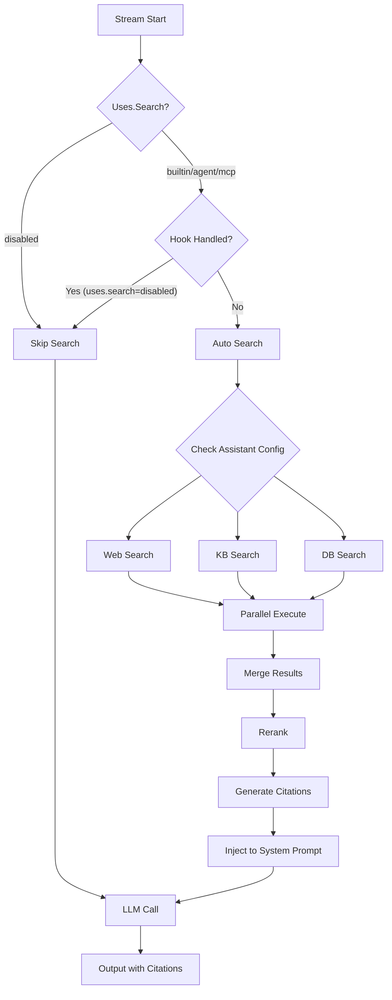
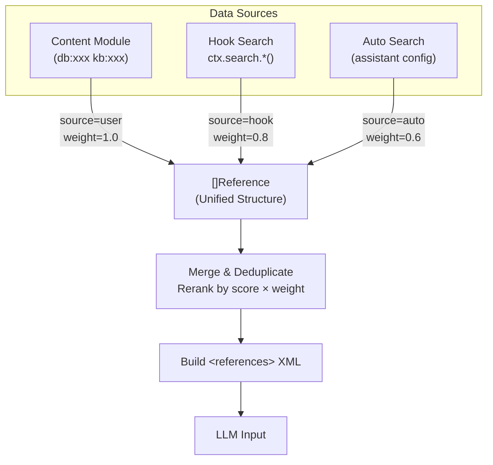

# Search Module Design

## Overview

The Search module provides a unified RAG (Retrieval-Augmented Generation) interface for Yao Agent, supporting three search types:

| Type  | Source         | Use Case                                             |
| ----- | -------------- | ---------------------------------------------------- |
| `web` | Internet       | Real-time information, news, external knowledge      |
| `kb`  | Knowledge Base | Documents, FAQs, internal knowledge (vector + graph) |
| `db`  | Database       | Structured data from Yao Models (QueryDSL)           |

The module follows the **Handler + Registry** pattern consistent with the `content` module, and exposes JSAPI for flexible usage in Create/Next hooks.

## Key Features

- **Unified JSAPI**: `ctx.search.Web()`, `ctx.search.KB()`, `ctx.search.DB()`, `ctx.search.Parallel()`
- **Citation System**: Auto-generate citation IDs (`#ref:xxx`) for LLM reference
- **Real-time Output**: Stream search progress to client
- **Trace Integration**: Report search operations to user for transparency
- **Reranking**: Builtin, Agent, or MCP-based result reranking
- **Graceful Degradation**: Search errors don't block agent flow

## Quick Start

```typescript
// In Create hook (assistants/my-assistant/index.ts)
function Create(ctx, messages, options) {
  const query = messages[messages.length - 1].content;

  // Simple web search
  const result = ctx.search.Web(query, { limit: 5 });

  // Or parallel search across all sources
  const [web, kb, db] = ctx.search.Parallel([
    { type: "web", query, limit: 5 },
    { type: "kb", query, collections: ["docs"] },
    { type: "db", query, models: ["product"] },
  ]);

  return {
    messages: [{ role: "system", content: formatContext(web, kb, db) }],
    uses: { search: "disabled" }, // Disable auto search since hook handled it
  };
}
```

## Goals

1. **Unified Interface**: Single API for web, knowledge base, and database search
2. **Flexibility**: Support built-in handlers and external tools (MCP/Agent delegation)
3. **JSAPI Support**: Enable search calls from Create/Next hooks via JavaScript
4. **Parallel Execution**: Support concurrent web + KB + DB searches
5. **Graceful Degradation**: Search failures should not block the main agent flow
6. **Real-time Feedback**: Stream search progress and results to users via output
7. **Traceability**: Report search operations to users for transparency
8. **Citation Support**: Enable LLM to reference search results with trackable citations

## Architecture

### Search Flow Diagram



### Integration in Stream()


### Directory Structure

```
agent/search/
├── DESIGN.md              # This document
├── TODO.md                # Implementation plan and progress
├── search.go              # Main Searcher implementation and public API
├── registry.go            # Handler registry (manages web/kb/db handlers)
├── jsapi.go               # JavaScript API bindings for hooks (skeleton)
├── citation.go            # Citation ID generation and tracking
├── reference.go           # Reference building and LLM context formatting
│
├── types/                 # Type definitions (no dependencies on other search packages)
│   ├── types.go           # Core types (SearchType, Request, Result, ResultItem, etc.)
│   ├── config.go          # Configuration types (Config, CitationConfig, WeightsConfig, etc.)
│   ├── reference.go       # Reference type for unified context protocol
│   └── graph.go           # Graph-related types (GraphNode)
│
├── interfaces/            # Interface definitions (depends only on types/)
│   ├── handler.go         # Handler interface
│   ├── searcher.go        # Searcher interface (public API)
│   ├── reranker.go        # Reranker interface
│   └── nlp.go             # NLP interfaces (KeywordExtractor, QueryDSLGenerator)
│
├── rerank/                # Result reranking implementations (Handler + Registry pattern) ✅
│   ├── reranker.go        # Main entry point (mode dispatch)
│   ├── builtin.go         # Builtin: weighted score sorting
│   ├── agent.go           # Agent mode (delegate to LLM assistant)
│   └── mcp.go             # MCP mode (external service)
│
├── nlp/                   # Natural language processing for search
│   ├── keyword/           # Keyword extraction (Handler + Registry pattern) ✅
│   │   ├── extractor.go   # Main extractor (mode dispatch)
│   │   ├── builtin.go     # Builtin frequency-based extraction
│   │   ├── agent.go       # Agent mode (LLM-powered)
│   │   └── mcp.go         # MCP mode (external service)
│   └── querydsl/          # QueryDSL generation for DB search (TODO)
│       ├── generator.go   # Main generator (mode dispatch)
│       ├── builtin.go     # Builtin template-based generation
│       ├── agent.go       # Agent mode (LLM-powered)
│       └── mcp.go         # MCP mode (external service)
│   # Note: Embedding follows KB collection config, not in this package
│
├── handlers/              # Search handler implementations
│   ├── web/               # Web search ✅
│   │   ├── handler.go     # Web search handler (mode dispatch)
│   │   ├── tavily.go      # Tavily provider (builtin)
│   │   ├── serper.go      # Serper provider (serper.dev, builtin)
│   │   ├── serpapi.go     # SerpAPI provider (serpapi.com, multi-engine, builtin)
│   │   ├── agent.go       # Agent mode (AI Search)
│   │   └── mcp.go         # MCP mode (external service)
│   │
│   ├── kb/                # Knowledge base search (skeleton)
│   │   ├── handler.go     # KB search handler
│   │   ├── vector.go      # Vector similarity search (TODO)
│   │   └── graph.go       # Graph-based association (TODO)
│   │
│   └── db/                # Database search (skeleton)
│       ├── handler.go     # DB search handler
│       ├── query.go       # QueryDSL builder (TODO)
│       └── schema.go      # Model schema introspection (TODO)
│
└── defaults/              # Default configuration values
    └── defaults.go        # System built-in defaults (used by agent/load.go)

# Note: Output and Trace are integrated into assistant/search.go
# No separate trace.go or output.go files needed
```

### Dependency Graph

```
                    ┌─────────────┐
                    │   types/    │  ← No internal dependencies
                    └──────┬──────┘
                           │
                    ┌──────▼──────┐
                    │ interfaces/ │  ← Depends only on types/
                    └──────┬──────┘
                           │
         ┌─────────────────┼─────────────────┐
         │                 │                 │
   ┌─────▼─────┐    ┌──────▼──────┐   ┌──────▼──────┐
   │  rerank/  │    │    nlp/     │   │  defaults/  │
   └─────┬─────┘    └──────┬──────┘   └──────┬──────┘
         │                 │                 │
         └────────┬────────┴────────┬────────┘
                  │                 │
           ┌──────▼──────┐   ┌──────▼──────┐
           │  handlers/  │   │  (root pkg) │
           │  web/kb/db  │   │  search.go  │
           └──────┬──────┘   │  registry   │
                  │          │  jsapi, etc │
                  └────┬─────┴─────────────┘
                       │
                 ┌─────▼─────┐
                 │  External │
                 │  Packages │
                 └───────────┘
```

### Package Import Rules

1. **`types/`** - Zero internal dependencies, only stdlib and external packages
2. **`interfaces/`** - Imports only `types/`
3. **`rerank/`**, **`nlp/`**, **`defaults/`** - Import `types/` and `interfaces/`
4. **`handlers/*`** - Import `types/`, `interfaces/`, and may use `nlp/` for NL processing
5. **Root package** - Imports all sub-packages, provides public API

### Main Searcher Implementation (`search.go`)

Configuration is loaded by `agent/load.go` (global) and `agent/assistant/load.go` (assistant-level), following the existing pattern. The Search package directly uses the loaded configuration.

```go
package search

import (
    "sync"

    "github.com/yaoapp/yao/agent/context"
    "github.com/yaoapp/yao/agent/search/handlers/db"
    "github.com/yaoapp/yao/agent/search/handlers/kb"
    "github.com/yaoapp/yao/agent/search/handlers/web"
    "github.com/yaoapp/yao/agent/search/interfaces"
    "github.com/yaoapp/yao/agent/search/rerank"
    "github.com/yaoapp/yao/agent/search/types"
)

// Searcher is the main search implementation
type Searcher struct {
    config    *types.Config           // Merged config (global + assistant)
    handlers  map[types.SearchType]interfaces.Handler
    reranker  *rerank.Reranker        // Uses rerank package directly
    citation  *CitationGenerator
}

// Uses contains the search-specific uses configuration
// These are extracted from context.Uses and search config
type Uses struct {
    Search   string // "builtin", "disabled", "<assistant-id>", "mcp:<server>.<tool>"
    Web      string // "builtin", "<assistant-id>", "mcp:<server>.<tool>"
    Keyword  string // "builtin", "<assistant-id>", "mcp:<server>.<tool>"
    QueryDSL string // "builtin", "<assistant-id>", "mcp:<server>.<tool>"
    Rerank   string // "builtin", "<assistant-id>", "mcp:<server>.<tool>"
}

// New creates a new Searcher instance
// cfg: merged config from agent/load.go + assistant config
// uses: merged uses configuration (global → assistant → hook)
func New(cfg *types.Config, uses *Uses) *Searcher {
    return &Searcher{
        config: cfg,
        handlers: map[types.SearchType]interfaces.Handler{
            types.SearchTypeWeb: web.NewHandler(uses.Web, cfg.Web),
            types.SearchTypeKB:  kb.NewHandler(cfg.KB),  // KB always builtin
            types.SearchTypeDB:  db.NewHandler(uses.QueryDSL, cfg.DB),
        },
        reranker: rerank.NewReranker(uses.Rerank, cfg.Rerank),
        citation: NewCitationGenerator(),
    }
}

// Search executes a single search request
func (s *Searcher) Search(ctx *context.Context, req *types.Request) (*types.Result, error) {
    handler, ok := s.handlers[req.Type]
    if !ok {
        return &types.Result{Error: "unsupported search type"}, nil
    }

    // Execute search (handler doesn't need ctx)
    result, err := handler.Search(req)
    if err != nil {
        return &types.Result{Error: err.Error()}, nil
    }

    // Assign weights based on source
    for _, item := range result.Items {
        item.Weight = s.config.GetWeight(req.Source)
    }

    // Rerank if requested (reranker needs ctx for Agent/MCP modes)
    if req.Rerank != nil && s.reranker != nil {
        result.Items, _ = s.reranker.Rerank(ctx, req.Query, result.Items, req.Rerank)
    }

    // Generate citation IDs
    for _, item := range result.Items {
        item.CitationID = s.citation.Next()
    }

    return result, nil
}

// ParallelMode defines how parallel search should behave (inspired by JavaScript Promise)
type ParallelMode string

// ParallelMode constants (similar to Promise.all, Promise.any, Promise.race)
const (
    // ModeAll waits for all searches to complete, returns all results (like Promise.all)
    ModeAll ParallelMode = "all"
    // ModeAny returns as soon as any search succeeds (has results), others continue but are discarded (like Promise.any)
    ModeAny ParallelMode = "any"
    // ModeRace returns as soon as any search completes (success or empty), others continue but are discarded (like Promise.race)
    ModeRace ParallelMode = "race"
)

// ParallelOptions configures parallel search behavior
// All executes all searches and waits for all to complete (like Promise.all)
func (s *Searcher) All(ctx *context.Context, reqs []*types.Request) ([]*types.Result, error) {
    return s.parallelAll(ctx, reqs)
}

// Any returns as soon as any search succeeds with results (like Promise.any)
func (s *Searcher) Any(ctx *context.Context, reqs []*types.Request) ([]*types.Result, error) {
    return s.parallelAny(ctx, reqs)
}

// Race returns as soon as any search completes (like Promise.race)
func (s *Searcher) Race(ctx *context.Context, reqs []*types.Request) ([]*types.Result, error) {
    return s.parallelRace(ctx, reqs)
}

// BuildReferences converts search results to unified Reference format
func (s *Searcher) BuildReferences(results []*types.Result) []*types.Reference {
    var refs []*types.Reference
    for _, result := range results {
        for _, item := range result.Items {
            refs = append(refs, &types.Reference{
                ID:      item.CitationID,
                Type:    item.Type,
                Source:  item.Source,
                Weight:  item.Weight,
                Score:   item.Score,
                Title:   item.Title,
                Content: item.Content,
                URL:     item.URL,
            })
        }
    }
    return refs
}
```

### Registry (`registry.go`)

```go
package search

import (
    "github.com/yaoapp/yao/agent/search/interfaces"
    "github.com/yaoapp/yao/agent/search/types"
)

// Registry manages search handlers
type Registry struct {
    handlers map[types.SearchType]interfaces.Handler
}

// NewRegistry creates a new handler registry
func NewRegistry() *Registry {
    return &Registry{
        handlers: make(map[types.SearchType]interfaces.Handler),
    }
}

// Register registers a handler for a search type
func (r *Registry) Register(handler interfaces.Handler) {
    r.handlers[handler.Type()] = handler
}

// Get returns the handler for a search type
func (r *Registry) Get(t types.SearchType) (interfaces.Handler, bool) {
    h, ok := r.handlers[t]
    return h, ok
}
```

## Core Interfaces

All interfaces are defined in `search/interfaces/` package to prevent circular dependencies.

### Handler Interface (`interfaces/handler.go`)

```go
package interfaces

import (
    "github.com/yaoapp/yao/agent/search/types"
)

// Handler defines the interface for search implementations
type Handler interface {
    // Type returns the search type this handler supports
    Type() types.SearchType

    // Search executes the search and returns results
    Search(req *types.Request) (*types.Result, error)
}
```

### Searcher Interface (`interfaces/searcher.go`)

```go
package interfaces

import (
    "github.com/yaoapp/yao/agent/search/types"
)

// Searcher is the main interface exposed to external callers
type Searcher interface {
    // Search executes a single search request
    Search(ctx *context.Context, req *types.Request) (*types.Result, error)

    // Parallel search methods - inspired by JavaScript Promise
    // All waits for all searches to complete (like Promise.all)
    All(ctx *context.Context, reqs []*types.Request) ([]*types.Result, error)
    // Any returns when any search succeeds with results (like Promise.any)
    Any(ctx *context.Context, reqs []*types.Request) ([]*types.Result, error)
    // Race returns when any search completes (like Promise.race)
    Race(ctx *context.Context, reqs []*types.Request) ([]*types.Result, error)

    // BuildReferences converts search results to unified Reference format for LLM
    BuildReferences(results []*types.Result) []*types.Reference
}
```

> **Note**: Parallel search methods follow JavaScript Promise naming:
>
> - `All()`: Wait for all searches to complete (like `Promise.all`)
> - `Any()`: Return when any search succeeds with results (like `Promise.any`)
> - `Race()`: Return when any search completes (like `Promise.race`)

### NLP Interfaces (`interfaces/nlp.go`)

```go
package interfaces

import (
    "github.com/yaoapp/gou/model"
    "github.com/yaoapp/gou/query/gou"
    "github.com/yaoapp/yao/agent/context"
    "github.com/yaoapp/yao/agent/search/types"
)

// KeywordExtractor extracts keywords for web search
type KeywordExtractor interface {
    // Extract extracts search keywords from user message
    // ctx is required for Agent and MCP modes, can be nil for builtin mode
    Extract(ctx *context.Context, content string, opts *types.KeywordOptions) ([]string, error)
}

// QueryDSLGenerator generates QueryDSL for DB search
type QueryDSLGenerator interface {
    // Generate converts natural language to QueryDSL
    // Uses GOU types directly: model.Model and gou.QueryDSL
    Generate(query string, models []*model.Model) (*gou.QueryDSL, error)
}

// Note: Embedding is handled by KB collection's own config (embedding provider + model),
// not defined here. See KB handler for details.
```

### Reranker Interface (`interfaces/reranker.go`)

```go
package interfaces

import (
    "github.com/yaoapp/yao/agent/context"
    "github.com/yaoapp/yao/agent/search/types"
)

// Reranker reorders search results by relevance
type Reranker interface {
    // Rerank reorders results based on query relevance
    Rerank(ctx *context.Context, query string, items []*types.ResultItem, opts *types.RerankOptions) ([]*types.ResultItem, error)
}
```

## Types

All types are defined in `search/types/` package to prevent circular dependencies.

### Core Types (`types/types.go`)

```go
package types

import (
    "github.com/yaoapp/gou/query/gou"
)

// SearchType represents the type of search
type SearchType string

const (
    SearchTypeWeb SearchType = "web" // Web/Internet search
    SearchTypeKB  SearchType = "kb"  // Knowledge base vector search
    SearchTypeDB  SearchType = "db"  // Database search (Yao Model/QueryDSL)
)

// SourceType represents where the search result came from
type SourceType string

const (
    SourceUser SourceType = "user" // User-provided DataContent (highest priority)
    SourceHook SourceType = "hook" // Hook ctx.search.*() results
    SourceAuto SourceType = "auto" // Auto search results (lowest priority)
)

// Request represents a search request
type Request struct {
    // Common fields
    Query   string     `json:"query"`           // Search query (natural language)
    Type    SearchType `json:"type"`            // Search type: "web", "kb", or "db"
    Limit   int        `json:"limit,omitempty"` // Max results (default: 10)
    Source  SourceType `json:"source"`          // Source of this request (user/hook/auto)

    // Web search specific
    Sites     []string `json:"sites,omitempty"`      // Restrict to specific sites
    TimeRange string   `json:"time_range,omitempty"` // "day", "week", "month", "year"

    // Knowledge base specific
    Collections []string `json:"collections,omitempty"` // KB collection IDs
    Threshold   float64  `json:"threshold,omitempty"`   // Similarity threshold (0-1)
    Graph       bool     `json:"graph,omitempty"`       // Enable graph association

    // Database search specific
    // Uses GOU QueryDSL types directly for compatibility with Yao's query system
    // See: github.com/yaoapp/gou/query/gou/types.go
    Models []string    `json:"models,omitempty"` // Model IDs (e.g., "user", "agents.mybot.product")
    Wheres []gou.Where `json:"wheres,omitempty"` // Pre-defined filters (optional), uses GOU QueryDSL Where
    Orders gou.Orders  `json:"orders,omitempty"` // Sort orders (optional), uses GOU QueryDSL Orders
    Select []string    `json:"select,omitempty"` // Fields to return (optional)

    // Reranking
    Rerank *RerankOptions `json:"rerank,omitempty"`
}

// RerankOptions controls result reranking
// Reranker type is determined by uses.rerank in agent/agent.yml
type RerankOptions struct {
    TopN int `json:"top_n,omitempty"` // Return top N after reranking
}

// Result represents the search result with all intermediate processing data
type Result struct {
    Type     SearchType    `json:"type"`            // Search type
    Query    string        `json:"query"`           // Original query
    Source   SourceType    `json:"source"`          // Source of this result
    Items    []*ResultItem `json:"items"`           // Result items
    Total    int           `json:"total"`           // Total matches
    Duration int64         `json:"duration_ms"`     // Search duration in ms
    Error    string        `json:"error,omitempty"` // Error message if failed

    // Intermediate processing results (for storage and debugging)
    Keywords  []string       `json:"keywords,omitempty"`  // Extracted keywords (Web/NLP)
    DSL       map[string]any `json:"dsl,omitempty"`       // Generated QueryDSL (DB)
    Entities  []Entity       `json:"entities,omitempty"`  // Extracted entities (Graph RAG)
    Relations []Relation     `json:"relations,omitempty"` // Extracted relations (Graph RAG)

    // Graph associations (KB only, if enabled)
    GraphNodes []*GraphNode `json:"graph_nodes,omitempty"`
}

// Entity represents an extracted entity (for Graph RAG)
type Entity struct {
    Name   string `json:"name"`
    Type   string `json:"type,omitempty"`
    Source string `json:"source,omitempty"`
}

// Relation represents an extracted relation (for Graph RAG)
type Relation struct {
    Subject   string `json:"subject"`
    Predicate string `json:"predicate"`
    Object    string `json:"object"`
    Source    string `json:"source,omitempty"`
}

// ResultItem represents a single search result item
type ResultItem struct {
    // Citation
    CitationID string `json:"citation_id"` // Unique ID for LLM reference: "ref_001"

    // Weighting
    Source SourceType `json:"source"`          // Source type: "user", "hook", "auto"
    Weight float64    `json:"weight"`          // Source weight (from config)
    Score  float64    `json:"score,omitempty"` // Relevance score (0-1)

    // Common fields
    Type    SearchType `json:"type"`            // Search type for this item
    Title   string     `json:"title,omitempty"` // Title/headline
    Content string     `json:"content"`         // Main content/snippet
    URL     string     `json:"url,omitempty"`   // Source URL

    // KB specific
    DocumentID string `json:"document_id,omitempty"` // Source document ID
    Collection string `json:"collection,omitempty"`  // Collection name

    // DB specific
    Model    string                 `json:"model,omitempty"`     // Model ID
    RecordID interface{}            `json:"record_id,omitempty"` // Record primary key
    Data     map[string]interface{} `json:"data,omitempty"`      // Full record data

    // Metadata
    Metadata map[string]interface{} `json:"metadata,omitempty"` // Additional metadata
}

// ProcessedQuery represents a processed query ready for execution
type ProcessedQuery struct {
    Type     SearchType    `json:"type"`
    Keywords []string      `json:"keywords,omitempty"` // For web search
    Vector   []float32     `json:"vector,omitempty"`   // For KB search
    DSL      *gou.QueryDSL `json:"dsl,omitempty"`      // For DB search, uses GOU QueryDSL
}
```

> **Design Note: Result with Intermediate Data**
>
> The `Result` type now includes intermediate processing results (`Keywords`, `DSL`, `Entities`, `Relations`)
> that were previously only available during query processing. This design enables:
>
> 1. **Storage for Debugging**: All processing steps are captured for later analysis
> 2. **System Tuning**: Analyze extracted keywords, generated DSL, and entity extraction quality
> 3. **Unified Data Flow**: Handlers populate these fields during execution, eliminating the need
>    for separate data collection in `executeAutoSearch`
>
> **Handler Responsibilities**:
>
> - **Web Handler**: Populates `Keywords` from NLP extraction
> - **DB Handler**: Populates `DSL` from QueryDSL generation
> - **KB Handler**: Populates `Entities`, `Relations`, and `GraphNodes` from Graph RAG
>
> **Data Flow**:
>
> ```
> Request → Handler → Result (with Keywords/DSL/Entities/Relations)
>                         ↓
>                   BuildReferenceContext
>                         ↓
>                   saveSearch (stores all intermediate data)
> ```

```go
// ProcessedQuery is DEPRECATED for external use
// Handlers should populate Result.Keywords/DSL/Entities/Relations directly
type ProcessedQuery struct {
    Type     SearchType    `json:"type"`
    Keywords []string      `json:"keywords,omitempty"` // For web search
    Vector   []float32     `json:"vector,omitempty"`   // For KB search
    DSL      *gou.QueryDSL `json:"dsl,omitempty"`      // For DB search
}

// Note: For QueryDSL and Model types, use GOU types directly:
// - github.com/yaoapp/gou/query/gou.QueryDSL
// - github.com/yaoapp/gou/model.Model
// - github.com/yaoapp/gou/model.Column
```

> **Note**: `Wheres` and `Orders` use GOU QueryDSL types directly (`gou.Where` and `gou.Orders`) for full compatibility with Yao's query system. See `github.com/yaoapp/gou/query/gou/types.go` for the complete type definitions.

### Graph Types (`types/graph.go`)

```go
package types

// GraphNode represents a related entity from knowledge graph
type GraphNode struct {
    ID          string                 `json:"id"`
    Type        string                 `json:"type"`                  // Entity type
    Name        string                 `json:"name"`                  // Entity name
    Description string                 `json:"description,omitempty"` // Entity description
    Relation    string                 `json:"relation,omitempty"`    // Relationship to query
    Score       float64                `json:"score,omitempty"`       // Relevance score
    Metadata    map[string]interface{} `json:"metadata,omitempty"`
}
```

### Reference Types (`types/reference.go`)

```go
package types

// Reference is the unified structure for all data sources
// Used to build LLM context from search results
type Reference struct {
    ID      string                 `json:"id"`      // Unique citation ID: "ref_001", "ref_002"
    Type    SearchType             `json:"type"`    // Data type: "web", "kb", "db"
    Source  SourceType             `json:"source"`  // Origin: "user", "hook", "auto"
    Weight  float64                `json:"weight"`  // Relevance weight (1.0=highest, 0.6=lowest)
    Score   float64                `json:"score"`   // Relevance score (0-1)
    Title   string                 `json:"title"`   // Optional title
    Content string                 `json:"content"` // Main content
    URL     string                 `json:"url"`     // Optional URL
    Meta    map[string]interface{} `json:"meta"`    // Additional metadata
}

// ReferenceContext holds the formatted references for LLM input
type ReferenceContext struct {
    References []*Reference `json:"references"`      // All references
    XML        string       `json:"xml"`             // Formatted <references> XML
    Prompt     string       `json:"prompt"`          // Citation instruction prompt
}
```

### Configuration Types (`types/config.go`)

```go
package types

// Config represents the complete search configuration
type Config struct {
    Web      *WebConfig      `json:"web,omitempty"`
    KB       *KBConfig       `json:"kb,omitempty"`
    DB       *DBConfig       `json:"db,omitempty"`
    Keyword  *KeywordConfig  `json:"keyword,omitempty"`
    QueryDSL *QueryDSLConfig `json:"querydsl,omitempty"`
    Rerank   *RerankConfig   `json:"rerank,omitempty"`
    Citation *CitationConfig `json:"citation,omitempty"`
    Weights  *WeightsConfig  `json:"weights,omitempty"`
    Options  *OptionsConfig  `json:"options,omitempty"`
}

// WebConfig for web search settings
// Note: uses.web determines the mode (builtin/agent/mcp)
// Provider is only used when uses.web = "builtin"
type WebConfig struct {
    Provider   string `json:"provider,omitempty"`    // "tavily", "serper", or "serpapi" (for builtin mode)
    APIKeyEnv  string `json:"api_key_env,omitempty"` // Environment variable for API key
    MaxResults int    `json:"max_results,omitempty"` // Max results (default: 10)
    Engine     string `json:"engine,omitempty"`      // Search engine for SerpAPI: "google", "bing", "baidu", etc. (default: "google")
}

// KBConfig for knowledge base search settings
type KBConfig struct {
    Collections []string `json:"collections,omitempty"` // Default collections
    Threshold   float64  `json:"threshold,omitempty"`   // Similarity threshold (default: 0.7)
    Graph       bool     `json:"graph,omitempty"`       // Enable GraphRAG (default: false)
}

// DBConfig for database search settings
type DBConfig struct {
    Models     []string `json:"models,omitempty"`      // Default models
    MaxResults int      `json:"max_results,omitempty"` // Max results (default: 20)
}

// KeywordConfig for keyword extraction
type KeywordConfig struct {
    MaxKeywords int    `json:"max_keywords,omitempty"` // Max keywords (default: 10)
    Language    string `json:"language,omitempty"`     // "auto", "en", "zh", etc.
}

// KeywordOptions for keyword extraction (runtime options)
type KeywordOptions struct {
    MaxKeywords int    `json:"max_keywords,omitempty"`
    Language    string `json:"language,omitempty"`
}

// QueryDSLConfig for QueryDSL generation from natural language
type QueryDSLConfig struct {
    Strict bool `json:"strict,omitempty"` // Fail if generation fails (default: false)
}

// RerankConfig for reranking
type RerankConfig struct {
    TopN int `json:"top_n,omitempty"` // Return top N (default: 10)
}

// CitationConfig for citation format
type CitationConfig struct {
    Format           string `json:"format,omitempty"`             // Default: "#ref:{id}"
    AutoInjectPrompt bool   `json:"auto_inject_prompt,omitempty"` // Auto-inject prompt (default: true)
    CustomPrompt     string `json:"custom_prompt,omitempty"`      // Custom prompt template
}

// WeightsConfig for source weighting
type WeightsConfig struct {
    User float64 `json:"user,omitempty"` // User-provided (default: 1.0)
    Hook float64 `json:"hook,omitempty"` // Hook results (default: 0.8)
    Auto float64 `json:"auto,omitempty"` // Auto search (default: 0.6)
}

// OptionsConfig for search behavior
type OptionsConfig struct {
    SkipThreshold int `json:"skip_threshold,omitempty"` // Skip auto search if user provides >= N results
}
```

### Note on Reranker

Reranker type is determined by `uses.rerank` in `agent/agent.yml`:

- `"builtin"` - Simple score-based sorting
- `"<assistant-id>"` - Delegate to an assistant (Agent)
- `"mcp:<server>.<tool>"` - Call MCP tool (e.g., `"mcp:my-server.rerank"`)

## Citation System

Each search result has a unique `CitationID` for LLM reference. Citation logic is implemented in `search/citation.go`.

### Citation ID Generation

Citation IDs are generated sequentially: `ref_001`, `ref_002`, etc.

```go
// citation.go
package search

import (
    "fmt"
    "sync/atomic"
)

// CitationGenerator generates unique citation IDs
type CitationGenerator struct {
    counter uint64
}

// NewCitationGenerator creates a new citation generator
func NewCitationGenerator() *CitationGenerator {
    return &CitationGenerator{}
}

// Next generates the next citation ID
func (g *CitationGenerator) Next() string {
    n := atomic.AddUint64(&g.counter, 1)
    return fmt.Sprintf("ref_%03d", n)
}
```

### Citation Config (in `types/config.go`)

```go
type CitationConfig struct {
    Format           string `json:"format,omitempty"`             // Default: "#ref:{id}"
    AutoInjectPrompt bool   `json:"auto_inject_prompt,omitempty"` // Auto-add instructions to system prompt
    CustomPrompt     string `json:"custom_prompt,omitempty"`      // Override default prompt template
}
```

### Default Citation Prompt

When `AutoInjectPrompt` is enabled (default), the system prompt includes:

```
You have access to reference data in <references> tags. Each <ref> has:
- id: Citation identifier
- type: Data type (web/kb/db)
- weight: Relevance weight (1.0=highest priority, 0.6=lowest)
- source: Origin (user=user-provided, hook=assistant-searched, auto=auto-searched)

Prioritize higher-weight references when answering.

When citing a reference, use this exact HTML format:
<a class="ref" data-ref-id="{id}" data-ref-type="{type}" href="#ref:{id}">[{id}]</a>

Example: According to the product data<a class="ref" data-ref-id="ref_001" data-ref-type="db" href="#ref:ref_001">[ref_001]</a>, the price is $999.
```

### Custom Prompt in Config

```yaml
# assistants/my-assistant.yml
search:
  citation:
    format: "[{id}]"
    auto_inject_prompt: true
    custom_prompt: "Cite using [{id}]. Sources: ..."
```

## Trace Integration

Search operations create minimal trace nodes to report execution status to users, providing transparency about what the agent is doing. Detailed information is recorded via LOG for debugging.

### Trace Node Structure

Uses `trace/types.NodeStatus` constants:

- `pending` - Node created but not started
- `running` - Node is currently executing
- `completed` - Node finished successfully
- `failed` - Node failed with error

**Single Search:**

```
search (type: "search")
├── label       // i18n: "Search" / "搜索"
├── status      // "pending" | "running" | "completed" | "failed"
├── input
│   ├── query   // Original query
│   └── types   // ["web"], ["kb"], ["web", "kb", "db"]
└── output      // (set on complete)
    └── result_count // Total results found
```

**Parallel Search:**

```
search (type: "search")
├── label       // i18n: "Search" / "搜索"
├── status      // "pending" | "running" | "completed" | "failed"
├── input
│   ├── query   // Original query
│   └── types   // ["web", "kb", "db"]
└── children
    ├── web (type: "search_item")
    │   ├── label   // i18n: "Web Search" / "网页搜索"
    │   ├── status  // "pending" | "running" | "completed" | "failed"
    │   └── output
    │       └── result_count
    ├── kb (type: "search_item")
    │   └── ...
    └── db (type: "search_item")
        └── ...
```

### Trace Logging

Detailed search information is recorded via Trace node logging methods (broadcasts to client):

```go
// Node logging methods (from trace/node.go):
// - node.Info(message, args...)  - Info level log
// - node.Debug(message, args...) - Debug level log
// - node.Warn(message, args...)  - Warning level log
// - node.Error(message, args...) - Error level log

// Search start
searchNode.Info("Starting search", map[string]any{"query": query, "types": types})

// Per-type results (on parallel search children)
webNode.Debug("Web search completed", map[string]any{"count": count, "duration_ms": duration})
kbNode.Debug("KB search completed", map[string]any{"count": count, "duration_ms": duration})
dbNode.Debug("DB search completed", map[string]any{"count": count, "duration_ms": duration})

// Errors (non-blocking, search continues)
webNode.Warn("Web search failed", map[string]any{"error": err.Error()})

// Final summary (on parent node)
searchNode.Info("Search completed", map[string]any{"total": total, "duration_ms": duration})
```

**Log Event Structure** (broadcasted via SSE):

```go
// types.TraceLog
type TraceLog struct {
    Timestamp int64  `json:"timestamp"` // milliseconds since epoch
    Level     string `json:"level"`     // "info", "debug", "warn", "error"
    Message   string `json:"message"`   // Log message
    Data      any    `json:"data"`      // Additional data
    NodeID    string `json:"node_id"`   // Parent node ID
}
```

## Real-time Output

Search progress is displayed to the client using **Loading component with Replace** pattern. Uses `ctx.Send()` and `ctx.Replace()` methods.

### Output Flow

```
1. Send Loading Message
   loading_id = ctx.Send({ type: "loading", props: { message: "Searching..." } })
   → Client displays loading indicator

2. Execute Search (parallel web/kb/db)

3. Replace with Result Message (shows result to user)
   ctx.Replace(loading_id, { type: "loading", props: { message: "Found 5 references" } })
   → Client displays result message

4. Mark as Done (removes the loading after brief display)
   ctx.Replace(loading_id, { type: "loading", props: { message: "Found 5 references", done: true } })
   → Client removes loading indicator
```

### Implementation

```go
// Send loading message
loadingID := ctx.Send(map[string]any{
    "type": "loading",
    "props": map[string]any{
        "message": i18n.Tr("search.loading", locale), // "Searching..." / "正在搜索..."
    },
})

// Execute search...

// Replace with result message (displayed to user)
resultMessage := i18n.Tr("search.success", locale, count) // "Found 5 references"
ctx.Replace(loadingID, map[string]any{
    "type": "loading",
    "props": map[string]any{
        "message": resultMessage,
    },
})

// Mark as done (removes loading indicator after user sees the result)
ctx.Replace(loadingID, map[string]any{
    "type": "loading",
    "props": map[string]any{
        "message": resultMessage,
        "done":    true, // Frontend will remove loading indicator
    },
})
```

### Loading Props

| Prop      | Type   | Description                                         |
| --------- | ------ | --------------------------------------------------- |
| `message` | string | Localized message to display                        |
| `done`    | bool   | When `true`, frontend removes the loading indicator |

### Localized Messages

| Scenario      | English                                  | Chinese                           |
| ------------- | ---------------------------------------- | --------------------------------- |
| Loading       | Searching...                             | 正在搜索...                       |
| Success (1)   | Found 1 reference                        | 找到 1 条参考资料                 |
| Success (N)   | Found N references                       | 找到 N 条参考资料                 |
| Partial Error | Found N references (some sources failed) | 找到 N 条参考资料（部分来源失败） |
| All Failed    | Search failed                            | 搜索失败                          |
| No Results    | No references found                      | 未找到相关资料                    |

### Client Display Example

```
Frame 1 - During search:
┌─────────────────────────────────┐
│ Searching...                    │  ← Loading (done: false)
└─────────────────────────────────┘

Frame 2 - Result displayed:
┌─────────────────────────────────┐
│ Found 5 references              │  ← Result (done: false)
└─────────────────────────────────┘

Frame 3 - Removed:
(loading indicator removed when done: true)
```

## Search Result Storage

Search results are stored per request to support citation click-through and history replay.

### Data Model

```
Relationships:
Chat
 └── Request (request_id)
      ├── Message[] (user, assistant, tool...)
      └── SearchResult[] (one request may have multiple searches)
           └── Reference[] (indexed references from each search)
```

### Citation Locating

LLM output uses `<a>` tags with index:

```xml
AI is artificial intelligence<a index="1" />, it has developed rapidly<a index="2" />...
```

Location path: `request_id` + `index` → precisely locate reference

### Database Schema

**Table: `agent_search`**

| Column     | Type        | Description                            |
| ---------- | ----------- | -------------------------------------- |
| id         | BIGINT      | Auto-increment primary key             |
| request_id | VARCHAR(64) | Associated request ID (indexed)        |
| chat_id    | VARCHAR(64) | Associated chat ID (indexed)           |
| query      | TEXT        | Original search query                  |
| config     | JSON        | Search config used (for tuning)        |
| keywords   | JSON        | Extracted keywords (from NLP)          |
| entities   | JSON        | Extracted entities (for Graph search)  |
| relations  | JSON        | Extracted relations (for Graph search) |
| dsl        | JSON        | Generated QueryDSL (for DB search)     |
| source     | VARCHAR(32) | Search source: web/kb/db/auto          |
| references | JSON        | Reference[] with global index          |
| graph      | JSON        | GraphNode[] from knowledge graph       |
| xml        | TEXT        | Formatted XML for LLM context          |
| prompt     | TEXT        | Citation instruction prompt            |
| duration   | INT         | Search duration in milliseconds        |
| error      | TEXT        | Error message if failed (nullable)     |
| created_at | TIMESTAMP   | Creation time                          |
| deleted_at | TIMESTAMP   | Soft delete time (nullable)            |

**Config Field Structure:**

```json
{
  "uses": {
    "search": "builtin",
    "web": "builtin",
    "keyword": "builtin",
    "querydsl": "builtin",
    "rerank": "builtin"
  },
  "web": {
    "provider": "tavily",
    "max_results": 5
  },
  "kb": {
    "collections": ["docs", "faq"],
    "threshold": 0.7,
    "graph": true
  },
  "db": {
    "models": ["product", "order"],
    "max_results": 20
  },
  "rerank": {
    "provider": "builtin",
    "top_n": 10
  }
}
```

### Type Definitions

```go
// store/types/types.go

// Search represents stored search results for a request
// Stores all intermediate processing results for debugging and replay
type Search struct {
    ID         int64          `json:"id"`
    RequestID  string         `json:"request_id"`
    ChatID     string         `json:"chat_id"`
    Query      string         `json:"query"`               // Original query
    Config     map[string]any `json:"config,omitempty"`    // Search config used (for tuning)
    Keywords   []string       `json:"keywords,omitempty"`  // Extracted keywords (Web/NLP)
    Entities   []Entity       `json:"entities,omitempty"`  // Extracted entities (Graph)
    Relations  []Relation     `json:"relations,omitempty"` // Extracted relations (Graph)
    DSL        map[string]any `json:"dsl,omitempty"`       // Generated QueryDSL (DB)
    Source     string         `json:"source"`              // web/kb/db/auto
    References []Reference    `json:"references"`
    Graph      []GraphNode    `json:"graph,omitempty"`     // Graph nodes from KB
    XML        string         `json:"xml,omitempty"`       // Formatted XML for LLM
    Prompt     string         `json:"prompt,omitempty"`    // Citation prompt
    Duration   int64          `json:"duration_ms"`         // Search duration
    Error      string         `json:"error,omitempty"`     // Error if failed
    CreatedAt  time.Time      `json:"created_at"`
}

// Reference represents a single reference with global index (for storage)
type Reference struct {
    Index    int            `json:"index"`             // Global index: 1, 2, 3...
    Type     string         `json:"type"`              // web/kb/db
    Title    string         `json:"title"`
    URL      string         `json:"url,omitempty"`
    Snippet  string         `json:"snippet"`
    Content  string         `json:"content,omitempty"` // Full content (optional)
    Metadata map[string]any `json:"metadata,omitempty"`
}

// Entity represents an extracted entity from query (for Graph search)
type Entity struct {
    Name   string         `json:"name"`             // Entity name
    Type   string         `json:"type"`             // Entity type: person, org, location, etc.
    Metadata map[string]any `json:"metadata,omitempty"`
}

// Relation represents an extracted relation from query (for Graph search)
type Relation struct {
    Subject  string         `json:"subject"`          // Source entity
    Predicate string        `json:"predicate"`        // Relation type
    Object   string         `json:"object"`           // Target entity
    Metadata map[string]any `json:"metadata,omitempty"`
}

// GraphNode represents a node from knowledge graph (search result)
type GraphNode struct {
    ID          string         `json:"id"`
    Type        string         `json:"type"`              // Entity type
    Name        string         `json:"name"`              // Entity name
    Description string         `json:"description,omitempty"`
    Relation    string         `json:"relation,omitempty"` // Relationship to query
    Score       float64        `json:"score,omitempty"`
    Metadata    map[string]any `json:"metadata,omitempty"`
}

// SearchFilter for querying search records
type SearchFilter struct {
    RequestID string `json:"request_id,omitempty"`
    ChatID    string `json:"chat_id,omitempty"`
    Source    string `json:"source,omitempty"`
}
```

### Store Interface Extension

```go
// store/types/store.go

// ChatStore interface extension
type ChatStore interface {
    // ... existing methods ...

    // ==========================================================================
    // Search Management
    // ==========================================================================

    // SaveSearch saves search record for a request
    // search: Search record to save
    // Returns: Potential error
    SaveSearch(search *Search) error

    // GetSearches retrieves search records for a request
    // requestID: Request ID
    // Returns: Search records and potential error
    GetSearches(requestID string) ([]*Search, error)

    // GetReference retrieves a single reference by request ID and index
    // requestID: Request ID
    // index: Reference index (1-based)
    // Returns: Reference and potential error
    GetReference(requestID string, index int) (*Reference, error)

    // DeleteSearches deletes all search records for a chat
    // chatID: Chat ID
    // Returns: Potential error
    DeleteSearches(chatID string) error
}
```

### Xun Implementation

```go
// store/xun/search.go

// SaveSearch saves a search record
func (store *Xun) SaveSearch(search *Search) error {
    if search.RequestID == "" {
        return fmt.Errorf("request_id is required")
    }

    refsJSON, err := jsoniter.MarshalToString(search.References)
    if err != nil {
        return fmt.Errorf("failed to marshal references: %w", err)
    }

    row := map[string]interface{}{
        "request_id": search.RequestID,
        "chat_id":    search.ChatID,
        "query":      search.Query,
        "config":     search.Config,     // Search config for tuning
        "keywords":   search.Keywords,
        "entities":   search.Entities,   // Graph entities
        "relations":  search.Relations,  // Graph relations
        "dsl":        search.DSL,
        "source":     search.Source,
        "references": refsJSON,
        "graph":      search.Graph,      // Graph nodes
        "xml":        search.XML,
        "prompt":     search.Prompt,
        "duration":   search.Duration,
        "error":      search.Error,
        "created_at": time.Now(),
    }

    return store.newQuerySearch().Insert(row)
}

// GetSearches retrieves all search records for a request
func (store *Xun) GetSearches(requestID string) ([]*Search, error) {
    rows, err := store.newQuerySearch().
        Where("request_id", requestID).
        WhereNull("deleted_at").
        OrderBy("created_at", "asc").
        Get()
    // ... convert rows to Search
}

// GetReference retrieves a single reference
func (store *Xun) GetReference(requestID string, index int) (*Reference, error) {
    searches, err := store.GetSearches(requestID)
    if err != nil {
        return nil, err
    }

    // Find reference by index across all search records
    for _, search := range searches {
        for _, ref := range search.References {
            if ref.Index == index {
                return &ref, nil
            }
        }
    }

    return nil, fmt.Errorf("reference %d not found in request %s", index, requestID)
}
```

### Model Definition

```json
// yao/models/agent/search.mod.yao
{
  "name": "Search",
  "label": "Search",
  "description": "Search records for citation support and debugging",
  "tags": ["agent", "system"],
  "builtin": true,
  "readonly": true,
  "table": {
    "name": "agent_search",
    "comment": "Agent search table"
  },
  "columns": [
    { "name": "id", "type": "ID", "label": "ID" },
    {
      "name": "request_id",
      "type": "string",
      "length": 64,
      "nullable": false,
      "index": true
    },
    {
      "name": "chat_id",
      "type": "string",
      "length": 64,
      "nullable": false,
      "index": true
    },
    { "name": "query", "type": "text", "nullable": true },
    {
      "name": "config",
      "type": "json",
      "nullable": true,
      "comment": "Search config used (for tuning)"
    },
    { "name": "keywords", "type": "json", "nullable": true },
    { "name": "entities", "type": "json", "nullable": true },
    { "name": "relations", "type": "json", "nullable": true },
    { "name": "dsl", "type": "json", "nullable": true },
    { "name": "source", "type": "string", "length": 32, "nullable": false },
    { "name": "references", "type": "json", "nullable": true },
    { "name": "graph", "type": "json", "nullable": true },
    { "name": "xml", "type": "text", "nullable": true },
    { "name": "prompt", "type": "text", "nullable": true },
    { "name": "duration", "type": "integer", "nullable": true },
    { "name": "error", "type": "text", "nullable": true }
  ],
  "option": { "timestamps": true, "soft_deletes": true }
}
```

### Stream Integration

Storage logic is encapsulated in `assistant/search.go` with a dedicated method:

```go
// assistant/search.go

// SearchExecutionResult contains all intermediate results from search execution
type SearchExecutionResult struct {
    Query      string                          // Original query
    Config     map[string]any                  // Search config used
    Keywords   []string                        // Extracted keywords (Web/NLP)
    Entities   []storeTypes.Entity             // Extracted entities (Graph)
    Relations  []storeTypes.Relation           // Extracted relations (Graph)
    DSL        map[string]any                  // Generated QueryDSL (DB)
    Source     string                          // web/kb/db/auto
    RefCtx     *searchTypes.ReferenceContext   // Reference context for LLM
    Graph      []storeTypes.GraphNode          // Graph nodes from KB
    Duration   int64                           // Duration in ms
    Error      string                          // Error message if failed
}

// saveSearch saves search record to store for citation support and debugging
func (ast *Assistant) saveSearch(ctx *context.Context, result *SearchExecutionResult) {
    if ctx.Store == nil || result == nil {
        return
    }

    // Skip if no references and no error
    if result.RefCtx == nil && result.Error == "" {
        return
    }

    var refs []storeTypes.Reference
    var xml, prompt string

    if result.RefCtx != nil {
        refs = convertReferences(result.RefCtx.References)
        xml = result.RefCtx.XML
        prompt = result.RefCtx.Prompt
    }

    search := &storeTypes.Search{
        RequestID:  ctx.RequestID,
        ChatID:     ctx.ID,
        Query:      result.Query,
        Config:     result.Config,     // Search config for tuning analysis
        Keywords:   result.Keywords,
        Entities:   result.Entities,   // Graph entities
        Relations:  result.Relations,  // Graph relations
        DSL:        result.DSL,
        Source:     result.Source,
        References: refs,
        Graph:      result.Graph,      // Graph nodes
        XML:        xml,
        Prompt:     prompt,
        Duration:   result.Duration,
        Error:      result.Error,
    }

    if err := ctx.Store.SaveSearch(search); err != nil {
        ctx.Logger.Warn("Failed to save search: %v", err)
    }
}

// convertReferences converts search references to store format
func convertReferences(refs []*searchTypes.Reference) []storeTypes.Reference {
    result := make([]storeTypes.Reference, len(refs))
    for i, ref := range refs {
        result[i] = storeTypes.Reference{
            Index:    i + 1, // 1-based index
            Type:     string(ref.Type),
            Title:    ref.Title,
            URL:      ref.URL,
            Snippet:  ref.Content,
            Content:  ref.Content,
            Metadata: ref.Meta,
        }
    }
    return result
}

// In executeAutoSearch:
func (ast *Assistant) executeAutoSearch(ctx *context.Context, ...) *searchTypes.ReferenceContext {
    start := time.Now()

    // 1. Execute search (Result now contains all intermediate data)
    results, err := searcher.All(ctx, requests)
    duration := time.Since(start).Milliseconds()

    // 2. Prepare execution result for storage
    execResult := &SearchExecutionResult{
        Query:    query,
        Config:   buildSearchConfig(searchConfig, searchUses),
        Source:   "auto",
        Duration: duration,
    }

    if err != nil {
        execResult.Error = err.Error()
        ast.saveSearch(ctx, execResult)
        return nil
    }

    // 3. Extract intermediate data from results
    // Result.Keywords, Result.DSL, Result.Entities, Result.Relations are populated by handlers
    for _, result := range results {
        if len(result.Keywords) > 0 {
            execResult.Keywords = result.Keywords
        }
        if result.DSL != nil {
            execResult.DSL = result.DSL
        }
        if len(result.Entities) > 0 {
            execResult.Entities = convertEntities(result.Entities)
        }
        if len(result.Relations) > 0 {
            execResult.Relations = convertRelations(result.Relations)
        }
        if len(result.GraphNodes) > 0 {
            execResult.Graph = convertGraphNodes(result.GraphNodes)
        }
    }

    // 4. Build reference context
    refCtx := search.BuildReferenceContext(results, citationConfig)
    execResult.RefCtx = refCtx

    // 5. Save search record
    ast.saveSearch(ctx, execResult)

    return refCtx
}
```

### Usage Scenarios

**Scenario 1: Single Search**

```
Request: req_001
  └── Search: { source: "auto", references: [{index:1,...}, {index:2,...}, {index:3,...}] }
```

**Scenario 2: Multiple Searches (e.g., Tool Call triggers another search)**

```
Request: req_001
  ├── Search[0]: { source: "web", references: [{index:1,...}, {index:2,...}] }
  └── Search[1]: { source: "kb",  references: [{index:3,...}, {index:4,...}] }
```

Index is globally incremented, so `request_id + index` is always unique.

### API Endpoints

```
GET /api/chat/{chat_id}/request/{request_id}/references           # Get all references for request
GET /api/chat/{chat_id}/request/{request_id}/reference/{index}    # Get single reference by index
```

### Frontend Integration

```typescript
// When user clicks citation [1]
async function onCitationClick(requestId: string, index: number) {
  const ref = await api.get(
    `/chat/${chatId}/request/${requestId}/reference/${index}`
  );
  showReferenceCard({
    title: ref.title,
    url: ref.url,
    snippet: ref.snippet,
    content: ref.content,
  });
}
```

## JSAPI Integration

The Search module is exposed via `ctx.search` object in hook scripts.

### Architecture

To avoid circular dependency between `context` and `search` packages:

```
agent/context/jsapi_search.go          agent/search/jsapi.go
┌─────────────────────────────┐        ┌─────────────────────────┐
│  SearchAPI interface        │◄───────│  JSAPI struct           │
│  SearchAPIFactory var       │        │  (implements SearchAPI) │
│  V8 binding methods:        │        │  NewJSAPI()             │
│    newSearchObject()        │        │  Web/KB/DB()            │
│    searchWebMethod()        │        │  All/Any/Race()         │
│    searchKBMethod()         │        │  buildRequest()         │
│    searchDBMethod()         │        │  parseRequests()        │
│    searchAllMethod()        │        │  ConfigGetter type      │
│    searchAnyMethod()        │        │  SetJSAPIFactory()      │
│    searchRaceMethod()       │        └─────────────────────────┘
└─────────────────────────────┘                    │
           ▲                                       │
           │                                       │
           └───────────────────────────────────────┘
                    Factory registration
                    (with ConfigGetter in assistant/init)

agent/context/jsapi.go
┌─────────────────────────────┐
│  NewObject()                │
│    jsObject.Set("search",   │
│      ctx.newSearchObject()) │
└─────────────────────────────┘
```

**Key Files:**

| File                             | Description                                                      |
| -------------------------------- | ---------------------------------------------------------------- |
| `context/jsapi_search.go`        | SearchAPI interface + V8 binding methods                         |
| `context/jsapi_search_test.go`   | Integration tests (real V8 calls via test assistant)             |
| `context/jsapi.go`               | Mount search object to ctx                                       |
| `search/jsapi.go`                | JSAPI implementation (calls Searcher) + ConfigGetter             |
| `search/jsapi_test.go`           | Black-box unit tests                                             |
| `assistant/assistant.go:init`    | Factory registration via SetJSAPIFactory(ConfigGetter)           |
| `assistants/tests/search-jsapi/` | Test assistant for JSAPI integration tests (Create hook, no LLM) |

### API Methods

```typescript
// In hook scripts (index.ts)

// Single search methods
ctx.search.Web(query: string, options?: WebOptions): Result
ctx.search.KB(query: string, options?: KBOptions): Result
ctx.search.DB(query: string, options?: DBOptions): Result

// Parallel search methods - inspired by JavaScript Promise
ctx.search.All(requests: Request[]): Result[]   // Like Promise.all - wait for all
ctx.search.Any(requests: Request[]): Result[]   // Like Promise.any - first success
ctx.search.Race(requests: Request[]): Result[]  // Like Promise.race - first complete
```

### Options Types

```typescript
interface WebOptions {
  limit?: number; // Max results (default: 10)
  sites?: string[]; // Restrict to sites
  timeRange?: string; // "day", "week", "month", "year"
  rerank?: RerankOptions;
}

interface KBOptions {
  collections?: string[]; // Collection IDs
  threshold?: number; // Similarity threshold (0-1)
  limit?: number; // Max results
  graph?: boolean; // Enable graph association
  rerank?: RerankOptions;
}

interface DBOptions {
  models?: string[]; // Model IDs (default: use assistant's db.models)
  wheres?: Where[]; // Pre-defined filters, uses GOU QueryDSL Where format
  orders?: Order[]; // Sort orders, uses GOU QueryDSL Order format
  select?: string[]; // Fields to return
  limit?: number; // Max results (default: 10)
  rerank?: RerankOptions;
}

// GOU QueryDSL Where condition
// See: github.com/yaoapp/gou/query/gou/types.go
interface Where {
  field: Expression; // Field expression
  value?: any; // Match value
  op: string; // Operator: "=", "like", ">", "<", ">=", "<=", "in", "is null", etc.
  or?: boolean; // true for OR condition, default AND
  wheres?: Where[]; // Nested conditions for grouping
}

// GOU QueryDSL Order
interface Order {
  field: Expression; // Field expression
  sort?: string; // "asc" or "desc"
}

// GOU Expression (simplified)
interface Expression {
  field?: string; // Field name
  table?: string; // Table name (optional)
}

interface RerankOptions {
  topN?: number; // Return top N after reranking
  // Note: Reranker type is determined by uses.rerank in agent/agent.yml
}
```

### Usage Examples

#### Example 1: Web Search

```typescript
function Create(ctx, messages, options) {
  const query = messages[messages.length - 1].content;

  const result = ctx.search.Web(query, {
    limit: 5,
    timeRange: "week",
  });

  if (result.items.length > 0) {
    return {
      messages: [
        {
          role: "system",
          content: formatSearchContext(result),
        },
      ],
      uses: { search: "disabled" }, // Disable auto search
    };
  }

  return { messages: [] }; // Let auto search handle it
}
```

#### Example 2: Knowledge Base Search with Graph

```typescript
function Create(ctx, messages, options) {
  const query = messages[messages.length - 1].content;

  const result = ctx.search.KB(query, {
    collections: ["docs", "faq"],
    threshold: 0.7,
    limit: 10,
    graph: true, // Enable graph association
  });

  if (result.items.length > 0) {
    return {
      messages: [
        {
          role: "system",
          content: formatKBContext(result),
        },
      ],
      uses: { search: "disabled" }, // Disable auto search
    };
  }

  return { messages: [] }; // Let auto search handle it
}
```

#### Example 3: Database Search

```typescript
function Create(ctx, messages, options) {
  const query = messages[messages.length - 1].content;

  // Search in assistant's models (uses db.models from assistant config)
  const result = ctx.search.DB(query, {
    models: ["product", "agents.mybot.order"], // Optional: override models
    wheres: [{ field: "status", value: "active" }], // Pre-filter
    limit: 20,
  });

  if (result.items.length > 0) {
    return {
      messages: [
        {
          role: "system",
          content: formatDBContext(result),
        },
      ],
      uses: { search: "disabled" }, // Disable auto search
    };
  }

  return { messages: [] }; // Let auto search handle it
}
```

#### Example 4: Parallel Search with ctx.search.All()

```typescript
function Create(ctx, messages, options) {
  const query = messages[messages.length - 1].content;

  // Execute web, KB, and DB search in parallel (wait for all) - like Promise.all
  const [webResult, kbResult, dbResult] = ctx.search.All([
    { type: "web", query: query, limit: 5 },
    { type: "kb", query: query, collections: ["docs"], limit: 10 },
    { type: "db", query: query, models: ["product"], limit: 10 },
  ]);

  // Merge results
  const context = mergeSearchResults(webResult, kbResult, dbResult);

  return {
    messages: [
      {
        role: "system",
        content: context,
      },
    ],
    uses: { search: "disabled" }, // Disable auto search
  };
}
```

#### Example 4b: Parallel Search with ctx.search.Any()

```typescript
function Create(ctx, messages, options) {
  const query = messages[messages.length - 1].content;

  // Return as soon as any search succeeds (has results) - like Promise.any
  const results = ctx.search.Any([
    { type: "web", query: query, limit: 5 },
    { type: "kb", query: query, collections: ["docs"], limit: 10 },
  ]);

  // Use the first successful result
  const successResult = results.find((r) => r && r.items?.length > 0);
  if (successResult) {
    return {
      messages: [{ role: "system", content: formatContext(successResult) }],
      uses: { search: "disabled" },
    };
  }

  return { messages: [] };
}
```

#### Example 4c: Parallel Search with ctx.search.Race()

```typescript
function Create(ctx, messages, options) {
  const query = messages[messages.length - 1].content;

  // Return as soon as any search completes (success or not) - like Promise.race
  const results = ctx.search.Race([
    { type: "web", query: query, limit: 5 },
    { type: "kb", query: query, collections: ["docs"], limit: 10 },
  ]);

  // Use the first completed result
  const firstResult = results.find((r) => r != null);
  if (firstResult && firstResult.items?.length > 0) {
    return {
      messages: [{ role: "system", content: formatContext(firstResult) }],
      uses: { search: "disabled" },
    };
  }

  return { messages: [] };
}
```

#### Example 5: Custom Citation Format

```typescript
function Create(ctx, messages, options) {
  const query = messages[messages.length - 1].content;
  const result = ctx.search.Web(query, { limit: 5 });

  // Build custom citation prompt
  const refs = result.items
    .map((item, i) => `[${i + 1}] ${item.title} - ${item.url}`)
    .join("\n");

  return {
    messages: [
      {
        role: "system",
        content: `Use [N] to cite. References:\n${refs}`,
      },
    ],
    uses: { search: "disabled" }, // Disable auto search
    citation: { autoInjectPrompt: false }, // Override citation config
  };
}
```

## Configuration

Configuration follows a three-layer hierarchy (later overrides earlier):

1. **System Built-in Defaults** - Hardcoded sensible defaults
2. **Global Configuration** - `agent/agent.yml` (uses) + `agent/search.yml` (search options)
3. **Assistant Configuration** - `assistants/<assistant-id>/package.yao` (uses + search options)

### Uses Configuration

Processing tools are configured in `agent/agent.yml` under `uses`:

```yaml
# agent/agent.yml
uses:
  default: "yaobots"
  title: "workers.system.title"
  vision: "workers.system.vision"
  fetch: "workers.system.fetch"

  # Search processing tools (NLP)
  keyword: "builtin" # "builtin", "workers.nlp.keyword", "mcp:my-server.extract_keywords"
  querydsl: "builtin" # "builtin", "workers.nlp.querydsl", "mcp:my-server.generate_dsl"
  rerank: "builtin" # "builtin", "workers.rerank", "mcp:my-server.rerank"

  # Search handlers
  web: "builtin" # "builtin", "workers.search.web", "mcp:my-server.web_search"
  # Note: kb & db always use builtin (access internal data)
  # Note: embedding & entity follow KB collection config
```

Tool format: `"builtin"`, `"<assistant-id>"` (Agent), `"mcp:<server>.<tool>"` (MCP Tool)

**Web Search Modes:**

| Mode      | Example                      | Description                                                                |
| --------- | ---------------------------- | -------------------------------------------------------------------------- |
| `builtin` | `"builtin"`                  | Use built-in providers (Tavily, Serper, SerpAPI)                           |
| Agent     | `"workers.search.web"`       | AI-powered search: understand intent → optimize query → search → summarize |
| MCP       | `"mcp:my-server.web_search"` | External search tool via MCP protocol                                      |

**Why Agent for Web Search (AI Search)?**

When `uses.web` is set to an assistant ID, the search flow becomes:

```
User Query: "What's the best laptop for programming in 2024?"
    │
    ▼
┌─────────────────────────────────────────────────────────────┐
│  Agent (workers.search.web)                                 │
│  1. Understand intent: laptop recommendations for coding    │
│  2. Generate optimized queries:                             │
│     - "best programming laptop 2024 review"                 │
│     - "developer laptop comparison 2024"                    │
│  3. Execute multiple searches                               │
│  4. Analyze & deduplicate results                           │
│  5. Return structured, relevant results                     │
└─────────────────────────────────────────────────────────────┘
    │
    ▼
High-quality, intent-aware search results
```

### System Built-in Defaults (`defaults/defaults.go`)

These are the hardcoded defaults, used by `agent/load.go` when loading configuration:

```go
package defaults

import "github.com/yaoapp/yao/agent/search/types"

// SystemDefaults provides hardcoded default values
// Used by agent/load.go for merging with agent/search.yml
var SystemDefaults = &types.Config{
    // Web search defaults
    Web: &types.WebConfig{
        Provider:   "tavily",
        MaxResults: 10,
    },

    // KB search defaults
    KB: &types.KBConfig{
        Threshold: 0.7,
        Graph:     false,
    },

    // DB search defaults
    DB: &types.DBConfig{
        MaxResults: 20,
    },

    // Keyword extraction options (uses.keyword)
    Keyword: &types.KeywordConfig{
        MaxKeywords: 10,
        Language:    "auto",
    },

    // QueryDSL generation options (uses.querydsl)
    QueryDSL: &types.QueryDSLConfig{
        Strict: false,
    },

    // Rerank options (uses.rerank)
    Rerank: &types.RerankConfig{
        TopN: 10,
    },

    // Citation
    Citation: &types.CitationConfig{
        Format:           "#ref:{id}",
        AutoInjectPrompt: true,
    },

    // Source weights
    Weights: &types.WeightsConfig{
        User: 1.0,
        Hook: 0.8,
        Auto: 0.6,
    },

    // Behavior options
    Options: &types.OptionsConfig{
        SkipThreshold: 5,
    },
}

// GetWeight returns the weight for a source type
func GetWeight(cfg *types.Config, source types.SourceType) float64 {
    if cfg == nil || cfg.Weights == nil {
        switch source {
        case types.SourceUser:
            return 1.0
        case types.SourceHook:
            return 0.8
        default:
            return 0.6
        }
    }
    switch source {
    case types.SourceUser:
        return cfg.Weights.User
    case types.SourceHook:
        return cfg.Weights.Hook
    case types.SourceAuto:
        return cfg.Weights.Auto
    default:
        return 0.6
    }
}
```

### Configuration Loading (in `agent/load.go`)

Configuration loading follows the existing pattern in `agent/load.go`:

```go
// agent/load.go

import (
    searchDefaults "github.com/yaoapp/yao/agent/search/defaults"
    searchTypes "github.com/yaoapp/yao/agent/search/types"
)

var searchConfig *searchTypes.Config

// initSearchConfig initialize the search configuration from agent/search.yml
func initSearchConfig() error {
    // Start with system defaults
    searchConfig = searchDefaults.SystemDefaults

    path := filepath.Join("agent", "search.yml")
    if exists, _ := application.App.Exists(path); !exists {
        return nil // Use defaults
    }

    // Read and merge with defaults
    bytes, err := application.App.Read(path)
    if err != nil {
        return err
    }

    var cfg searchTypes.Config
    err = application.Parse("search.yml", bytes, &cfg)
    if err != nil {
        return err
    }

    // Merge: defaults < global config
    searchConfig = mergeSearchConfig(searchDefaults.SystemDefaults, &cfg)
    return nil
}

// GetSearchConfig returns the global search configuration
func GetSearchConfig() *searchTypes.Config {
    return searchConfig
}
```

### Assistant-level Config Merge (in `agent/assistant/load.go`)

Assistant-specific search config is merged in `assistant/load.go`:

```go
// agent/assistant/load.go

// GetMergedSearchConfig returns merged search config for this assistant
func (ast *Assistant) GetMergedSearchConfig() *searchTypes.Config {
    globalCfg := agent.GetSearchConfig()
    if ast.Search == nil {
        return globalCfg
    }
    // Merge: global < assistant
    return mergeSearchConfig(globalCfg, ast.Search.ToConfig())
}
```

### Global Configuration

`agent/search.yml` - Override system defaults for all assistants:

```yaml
# Global Search Configuration
# These settings apply to all assistants unless overridden by assistant-specific configurations.

# Web search settings
web:
  provider: "tavily" # "tavily", "serper", or "serpapi" (builtin providers only)
  api_key_env: "TAVILY_API_KEY"
  max_results: 10
  # engine: "google"  # For SerpAPI only: "google", "bing", "baidu", "yandex", etc.

# Knowledge base search settings
kb:
  threshold: 0.7 # Similarity threshold
  graph: false # Enable GraphRAG association

# Database search settings
db:
  max_results: 20

# Keyword extraction options (uses.keyword)
keyword:
  max_keywords: 10
  language: "auto" # "auto", "en", "zh", etc.

# QueryDSL generation options (uses.querydsl)
querydsl:
  strict: false # Strict mode: fail if generation fails

# Rerank options (uses.rerank)
rerank:
  top_n: 10 # Return top N results after reranking

# Citation format for LLM references
citation:
  format: "#ref:{id}"
  auto_inject_prompt: true # Auto-inject citation instructions to system prompt

# Source weighting for result merging
weights:
  user: 1.0 # User-provided DataContent (highest priority)
  hook: 0.8 # Hook ctx.search.*() results
  auto: 0.6 # Auto search results

# Search behavior options
options:
  skip_threshold: 5 # Skip auto search if user provides >= N results
```

### Assistant Configuration

`assistants/<assistant-id>/package.yao` - Override for specific assistant:

```jsonc
{
  "name": "My Assistant",
  "connector": "openai",

  // Overrides global uses (agent/agent.yml)
  "uses": {
    "search": "builtin", // "builtin", "disabled", "<assistant-id>", "mcp:<server>.<tool>"
    "web": "builtin", // "builtin", "<assistant-id>", "mcp:<server>.<tool>"
    "keyword": "workers.nlp.keyword", // Use LLM for keyword extraction
    "querydsl": "workers.nlp.querydsl", // Use LLM for QueryDSL generation
    "rerank": "mcp:my-server.rerank" // Use MCP tool for reranking
  },

  // Search configuration (overrides agent/search.yml)
  "search": {
    // Overrides global web settings
    "web": {
      "provider": "tavily",
      "max_results": 5
    },

    // Overrides global kb settings
    "kb": {
      "collections": ["docs", "faq"], // Specific collections to search
      "threshold": 0.7,
      "graph": true
    },

    // Overrides global db settings
    "db": {
      "models": ["product", "order"], // Uses db.models if not set
      "max_results": 20
    },

    // Overrides global keyword options
    "keyword": {
      "max_keywords": 5
    },

    // Overrides global querydsl options
    "querydsl": {
      "strict": true
    },

    // Overrides global rerank options
    "rerank": {
      "top_n": 5
    },

    // Overrides global citation settings
    "citation": {
      "format": "#ref:{id}",
      "auto_inject_prompt": true
    }
  },

  // Knowledge base collections available to this assistant
  "kb": {
    "collections": ["docs", "faq"]
  },

  // Database models available to this assistant
  "db": {
    "models": ["product", "order", "customer"]
  }
}
```

## Execution Flow

### Search Flow

## Execution Modes

### Stream() Execution with Search

```
Stream(ctx, messages, options)
  │
  ├── 1. Initialize
  │
  ├── 2. Create Hook (optional)
  │   └── Can call ctx.search.* and return search results
  │
  ├── 3. BuildRequest + BuildContent
  │
  ├── 4. Auto Search Decision (shouldAutoSearch)
  │   ├── IF Uses.Search == "disabled" → SKIP
  │   ├── IF Create Hook returned uses.search="disabled" → SKIP
  │   └── ELSE → Execute Auto Search (executeAutoSearch)
  │       ├── Read assistant's search config (GetMergedSearchConfig)
  │       ├── Extract keywords (if uses.keyword && !Skip.Keyword)
  │       ├── Build search requests (buildSearchRequests)
  │       ├── Execute web/kb/db in parallel (searcher.All)
  │       ├── Build reference context (BuildReferenceContext)
  │       └── Inject search context to messages (injectSearchContext)
  │
  ├── 5. LLM Call (with search context if any)
  │
  ├── 6. Next Hook (optional)
  │
  └── 7. Output (response may contain #ref:xxx citations)
```

**Implementation Files:**

| File                  | Description                                     |
| --------------------- | ----------------------------------------------- |
| `assistant/search.go` | Core integration logic (shouldAutoSearch, etc.) |
| `assistant/agent.go`  | Stream() integration point (after BuildContent) |
| `search/reference.go` | BuildReferenceContext, FormatReferencesXML      |

**Key Functions (`assistant/search.go`):**

```go
// shouldAutoSearch determines if auto search should be executed
func (ast *Assistant) shouldAutoSearch(ctx *context.Context, createResponse *context.HookCreateResponse) bool

// executeAutoSearch executes auto search based on configuration
// opts is optional, used to check Skip.Keyword for keyword extraction
func (ast *Assistant) executeAutoSearch(ctx *context.Context, messages []context.Message, createResponse *context.HookCreateResponse, opts ...*context.Options) *searchTypes.ReferenceContext

// injectSearchContext injects search results into messages
func (ast *Assistant) injectSearchContext(messages []context.Message, refCtx *searchTypes.ReferenceContext) []context.Message

// getMergedSearchUses returns the merged uses configuration for search
func (ast *Assistant) getMergedSearchUses(createResponse *context.HookCreateResponse) *context.Uses

// buildSearchRequests builds search requests based on assistant configuration
func (ast *Assistant) buildSearchRequests(query string, config *searchTypes.Config) []*searchTypes.Request
```

**Keyword Extraction in executeAutoSearch:**

When `uses.keyword` is configured and `opts.Skip.Keyword` is not true, keyword extraction is performed before web search:

```go
// Extract keywords for web search if:
// 1. uses.keyword is configured (not empty)
// 2. Skip.Keyword is not true
// 3. Web search is enabled
if webSearchEnabled && !skipKeyword && searchUses.Keyword != "" {
    extractor := keyword.NewExtractor(searchUses.Keyword, searchConfig.Keyword)
    keywords, err := extractor.Extract(ctx, query, nil)
    if err == nil && len(keywords) > 0 {
        query = strings.Join(keywords, " ")
    }
}
```

**Integration in agent.go:**

```go
// In Stream(), after BuildContent:
if ast.shouldAutoSearch(ctx, createResponse) {
    refCtx := ast.executeAutoSearch(ctx, completionMessages, createResponse, opts)
    if refCtx != nil && len(refCtx.References) > 0 {
        completionMessages = ast.injectSearchContext(completionMessages, refCtx)
    }
}
```

**Skip.Keyword Option (`context.Options.Skip`):**

```go
type Skip struct {
    History bool `json:"history"` // Skip saving chat history
    Trace   bool `json:"trace"`   // Skip trace logging
    Output  bool `json:"output"`  // Skip output to client
    Keyword bool `json:"keyword"` // Skip keyword extraction for web search
}
```

Use `Skip.Keyword = true` when you want to use the raw query directly without keyword extraction.

### Control via Uses.Search

Search is controlled via the `Uses` mechanism, following the merge hierarchy:

```
Global (agent/agent.yml) → Assistant (package.yao) → CreateHook (return uses) → Request (options.uses)
```

| Uses.Search             | Behavior                             |
| ----------------------- | ------------------------------------ |
| `"builtin"`             | Use builtin auto search              |
| `"disabled"`            | Disable auto search                  |
| `"<assistant-id>"`      | Delegate to an assistant (AI Search) |
| `"mcp:<server>.<tool>"` | Use MCP tool for search              |
| `undefined`             | Follow upper layer config (default)  |

**Go:**

```go
// Use builtin auto search
uses := &context.Uses{Search: "builtin"}

// Disable auto search
uses := &context.Uses{Search: "disabled"}

// Delegate to AI Search assistant
uses := &context.Uses{Search: "workers.search.ai"}

// Follow assistant config (default)
uses := &context.Uses{Search: ""} // or nil
```

**API Request:**

```json
{
  "messages": [...],
  "uses": {
    "search": "builtin"
  }
}
```

### Hook-Controlled Search

Search is controlled via the `Uses` mechanism, same as Vision/Audio. The merge hierarchy is:

```
Global (agent/agent.yml) → Assistant (package.yao) → CreateHook (return uses)
```

When you need custom search logic, handle it in Create Hook and return `uses.search` to control auto search:

```typescript
function Create(ctx, messages, options) {
  const query = messages[messages.length - 1].content;

  // Custom logic: only search for certain queries
  if (needsSearch(query)) {
    const result = ctx.search.Web(query, { limit: 5 });
    return {
      messages: [{ role: "system", content: formatContext(result) }],
      uses: { search: "disabled" }, // Disable auto search (hook handled it)
    };
  }

  // Let auto search handle it (follow assistant config)
  return { messages: [] };
}
```

**Uses.Search Values:**

| Value                   | Behavior                             |
| ----------------------- | ------------------------------------ |
| `"builtin"`             | Use builtin auto search              |
| `"disabled"`            | Disable auto search                  |
| `"<assistant-id>"`      | Delegate to an assistant (AI Search) |
| `"mcp:<server>.<tool>"` | Use MCP tool for search              |
| `undefined`             | Follow upper layer config (default)  |

**Uses Merge Hierarchy:**

```
┌─────────────────────────────────────────────────────────────┐
│  1. Global Config (agent/agent.yml)                         │
│     uses:                                                   │
│       search: "builtin"                                     │
└─────────────────────────────────────────────────────────────┘
                           ↓ merge
┌─────────────────────────────────────────────────────────────┐
│  2. Assistant Config (assistants/<id>/package.yao)          │
│     uses:                                                   │
│       search: "workers.search.web"  # Override to AI Search │
└─────────────────────────────────────────────────────────────┘
                           ↓ merge
┌─────────────────────────────────────────────────────────────┐
│  3. CreateHook Return                                       │
│     return {                                                │
│       uses: { search: "disabled" }  # Hook handled it       │
│     }                                                       │
└─────────────────────────────────────────────────────────────┘
```

> **Note**: The `Uses` struct in `context/types_llm.go` already has a `Search` field.
> The value `"disabled"` is a special value to disable auto search when hook handles it.

## Search Flow

```
Request → Trace Start → Query Process → Search → Rerank → Citations → Output → Return
```

### Query Processing

| Type | Process                                               | Tool Config          |
| ---- | ----------------------------------------------------- | -------------------- |
| Web  | Extract keywords → Build query                        | `uses.keyword`       |
| KB   | Get collection's embedding model → Generate embedding | KB collection config |
| DB   | Parse query → Build QueryDSL → Execute on models      | `uses.querydsl`      |

#### Processing Methods

Configure via `uses.*` in `agent/agent.yml`:

| Format                | Description                               | Use Case                       |
| --------------------- | ----------------------------------------- | ------------------------------ |
| `builtin`             | Rule-based, template-driven (no LLM call) | Fast, low cost, simple queries |
| `<assistant-id>`      | Delegate to an assistant (Agent)          | LLM-based, custom logic        |
| `mcp:<server>.<tool>` | Call MCP tool                             | External services integration  |

#### Keyword Extraction (`nlp/keyword/`)

Configure via `uses.keyword`. The keyword extraction module follows the Handler + Registry pattern with three modes:

| Mode    | Value                        | Description                                   |
| ------- | ---------------------------- | --------------------------------------------- |
| Builtin | `"builtin"`                  | Frequency-based extraction (no external deps) |
| Agent   | `"workers.nlp.keyword"`      | LLM-powered semantic extraction               |
| MCP     | `"mcp:nlp.extract_keywords"` | External service via MCP                      |

**Directory Structure:**

```
nlp/keyword/
├── extractor.go   # Main entry point (mode dispatch)
├── builtin.go     # Builtin: frequency-based, stopword filtering
├── agent.go       # Agent: delegate to LLM assistant
└── mcp.go         # MCP: call external tool
```

**Usage:**

```go
// nlp/keyword/extractor.go
package keyword

// Extractor extracts keywords from text
type Extractor struct {
    usesKeyword string              // "builtin", "<assistant-id>", "mcp:<server>.<tool>"
    config      *types.KeywordConfig
}

// NewExtractor creates a new keyword extractor
func NewExtractor(usesKeyword string, cfg *types.KeywordConfig) *Extractor

// Extract extracts keywords based on configured mode
func (e *Extractor) Extract(ctx *context.Context, content string, opts *types.KeywordOptions) ([]string, error)
```

**Builtin Implementation:**

The builtin extractor uses simple frequency-based extraction with no external dependencies:

- Tokenization (handles English and Chinese)
- Stop word filtering (common English and Chinese stop words)
- Frequency counting and ranking
- Returns top N keywords by frequency

> **Note**: For production use cases requiring high accuracy (semantic understanding, phrase extraction), use Agent or MCP mode.

**Example:**

```
"I want to find the best wireless headphones under $100"
    ↓ builtin: tokenization + stopword removal + frequency ranking
      → ["wireless", "headphones", "find", "best"]
    ↓ agent: LLM semantic extraction
      → ["wireless headphones", "under $100", "best"]
```

#### Embedding (KB Collection Config)

Embedding is **not** part of the `nlp/` package. It follows KB collection's own configuration:

- Each KB collection defines its own embedding provider and model
- The KB handler (`handlers/kb/`) calls the collection's embedding API directly
- Entity types for GraphRAG are also defined per collection

```go
// handlers/kb/handler.go
func (h *Handler) Search(ctx *context.Context, req *types.Request) (*types.Result, error) {
    // 1. Get collection config (embedding provider, model)
    collection := h.getCollection(req.Collections[0])

    // 2. Generate embedding using collection's config
    vector, err := collection.Embed(ctx, req.Query)

    // 3. Vector search
    // ...
}
```

#### QueryDSL Generation (`nlp/querydsl/`)

Configure via `uses.querydsl`. The QueryDSL generation module follows the same pattern as keyword extraction:

| Mode    | Value                         | Description                                 |
| ------- | ----------------------------- | ------------------------------------------- |
| Builtin | `"builtin"`                   | Template-based generation from model schema |
| Agent   | `"workers.nlp.querydsl"`      | LLM-powered semantic query generation       |
| MCP     | `"mcp:nlp.generate_querydsl"` | External service via MCP                    |

**Directory Structure:**

```
nlp/querydsl/
├── generator.go   # Main entry point (mode dispatch)
├── builtin.go     # Builtin: template-based generation
├── agent.go       # Agent: delegate to LLM assistant
└── mcp.go         # MCP: call external tool
```

**Usage:**

```go
// nlp/querydsl/generator.go
package querydsl

// Generator generates QueryDSL from natural language
type Generator struct {
    usesQueryDSL string
    config       *types.QueryDSLConfig
}

// NewGenerator creates a new QueryDSL generator
func NewGenerator(usesQueryDSL string, cfg *types.QueryDSLConfig) *Generator

// Generate converts natural language to QueryDSL
// Uses GOU types directly: model.Model and gou.QueryDSL
func (g *Generator) Generate(query string, models []*model.Model) (*gou.QueryDSL, error)
```

**Example:**

```
"Products cheaper than $100 from Apple"
    ↓ builtin: template matching against model schema
      → QueryDSL with simple keyword matching
    ↓ agent: LLM generates DSL from NL + schema
      → QueryDSL: {"wheres": [{"column": "price", "op": "<", "value": 100}, {"column": "brand", "value": "Apple"}]}
```

## Handlers & Providers

All handler implementations are in `search/handlers/` directory.

### Web Search (`handlers/web/`)

Web search supports three modes via `uses.web`:

| Mode    | Value                        | Description                                 |
| ------- | ---------------------------- | ------------------------------------------- |
| Builtin | `"builtin"`                  | Direct API calls to Tavily/Serper/SerpAPI   |
| Agent   | `"workers.search.web"`       | AI-powered search with intent understanding |
| MCP     | `"mcp:my-server.web_search"` | External search tool via MCP                |

```go
// handlers/web/handler.go
package web

import (
    "strings"

    agentContext "github.com/yaoapp/yao/agent/context"
    "github.com/yaoapp/yao/agent/search/types"
)

// Handler implements web search
type Handler struct {
    usesWeb string           // "builtin", "<assistant-id>", "mcp:<server>.<tool>"
    config  *types.WebConfig
}

// NewHandler creates a new web search handler
func NewHandler(usesWeb string, cfg *types.WebConfig) *Handler

// Type returns the search type this handler supports
func (h *Handler) Type() types.SearchType

// Search implements interfaces.Handler (without context)
func (h *Handler) Search(req *types.Request) (*types.Result, error)

// SearchWithContext executes web search with context (for Agent/MCP modes)
func (h *Handler) SearchWithContext(ctx *agentContext.Context, req *types.Request) (*types.Result, error)
```

**Directory Structure:**

```
handlers/web/
├── handler.go     # Main entry point (mode dispatch)
├── tavily.go      # Tavily provider (builtin)
├── serper.go      # Serper provider (serper.dev)
├── serpapi.go     # SerpAPI provider (serpapi.com, multi-engine)
├── agent.go       # Agent mode (AI Search)
└── mcp.go         # MCP mode (external service)
```

**Built-in Providers (when `uses.web = "builtin"`):**

| Provider | File         | Notes                                           |
| -------- | ------------ | ----------------------------------------------- |
| Tavily   | `tavily.go`  | Recommended for AI applications                 |
| Serper   | `serper.go`  | Google search via serper.dev (POST + X-API-KEY) |
| SerpAPI  | `serpapi.go` | Multi-engine search via serpapi.com (GET + URL) |

**SerpAPI Engine Support:**

SerpAPI supports multiple search engines via the `engine` config:

| Engine       | Description                  |
| ------------ | ---------------------------- |
| `google`     | Google Search (default)      |
| `bing`       | Bing Search                  |
| `baidu`      | Baidu Search (Chinese)       |
| `yandex`     | Yandex Search                |
| `yahoo`      | Yahoo Search                 |
| `duckduckgo` | DuckDuckGo Search            |
| `naver`      | Naver Search (Korean)        |
| `ecosia`     | Ecosia Search (eco-friendly) |
| `seznam`     | Seznam Search (Czech)        |

See [SerpAPI Documentation](https://serpapi.com/search-api) for the full list of supported engines.

Configuration example:

```yaml
# agent/search.yml
web:
  provider: "serpapi"
  api_key_env: "SERPAPI_API_KEY"
  engine: "bing" # Use Bing instead of Google
  max_results: 10
```

**Agent Mode (AI Search):**

When `uses.web` is set to an assistant ID (e.g., `"workers.search.web"`), the assistant can:

1. **Understand user intent** - Parse complex queries, identify what user really wants
2. **Generate multiple queries** - Create optimized search terms for better coverage
3. **Multi-source search** - Search multiple providers or sources
4. **Result analysis** - Deduplicate, rank, and summarize results
5. **Context-aware** - Use conversation context to improve search relevance

```
User Query: "What's the best laptop for programming in 2024?"
    │
    ▼
┌─────────────────────────────────────────────────────────────┐
│  Agent (workers.search.web)                                 │
│  1. Understand intent: laptop recommendations for coding    │
│  2. Generate optimized queries:                             │
│     - "best programming laptop 2024 review"                 │
│     - "developer laptop comparison 2024"                    │
│  3. Execute multiple searches via builtin providers         │
│  4. Analyze & deduplicate results                           │
│  5. Return structured, relevant results                     │
└─────────────────────────────────────────────────────────────┘
    │
    ▼
High-quality, intent-aware search results
```

**Example AI Search Assistant:**

```typescript
// assistants/workers/search/web/src/index.ts
function Create(ctx, messages, options) {
  const userQuery = messages[messages.length - 1].content;

  // 1. Analyze intent (this assistant has access to LLM)
  const intent = analyzeIntent(ctx, userQuery);

  // 2. Generate optimized queries
  const queries = generateQueries(intent);

  // 3. Execute searches using builtin provider
  const allResults = [];
  for (const q of queries) {
    const result = ctx.search.Web(q, {
      provider: "tavily", // Use builtin provider
      limit: 5,
    });
    allResults.push(...result.items);
  }

  // 4. Merge, deduplicate, and rank results
  const merged = mergeAndRank(allResults, intent);

  return {
    type: "search_result",
    items: merged,
  };
}
```

### Knowledge Base (`handlers/kb/`)

```go
// handlers/kb/handler.go
package kb

import (
    "github.com/yaoapp/yao/agent/search/types"
)

// Handler implements KB search
type Handler struct {
    config *types.KBConfig
}

// NewHandler creates a new KB search handler
func NewHandler(cfg *types.KBConfig) *Handler

// Type returns the search type this handler supports
func (h *Handler) Type() types.SearchType

// Search executes vector search and optional graph association
// TODO: Implement actual search logic
func (h *Handler) Search(req *types.Request) (*types.Result, error)
```

| File         | Description                        |
| ------------ | ---------------------------------- |
| `handler.go` | Main KB handler implementation     |
| `vector.go`  | Vector similarity search           |
| `graph.go`   | Graph-based association (GraphRAG) |

### Database Search (`handlers/db/`)

```go
// handlers/db/handler.go
package db

import (
    "github.com/yaoapp/yao/agent/search/types"
)

// Handler implements DB search
type Handler struct {
    usesQueryDSL string         // "builtin", "<assistant-id>", "mcp:<server>.<tool>"
    config       *types.DBConfig
}

// NewHandler creates a new DB search handler
func NewHandler(usesQueryDSL string, cfg *types.DBConfig) *Handler

// Type returns the search type this handler supports
func (h *Handler) Type() types.SearchType

// Search converts NL to QueryDSL and executes
// TODO: Implement actual search logic
func (h *Handler) Search(req *types.Request) (*types.Result, error)
```

| File         | Description                    |
| ------------ | ------------------------------ |
| `handler.go` | Main DB handler implementation |
| `query.go`   | QueryDSL builder utilities     |
| `schema.go`  | Model schema introspection     |

Integrates with Yao's Model/QueryDSL system:

- Natural language → QueryDSL conversion (via LLM)
- Model schema introspection for query building
- Support for:
  - Global models (`models/*.mod.yao`)
  - Assistant-specific models (`assistants/{id}/models/*.mod.yao` → `agents.{id}.*`)
- Permission-aware queries (respects `__yao_*` permission fields)

### Reranking (`rerank/`)

The rerank module follows the Handler + Registry pattern, consistent with `keyword/` and `web/`.

```go
// rerank/reranker.go
package rerank

import (
    "strings"

    "github.com/yaoapp/yao/agent/context"
    "github.com/yaoapp/yao/agent/search/types"
)

// Reranker reorders search results by relevance
// Mode is determined by uses.rerank configuration
type Reranker struct {
    usesRerank string             // "builtin", "<assistant-id>", "mcp:<server>.<tool>"
    config     *types.RerankConfig
}

// NewReranker creates a new reranker
func NewReranker(usesRerank string, cfg *types.RerankConfig) *Reranker

// Rerank reorders results based on configured mode
func (r *Reranker) Rerank(ctx *context.Context, query string, items []*types.ResultItem, opts *types.RerankOptions) ([]*types.ResultItem, error)
```

**Directory Structure:**

```
rerank/
├── reranker.go        # Main entry point (mode dispatch)
├── builtin.go         # Builtin: weighted score sorting (score * weight)
├── agent.go           # Agent mode (delegate to LLM assistant)
└── mcp.go             # MCP mode (external service)
```

**Builtin Implementation:**

The builtin reranker uses weighted score sorting:

- Calculate `weightedScore = score * weight`
- Sort items by weighted score descending
- Return top N items

> **Note**: For production use cases requiring semantic understanding, use Agent or MCP mode.

**Agent Response Format:**

The agent should return reordered items in one of these formats:

```json
// Format 1: Order list (recommended)
{ "order": ["ref_003", "ref_001", "ref_002"] }

// Format 2: Items list with citation_id
{ "items": [{ "citation_id": "ref_003" }, { "citation_id": "ref_001" }] }
```

| File          | Description                              |
| ------------- | ---------------------------------------- |
| `reranker.go` | Main entry point and mode dispatch       |
| `builtin.go`  | Weighted score sorting (score \* weight) |
| `agent.go`    | Delegate to LLM assistant for reranking  |
| `mcp.go`      | Call external MCP tool for reranking     |

Configure via `uses.rerank` in `agent/agent.yml`:

| Value                  | Notes                            |
| ---------------------- | -------------------------------- |
| `builtin`              | Simple score sorting (default)   |
| `workers.rerank`       | Delegate to an assistant (Agent) |
| `mcp:my-server.rerank` | Call MCP tool for reranking      |

## Error Handling

Search errors don't block the agent flow. Errors are returned in `Result.Error`:

```typescript
const result = ctx.search.Web(query);
if (result.error) {
  // Handle gracefully or fallback
  console.warn("Search failed:", result.error);
}
```

## Configuration Priority

Configuration is merged with later layers overriding earlier ones:

1. **System Built-in** - Hardcoded defaults (lowest priority)
2. **Global-level** - `agent/agent.yml` (uses) + `agent/search.yml` (search options)
3. **Assistant-level** - `assistants/<assistant-id>/package.yao` (uses + search)
4. **Hook-level** - CreateHook return `uses.search` value
5. **Request-level** - `options.uses.search` in Stream() call (highest priority)
   - `"builtin"`: Use builtin auto search
   - `"disabled"`: Disable auto search
   - `"<assistant-id>"`: Delegate to AI Search assistant
   - `"mcp:<server>.<tool>"`: Use MCP tool for search

## DB Search Details

### Query Processing Flow

```
Natural Language Query
         │
         ▼
┌─────────────────────────────────┐
│   Get Model Schemas             │  ← Introspect models from db.models config
│   (fields, types, relations)    │
└─────────────────────────────────┘
         │
         ▼
┌─────────────────────────────────┐
│   LLM: Generate QueryDSL        │  ← Convert NL to Yao QueryDSL
│   (select, wheres, orders)      │
└─────────────────────────────────┘
         │
         ▼
┌─────────────────────────────────┐
│   Execute Query on Each Model   │  ← model.Find() with QueryDSL
└─────────────────────────────────┘
         │
         ▼
       Results
```

### Model ID Formats

| Format | Example              | Description                                                           |
| ------ | -------------------- | --------------------------------------------------------------------- |
| Global | `product`            | Global model from `models/product.mod.yao`                            |
| System | `__yao.user`         | Yao system model                                                      |
| Agent  | `agents.mybot.order` | Assistant-specific model from `assistants/mybot/models/order.mod.yao` |

### QueryDSL Generation Prompt

The DB handler uses LLM to convert natural language to QueryDSL:

```
Given the following model schemas:
- product: { id, name, price, category, status, created_at }
- order: { id, product_id, quantity, total, customer_id, status }

User query: "find all active products under $100 in electronics category"

Generate Yao QueryDSL:
{
  "model": "product",
  "wheres": [
    { "field": "status", "op": "=", "value": "active" },
    { "field": "price", "op": "<", "value": 100 },
    { "field": "category", "op": "=", "value": "electronics" }
  ],
  "orders": [{ "field": "price", "order": "asc" }],
  "limit": 10
}
```

## Content Module Integration

User messages may contain `type="data"` ContentParts with data source references. The `content` module processes these before LLM call.

### DataSource Types (from `context/types.go`)

```go
const (
    DataSourceModel        DataSourceType = "model"         // DB model query
    DataSourceKBCollection DataSourceType = "kb_collection" // KB collection search
    DataSourceKBDocument   DataSourceType = "kb_document"   // KB document retrieval
    DataSourceTable        DataSourceType = "table"         // Direct table query
    DataSourceAPI          DataSourceType = "api"           // External API
    DataSourceMCPResource  DataSourceType = "mcp_resource"  // MCP resource
)
```

### Message with Data Reference

User only specifies data source IDs. Filters are generated by Search module from natural language.

```json
{
  "role": "user",
  "content": [
    { "type": "text", "text": "Show me products under $100" },
    {
      "type": "data",
      "data": {
        "sources": [
          { "type": "model", "name": "product" },
          { "type": "kb_collection", "name": "product-docs" }
        ]
      }
    }
  ]
}
```

The Search module will:

1. Extract query from text: "products under $100"
2. For `model:product` → Generate QueryDSL: `{ "wheres": [{ "field": "price", "op": "<", "value": 100 }] }`
3. For `kb_collection:product-docs` → Vector search with query embedding

### Source Weighting & LLM Context

Search results carry `source` and `weight` fields, which are used to build weighted context for LLM.

**Source Types:**

| Source | Weight | Description                      |
| ------ | ------ | -------------------------------- |
| `user` | 1.0    | Explicitly referenced in message |
| `hook` | 0.8    | Called in Create/Next hook       |
| `auto` | 0.6    | Triggered by assistant config    |

**ResultItem with Weight:**

```go
type ResultItem struct {
    CitationID string  `json:"citation_id"` // "#ref:xxx"
    Source     string  `json:"source"`      // "user", "hook", "auto"
    Weight     float64 `json:"weight"`      // 1.0, 0.8, 0.6
    Score      float64 `json:"score"`       // Relevance score
    // ... other fields
}
```

### Unified Context Protocol

All data sources (Content module, Hook, Auto-Search) produce the same `Reference` structure. The final LLM input uses a unified `<references>` format.

**Reference (Internal Structure):**

```go
// Reference is the unified structure for all data sources
type Reference struct {
    ID      string  `json:"id"`      // Unique citation ID: "ref_001", "ref_002"
    Type    string  `json:"type"`    // "web", "kb", "db"
    Source  string  `json:"source"`  // "user", "hook", "auto"
    Weight  float64 `json:"weight"`  // 1.0, 0.8, 0.6
    Score   float64 `json:"score"`   // Relevance score (0-1)
    Title   string  `json:"title"`   // Optional title
    Content string  `json:"content"` // Main content
    URL     string  `json:"url"`     // Optional URL
    Meta    map[string]interface{} `json:"meta"` // Additional metadata
}
```

**Data Flow:**



**LLM References Format:**

```xml
<references>
<ref id="ref_001" type="db" weight="1.0" source="user">
Product: iPhone 15 Pro
Price: $999
Category: Electronics
</ref>
<ref id="ref_002" type="kb" weight="0.8" source="hook">
The iPhone 15 Pro features the A17 Pro chip with improved performance...
URL: https://example.com/iphone-review
</ref>
<ref id="ref_003" type="web" weight="0.6" source="auto">
Apple announced the iPhone 15 series in September 2023...
URL: https://news.example.com/apple-iphone-15
</ref>
</references>
```

**LLM System Prompt (auto-injected):**

```
You have access to reference data in <references> tags. Each <ref> has:
- id: Citation identifier
- type: Data type (web/kb/db)
- weight: Relevance weight (1.0=highest priority, 0.6=lowest)
- source: Origin (user=user-provided, hook=assistant-searched, auto=auto-searched)

Prioritize higher-weight references when answering.

When citing a reference, use this exact HTML format:
<a class="ref" data-ref-id="{id}" data-ref-type="{type}" href="#ref:{id}">[{id}]</a>

Example: According to the product data<a class="ref" data-ref-id="ref_001" data-ref-type="db" href="#ref:ref_001">[ref_001]</a>, the price is $999.
```

**Citation Output Format:**

LLM outputs citations as HTML links that can be parsed and rendered by frontend:

```html
<!-- LLM output example -->
The iPhone 15 Pro<a
  class="ref"
  data-ref-id="ref_001"
  data-ref-type="db"
  href="#ref:ref_001"
  >[ref_001]</a
>
features the A17 Pro chip<a
  class="ref"
  data-ref-id="ref_002"
  data-ref-type="kb"
  href="#ref:ref_002"
  >[ref_002]</a
>.
```

**Citation Link Attributes:**

| Attribute       | Description             | Example                 |
| --------------- | ----------------------- | ----------------------- |
| `class`         | Fixed class for styling | `"ref"`                 |
| `data-ref-id`   | Reference ID            | `"ref_001"`             |
| `data-ref-type` | Data type               | `"db"`, `"kb"`, `"web"` |
| `href`          | Anchor link             | `"#ref:ref_001"`        |

**Conversion Examples:**

| Module  | Input                              | Output Reference                               |
| ------- | ---------------------------------- | ---------------------------------------------- |
| Content | `db:product` (user message)        | `{source:"user", weight:1.0, type:"db", ...}`  |
| Content | `kb:docs` (user message)           | `{source:"user", weight:1.0, type:"kb", ...}`  |
| Hook    | `ctx.search.Web(query)`            | `{source:"hook", weight:0.8, type:"web", ...}` |
| Hook    | `ctx.search.KB(query)`             | `{source:"hook", weight:0.8, type:"kb", ...}`  |
| Hook    | `ctx.search.DB(query)`             | `{source:"hook", weight:0.8, type:"db", ...}`  |
| Auto    | Assistant config `search.web=true` | `{source:"auto", weight:0.6, type:"web", ...}` |
| Auto    | Assistant config `search.kb=true`  | `{source:"auto", weight:0.6, type:"kb", ...}`  |

### Processing Flow

```
Stream()
  │
  ├── 1. Collect search results from all sources
  │   ├── User DataContent → source="user", weight=1.0
  │   ├── Hook ctx.search.*() → source="hook", weight=0.8
  │   └── Auto search → source="auto", weight=0.6
  │
  ├── 2. Merge, deduplicate, rerank by (score * weight)
  │
  ├── 3. Build <references><ref>...</ref></references> format
  │
  └── 4. Inject references into messages for LLM
```

**Behavior Rules:**

1. **User data sufficient**: If user provides enough data (≥ skip_threshold), skip auto search
2. **Deduplication**: Same record from different sources → keep highest weight version
3. **Final ranking**: Sort by `score * weight` after reranking

**Configuration:**

Global defaults (`agent/search.yml`):

```yaml
weights:
  user: 1.0 # User-provided DataContent
  hook: 0.8 # Hook ctx.search.*() results
  auto: 0.6 # Auto search results
options:
  skip_threshold: 5 # Skip auto search if user provides >= N results
```

Assistant-level override (`assistants/<assistant-id>/package.yao`):

```jsonc
{
  "search": {
    "weights": {
      "user": 1.0,
      "hook": 0.9, // Higher weight for hook results
      "auto": 0.5 // Lower weight for auto results
    },
    "options": {
      "skip_threshold": 10 // Need more user results to skip auto search
    }
  }
}
```

**System Auto-Processing:**

The weighting and context building is handled automatically by the system:

```
Stream()
  │
  ├── 1. Parse user message for DataContent sources
  │   └── If found → Mark as source="user", weight=1.0
  │
  ├── 2. Create Hook (optional)
  │   └── If hook calls ctx.search.*() → Mark as priority=2, weight=0.8
  │
  ├── 3. Auto Search Decision
  │   ├── Count user-provided results
  │   ├── IF user_results >= skip_auto_if_user_results → SKIP auto search
  │   └── ELSE → Execute auto search with priority=3, weight=0.6
  │
  ├── 4. Merge & Rerank (automatic)
  │   ├── Collect all results with their weights
  │   ├── Deduplicate (keep highest priority)
  │   └── Calculate finalScore = baseScore * weight
  │
  └── 5. Inject to LLM context
```

Users don't need to handle weights in hooks - the system manages this automatically.

### Processing Flow in content.Vision()

```
content.Vision()
  ├── type="text" → Pass through
  ├── type="image_url" → Image processing
  ├── type="file" → File processing
  └── type="data" → processDataContent()
      ├── DataSourceModel → Query via model.Find() → Format as text
      ├── DataSourceKBCollection → search.KB() → Format as text
      ├── DataSourceKBDocument → Retrieve document → Format as text
      └── DataSourceMCPResource → MCP resource read → Format as text
```

### Implementation Location

The `processDataContent()` function in `content/content.go` should:

1. **For `model` type**: Call search module's DB handler or direct model query
2. **For `kb_collection` type**: Call search module's KB handler
3. **For `kb_document` type**: Retrieve specific document from KB
4. **For `mcp_resource` type**: Read MCP resource

This allows the search module to be reused for both:

- **Auto Search**: Triggered when `Uses.Search != "disabled"`
- **Data ContentPart**: User explicitly references data sources in message

## Related Files

### Internal Dependencies

- `agent/search/types/` - All type definitions (no circular dependencies)
- `agent/search/interfaces/` - All interface definitions
- `agent/search/defaults/` - System default configuration values
- `agent/search/handlers/` - Handler implementations (web, kb, db)
- `agent/search/rerank/` - Reranker implementations
- `agent/search/nlp/` - NLP implementations (keyword, querydsl)

### External Dependencies

- `agent/context/jsapi.go` - JSAPI base implementation
- `agent/context/types.go` - DataSource, DataContent types
- `agent/context/types_llm.go` - Uses configuration (Search field)
- `agent/assistant/types.go` - SearchOption definition
- `agent/store/types/types.go` - KnowledgeBase, Database config
- `agent/output/message/types.go` - Output message types
- `agent/content/content.go` - Content processing (Vision function)
- `model/model.go` - Yao Model loading (global, system, assistant models)

## See Also

- `agent/context/JSAPI.md` - Full JSAPI documentation
- `agent/context/RESOURCE_MANAGEMENT.md` - Context lifecycle and resource management
- `agent/output/README.md` - Output system documentation
- `agent/store/CHAT_STORAGE_DESIGN.md` - Chat storage design
