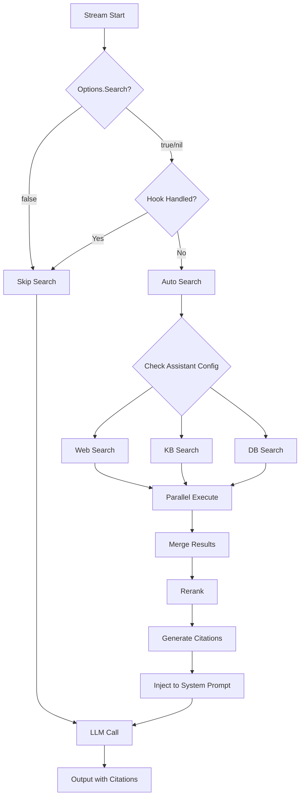
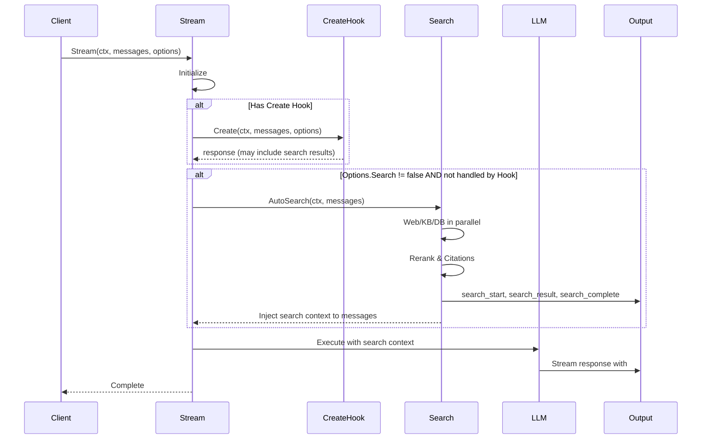

# Search Module Design

## Overview

The Search module provides a unified RAG (Retrieval-Augmented Generation) interface for Yao Agent, supporting three search types:

| Type  | Source         | Use Case                                             |
| ----- | -------------- | ---------------------------------------------------- |
| `web` | Internet       | Real-time information, news, external knowledge      |
| `kb`  | Knowledge Base | Documents, FAQs, internal knowledge (vector + graph) |
| `db`  | Database       | Structured data from Yao Models (QueryDSL)           |

The module follows the **Handler + Registry** pattern consistent with the `content` module, and exposes JSAPI for flexible usage in Create/Next hooks.

## Key Features

- **Unified JSAPI**: `ctx.search.Web()`, `ctx.search.KB()`, `ctx.search.DB()`, `ctx.search.Parallel()`
- **Citation System**: Auto-generate citation IDs (`#ref:xxx`) for LLM reference
- **Real-time Output**: Stream search progress to client
- **Trace Integration**: Report search operations to user for transparency
- **Reranking**: Score, Model, Agent, or MCP-based result reranking
- **Graceful Degradation**: Search errors don't block agent flow

## Quick Start

```typescript
// In Create hook (assistants/my-assistant/index.ts)
function Create(ctx, messages, options) {
  const query = messages[messages.length - 1].content;

  // Simple web search
  const result = ctx.search.Web(query, { limit: 5 });

  // Or parallel search across all sources
  const [web, kb, db] = ctx.search.Parallel([
    { type: "web", query, limit: 5 },
    { type: "kb", query, collections: ["docs"] },
    { type: "db", query, models: ["product"] },
  ]);

  return {
    messages: [{ role: "system", content: formatContext(web, kb, db) }],
  };
}
```

## Goals

1. **Unified Interface**: Single API for web, knowledge base, and database search
2. **Flexibility**: Support built-in handlers and external tools (MCP/Agent delegation)
3. **JSAPI Support**: Enable search calls from Create/Next hooks via JavaScript
4. **Parallel Execution**: Support concurrent web + KB + DB searches
5. **Graceful Degradation**: Search failures should not block the main agent flow
6. **Real-time Feedback**: Stream search progress and results to users via output
7. **Traceability**: Report search operations to users for transparency
8. **Citation Support**: Enable LLM to reference search results with trackable citations

## Architecture

### Search Flow Diagram



### Integration in Stream()



### Directory Structure

```
agent/search/
├── DESIGN.md              # This document
├── interfaces.go          # Core interfaces (Handler, Searcher)
├── types.go               # Type definitions (Request, Result, Citation, etc.)
├── registry.go            # Handler registry
├── search.go              # Main search logic and utilities
├── jsapi.go               # JavaScript API bindings for hooks
├── trace.go               # Trace node creation and management
├── output.go              # Real-time output/streaming to client
├── citation.go            # Citation ID generation and tracking
├── rerank/                # Result reranking
│   ├── interfaces.go      # Reranker interface
│   ├── score.go           # Score-based reranking (default)
│   ├── model.go           # Model-based reranking (Cohere, etc.)
│   ├── agent.go           # Agent-based reranking (delegate to another assistant)
│   └── mcp.go             # MCP-based reranking (call MCP server tool)
├── query/                 # Query processing
│   ├── interfaces.go      # Query processor interface
│   ├── keyword.go         # Keyword extraction for web search
│   ├── embedding.go       # Embedding generation for KB search
│   └── dsl.go             # Query DSL generation for DB search
├── web/                   # Web search implementations
│   ├── handler.go         # Web search handler
│   └── providers/         # Provider implementations
│       ├── tavily.go
│       └── serper.go
├── kb/                    # Knowledge base search
│   ├── handler.go         # KB search handler
│   ├── vector.go          # Vector similarity search
│   └── graph.go           # Graph-based association (GraphRAG)
└── db/                    # Database search (Yao Model/QueryDSL)
    ├── handler.go         # DB search handler
    ├── query.go           # QueryDSL builder
    └── schema.go          # Model schema introspection
```

## Core Interfaces

### Handler Interface

```go
// Handler defines the interface for search implementations
type Handler interface {
    // Type returns the search type this handler supports
    Type() SearchType

    // CanHandle checks if this handler can process the given request
    CanHandle(ctx *context.Context, req *Request) bool

    // Search executes the search and returns results
    Search(ctx *context.Context, req *Request) (*Result, error)
}
```

### Searcher Interface (Public API)

```go
// Searcher is the main interface exposed to external callers
type Searcher interface {
    // Search executes a single search request
    Search(ctx *context.Context, req *Request) (*Result, error)

    // SearchMultiple executes multiple searches (potentially in parallel)
    SearchMultiple(ctx *context.Context, reqs []*Request) ([]*Result, error)
}
```

### QueryProcessor Interface

```go
// QueryProcessor prepares queries for different search types
type QueryProcessor interface {
    // ExtractKeywords extracts search keywords from user message (for web search)
    ExtractKeywords(ctx *context.Context, content string) ([]string, error)

    // Embed generates vector embedding for query (for KB search)
    Embed(ctx *context.Context, content string, collection string) ([]float32, error)
}
```

### Reranker Interface

```go
// Reranker reorders search results by relevance
type Reranker interface {
    // Rerank reorders results based on query relevance
    Rerank(ctx *context.Context, query string, items []*ResultItem) ([]*ResultItem, error)
}
```

## Types

### SearchType

```go
type SearchType string

const (
    SearchTypeWeb SearchType = "web" // Web/Internet search
    SearchTypeKB  SearchType = "kb"  // Knowledge base vector search
    SearchTypeDB  SearchType = "db"  // Database search (Yao Model/QueryDSL)
)
```

### RerankerType

```go
type RerankerType string

const (
    RerankerTypeScore RerankerType = "score" // Simple score-based sorting (default)
    RerankerTypeModel RerankerType = "model" // Model-based reranking (Cohere, BGE, etc.)
    RerankerTypeAgent RerankerType = "agent" // Agent-based reranking (delegate to assistant)
    RerankerTypeMCP   RerankerType = "mcp"   // MCP-based reranking (call MCP server tool)
)
```

### Request

```go
type Request struct {
    // Common fields
    Query   string     `json:"query"`           // Search query (natural language)
    Type    SearchType `json:"type"`            // Search type: "web", "kb", or "db"
    Limit   int        `json:"limit,omitempty"` // Max results (default: 10)

    // Web search specific
    Sites     []string `json:"sites,omitempty"`      // Restrict to specific sites
    TimeRange string   `json:"time_range,omitempty"` // "day", "week", "month", "year"

    // Knowledge base specific
    Collections []string `json:"collections,omitempty"` // KB collection IDs
    Threshold   float64  `json:"threshold,omitempty"`   // Similarity threshold (0-1)
    Graph       bool     `json:"graph,omitempty"`       // Enable graph association

    // Database search specific
    Models  []string               `json:"models,omitempty"`  // Model IDs (e.g., "user", "agents.mybot.product")
    Wheres  []QueryWhere           `json:"wheres,omitempty"`  // Pre-defined filters (optional)
    Orders  []QueryOrder           `json:"orders,omitempty"`  // Sort orders (optional)
    Select  []string               `json:"select,omitempty"`  // Fields to return (optional)

    // Reranking
    Rerank *RerankOptions `json:"rerank,omitempty"`
}

// QueryWhere represents a filter condition for DB search
type QueryWhere struct {
    Field string      `json:"field"`          // Field name
    Op    string      `json:"op,omitempty"`   // Operator: "=", "like", ">", "<", "in", etc. (default: "=")
    Value interface{} `json:"value"`          // Filter value
}

// QueryOrder represents a sort order for DB search
type QueryOrder struct {
    Field string `json:"field"`          // Field name
    Order string `json:"order,omitempty"` // "asc" or "desc" (default: "desc")
}
```

### RerankOptions

```go
// RerankOptions controls result reranking
type RerankOptions struct {
    Type  string `json:"type,omitempty"`  // "score", "model", "agent", "mcp"
    Model string `json:"model,omitempty"` // Model ID (for type="model")
    Agent string `json:"agent,omitempty"` // Agent ID (for type="agent")
    MCP   string `json:"mcp,omitempty"`   // MCP server ID (for type="mcp")
    TopK  int    `json:"top_k,omitempty"` // Return top K after reranking
}
```

### Result

```go
type Result struct {
    Type     SearchType    `json:"type"`              // Search type
    Query    string        `json:"query"`             // Original query
    Items    []*ResultItem `json:"items"`             // Result items
    Total    int           `json:"total"`             // Total matches
    Duration int64         `json:"duration_ms"`       // Search duration in ms
    Error    string        `json:"error,omitempty"`   // Error message if failed

    // Graph associations (KB only, if enabled)
    GraphNodes []*GraphNode `json:"graph_nodes,omitempty"`
}
```

### ResultItem

```go
type ResultItem struct {
    // Citation
    CitationID string `json:"citation_id"` // Unique ID for LLM reference: "#ref:xxx"

    // Common fields
    Title   string  `json:"title,omitempty"`  // Title/headline
    Content string  `json:"content"`          // Main content/snippet
    URL     string  `json:"url,omitempty"`    // Source URL
    Score   float64 `json:"score,omitempty"`  // Relevance score (0-1)

    // KB specific
    DocumentID string `json:"document_id,omitempty"` // Source document ID
    Collection string `json:"collection,omitempty"`  // Collection name

    // DB specific
    Model    string                 `json:"model,omitempty"`     // Model ID
    RecordID interface{}            `json:"record_id,omitempty"` // Record primary key
    Data     map[string]interface{} `json:"data,omitempty"`      // Full record data
}
```

### GraphNode

```go
// GraphNode represents a related entity from knowledge graph
type GraphNode struct {
    ID          string                 `json:"id"`
    Type        string                 `json:"type"`                  // Entity type
    Name        string                 `json:"name"`                  // Entity name
    Description string                 `json:"description,omitempty"` // Entity description
    Relation    string                 `json:"relation,omitempty"`    // Relationship to query
    Score       float64                `json:"score,omitempty"`       // Relevance score
    Metadata    map[string]interface{} `json:"metadata,omitempty"`
}
```

## Citation System

Each search result has a unique `CitationID` for LLM reference.

### Citation Config

```go
type CitationConfig struct {
    Format           string `json:"format,omitempty"`             // Default: "#ref:{id}"
    AutoInjectPrompt bool   `json:"auto_inject_prompt,omitempty"` // Auto-add instructions to system prompt
    CustomPrompt     string `json:"custom_prompt,omitempty"`      // Override default prompt template
}
```

### Default Citation Prompt

When `AutoInjectPrompt` is enabled (default), the system prompt includes:

```
When citing search results, use #ref:{id} format inline.
Example: "According to studies #ref:a1b2, this is significant."

Available references:
- #ref:a1b2 - Title of source 1
- #ref:c3d4 - Title of source 2
```

### Custom Prompt in Config

```yaml
# assistants/my-assistant.yml
search:
  citation:
    format: "[{id}]"
    auto_inject_prompt: true
    custom_prompt: "Cite using [{id}]. Sources: ..."
```

## Trace Integration

Search operations create trace nodes to report execution details to users, providing transparency about what the agent is doing.

### Trace Node Structure

```
search (type: "search")
├── query       // Original query
├── search_type // "web", "kb", or "db"
├── duration_ms
├── status      // "success", "failed"
├── result_count
└── children    // Sub-operations
    ├── embedding (kb only)
    ├── vector_search (kb only)
    ├── graph_search (kb, if enabled)
    ├── dsl_build (db only)
    ├── db_query (db only)
    └── rerank (if enabled)
```

## Real-time Output

Search progress is streamed to the client via the output system.

### Output Message Types

```go
const (
    TypeSearchStart    = "search_start"    // Search initiated
    TypeSearchResult   = "search_result"   // Result item (streamed)
    TypeSearchComplete = "search_complete" // Search completed
)
```

### Client Display Example

```
🔍 Searching "latest AI developments"...

📄 Found 5 results:
   1. #ref:a1b2 - OpenAI Announces GPT-5
   2. #ref:c3d4 - Google's New AI Model
   ...

✅ Search complete (1.2s)
```

## JSAPI Integration

The Search module is exposed via `ctx.search` object in hook scripts.

### API Methods

```typescript
// In hook scripts (index.ts)

// Web search
ctx.search.Web(query: string, options?: WebOptions): Result

// Knowledge base search
ctx.search.KB(query: string, options?: KBOptions): Result

// Database search (Yao Model/QueryDSL)
ctx.search.DB(query: string, options?: DBOptions): Result

// Parallel search (multiple types)
ctx.search.Parallel(requests: Request[]): Result[]
```

### Options Types

```typescript
interface WebOptions {
  limit?: number; // Max results (default: 10)
  sites?: string[]; // Restrict to sites
  timeRange?: string; // "day", "week", "month", "year"
  rerank?: RerankOptions;
}

interface KBOptions {
  collections?: string[]; // Collection IDs
  threshold?: number; // Similarity threshold (0-1)
  limit?: number; // Max results
  graph?: boolean; // Enable graph association
  rerank?: RerankOptions;
}

interface DBOptions {
  models?: string[]; // Model IDs (default: use assistant's db.models)
  wheres?: QueryWhere[]; // Pre-defined filters
  orders?: QueryOrder[]; // Sort orders
  select?: string[]; // Fields to return
  limit?: number; // Max results (default: 10)
  rerank?: RerankOptions;
}

interface QueryWhere {
  field: string;
  op?: string; // "=", "like", ">", "<", "in", etc.
  value: any;
}

interface QueryOrder {
  field: string;
  order?: string; // "asc" or "desc"
}

interface RerankOptions {
  type?: string; // "score", "model", "agent", "mcp"
  model?: string; // Model ID (for type="model")
  agent?: string; // Agent ID (for type="agent")
  mcp?: string; // MCP server ID (for type="mcp")
  topK?: number; // Return top K
}
```

### Usage Examples

#### Example 1: Web Search

```typescript
function Create(ctx, messages, options) {
  const query = messages[messages.length - 1].content;

  const result = ctx.search.Web(query, {
    limit: 5,
    timeRange: "week",
  });

  if (result.items.length > 0) {
    return {
      messages: [
        {
          role: "system",
          content: formatSearchContext(result),
        },
      ],
    };
  }

  return { messages: [] };
}
```

#### Example 2: Knowledge Base Search with Graph

```typescript
function Create(ctx, messages, options) {
  const query = messages[messages.length - 1].content;

  const result = ctx.search.KB(query, {
    collections: ["docs", "faq"],
    threshold: 0.7,
    limit: 10,
    graph: true, // Enable graph association
  });

  if (result.items.length > 0) {
    return {
      messages: [
        {
          role: "system",
          content: formatKBContext(result),
        },
      ],
    };
  }

  return { messages: [] };
}
```

#### Example 3: Database Search

```typescript
function Create(ctx, messages, options) {
  const query = messages[messages.length - 1].content;

  // Search in assistant's models (uses db.models from assistant config)
  const result = ctx.search.DB(query, {
    models: ["product", "agents.mybot.order"], // Optional: override models
    wheres: [{ field: "status", value: "active" }], // Pre-filter
    limit: 20,
  });

  if (result.items.length > 0) {
    return {
      messages: [
        {
          role: "system",
          content: formatDBContext(result),
        },
      ],
    };
  }

  return { messages: [] };
}
```

#### Example 4: Parallel Web + KB + DB Search

```typescript
function Create(ctx, messages, options) {
  const query = messages[messages.length - 1].content;

  // Execute web, KB, and DB search in parallel
  const [webResult, kbResult, dbResult] = ctx.search.Parallel([
    { type: "web", query: query, limit: 5 },
    { type: "kb", query: query, collections: ["docs"], limit: 10 },
    { type: "db", query: query, models: ["product"], limit: 10 },
  ]);

  // Merge results
  const context = mergeSearchResults(webResult, kbResult, dbResult);

  return {
    messages: [
      {
        role: "system",
        content: context,
      },
    ],
  };
}
```

#### Example 5: Custom Citation Format

```typescript
function Create(ctx, messages, options) {
  const query = messages[messages.length - 1].content;
  const result = ctx.search.Web(query, { limit: 5 });

  // Build custom citation prompt
  const refs = result.items
    .map((item, i) => `[${i + 1}] ${item.title} - ${item.url}`)
    .join("\n");

  return {
    messages: [
      {
        role: "system",
        content: `Use [N] to cite. References:\n${refs}`,
      },
    ],
    // Override citation config
    citation: { autoInjectPrompt: false },
  };
}
```

## Configuration

Configuration follows a three-layer hierarchy (later overrides earlier):

1. **System Built-in Defaults** - Hardcoded sensible defaults
2. **Global Configuration** - `agent/agent.yml` + `agent/search.yao`
3. **Assistant Configuration** - `assistants/<assistant-id>/package.yao`

### Uses Configuration

Processing tools are configured in `agent/agent.yml` under `uses`:

```yaml
# agent/agent.yml
uses:
  default: "yaobots"
  title: "workers.system.title"
  vision: "workers.system.vision"
  fetch: "workers.system.fetch"

  # Search processing tools
  keyword: "builtin" # "builtin", "workers.nlp.keyword", "mcp:nlp-server"
  query: "builtin" # "builtin", "workers.nlp.query", "mcp:query-server"
  rerank: "builtin" # "builtin", "workers.rerank", "mcp:rerank-server"
  # Note: embedding & entity follow KB collection config
```

Tool format: `"builtin"`, `"<assistant-id>"` (Agent), `"mcp:<server-id>"` (MCP)

### System Built-in Defaults

These are the hardcoded defaults when no configuration is provided:

```go
// search/config/defaults.go
var SystemDefaults = Config{
    // Keyword extraction options (uses.keyword)
    Keyword: KeywordConfig{
        MaxKeywords: 10,
        Language:    "auto",
    },

    // QueryDSL generation options (uses.query)
    Query: QueryConfig{
        Strict: false,
    },

    // Rerank options (uses.rerank)
    Rerank: RerankConfig{
        TopN: 10,
    },

    // Citation
    Citation: CitationConfig{
        Format:           "#ref:{id}",
        AutoInjectPrompt: true,
    },

    // Source weights
    Weights: WeightsConfig{
        User: 1.0,
        Hook: 0.8,
        Auto: 0.6,
    },

    // Behavior options
    Options: OptionsConfig{
        SkipThreshold: 5,
    },
}
```

### Global Configuration

`agent/search.yao` - Override system defaults for all assistants:

```jsonc
{
  // Web search settings
  "web": {
    "provider": "tavily", // "tavily", "serper", "mcp:server-id"
    "api_key_env": "TAVILY_API_KEY",
    "max_results": 10
  },

  // Knowledge base search settings
  "kb": {
    "threshold": 0.7, // Similarity threshold
    "graph": false // Enable GraphRAG association
  },

  // Database search settings
  "db": {
    "max_results": 20
  },

  // Keyword extraction options (uses.keyword)
  "keyword": {
    "max_keywords": 10,
    "language": "auto" // "auto", "en", "zh", etc.
  },

  // QueryDSL generation options (uses.query)
  "query": {
    "strict": false // Strict mode: fail if generation fails
  },

  // Rerank options (uses.rerank)
  "rerank": {
    "top_n": 10 // Return top N results after reranking
  },

  // Citation format for LLM references
  "citation": {
    "format": "#ref:{id}",
    "auto_inject_prompt": true // Auto-inject citation instructions to system prompt
  },

  // Source weighting for result merging
  "weights": {
    "user": 1.0, // User-provided DataContent (highest priority)
    "hook": 0.8, // Hook ctx.search.*() results
    "auto": 0.6 // Auto search results
  },

  // Search behavior options
  "options": {
    "skip_threshold": 5 // Skip auto search if user provides >= N results
  }
}
```

### Assistant Configuration

`assistants/<assistant-id>/package.yao` - Override for specific assistant:

```jsonc
{
  "name": "My Assistant",
  "connector": "openai",

  // Search configuration (overrides agent/search.yao)
  "search": {
    "web": true, // Enable web search
    "kb": true, // Enable knowledge base search
    "db": true, // Enable database search

    // Overrides global web settings
    "web": {
      "provider": "tavily",
      "max_results": 5
    },

    // Overrides global kb settings
    "kb": {
      "collections": ["docs", "faq"], // Specific collections to search
      "threshold": 0.7,
      "graph": true
    },

    // Overrides global db settings
    "db": {
      "models": ["product", "order"], // Uses db.models if not set
      "max_results": 20
    },

    // Overrides global keyword options
    "keyword": {
      "max_keywords": 5
    },

    // Overrides global query options
    "query": {
      "strict": true
    },

    // Overrides global rerank options
    "rerank": {
      "top_n": 5
    },

    // Overrides global citation settings
    "citation": {
      "format": "#ref:{id}",
      "auto_inject_prompt": true
    }
  },

  // Knowledge base collections available to this assistant
  "kb": {
    "collections": ["docs", "faq"]
  },

  // Database models available to this assistant
  "db": {
    "models": ["product", "order", "customer"]
  }
}
```

## Execution Flow

### Search Flow

## Execution Modes

### Stream() Execution with Search

```
Stream(ctx, messages, options)
  │
  ├── 1. Initialize
  │
  ├── 2. Create Hook (optional)
  │   └── Can call ctx.search.* and return search results
  │
  ├── 3. Auto Search Decision
  │   ├── IF Options.Search == false → SKIP
  │   ├── IF Create Hook returned search context → SKIP
  │   └── ELSE → Execute Auto Search
  │       ├── Read assistant's search config
  │       ├── Execute web/kb/db in parallel
  │       ├── Send search_start/search_result/search_complete to output
  │       ├── Rerank results
  │       ├── Generate citation IDs
  │       └── Inject search context + citation prompt to messages
  │
  ├── 4. LLM Call (with search context if any)
  │
  ├── 5. Next Hook (optional)
  │
  └── 6. Output (response may contain #ref:xxx citations)
```

### Control Options

| Options.Search | Assistant Config  | Behavior                  |
| -------------- | ----------------- | ------------------------- |
| `true`         | any               | Force enable auto search  |
| `false`        | any               | Force disable auto search |
| `nil`          | has search config | Enable auto search        |
| `nil`          | no search config  | Disable auto search       |

**Go:**

```go
// Force enable
options := &context.Options{Search: boolPtr(true)}

// Force disable
options := &context.Options{Search: boolPtr(false)}

// Follow assistant config (default)
options := &context.Options{Search: nil}
```

**API Request:**

```json
{
  "messages": [...],
  "search": true
}
```

### Hook-Controlled Search

When you need custom search logic, handle it in Create Hook:

```typescript
function Create(ctx, messages, options) {
  const query = messages[messages.length - 1].content;

  // Custom logic: only search for certain queries
  if (needsSearch(query)) {
    const result = ctx.search.Web(query, { limit: 5 });
    return {
      messages: [{ role: "system", content: formatContext(result) }],
      // Returning messages signals: skip auto search
    };
  }

  return { messages: [] };
}
```

## Search Flow

```
Request → Trace Start → Query Process → Search → Rerank → Citations → Output → Return
```

### Query Processing

| Type | Process                                               | Tool Config          |
| ---- | ----------------------------------------------------- | -------------------- |
| Web  | Extract keywords → Build query                        | `uses.keyword`       |
| KB   | Get collection's embedding model → Generate embedding | KB collection config |
| DB   | Parse query → Build QueryDSL → Execute on models      | `uses.query`         |

#### Processing Methods

Configure via `uses.*` in `agent/agent.yml`:

| Format            | Description                               | Use Case                       |
| ----------------- | ----------------------------------------- | ------------------------------ |
| `builtin`         | Rule-based, template-driven (no LLM call) | Fast, low cost, simple queries |
| `<assistant-id>`  | Delegate to an assistant (Agent)          | LLM-based, custom logic        |
| `mcp:<server-id>` | Call MCP server tool                      | External services integration  |

#### Keyword Extraction (Web Search)

Configure via `uses.keyword`:

```
"I want to find the best wireless headphones under $100"
    ↓ builtin: simple tokenization + stopword removal
    ↓ agent: LLM extracts ["wireless headphones", "under $100", "best"]
→ Keywords: ["wireless headphones", "under $100", "best"]
```

#### KB Search (Entity & Embedding)

Entity extraction and embedding generation follow KB collection's own configuration:

- Each KB collection has its own embedding model
- Entity types are defined per collection (for GraphRAG)

#### QueryDSL Generation (Database)

Configure via `uses.query`:

```
"Products cheaper than $100 from Apple"
    ↓ builtin: template matching against model schema
    ↓ agent: LLM generates DSL from NL + schema
→ QueryDSL: {"wheres": [{"column": "price", "op": "<", "value": 100}, {"column": "brand", "value": "Apple"}]}
```

## Providers

### Web Search

| Provider | Type     | Notes                           |
| -------- | -------- | ------------------------------- |
| Tavily   | Built-in | Recommended for AI applications |
| Serper   | Built-in | Google search API               |
| MCP      | External | Any MCP server with search tool |

### Knowledge Base

Integrates with Yao's GraphRAG system:

- Vector search with collection-specific embedding models
- Graph-based association (optional)

### Database Search

Integrates with Yao's Model/QueryDSL system:

- Natural language → QueryDSL conversion (via LLM)
- Model schema introspection for query building
- Support for:
  - Global models (`models/*.mod.yao`)
  - Assistant-specific models (`assistants/{id}/models/*.mod.yao` → `agents.{id}.*`)
- Permission-aware queries (respects `__yao_*` permission fields)

### Reranking

Configure via `uses.rerank` in `agent/agent.yml`:

| Value               | Notes                            |
| ------------------- | -------------------------------- |
| `builtin`           | Simple score sorting (default)   |
| `workers.rerank`    | Delegate to an assistant (Agent) |
| `mcp:rerank-server` | Call MCP server rerank tool      |

## Error Handling

Search errors don't block the agent flow. Errors are returned in `Result.Error`:

```typescript
const result = ctx.search.Web(query);
if (result.error) {
  // Handle gracefully or fallback
  console.warn("Search failed:", result.error);
}
```

## Configuration Priority

Configuration is merged with later layers overriding earlier ones:

1. **System Built-in** - Hardcoded defaults (lowest priority)
2. **Global-level** - `agent/search.yao`
3. **Assistant-level** - `assistants/<assistant-id>/package.yao`
4. **Hook-level** - Options in `ctx.search.*()` calls
5. **Request-level** - `Options.Search` in Stream() call (highest priority)
   - `true`: Force enable auto search
   - `false`: Force disable auto search
   - `nil`: Follow assistant config

## DB Search Details

### Query Processing Flow

```
Natural Language Query
         │
         ▼
┌─────────────────────────────────┐
│   Get Model Schemas             │  ← Introspect models from db.models config
│   (fields, types, relations)    │
└─────────────────────────────────┘
         │
         ▼
┌─────────────────────────────────┐
│   LLM: Generate QueryDSL        │  ← Convert NL to Yao QueryDSL
│   (select, wheres, orders)      │
└─────────────────────────────────┘
         │
         ▼
┌─────────────────────────────────┐
│   Execute Query on Each Model   │  ← model.Find() with QueryDSL
└─────────────────────────────────┘
         │
         ▼
       Results
```

### Model ID Formats

| Format | Example              | Description                                                           |
| ------ | -------------------- | --------------------------------------------------------------------- |
| Global | `product`            | Global model from `models/product.mod.yao`                            |
| System | `__yao.user`         | Yao system model                                                      |
| Agent  | `agents.mybot.order` | Assistant-specific model from `assistants/mybot/models/order.mod.yao` |

### QueryDSL Generation Prompt

The DB handler uses LLM to convert natural language to QueryDSL:

```
Given the following model schemas:
- product: { id, name, price, category, status, created_at }
- order: { id, product_id, quantity, total, customer_id, status }

User query: "find all active products under $100 in electronics category"

Generate Yao QueryDSL:
{
  "model": "product",
  "wheres": [
    { "field": "status", "op": "=", "value": "active" },
    { "field": "price", "op": "<", "value": 100 },
    { "field": "category", "op": "=", "value": "electronics" }
  ],
  "orders": [{ "field": "price", "order": "asc" }],
  "limit": 10
}
```

## Content Module Integration

User messages may contain `type="data"` ContentParts with data source references. The `content` module processes these before LLM call.

### DataSource Types (from `context/types.go`)

```go
const (
    DataSourceModel        DataSourceType = "model"         // DB model query
    DataSourceKBCollection DataSourceType = "kb_collection" // KB collection search
    DataSourceKBDocument   DataSourceType = "kb_document"   // KB document retrieval
    DataSourceTable        DataSourceType = "table"         // Direct table query
    DataSourceAPI          DataSourceType = "api"           // External API
    DataSourceMCPResource  DataSourceType = "mcp_resource"  // MCP resource
)
```

### Message with Data Reference

User only specifies data source IDs. Filters are generated by Search module from natural language.

```json
{
  "role": "user",
  "content": [
    { "type": "text", "text": "Show me products under $100" },
    {
      "type": "data",
      "data": {
        "sources": [
          { "type": "model", "name": "product" },
          { "type": "kb_collection", "name": "product-docs" }
        ]
      }
    }
  ]
}
```

The Search module will:

1. Extract query from text: "products under $100"
2. For `model:product` → Generate QueryDSL: `{ "wheres": [{ "field": "price", "op": "<", "value": 100 }] }`
3. For `kb_collection:product-docs` → Vector search with query embedding

### Source Priority & Weighting

User-provided data sources have higher priority than auto-search results.

**Priority Levels:**

| Source           | Priority    | Weight | Description                      |
| ---------------- | ----------- | ------ | -------------------------------- |
| User DataContent | 1 (highest) | 1.0    | Explicitly referenced in message |
| Hook Search      | 2           | 0.8    | Called in Create/Next hook       |
| Auto Search      | 3 (lowest)  | 0.6    | Triggered by assistant config    |

**Behavior Rules:**

1. **User data sufficient**: If user provides enough data (e.g., ≥ 5 results), skip auto search
2. **Merge & Rerank**: When multiple sources, merge all results and rerank with weights
3. **Deduplication**: Same record from different sources → keep highest priority version

**Rerank with Weights:**

```go
// Final score calculation
finalScore = baseScore * sourceWeight * rerankScore

// Example:
// User data:  baseScore=0.8 * weight=1.0 = 0.80
// Auto search: baseScore=0.9 * weight=0.6 = 0.54
// User data wins even with lower base score
```

**Configuration:**

Global defaults (`agent/search.yao`):

```jsonc
{
  "weights": {
    "user": 1.0, // User-provided DataContent
    "hook": 0.8, // Hook ctx.search.*() results
    "auto": 0.6 // Auto search results
  },
  "options": {
    "skip_threshold": 5 // Skip auto search if user provides >= N results
  }
}
```

Assistant-level override (`assistants/<assistant-id>/package.yao`):

```jsonc
{
  "search": {
    "weights": {
      "user": 1.0,
      "hook": 0.9, // Higher weight for hook results
      "auto": 0.5 // Lower weight for auto results
    },
    "options": {
      "skip_threshold": 10 // Need more user results to skip auto search
    }
  }
}
```

**System Auto-Processing:**

The priority and weighting logic is handled automatically by the system:

```
Stream()
  │
  ├── 1. Parse user message for DataContent sources
  │   └── If found → Mark as priority=1, weight=1.0
  │
  ├── 2. Create Hook (optional)
  │   └── If hook calls ctx.search.*() → Mark as priority=2, weight=0.8
  │
  ├── 3. Auto Search Decision
  │   ├── Count user-provided results
  │   ├── IF user_results >= skip_auto_if_user_results → SKIP auto search
  │   └── ELSE → Execute auto search with priority=3, weight=0.6
  │
  ├── 4. Merge & Rerank (automatic)
  │   ├── Collect all results with their weights
  │   ├── Deduplicate (keep highest priority)
  │   └── Calculate finalScore = baseScore * weight
  │
  └── 5. Inject to LLM context
```

Users don't need to handle weights in hooks - the system manages this automatically.

### Processing Flow in content.Vision()

```
content.Vision()
  ├── type="text" → Pass through
  ├── type="image_url" → Image processing
  ├── type="file" → File processing
  └── type="data" → processDataContent()
      ├── DataSourceModel → Query via model.Find() → Format as text
      ├── DataSourceKBCollection → search.KB() → Format as text
      ├── DataSourceKBDocument → Retrieve document → Format as text
      └── DataSourceMCPResource → MCP resource read → Format as text
```

### Implementation Location

The `processDataContent()` function in `content/content.go` should:

1. **For `model` type**: Call search module's DB handler or direct model query
2. **For `kb_collection` type**: Call search module's KB handler
3. **For `kb_document` type**: Retrieve specific document from KB
4. **For `mcp_resource` type**: Read MCP resource

This allows the search module to be reused for both:

- **Auto Search**: Triggered by `Options.Search = true`
- **Data ContentPart**: User explicitly references data sources in message

## Related Files

- `agent/context/jsapi.go` - JSAPI base implementation
- `agent/context/types.go` - DataSource, DataContent types
- `agent/context/types_llm.go` - Uses configuration (Search field)
- `agent/assistant/types.go` - SearchOption definition
- `agent/store/types/types.go` - KnowledgeBase, Database config
- `agent/output/message/types.go` - Output message types
- `agent/content/content.go` - Content processing (Vision function)
- `model/model.go` - Yao Model loading (global, system, assistant models)

## See Also

- `agent/context/JSAPI.md` - Full JSAPI documentation
- `agent/context/RESOURCE_MANAGEMENT.md` - Context lifecycle and resource management
- `agent/output/README.md` - Output system documentation
- `agent/store/CHAT_STORAGE_DESIGN.md` - Chat storage design
