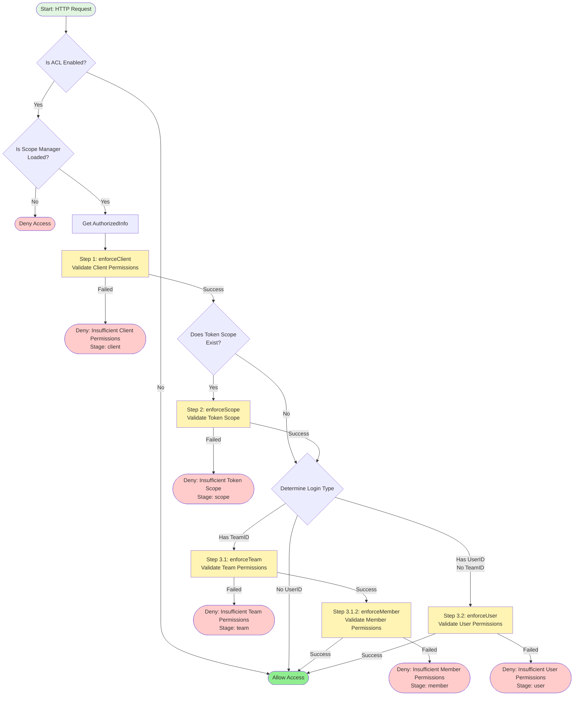

# ACL Enforcement Logic

## Overview

The ACL (Access Control List) enforcement system provides a comprehensive permission validation mechanism for OAuth-protected APIs. It validates permissions through multiple layers: **Client**, **Token Scope**, **Team**, **Member**, and **User** levels.

**Key Principle**: All applicable validation steps must pass (AND logic). If any check fails, access is immediately denied with a specific error indicating which stage failed.

---

## Enforcement Flow Diagram



---

## Validation Steps

### Step 1: Client Validation (`enforceClient`)

**Purpose**: Validate that the OAuth client has permission to access the endpoint.

**Process**:

1. Get client role from `RoleManager.GetClientRole(clientID)`
2. Retrieve client's scopes: `RoleManager.GetScopes(clientRole)`
   - Returns: `allowedScopes` and `restrictedScopes`
3. **Step 1**: Check allowed scopes
   - Build `AccessRequest` with `allowedScopes`
   - Call `Scope.Check(request)` to validate
   - If fails → deny access immediately
4. **Step 2**: Check restricted scopes (if any)
   - Build `AccessRequest` with `restrictedScopes`
   - Call `Scope.CheckRestricted(request)` for reverse validation
   - If endpoint matches restricted scopes → deny access immediately

**Result**:

- ✅ **Pass**: Both checks pass → Continue to Step 2
- ❌ **Fail**: Either check fails → Immediately deny with `Stage: client`

---

### Step 2: Token Scope Validation (`enforceScope`)

**Purpose**: Validate explicit scopes granted in the OAuth token.

**Process**:

1. Check if `authInfo.Scope` is not empty
   - If empty: Skip this step (continue to Step 3)
2. Parse token scopes (space-separated string)
   - Example: `"read:users write:users"` → `["read:users", "write:users"]`
3. Build `AccessRequest` with parsed scopes
4. Call `Scope.Check(request)` to validate

**Result**:

- ⏭️ **Skip**: If no token scopes, continue to Step 3
- ✅ **Pass**: Continue to Step 3
- ❌ **Fail**: Immediately deny with `Stage: scope`

---

### Step 3: User/Team Validation

The validation path depends on the login type determined by `AuthorizedInfo`:

#### **3.1 Team Login** (Has `TeamID`)

When a user logs in as part of a team:

##### **3.1.1 Team Permission Validation (`enforceTeam`)**

**Process**:

1. Get team role from `RoleManager.GetTeamRole(teamID)`
2. Retrieve team's scopes: `RoleManager.GetScopes(teamRole)`
   - Returns: `allowedScopes` and `restrictedScopes`
3. **Step 1**: Check allowed scopes
   - Build `AccessRequest` with `allowedScopes`
   - Call `Scope.Check(request)` to validate
   - If fails → deny access immediately
4. **Step 2**: Check restricted scopes (if any)
   - Build `AccessRequest` with `restrictedScopes`
   - Call `Scope.CheckRestricted(request)` for reverse validation
   - If endpoint matches restricted scopes → deny access immediately

**Result**:

- ✅ **Pass**: Both checks pass → Continue to Step 3.1.2
- ❌ **Fail**: Either check fails → Immediately deny with `Stage: team`

##### **3.1.2 Member Permission Validation (`enforceMember`)**

**Process**:

1. Get member role from `RoleManager.GetMemberRole(teamID, userID)`
   - Represents the user's role within the team
2. Retrieve member's scopes: `RoleManager.GetScopes(memberRole)`
   - Returns: `allowedScopes` and `restrictedScopes`
3. **Step 1**: Check allowed scopes
   - Build `AccessRequest` with `allowedScopes`
   - Call `Scope.Check(request)` to validate
   - If fails → deny access immediately
4. **Step 2**: Check restricted scopes (if any)
   - Build `AccessRequest` with `restrictedScopes`
   - Call `Scope.CheckRestricted(request)` for reverse validation
   - If endpoint matches restricted scopes → deny access immediately

**Result**:

- ✅ **Pass**: Both checks pass → Allow access
- ❌ **Fail**: Either check fails → Immediately deny with `Stage: member`

---

#### **3.2 User Login** (Has `UserID`, No `TeamID`)

When a user logs in directly (not as part of a team):

##### **User Permission Validation (`enforceUser`)**

**Process**:

1. Get user role from `RoleManager.GetUserRole(userID)`
2. Retrieve user's scopes: `RoleManager.GetScopes(userRole)`
   - Returns: `allowedScopes` and `restrictedScopes`
3. **Step 1**: Check allowed scopes
   - Build `AccessRequest` with `allowedScopes`
   - Call `Scope.Check(request)` to validate
   - If fails → deny access immediately
4. **Step 2**: Check restricted scopes (if any)
   - Build `AccessRequest` with `restrictedScopes`
   - Call `Scope.CheckRestricted(request)` for reverse validation
   - If endpoint matches restricted scopes → deny access immediately

**Result**:

- ✅ **Pass**: Both checks pass → Allow access
- ❌ **Fail**: Either check fails → Immediately deny with `Stage: user`

---

#### **3.3 Pure API Call** (No `UserID`)

For client credential grants or service-to-service calls:

- Only Step 1 (client validation) is required
- If client validation passes, access is allowed

---

## Enforcement Stages

Each validation failure is tagged with a specific stage for debugging and error reporting:

| Stage  | Constant                 | Description                         |
| ------ | ------------------------ | ----------------------------------- |
| Client | `EnforcementStageClient` | Client permission check failed      |
| Scope  | `EnforcementStageScope`  | Token scope check failed            |
| Team   | `EnforcementStageTeam`   | Team permission check failed        |
| Member | `EnforcementStageMember` | Team member permission check failed |
| User   | `EnforcementStageUser`   | User permission check failed        |

---

## Error Handling

When a validation step fails, an `Error` is returned with:

```go
type Error struct {
    Type       ErrorType        // e.g., ErrorTypePermissionDenied
    Message    string           // Human-readable error message
    Stage      EnforcementStage // Which stage failed
    Details    map[string]interface{} // Additional context
}
```

**Example Error Response**:

```json
{
  "error": "permission_denied",
  "message": "Access denied: insufficient permissions",
  "stage": "member",
  "details": {
    "required_scopes": ["collections:write"],
    "missing_scopes": ["collections:write"]
  }
}
```

---

## Key Components

### RoleManager

The `RoleManager` is responsible for retrieving roles and their associated scopes:

```go
// Get role for different entities
RoleManager.GetClientRole(ctx, clientID) -> roleID
RoleManager.GetUserRole(ctx, userID) -> roleID
RoleManager.GetTeamRole(ctx, teamID) -> roleID
RoleManager.GetMemberRole(ctx, teamID, userID) -> roleID

// Get scopes for a role
RoleManager.GetScopes(ctx, roleID) -> (allowedScopes, restrictedScopes, error)
```

### ScopeManager

The `ScopeManager` validates endpoint access based on scopes with two methods:

#### `Check(request)` - Positive Validation

Checks if the given scopes **grant access** to the endpoint:

```go
type AccessRequest struct {
    Method string   // HTTP method (GET, POST, etc.)
    Path   string   // Request path
    Scopes []string // User's scopes
}

decision := ScopeManager.Check(request)
// Returns: AccessDecision with Allowed, Reason, MissingScopes, etc.
// Allowed = true: User has required scopes
// Allowed = false: User lacks required scopes
```

#### `CheckRestricted(request)` - Negative Validation (Reverse Check)

Checks if the given scopes **restrict access** to the endpoint:

```go
decision := ScopeManager.CheckRestricted(request)
// Returns: AccessDecision with Allowed, Reason, etc.
// Allowed = true: Endpoint is NOT restricted by these scopes
// Allowed = false: Endpoint IS restricted by these scopes (deny access)
```

**How Restrictions Work**:

1. If an endpoint matches any scope in `restrictedScopes`, access is **denied**
2. Restrictions override allowed scopes - even if `allowedScopes` grant access, `restrictedScopes` can block it
3. This allows fine-grained control: "User can access most endpoints, except these specific ones"

**Example**:

```go
// Role has:
allowedScopes = ["collections:*", "documents:*"]
restrictedScopes = ["collections:delete"]

// Request: DELETE /api/collections/123
// Check(allowedScopes) → Pass (collections:* matches)
// CheckRestricted(restrictedScopes) → Fail (collections:delete matches)
// Final result: Access DENIED
```

---

## Usage Example

### Basic Usage

```go
// In your HTTP handler
func HandleRequest(c *gin.Context) {
    // ACL enforcement is called by middleware
    allowed, err := acl.Enforce(c)

    if err != nil {
        aclErr := err.(*acl.Error)
        c.JSON(403, gin.H{
            "error": aclErr.Type,
            "message": aclErr.Message,
            "stage": aclErr.Stage,
            "details": aclErr.Details,
        })
        return
    }

    if !allowed {
        c.JSON(403, gin.H{"error": "access denied"})
        return
    }

    // After successful ACL enforcement, get authorized info with data constraints
    authInfo := authorized.GetInfo(c)

    // Check data access constraints to filter query results
    if authInfo.Constraints.OwnerOnly {
        // Only return data owned by current user
        // e.g., WHERE user_id = authInfo.UserID
    }

    if authInfo.Constraints.CreatorOnly {
        // Only return data created by current user
        // e.g., WHERE created_by = authInfo.UserID
    }

    if authInfo.Constraints.EditorOnly {
        // Only return data last edited by current user
        // e.g., WHERE updated_by = authInfo.UserID
    }

    if authInfo.Constraints.TeamOnly {
        // Only return data owned by current team
        // e.g., WHERE team_id = authInfo.TeamID
    }

    // Check extra constraints
    if dept, ok := authInfo.Constraints.Extra["department_only"].(bool); ok && dept {
        // Apply department filter
        // e.g., WHERE department_id = authInfo.DepartmentID
    }

    // Process request...
}
```

### Data Access Constraints

After successful ACL enforcement, the `AuthorizedInfo` is automatically updated with data access constraints from the matched endpoint:

```go
// DataConstraints represents data access constraints
type DataConstraints struct {
    // Built-in constraints
    OwnerOnly   bool // Only access owner's data (current owner)
    CreatorOnly bool // Only access creator's data (who created the resource)
    EditorOnly  bool // Only access editor's data (who last updated the resource)
    TeamOnly    bool // Only access team's data (filter by TeamID)

    // Extra constraints (user-defined, flexible extension)
    Extra map[string]interface{} // Custom constraints like department_only, region_only, etc.
}

type AuthorizedInfo struct {
    UserID    string
    TeamID    string
    // ... other fields ...

    // Data access constraints (set by ACL enforcement)
    Constraints DataConstraints
}
```

**How it works**:

1. During ACL enforcement, if validation passes, the system extracts constraints from the matched endpoint
2. `EndpointInfo.GetConstraints()` returns a map of all constraints
3. Constraints are automatically stored in the context via `authorized.UpdateConstraints()`
4. `authorized.GetInfo(c)` reads constraints and populates the `Constraints` struct
5. API handlers can access constraints through `authInfo.Constraints.OwnerOnly`, etc.

**Extensibility**:

The constraint system uses a map-based approach for easy extension:

```go
// The constraint system is already extensible through the Extra map!
// For custom constraints, use the Extra field directly - no code changes needed.

// Current structure (already supports custom constraints):
type DataConstraints struct {
    // Built-in constraints (pre-defined)
    OwnerOnly   bool
    CreatorOnly bool
    EditorOnly  bool
    TeamOnly    bool

    // Extra constraints (user-defined, flexible)
    Extra map[string]interface{}
}

// Define custom constraints in scope YAML:
// collections:read:department:
//   description: "Read collections in user's department"
//   extra:
//     department_only: true
//     region: "us-west"
//     project_ids: ["proj1", "proj2"]
//   endpoints:
//     - GET /kb/collections/department

// Access in handler code:
func GetCollections(c *gin.Context) {
    authInfo := authorized.GetInfo(c)

    query := db.Query("SELECT * FROM collections")

    // Check built-in constraints
    if authInfo.Constraints.OwnerOnly {
        query = query.Where("user_id = ?", authInfo.UserID)
    }

    // Check extra constraints (no code changes needed!)
    if dept, ok := authInfo.Constraints.Extra["department_only"].(bool); ok && dept {
        query = query.Where("department_id = ?", authInfo.DepartmentID)
    }

    if region, ok := authInfo.Constraints.Extra["region"].(string); ok {
        query = query.Where("region = ?", region)
    }

    if projectIDs, ok := authInfo.Constraints.Extra["project_ids"].([]interface{}); ok {
        query = query.Where("project_id IN (?)", projectIDs)
    }

    // Execute query...
}

// ONLY if you need a new BUILT-IN constraint (used frequently across the system):
// Follow these steps to add it alongside OwnerOnly, CreatorOnly, etc.
// But for most cases, using Extra is sufficient and more flexible!
```

**Example Endpoint Configuration**:

```yaml
# openapi/scopes/collections/read.yml
collections:read:own:
  name: "collections:read:own"
  description: "Read own collections"
  owner: true # Sets OwnerOnly = true
  creator: true # Sets CreatorOnly = true
  editor: true # Sets EditorOnly = true
  extra: # Sets Extra constraints
    department_only: true
    region: "us-west"
  endpoints:
    - "GET /api/collections/own"
    - "GET /api/collections/own/:id"
```

**Example API Handler**:

```go
func GetCollections(c *gin.Context) {
    authInfo := authorized.GetInfo(c)

    query := db.Query("SELECT * FROM collections")

    // Apply built-in data access constraints
    if authInfo.Constraints.OwnerOnly {
        query = query.Where("user_id = ?", authInfo.UserID)
    } else if authInfo.Constraints.CreatorOnly {
        query = query.Where("created_by = ?", authInfo.UserID)
    } else if authInfo.Constraints.EditorOnly {
        query = query.Where("updated_by = ?", authInfo.UserID)
    } else if authInfo.Constraints.TeamOnly {
        query = query.Where("team_id = ?", authInfo.TeamID)
    }

    // Apply extra constraints
    if dept, ok := authInfo.Constraints.Extra["department_only"].(bool); ok && dept {
        query = query.Where("department_id = ?", authInfo.DepartmentID)
    }

    if region, ok := authInfo.Constraints.Extra["region"].(string); ok {
        query = query.Where("region = ?", region)
    }

    // Execute query and return results
    collections, _ := query.Get()
    c.JSON(200, collections)
}
```

### Checking Enforcement Stage

```go
allowed, err := acl.Enforce(c)
if err != nil {
    aclErr := err.(*acl.Error)

    switch aclErr.Stage {
    case acl.EnforcementStageClient:
        // Client doesn't have permission
        log.Error("Client permission denied", "client_id", authInfo.ClientID)

    case acl.EnforcementStageUser:
        // User doesn't have permission
        log.Error("User permission denied", "user_id", authInfo.UserID)

    case acl.EnforcementStageMember:
        // Team member doesn't have permission
        log.Error("Member permission denied",
            "user_id", authInfo.UserID,
            "team_id", authInfo.TeamID)
    }

    return
}
```

---

## Configuration

### Enabling ACL

```go
config := &acl.Config{
    Enabled:  true,
    Cache:    cacheStore,
    Provider: userProvider,
}

aclInstance := acl.New(config)
```

### Role Manager Setup

```go
roleManager := role.NewManager(cacheStore, userProvider)
role.RoleManager = roleManager // Set global instance
```

---

## Design Principles

1. **Defense in Depth**: Multiple layers of validation ensure comprehensive security
2. **Fail-Safe**: Any validation failure results in access denial
3. **Explicit Stages**: Clear error messages indicate exactly where validation failed
4. **Independent Validation**: Each stage validates independently against the same endpoint
5. **Role-Based**: Permissions are managed through roles and scopes
6. **Dual Validation**: Each stage performs both positive (allowed) and negative (restricted) checks
   - **Allowed scopes**: Must grant access to the endpoint
   - **Restricted scopes**: Must NOT match the endpoint (reverse check)
   - Both conditions must be satisfied for access to be granted
7. **Restriction Priority**: Restricted scopes override allowed scopes for fine-grained control

---

## Performance Considerations

- **Caching**: RoleManager caches role and scope lookups
- **Early Exit**: Validation stops immediately on first failure
- **Concurrent Safe**: Uses `sync.RWMutex` for thread-safe operations
- **Efficient Matching**: PathMatcher uses optimized data structures (exact → param → wildcard)

---

## FAQ

**Q: What happens if RoleManager is not configured?**  
A: The RoleManager is automatically initialized when ACL is enabled. If role or permission retrieval fails (e.g., role not found), the enforcement will return an error with the appropriate stage information. For performance reasons, RoleManager should always be properly configured when ACL is enabled.

**Q: Can a user have multiple roles?**  
A: Currently, each entity (client/user/team/member) has one role. Multiple scopes are supported through role configuration.

**Q: What's the difference between Team and Member validation?**  
A: Team validation checks the team's overall permissions, while Member validation checks the specific user's role within that team.

**Q: Is scope matching case-sensitive?**  
A: Yes, scope names are case-sensitive (e.g., `read:users` ≠ `Read:Users`).

**Q: What if I want OR logic instead of AND?**  
A: The current design uses AND logic for security. For OR logic, consider assigning appropriate scopes to the client or user role that encompasses all required permissions.

**Q: How do restricted scopes work exactly?**  
A: Restricted scopes use reverse validation:

- `Check(allowedScopes)` asks: "Do these scopes grant access?"
- `CheckRestricted(restrictedScopes)` asks: "Do these scopes forbid access?"
- If an endpoint matches any restricted scope, access is denied regardless of allowed scopes

**Q: When should I use restricted scopes?**  
A: Use restricted scopes when you want to:

- Grant broad access but block specific operations (e.g., allow all collections operations except delete)
- Temporarily revoke access to certain endpoints without changing the base role
- Implement exceptions to general permissions

**Q: How do data constraints work?**  
A: After successful ACL enforcement:

1. The system checks if the matched endpoint has constraint flags in its scope definition (`owner`, `creator`, `editor`, `team`, `extra`)
2. These flags are automatically set in `AuthorizedInfo.Constraints`
3. API handlers read these flags from `authorized.GetInfo(c)` and apply data filters
4. Example: If `authInfo.Constraints.OwnerOnly = true`, the API should only return records where `user_id = authInfo.UserID`

**Q: What's the difference between Owner, Creator, and Editor constraints?**  
A:

- **OwnerOnly**: Filters by current owner (who owns it now) - can be transferred
- **CreatorOnly**: Filters by original creator (who created it) - immutable
- **EditorOnly**: Filters by last editor (who last updated it) - changes on each edit

**Q: Can multiple constraints be true at the same time?**  
A: Yes, a scope can have multiple constraints. The API handler should apply filters based on the most restrictive or appropriate constraint for the use case.

**Q: How do I use Extra constraints?**  
A: Define them in the scope configuration YAML under `extra:`, then access them in your handler:

```go
if dept, ok := authInfo.Constraints.Extra["department_only"].(bool); ok && dept {
    query = query.Where("department_id = ?", userDepartmentID)
}
```

**Q: What happens if constraints are set but the user context is missing?**  
A: For client credential grants with no user context, the API handler should handle this gracefully (e.g., return empty results or an appropriate error).
