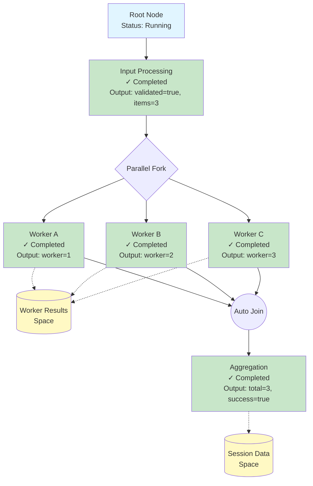

# Trace Package

A trace system for logging and visualizing execution flow with real-time event streaming support.

## Features

- **Node Tree Structure**: Build execution trees with sequential and parallel operations
- **Real-time Events**: Subscribe to trace updates with history replay and SSE support
- **Memory Spaces**: Key-value storage for session data and context
- **Dual Storage**: Local disk and Gou store backends
- **Concurrent Safe**: Thread-safe operations with context cancellation
- **Auto-join**: Automatic handling of parallel to sequential transitions

## Quick Start

Complete example program:

```go
package main

import (
    "context"
    "fmt"
    "sync"
    "time"

    "github.com/yaoapp/yao/trace"
    "github.com/yaoapp/yao/trace/types"
)

func main() {
    // Create a new trace with custom ID
    ctx := context.Background()
    traceID := trace.GenTraceID()

    option := &types.TraceOption{
        ID:        traceID,
        CreatedBy: "user@example.com",
        Metadata:  map[string]any{"task": "demo"},
    }

    _, manager, err := trace.New(ctx, trace.Local, option)
    if err != nil {
        panic(err)
    }
    defer trace.Release(traceID)

    fmt.Printf("Trace ID: %s\n", traceID)

    // Step 1: Input processing
    manager.Info("Starting input processing")
    _, err = manager.Add("user input data", types.TraceNodeOption{
        Label: "Input Processing",
        Icon:  "processor",
    })
    if err != nil {
        panic(err)
    }
    manager.Complete(map[string]any{"validated": true, "items": 3})

    // Step 2: Parallel processing - each worker completes independently
    manager.Info("Starting parallel tasks")

    // Create a shared space for workers to store results
    space, _ := manager.CreateSpace(types.TraceSpaceOption{
        Label: "Worker Results",
        Icon:  "storage",
    })

    nodes, _ := manager.Parallel([]types.TraceParallelInput{
        {
            Input: "Processing task A",
            Option: types.TraceNodeOption{Label: "Worker A", Icon: "cpu"},
        },
        {
            Input: "Processing task B",
            Option: types.TraceNodeOption{Label: "Worker B", Icon: "cpu"},
        },
        {
            Input: "Processing task C",
            Option: types.TraceNodeOption{Label: "Worker C", Icon: "cpu"},
        },
    })

    // Each parallel node completes itself
    var wg sync.WaitGroup
    for i, node := range nodes {
        wg.Add(1)
        go func(idx int, n types.Node) {
            defer wg.Done()

            // Worker performs its task
            n.Info("Worker %d processing", idx+1)

            // Simulate different completion times
            time.Sleep(time.Duration(50+idx*20) * time.Millisecond)

            // Store result in shared space
            manager.SetSpaceValue(space.ID, fmt.Sprintf("worker_%d", idx+1), map[string]any{
                "id":     idx + 1,
                "status": "done",
                "time":   time.Now().UnixMilli(),
            })

            // Each worker completes itself
            n.Complete(map[string]any{"worker": idx + 1, "status": "done"})
        }(i, node)
    }
    wg.Wait()

    // Step 3: Aggregation (auto-joins parallel branches)
    manager.Info("Aggregating results")
    _, err = manager.Add("Merging outputs", types.TraceNodeOption{
        Label: "Aggregation",
        Icon:  "merge",
    })
    if err != nil {
        panic(err)
    }

    // Create another space for session data
    sessionSpace, _ := manager.CreateSpace(types.TraceSpaceOption{
        Label: "Session Data",
        Icon:  "database",
    })
    manager.SetSpaceValue(sessionSpace.ID, "total_processed", 3)
    manager.SetSpaceValue(sessionSpace.ID, "timestamp", time.Now().UnixMilli())

    manager.Complete(map[string]any{"total": 3, "success": true})

    // Mark trace as completed
    manager.MarkComplete()

    fmt.Println("Trace completed successfully!")
}
```

### Execution Flow

The program creates the following node tree:



## Subscribe to Events

Real-time event subscription example:

```go
package main

import (
    "context"
    "encoding/json"
    "fmt"
    "time"

    "github.com/yaoapp/yao/trace"
    "github.com/yaoapp/yao/trace/types"
)

func main() {
    ctx := context.Background()
    traceID := trace.GenTraceID()

    option := &types.TraceOption{
        ID:        traceID,
        CreatedBy: "user@example.com",
    }

    _, manager, _ := trace.New(ctx, trace.Local, option)
    defer trace.Release(traceID)

    // Subscribe to all events (history + real-time)
    updates, _ := manager.Subscribe()

    // Start event listener in goroutine
    go func() {
        for update := range updates {
            // Convert to JSON for display
            data, _ := json.MarshalIndent(update, "", "  ")
            fmt.Printf("\n[Event] %s at %d\n%s\n",
                update.Type, update.Timestamp, string(data))

            // Handle specific events
            switch update.Type {
            case types.UpdateTypeNodeStart:
                fmt.Println("→ Node started")

            case types.UpdateTypeNodeComplete:
                fmt.Println("✓ Node completed")

            case types.UpdateTypeMemoryAdd:
                fmt.Println("💾 Memory updated")

            case types.UpdateTypeComplete:
                fmt.Println("🎉 Trace completed!")
                return
            }
        }
    }()

    // Execute trace operations
    manager.Info("Processing started")
    manager.Add("Task 1", types.TraceNodeOption{Label: "Task 1"})
    manager.Complete(map[string]any{"status": "ok"})

    manager.Add("Task 2", types.TraceNodeOption{Label: "Task 2"})
    manager.Complete(map[string]any{"status": "ok"})

    manager.MarkComplete()

    // Wait for events to be processed
    time.Sleep(1 * time.Second)
}
```

### Event Output Example

```json
[Event] init at 1700123456
{
  "Type": "init",
  "TraceID": "20251118123456789012",
  "Timestamp": 1700123456,
  "Data": {
    "traceId": "20251118123456789012",
    "agentName": "",
    "rootNode": {...}
  }
}
→ Node started

[Event] node_start at 1700123457
{
  "Type": "node_start",
  "TraceID": "20251118123456789012",
  "NodeID": "abc123def456",
  "Timestamp": 1700123457,
  "Data": {
    "node": {
      "ID": "abc123def456",
      "Label": "Task 1",
      "Status": "running"
    }
  }
}
→ Node started

[Event] node_complete at 1700123458
{
  "Type": "node_complete",
  "TraceID": "20251118123456789012",
  "NodeID": "abc123def456",
  "Timestamp": 1700123458,
  "Data": {
    "nodeId": "abc123def456",
    "status": "success",
    "endTime": 1700123458,
    "duration": 1000,
    "output": {"status": "ok"}
  }
}
✓ Node completed

[Event] complete at 1700123460
{
  "Type": "complete",
  "TraceID": "20251118123456789012",
  "Timestamp": 1700123460,
  "Data": {
    "traceId": "20251118123456789012",
    "status": "completed",
    "totalDuration": 4000
  }
}
🎉 Trace completed!
```

## API Reference

### Trace Management

#### `New(ctx, driver, option, driverOptions...) (traceID, Manager, error)`

Create a new trace or load existing one from storage.

**Drivers:**

- `trace.Local` - Local disk storage (default: uses log directory from config, fallback to `./traces`)
- `trace.Store` - Gou store backend (default store: `__yao.store`, default prefix: `__trace`)

**Example:**

```go
// Local with default path (uses log directory from config)
traceID, manager, _ := trace.New(ctx, trace.Local, nil)

// Local with custom path
traceID, manager, _ := trace.New(ctx, trace.Local, nil, "/data/traces")

// Store with default settings (uses __yao.store with __trace prefix)
traceID, manager, _ := trace.New(ctx, trace.Store, nil)

// Store with custom store name
traceID, manager, _ := trace.New(ctx, trace.Store, nil, "my_store")

// Store with custom store name and prefix
traceID, manager, _ := trace.New(ctx, trace.Store, nil, "my_store", "my_prefix")

// With trace options
option := &types.TraceOption{
    ID:        "custom-id",
    CreatedBy: "user@example.com",
    TeamID:    "team-001",
    Metadata:  map[string]any{"version": "1.0"},
}
traceID, manager, _ := trace.New(ctx, trace.Local, option)
```

#### `LoadFromStorage(ctx, driver, traceID, options...) (traceID, Manager, error)`

Load an existing trace from persistent storage.

#### `Load(traceID) (Manager, error)`

Get an active trace from registry.

#### `GetInfo(ctx, driver, traceID, options...) (*TraceInfo, error)`

Retrieve trace metadata from storage.

#### `IsLoaded(traceID) bool`

Check if trace is active in registry.

#### `Exists(ctx, driver, traceID, options...) (bool, error)`

Check if trace exists in persistent storage.

#### `Release(traceID) error`

Remove trace from registry and release resources.

#### `Remove(ctx, driver, traceID, options...) error`

Delete trace and all associated data permanently.

#### `List() []string`

List all active trace IDs in registry.

### Manager Interface

#### Node Operations

- `Add(input, option) Node` - Create sequential node, returns Node interface (auto-joins if parallel)
- `Parallel(inputs) []Node` - Create concurrent child nodes, returns Node interfaces for direct control
- `GetRootNode() *TraceNode` - Get root node data
- `GetNode(id) *TraceNode` - Get node data by ID
- `GetCurrentNodes() []*TraceNode` - Get active node data

#### Logging (Chainable)

- `Info(format, args...)` - Log info message
- `Debug(format, args...)` - Log debug message
- `Error(format, args...)` - Log error message
- `Warn(format, args...)` - Log warning message

#### Node Status

- `SetOutput(output)` - Set output for current nodes
- `SetMetadata(key, value)` - Set metadata
- `Complete(output...)` - Mark nodes as completed
- `Fail(err)` - Mark nodes as failed
- `MarkComplete()` - Mark entire trace as completed

#### Memory Spaces

- `CreateSpace(option)` - Create new space
- `GetSpace(id)` - Get space by ID
- `HasSpace(id)` - Check if space exists
- `DeleteSpace(id)` - Delete space
- `ListSpaces()` - List all spaces

#### Space Key-Value

- `SetSpaceValue(spaceID, key, value)` - Set value (broadcasts event)
- `GetSpaceValue(spaceID, key)` - Get value
- `HasSpaceValue(spaceID, key)` - Check key existence
- `DeleteSpaceValue(spaceID, key)` - Delete key
- `ClearSpaceValues(spaceID)` - Clear all keys
- `ListSpaceKeys(spaceID)` - List all keys

#### Subscription

- `Subscribe()` - Subscribe to events (history + real-time)
- `SubscribeFrom(since)` - Subscribe from timestamp
- `IsComplete()` - Check if trace is completed

### Node Interface

The Node interface is returned by `Manager.Add()` and `Manager.Parallel()` for direct control of individual nodes, typically used in parallel operations.

#### Node Operations

- `Add(input, option) Node` - Create child node
- `Parallel(inputs) []Node` - Create parallel child nodes
- `Join(nodes, input, option) Node` - Join multiple nodes into one
- `ID() string` - Get node ID

#### Logging (Chainable)

- `Info(format, args...)` - Log info message
- `Debug(format, args...)` - Log debug message
- `Error(format, args...)` - Log error message
- `Warn(format, args...)` - Log warning message

#### Node Status

- `SetOutput(output)` - Set node output
- `SetMetadata(key, value)` - Set node metadata
- `SetStatus(status)` - Set node status
- `Complete(output...)` - Mark node as completed (broadcasts event)
- `Fail(err)` - Mark node as failed (broadcasts event)

### Event Types

- `init` - Trace initialization
- `node_start` - Node created
- `node_complete` - Node completed
- `node_failed` - Node failed
- `node_updated` - Node data updated
- `log_added` - Log entry added
- `memory_add` - Space value added
- `memory_update` - Space value updated
- `memory_delete` - Space value deleted
- `space_created` - Space created
- `space_deleted` - Space deleted
- `complete` - Trace completed

## Storage Format

### TraceID Format

`YYYYMMDDnnnnnnnnnnnn` (20 digits)

- First 8 digits: Date (YYYYMMDD)
- Last 12 digits: Unique identifier

Example: `20251118123456789012`

### Local Driver Structure

```
./traces/
  └── 20251118/
      └── {traceID}/
          ├── trace_info.json
          ├── nodes/
          │   ├── {nodeID}.json
          │   └── ...
          ├── spaces/
          │   ├── {spaceID}.json
          │   └── {spaceID}/
          │       └── data.json
          └── logs/
              └── {nodeID}.jsonl
```

## Advanced Usage

### Custom Node Operations

For fine-grained control in parallel operations:

```go
nodes, _ := manager.Parallel(parallelInputs)

// Each goroutine controls its own node
var wg sync.WaitGroup
for i, node := range nodes {
    wg.Add(1)
    go func(idx int, n types.Node) {
        defer wg.Done()

        n.Info("Worker %d started", idx+1)

        // Simulate different processing times
        time.Sleep(time.Duration(100+idx*50) * time.Millisecond)

        n.Complete(result)
    }(i, node)
}
wg.Wait()
```

### Context Cancellation

The manager respects context cancellation:

```go
ctx, cancel := context.WithTimeout(context.Background(), 30*time.Second)
defer cancel()

traceID, manager, _ := trace.New(ctx, trace.Local, nil)

// All operations will check context
manager.Add(input, option) // Returns error if context cancelled
```

### Server-Sent Events (SSE)

```go
func traceSSEHandler(w http.ResponseWriter, r *http.Request) {
    traceID := r.URL.Query().Get("traceId")
    manager, _ := trace.Load(traceID)

    updates, _ := manager.Subscribe()

    w.Header().Set("Content-Type", "text/event-stream")
    w.Header().Set("Cache-Control", "no-cache")

    for update := range updates {
        json.NewEncoder(w).Encode(update)
        if f, ok := w.(http.Flusher); ok {
            f.Flush()
        }
    }
}
```

## Best Practices

1. **Always handle errors**: Check errors from all operations
2. **Release resources**: Call `Release()` when done or use defer
3. **Complete traces**: Always call `MarkComplete()` when finished
4. **Use context**: Pass context with timeout for long-running operations
5. **Buffer channels**: Subscription channels are buffered (100), handle updates promptly
6. **Unique IDs**: Let the system generate trace IDs for uniqueness
7. **Metadata**: Use metadata for custom fields and debugging info

## License

Copyright (c) 2025 YaoApp
